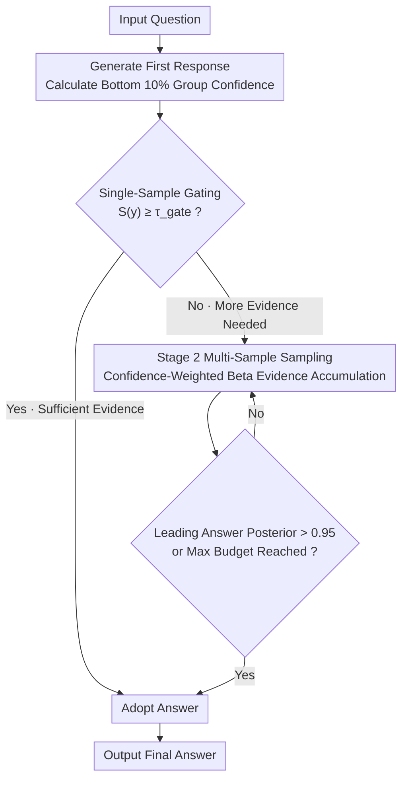

# Reliability-Aware Adaptive Self-Consistency for Efficient Sampling in LLM Reasoning

**Conference**: ACL2026  
**arXiv**: [2601.02970](https://arxiv.org/abs/2601.02970)  
**Code**: Not disclosed  
**Area**: LLM Reasoning  
**Keywords**: Self-consistency, Reasoning sampling, Confidence estimation, Adaptive stopping, Inference efficiency

## TL;DR
ReASC transforms adaptive self-consistency from "counting answer votes" into "determining if sufficient reliable evidence exists." By utilizing response-confidence-weighted Beta accumulation, it significantly reduces multi-sample reasoning costs on GSM8K, MATH500, Omni-Math, and GPQA-Diamond while maintaining near-original accuracy.

## Background & Motivation
**Background**: Self-consistency significantly enhances the reliability of LLMs in mathematical and complex reasoning tasks by sampling multiple reasoning paths and performing majority voting. However, it typically uses a fixed sampling budget of $k$ outputs, spending the same resources on both simple and difficult problems.

**Limitations of Prior Work**: Methods like Adaptive Consistency and Early-Stopping Self-Consistency dynamically stop based on observed answers, but their core logic remains rooted in answer counts or consistency within a window. This assumes every response carries equal information, ignoring that some reasoning trajectories are inherently more reliable while others are low-confidence noise.

**Key Challenge**: The fundamental requirement during inference is to determine if "current evidence is sufficient to support a reliable answer," rather than "how many times an answer has appeared." If an early high-confidence response already provides strong evidence, further sampling wastes computation; if low-confidence responses appear frequently, pure counting might lead to premature or incorrect aggregation.

**Goal**: The authors aim to design a training-free framework that operates solely during inference, using the model's own confidence signals to decide if a single sample is sufficient and letting high-confidence responses contribute more evidence when multiple samples are required.

**Key Insight**: This paper interprets response-level confidence as evidence strength and adopts Bottom 10% Group Confidence to capture the most unstable, low-confidence segments in a reasoning chain. This signal distinguishes correct and incorrect responses more effectively than average self-certainty.

**Core Idea**: A confidence gating mechanism first handles samples where a "single response is sufficiently reliable." For the remaining samples, a confidence-weighted Beta posterior update is performed to achieve decision reliability comparable to self-consistency with fewer samples.

## Method
ReASC is a pure inference-stage method that does not modify model parameters. It decomposes the reasoning process for each question into two stages: the first stage uses single-response confidence for early stopping, and the second stage continues sampling for remaining questions, converting the confidence of each response into soft counts for Beta updates. Compared to ASC/ESC, ReASC's stopping criterion considers both answer frequency and response reliability.

### Overall Architecture
Given a question, the model first generates a single reasoning response and calculates the Bottom 10% Group Confidence from the token probability distribution. If this confidence exceeds a calibrated threshold, ReASC accepts the answer directly. Otherwise, it enters Stage 2, continuing to sample multiple responses. Each response is categorized by its answer, and weighted evidence is added to that answer based on its confidence. The system continuously calculates the Beta posterior probability of the leading answer maintaining its advantage over the runner-up until it exceeds a stopping threshold or reaches the maximum sampling budget.

### Key Designs

**1. Bottom 10% Group Confidence: Judging reliability using the weakest parts of the reasoning chain rather than the global average.**

Global average confidence has a blind spot: incorrect reasoning often isn't "hesitant" from start to finish but is locally uncertain during a few critical steps. The average value can be diluted by large segments of high confidence. ReASC segments the token sequence of a response into sliding window groups, calculates group-level self-certainty, and takes the average of only the lowest 10% of groups as the response-level confidence. By focusing on the "tail" fragments most likely to contain errors, this approach aligns better with failure modes in chain-of-thought reasoning. In experiments, its AUROC (0.860) outperformed the average group confidence (0.823).

**2. Single-sample Gating: Many problems are sufficiently reliable at pass@1, making voting unnecessary.**

Fixed sampling at $k$ is wasteful for simple problems. Gating turns "whether this problem needs self-consistency" into an instance-level decision. After the first response, its confidence $S(y)$ is calculated. If $S(y) \geq \tau_{gate}$, the answer is accepted. The threshold $\tau_{gate}$ can be set offline using a small labeled calibration set to estimate the mean confidence of correct samples and the threshold required for a target accuracy. In unlabeled online settings, a two-component GMM fits the confidence distribution, treating the high-confidence component as the distribution of correct answers to determine the threshold. Experiments show that on GSM8K, this stage filters 49%–61% of questions, with accepted samples typically exceeding 90% accuracy.

**3. Confidence-Weighted Beta Evidence Accumulation: Accelerating the stopping condition for high-confidence consistent answers in the multi-sample phase.**

For questions failing the gate, ASC traditionally counts votes: the top two answer counts form a $Beta(v_1+1, v_2+1)$ distribution to check the probability of the leader maintaining its lead. However, frequency only reflects "how much evidence," not "how strong the evidence is." Two highly reliable answers should not weigh the same as two low-confidence noisy ones. ReASC normalizes each response confidence to $z(y)$ and uses $\max(1, \exp(\lambda z(y)))$ as the soft count increment for Beta updates. Sampling stops when the posterior probability $1 - I_{1/2}(\alpha, \beta)$ exceeds $C_{threshold}=0.95$. This allows consistent high-confidence answers to reach the confidence threshold faster, while remaining within the ASC Beta framework.

### Loss & Training
ReASC does not train the model; it only requires inference-time confidence calculation and threshold calibration. Experiments use LLaMA-3.2-3B, Qwen-2.5-3B/7B, and Gemma-3-4B/27B. Offline calibration uses 128 held-out samples with a target accuracy $p_{target}=0.9$. Online calibration uses GMM fitting on the confidence distribution of the first responses from the test set. Stage 2 uses $C_{threshold}=0.95$ and $\lambda=0.7$, with a max budget aligned to SC ($k=16$).

## Key Experimental Results

### Main Results
ReASC generally maintains accuracy close to SC/ASC while significantly reducing TFLOPs. Representative results are shown below:

| Model / Dataset | Method | Acc ↑ | TFLOPs ↓ | Acc/TF ↑ | Rel. SC Cost Change |
|-------------|------|-------|----------|----------|-----------------|
| Gemma-3-4B / GSM8K | SC | 92.12 | 32.67 | 2.82 | - |
| Gemma-3-4B / GSM8K | ASC | 92.12 | 12.26 | 7.52 | -62.5% |
| Gemma-3-4B / GSM8K | ReASC offline | 92.04 | 9.45 | 9.74 | -71.1% |
| Qwen-2.5-7B / MATH500 | SC | 80.6 | 71.59 | 1.13 | - |
| Qwen-2.5-7B / MATH500 | ASC | 80.8 | 37.25 | 2.17 | -48.0% |
| Qwen-2.5-7B / MATH500 | ReASC offline | 81.2 | 29.26 | 2.78 | -59.1% |
| Gemma-3-27B / GSM8K | SC | 97.04 | 166.93 | 0.58 | - |
| Gemma-3-27B / GSM8K | ReASC offline | 96.89 | 29.36 | 3.30 | -82.4% |

### Ablation Study
Stage 1 analysis indicates many problems can be reliably solved with a single sample, with accepted sample accuracy typically exceeding 90%.

| Model | Dataset | Calibration | Stage 1 Acceptance % | Accepted Acc |
|------|--------|----------|------------------|----------------|
| LLaMA-3.2-3B | GSM8K | Offline | 48.98 | 91.33 |
| Gemma-3-4B | GSM8K | Offline | 51.18 | 97.78 |
| Qwen-2.5-7B | GSM8K | Offline | 59.59 | 97.58 |
| Gemma-3-27B | GSM8K | Offline | 60.58 | 98.62 |
| Qwen-2.5-7B | MATH500 | Online | 31.8 | 93.08 |
| Gemma-3-27B | MATH500 | Online | 36.2 | 97.31 |

Comparing Stage 2 and full ReASC demonstrates that confidence weighting is not the only source of savings; even excluding Stage 1 samples, Stage 2 is more efficient than count-based ASC.

| Model / Dataset | Method | Acc ↑ | TFLOPs ↓ | Description |
|-------------|------|-------|----------|------|
| LLaMA-3.2-3B / GSM8K | ASC | 83.85 | 6.27 | Count-based stopping |
| LLaMA-3.2-3B / GSM8K | ReASC Stage2 only | 84.38 | 5.33 | Weighted Beta reduces sampling |
| LLaMA-3.2-3B / GSM8K | ReASC | 83.85 | 4.38 | Stage 1 further reduces cost |
| Qwen2.5-7B / MATH500 | ASC | 80.80 | 37.25 | Count-based stopping |
| Qwen2.5-7B / MATH500 | ReASC Stage2 only | 81.20 | 34.05 | Weighted accumulation efficiency |
| Qwen2.5-7B / MATH500 | ReASC | 81.20 | 29.26 | Optimal two-stage synergy |

### Key Findings
- ReASC's advantages hold across scales (3B to 27B), improving Acc/TF; stronger models typically show higher Stage 1 acceptance rates.
- Online calibration works without labels, achieving better accuracy-cost trade-offs than SC/ASC on Omni-Math and GPQA-Diamond.
- Bottom 10% Group Confidence (AUROC 0.860) outperforms average group confidence (0.823), confirming that low-confidence local segments better distinguish reasoning failures.
- In Qwen2.5-7B, accuracy increases monotonically from 20.00% in the lowest confidence bin to 93.27% in the highest, supporting the "high confidence implies reliability" hypothesis.
- ReASC online also achieves the highest Acc/TF on StrategyQA, Last Letter Concatenation, and NQ-Open, showing generalizability beyond math.

## Highlights & Insights
- Interpreting self-consistency sampling as evidence accumulation is a natural and effective perspective. It explains why simple vote counting is insufficient: high-reliability and low-reliability responses should not be weighted equally.
- Stage 1 is a highly practical design. In many deployment scenarios, simple requests dominate; determining if pass@1 is reliable avoids significant unnecessary sampling.
- Using Bottom 10% Group Confidence is clever, as reasoning errors are often triggered by a few vulnerable steps. Focusing on these segments aligns with the failure modes of chain-of-thought.
- The method requires no new model training and no external verifiers, making it easy to integrate into existing self-consistency inference services. If token logprobs are already available, the overhead is minimal.

## Limitations & Future Work
- ReASC relies on the assumption that model confidence correlates with correctness. While experiments support this, confidence can be distorted by systematic overconfidence, strong hallucinations, or OOD tasks.
- Bottom 10% Group Confidence requires access to token probability distributions, which may not be consistently available via closed-source APIs or certain high-throughput frameworks.
- Online calibration depends on GMM fitting of test set distributions; if the confidence distribution is not clearly bimodal, threshold estimation may become unstable.
- The paper focuses on computation and latency and does not deeply explore complementarity with verifiers, Process Reward Models (PRMs), or tree-search reasoning.

## Related Work & Insights
- **vs Self-Consistency**: SC uses a fixed $k=16$ budget; ReASC stops dynamically based on evidence sufficiency, resulting in much lower costs at similar accuracy levels.
- **vs ASC / ESC**: While ASC/ESC rely on counts or window consistency, ReASC introduces confidence-based soft counts into the same Beta stopping framework to model evidence quality.
- **vs verifier / reranker**: Verifiers usually require additional models or training data. ReASC leverages endogenous confidence for lighter deployment, though it is more sensitive to the quality of confidence calibration.

## Rating
- Novelty: ⭐⭐⭐⭐☆ Using confidence as evidence weight for adaptive self-consistency is clear and effective; the framework builds soundly on ASC.
- Experimental Thoroughness: ⭐⭐⭐⭐⭐ Covers multiple models, datasets, calibration modes, and tasks with strong supporting evidence.
- Writing Quality: ⭐⭐⭐⭐☆ Method description is smooth, and experimental analysis supports the claims.
- Value: ⭐⭐⭐⭐⭐ Highly practical for LLM services needing multi-sample reasoning with budget constraints.

<!-- RELATED:START -->

## Related Papers

- [\[ACL 2026\] Self-Consistency from Only Two Samples: CoT-PoT Ensembling for Efficient LLM Reasoning](self-consistency_from_only_two_samples_cot-pot_ensembling_for_efficient_llm_reas.md)
- [\[NeurIPS 2025\] Sampling-Efficient Test-Time Scaling: Self-Estimating the Best-of-N Sampling in Early Decoding](../../NeurIPS2025/llm_reasoning/sampling-efficient_test-time_scaling_self-estimating_the_best-of-n_sampling_in_e.md)
- [\[ACL 2026\] Does Self-Consistency Improve the Recall of Encyclopedic Knowledge?](does_self-consistency_improve_the_recall_of_encyclopedic_knowledge.md)
- [\[ICML 2025\] Self-Consistency Preference Optimization](../../ICML2025/llm_reasoning/self-consistency_preference_optimization.md)
- [\[ACL 2026\] Budget-Aware Anytime Reasoning with LLM-Synthesized Preference Data](budget-aware_anytime_reasoning_with_llm-synthesized_preference_data.md)

<!-- RELATED:END -->
