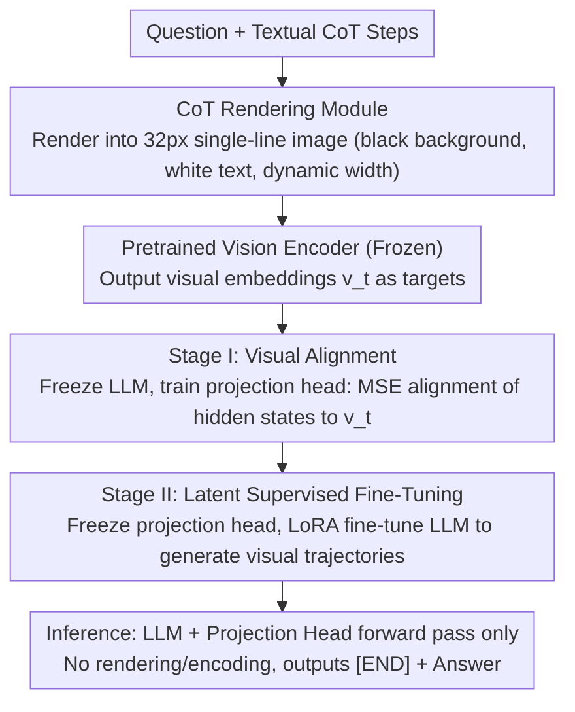

# Render-of-Thought: Rendering Textual Chain-of-Thought as Images for Visual Latent Reasoning

**Conference**: ACL 2026  
**arXiv**: [2601.14750](https://arxiv.org/abs/2601.14750)  
**Code**: [TencentBAC/RoT](https://github.com/TencentBAC/RoT)  
**Area**: LLM Reasoning  
**Keywords**: Chain-of-Thought Compression, Visual Latent Reasoning, Text-to-Image Rendering, CoT token compression, Self-distillation

## TL;DR

This paper proposes Render-of-Thought (RoT), the first approach to render textual CoT reasoning steps into images. By utilizing a pretrained vision encoder as a semantic anchor to align LLM hidden states with the visual embedding space, RoT achieves 3-4x token compression and significant inference acceleration while maintaining the analyzability of reasoning chains.

## Background & Motivation

**Background**: Chain-of-Thought (CoT) prompting has become a foundational paradigm for unlocking complex reasoning in LLMs, but its verbose nature leads to severe inference latency and memory consumption. Existing compression methods follow two main paths: explicit compression (token selection, RL-incentivized short paths) and implicit reasoning (encoding reasoning within the latent space).

**Limitations of Prior Work**: Explicit compression is still limited by sparse token representations. Implicit reasoning methods (e.g., Coconut, CODI, CoLaR) compress thoughts into opaque continuous vectors but often focus on outcome alignment while lacking supervision of intermediate processes. This leads to a loss of analyzability, making it difficult to track reasoning logic or diagnose errors. Furthermore, many methods employ complex architectures that affect training stability.

**Key Challenge**: The contradiction between compression efficiency and interpretability—high-compression latent reasoning sacrifices process traceability, while interpretable explicit CoT remains too verbose.

**Goal**: To find a representation that enables significant CoT compression while maintaining the observability of the reasoning process.

**Key Insight**: Visual modalities naturally possess high information density; a single image can encode a vast amount of textual information. By rendering CoT text into images, a pretrained vision encoder's few tokens can represent a complete reasoning process, and the rendered images themselves remain visualizable, preserving analyzability.

**Core Idea**: Textual CoT is rendered as single-line images. Embeddings extracted from a pretrained vision encoder serve as supervision targets to train the LLM to autoregressively generate reasoning trajectories in the visual latent space. During inference, no actual rendering or encoding is required; only the LLM forward pass is performed.

## Method

### Overall Architecture

RoT aims to achieve both massive compression and process observability. It leverages the high information density of visual modalities. During training, the textual CoT is rendered into a single-line image, which is processed by a pretrained vision encoder to obtain visual embeddings. The LLM then aligns its hidden states to these embeddings via a projection head, learning to autoregressively generate reasoning trajectories in a "visual latent space." The training consists of two stages: first, freezing the LLM and vision encoder to train the projection head for alignment; second, freezing the projection head and vision encoder to fine-tune the LLM via LoRA for autonomous trajectory generation. Crucially, inference requires only the LLM and projection head, bypassing actual rendering and encoding to save substantial token costs.

### Key Designs

**1. CoT Rendering Module: Compressing reasoning text into single-line images rather than square blocks**

To represent an entire reasoning segment using few vision tokens, the text must be transformed into an "easily encodable" image. RoT chooses single-line rendering: a fixed height of 32px with width dynamically scaling based on text length, using a black background, white text, 20px font size, and 4px padding. Square images are avoided as they introduce two issues: empty regions when the text is short (generating meaningless embeddings) and line breaks for long text (introducing spatial ambiguity). Single-line dynamic width eliminates both: image patches are strictly aligned from left to right, naturally corresponding to textual order, ensuring every patch represents actual reasoning content.

**2. Stage I Visual Alignment: Migrating LLM hidden states to the vision encoder's existing semantic space**

Latent reasoning often suffers from training instability when learning a representation space from scratch. RoT avoids this by using the structured representation of a pretrained vision encoder as a "semantic anchor." In this stage, the LLM and vision encoder are frozen, and a light-weight projection head (two-layer MLP + SwiGLU) is trained. An `<img_begin>` token triggers visual reasoning, and the projection head maps LLM hidden states into the visual embedding space using MSE loss:

$$\mathcal{L}_{align} = \frac{1}{K}\sum_{t=1}^{K}\|\hat{v}_t - v_t\|_2^2,$$

simultaneously training the `<img_end>` token and final answer prediction using cross-entropy. This "LLM-to-Vision" projection effectively teaches the LLM to "write" its thoughts in a coordinate system understood by the vision encoder.

**3. Stage II Latent Supervised Fine-Tuning: Teaching the LLM to navigate the aligned space**

Alignment alone is insufficient; the LLM must learn to actively generate trajectories that fall within the visual space. In this stage, the vision encoder and projection head are frozen, and only the LLM is fine-tuned using LoRA. The model autoregressively generates latent visual token sequences followed by the terminator and textual answer. Because the projection head is frozen, it acts as an implicit constraint: the LLM is forced to stay within the space established in Stage I. No explicit visual regression loss is used; training focuses purely on answer accuracy. Decoupling alignment and reasoning prevents instability.

### Loss & Training

Stage I: $\mathcal{L}_I = \mathcal{L}_{pred} + \lambda \mathcal{L}_{align}$, optimizing both alignment and prediction. Stage II: Only $\mathcal{L}_{pred}$, targeting pure answer accuracy. Training uses the AdamW optimizer with lr=2e-5. Stage I is trained for 1 epoch, and Stage II for 2 epochs. Inference utilizes a static termination strategy with a fixed token budget (e.g., 32/64) as dynamic termination on continuous representations can be unstable.

## Key Experimental Results

### Main Results

| Model/Method | GSM8k-Aug Pass@1 | # L (tokens) | MultiArith Pass@1 | Efficiency Ratio |
|--------|------|------|----------|------|
| Qwen3-VL-4B SFT-CoT | 81.2% | 127.3 | 98.3% | 0.73 |
| Qwen3-VL-4B RoT | 37.8% | 32.0 | 97.2% | 1.73 |
| CoLaR-2 (LLM-based) | 40.0% | 39.6 | 82.2% | - |
| Coconut | 16.9% | 6.0 | 60.3% | - |

### Ablation Study

| Configuration | GSM8k-Aug | MATH | Description |
|------|---------|------|------|
| Full RoT | 37.8% | 33.2% | Complete Model |
| w/o Stage I | 24.8% | 22.2% | Significant drop without visual alignment |
| w/o Stage II | 29.9% | 26.2% | Significant drop without latent SFT |

### Key Findings

- **Visual alignment (Stage I) contributes most**: Removing it causes GSM8k-Aug to drop from 37.8% to 24.8%, indicating that latent spaces without visual anchors prone to representation collapse.
- **On simple tasks (MultiArith), RoT approaches CoT performance** (97.2% vs 98.3%) but uses fewer tokens (32 vs 59), improving the efficiency ratio from 0.73 to 1.73.
- **Significant inference speedup**: On GSM-Hard, latency dropped from 8.55s to 1.84s (4.6x acceleration).
- **Single-line rendering is superior to square rendering**: Eliminating white space and spatial ambiguity is critical.
- **OOD Generalization**: RoT outperforms the LLM-based CoLaR-2 on SVAMP and MultiArith, attributed to the richer semantic supervision provided by the pretrained vision encoder.

## Highlights & Insights

- **Vision Encoder as a Semantic Anchor**: A clever design that leverages an existing structured representation space as a "coordinate system" for LLM reasoning rather than requiring the LLM to invent its own space. This avoids instability and enables plug-and-play capability.
- **Visual Analyzability of Reasoning**: Unlike other latent reasoning methods, RoT’s latent tokens can be visualized by mapping them back to the visual space, making "black-box reasoning" traceable again.
- **Text→Image→Embedding Information Bottleneck**: The rendering process acts as a natural information bottleneck, forcing the LLM to learn the core structure of reasoning rather than surface-level tokens.

## Limitations & Future Work

- There remains a significant accuracy gap compared to CoT (GSM8k-Aug: 37.8% vs 81.2%), suggesting the visual latent space has limited expressive power for high-difficulty reasoning.
- The fixed token budget (32/64) is inflexible; different problem complexities require varying reasoning chain lengths.
- Performance depends on the quality of the pretrained vision encoder.
- Future work could explore dynamic token budgets, multi-resolution rendering, and RL to optimize reasoning chain quality.

## Related Work & Insights

- **vs Coconut/CODI**: Coconut and CODI compress reasoning in pure linguistic latent spaces but lack intermediate supervision; RoT provides structured signals via visual anchors, leading to better OOD generalization.
- **vs CoLaR**: CoLaR uses dynamic compression in the language latent space; RoT shows a clear advantage on OOD datasets (e.g., SVAMP: 72.7% vs 57.7%), demonstrating the value of visual priors.

## Rating

- Novelty: ⭐⭐⭐⭐⭐ First to render CoT as images for visual latent reasoning; a paradigm-level innovation.
- Experimental Thoroughness: ⭐⭐⭐⭐ Extensive testing across multiple models and datasets with solid ablation; however, the gap on hard tasks is notable.
- Writing Quality: ⭐⭐⭐⭐ Intuitive diagrams, clear methodology, and self-consistent frameworks.
- Value: ⭐⭐⭐⭐ Opens a new direction for visual latent reasoning, though utility is currently limited by the accuracy gap.

<!-- RELATED:START -->

## Related Papers

- [\[NeurIPS 2025\] Latent Chain-of-Thought for Visual Reasoning](../../NeurIPS2025/llm_reasoning/latent_chain-of-thought_for_visual_reasoning.md)
- [\[ACL 2026\] Is Chain-of-Thought Really Not Explainability? Chain-of-Thought Can Be Faithful without Hint Verbalization](is_chain-of-thought_really_not_explainability_chain-of-thought_can_be_faithful_w.md)
- [\[ICML 2026\] A Formal Comparison Between Chain of Thought and Latent Thought](../../ICML2026/llm_reasoning/a_formal_comparison_between_chain_of_thought_and_latent_thought.md)
- [\[ICML 2026\] LatentChem: From Textual CoT to Latent Thinking in Chemical Reasoning](../../ICML2026/llm_reasoning/latentchem_from_textual_cot_to_latent_thinking_in_chemical_reasoning.md)
- [\[ACL 2026\] ETR: Entropy Trend Reward for Efficient Chain-of-Thought Reasoning](etr_entropy_trend_reward_for_efficient_chain-of-thought_reasoning.md)

<!-- RELATED:END -->
