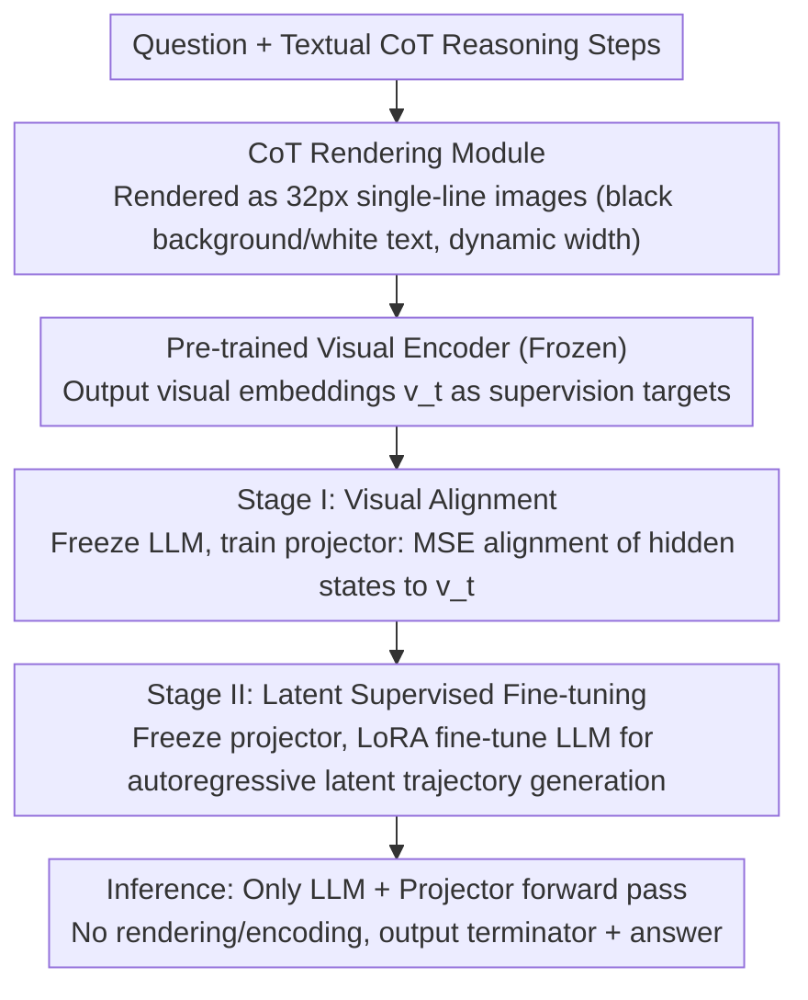

# Render-of-Thought: Rendering Textual Chain-of-Thought as Images for Visual Latent Reasoning

**Conference**: ACL 2026  
**arXiv**: [2601.14750](https://arxiv.org/abs/2601.14750)  
**Code**: [TencentBAC/RoT](https://github.com/TencentBAC/RoT)  
**Area**: LLM Reasoning  
**Keywords**: Chain-of-Thought Compression, Visual Latent Space Reasoning, Text-to-Image Rendering, CoT Token Compression, Self-distillation

## TL;DR

Ours proposes Render-of-Thought (RoT), the first to render textual CoT reasoning steps into images. By utilizing a pre-trained visual encoder as a semantic anchor to align LLM hidden states with the visual embedding space, it achieves 3-4x token compression and significant inference acceleration while maintaining the analyzability of reasoning chains.

## Background & Motivation

**Background**: Chain-of-Thought (CoT) prompting has become a foundational paradigm for unlocking the complex reasoning capabilities of LLMs. However, the verbose nature of CoT leads to severe inference latency and memory consumption. Existing compression methods are divided into two routes: explicit compression (token pruning, RL-incentivized short paths) and implicit reasoning (encoding reasoning processes in latent spaces).

**Limitations of Prior Work**: Explicit compression is still limited by sparse token representations. Implicit reasoning methods (e.g., Coconut, CODI, CoLaR) compress thoughts into opaque continuous vectors but typically focus only on result alignment while lacking supervision of intermediate reasoning processes. This leads to a loss of analyzability—making it difficult to trace the model's logic or diagnose errors. Additionally, many methods adopt complex architectures that affect training stability.

**Key Challenge**: The contradiction between compression efficiency and interpretability—high-compression latent reasoning sacrifices observability, while interpretable explicit CoT is too verbose.

**Goal**: Find a representation that can significantly compress CoT while keeping the reasoning process observable.

**Key Insight**: The visual modality naturally possesses high information density—a single image can encode a large volume of textual information. If CoT text is rendered into images, the complete reasoning process can be represented by a few tokens from a visual encoder, and the rendered images themselves remain visualizable, preserving analyzability.

**Core Idea**: Render textual CoT as single-line images and use embeddings from a pre-trained visual encoder as supervision targets. Train the LLM to autoregressively generate reasoning trajectories in the visual latent space. During inference, no actual rendering or encoding is required, only LLM forward propagation.

## Method

### Overall Architecture

RoT aims to simultaneously achieve two goals: drastically compressing verbose CoT without losing observability. The mechanism leverages the high information density of the visual modality. During training, textual CoT is rendered into a single-line image, passed through a pre-trained visual encoder to obtain a sequence of embeddings, and the LLM hidden states are aligned to this visual embedding space via a projector. This allows the model to learn to generate reasoning trajectories autoregressively in a "visual latent space." Training proceeds in two stages: first, freeze the LLM and visual encoder to train only the projector for alignment; second, freeze the projector and visual encoder to use LoRA for fine-tuning the LLM to autonomously generate trajectories. Crucially, inference does not require actual image rendering or visual encoder execution—only the LLM + projector forward pass is needed, saving the compressed tokens.

### Key Designs

**1. CoT Rendering Module: Compressing reasoning text into single-line images rather than square ones**

To represent the entire reasoning process with a few tokens, the text must first be transformed into an "easy-to-encode" image. RoT chooses single-line rendering: fixed height at 32px, with width dynamically scaling with text length, using a black background, white text, 20px font size, and 4px padding. Square images were avoided because they introduce two issues: empty white space when text doesn't fill the box (generating meaningless embeddings) and line breaks for long text (introducing spatial ambiguity). Single-line dynamic width eliminates both: image patches are strictly aligned from left to right, naturally matching text order, so every patch read by the encoder corresponds to actual reasoning content.

**2. Stage I: Visual Alignment – Moving LLM hidden states into the visual encoder's existing semantic space**

Latent reasoning often fails when learning a representation space from scratch due to instability. RoT's design avoids this by not having the LLM create its own space, but rather borrowing the structured representation of a pre-trained visual encoder as a "semantic anchor." In this stage, the LLM and visual encoder are frozen, and only a lightweight projector (two-layer MLP + SwiGLU) is trained. An `<img_begin>` token triggers visual reasoning, and the projector maps LLM hidden states to the visual embedding space using an MSE loss to approximate the visual encoder's output:

$$\mathcal{L}_{align} = \frac{1}{K}\sum_{t=1}^{K}\|\hat{v}_t - v_t\|_2^2,$$

simultaneously training the `<img_end>` terminator and final answer prediction using cross-entropy. This is the inverse of typical MLLM "Vision→LLM" alignment; it is an "LLM→Vision" projection, essentially teaching the LLM to "write" its thoughts in a coordinate system the visual encoder understands.

**3. Stage II: Latent Supervised Fine-tuning – Teaching the LLM to traverse the reasoning path**

Alignment alone is insufficient; the LLM must learn to actively generate a trajectory that falls within the visual space and eventually produce an answer. In this stage, the visual encoder and the aligned projector are frozen, while the LLM is fine-tuned using LoRA. The model autoregressively generates a sequence of latent visual tokens, followed by a terminator and the textual answer. Because the projector is frozen, it acts as an implicit constraint—the LLM is forced to generate hidden states that "can be projected into meaningful visual representations," effectively keeping it within the space established in Stage I. No explicit visual regression loss is used here; only cross-entropy for answer prediction is applied. Decoupling alignment and reasoning avoids the instability of learning to navigate while simultaneously building the space.

### Loss & Training

Stage I: $\mathcal{L}_I = \mathcal{L}_{pred} + \lambda \mathcal{L}_{align}$, optimizing both alignment and prediction. Stage II: Only $\mathcal{L}_{pred}$, aiming purely for answer accuracy. Training uses the AdamW optimizer with lr=2e-5, Stage I for 1 epoch, and Stage II for 2 epochs. Inference utilizes a static termination strategy with a fixed token budget (rather than dynamic termination) as dynamic termination is unstable with continuous latent representations.

## Key Experimental Results

### Main Results

| Model/Method | GSM8k-Aug Pass@1 | # L (tokens) | MultiArith Pass@1 | Avg Efficiency Ratio |
|--------|------|------|----------|------|
| Qwen3-VL-4B SFT-CoT | 81.2% | 127.3 | 98.3% | 0.73 |
| Qwen3-VL-4B RoT | 37.8% | 32.0 | 97.2% | 1.73 |
| CoLaR-2 (LLM-based) | 40.0% | 39.6 | 82.2% | - |
| Coconut | 16.9% | 6.0 | 60.3% | - |

### Ablation Study

| Configuration | GSM8k-Aug | MATH | Description |
|------|---------|------|------|
| Full RoT | 37.8% | 33.2% | Complete model |
| w/o Stage I | 24.8% | 22.2% | Significant drop without visual alignment |
| w/o Stage II | 29.9% | 26.2% | Significant drop without latent SFT |

### Key Findings

- **Visual Alignment (Stage I) contributes most**: Removing it drops GSM8k-Aug from 37.8% to 24.8%, indicating that latent spaces without visual anchors suffer from representation collapse.
- **RoT approaches CoT performance on simple tasks (MultiArith)**: 97.2% vs 98.3%, while using only 32 vs 59 tokens, improving the efficiency ratio from 0.73 to 1.73.
- **Significant inference speedup**: On GSM-Hard, latency dropped from 8.55s to 1.84s (4.6x acceleration).
- **Single-line rendering is far superior to square rendering**: Eliminating white space and spatial ambiguity is critical.
- **Superior OOD generalization**: RoT outperforms the LLM-based CoLaR-2 on OOD datasets (SVAMP, MultiArith), attributed to the richer semantic supervision provided by the pre-trained visual encoder.

## Highlights & Insights

- **Visual Encoders as Semantic Anchors**: This is an ingenious design—instead of forcing the visual encoder to learn new things, it leverages its existing structured representation as a "coordinate system" for LLM reasoning. This avoids the instability of learning a latent space from scratch, achieving a true plug-and-play effect.
- **Visual Analyzability of Reasoning**: Unlike other latent space reasoning methods, RoT's latent tokens can be visualized by mapping them back to the visual space, making "black-box reasoning" traceable again.
- **Text→Image→Embedding Information Bottleneck**: The rendering process itself serves as a natural information bottleneck, forcing the LLM to learn the core structure of reasoning rather than surface-level tokens. This concept is transferable to other compression scenarios.

## Limitations & Future Work

- **Accuracy gap**: A significant gap remains compared to explicit CoT (GSM8k-Aug: 37.8% vs 81.2%), suggesting the expressive capacity of the visual latent space is limited for high-difficulty tasks.
- **Fixed token budget**: Using 32/64 tokens is inflexible; different problem difficulties require reasoning chains of varying lengths.
- **Dependency on encoder quality**: The quality of the pre-trained visual encoder directly affects alignment performance.
- **Future directions**: Exploring dynamic token budget allocation, multi-resolution rendering, and combining with RL to optimize reasoning chain quality.

## Related Work & Insights

- **vs Coconut/CODI**: Coconut and CODI compress reasoning in pure language latent spaces but lack intermediate supervision; RoT provides structured supervision through visual anchors, leading to better OOD generalization.
- **vs CoLaR**: CoLaR uses dynamic compression in language latent space. While average efficiency is similar, RoT shows a clear advantage on OOD datasets (SVAMP: 72.7% vs 57.7%), demonstrating the value of visual priors.

## Rating

- **Novelty**: ⭐⭐⭐⭐⭐ Paradigm-level innovation by rendering CoT as images for visual latent reasoning.
- **Experimental Thoroughness**: ⭐⭐⭐⭐ Evaluated across multiple models and datasets with solid ablation, though gaps in high-difficulty tasks remain.
- **Writing Quality**: ⭐⭐⭐⭐ Clear diagrams, well-defined methods, and logically consistent two-stage framework.
- **Value**: ⭐⭐⭐⭐ Opens a new direction for visual latent reasoning, though utility is currently limited by the accuracy gap.

<!-- RELATED:START -->

## Related Papers

- [\[NeurIPS 2025\] Latent Chain-of-Thought for Visual Reasoning](../../NeurIPS2025/llm_reasoning/latent_chain-of-thought_for_visual_reasoning.md)
- [\[ACL 2026\] Is Chain-of-Thought Really Not Explainability? Chain-of-Thought Can Be Faithful without Hint Verbalization](is_chain-of-thought_really_not_explainability_chain-of-thought_can_be_faithful_w.md)
- [\[ICML 2026\] A Formal Comparison Between Chain of Thought and Latent Thought](../../ICML2026/llm_reasoning/a_formal_comparison_between_chain_of_thought_and_latent_thought.md)
- [\[ACL 2026\] ETR: Entropy Trend Reward for Efficient Chain-of-Thought Reasoning](etr_entropy_trend_reward_for_efficient_chain-of-thought_reasoning.md)
- [\[ACL 2026\] Learning to Edit Knowledge via Instruction-based Chain-of-Thought Prompting](learning_to_edit_knowledge_via_instruction-based_chain-of-thought_prompting.md)

<!-- RELATED:END -->
