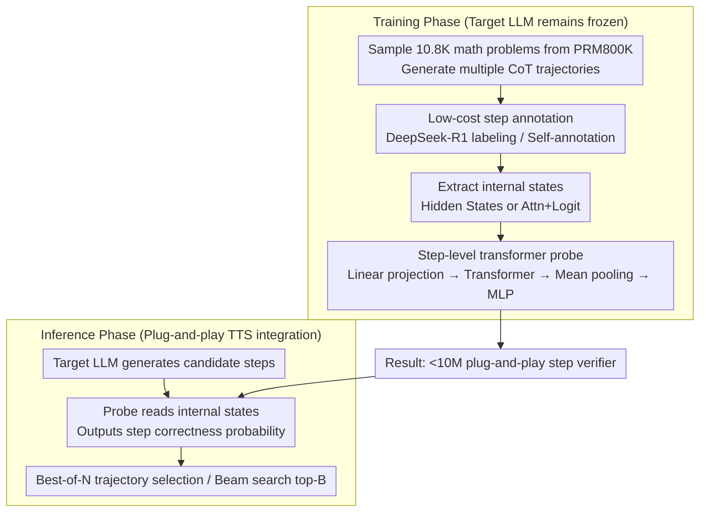

# ReProbe: Efficient Test-Time Scaling of Multi-Step Reasoning by Probing Internal States of Large Language Models

**Conference**: ACL2026  
**arXiv**: [2511.06209](https://arxiv.org/abs/2511.06209)  
**Code**: https://reprobe.github.io/  
**Area**: LLM Reasoning  
**Keywords**: Test-time scaling, process verification, internal state probe, PRM, Chain-of-Thought

## TL;DR
This paper proposes ReProbe, which uses lightweight transformer probes with fewer than 10M parameters to read the hidden states, attention, and logits of frozen LLMs to judge the reliability of each reasoning step. It approaches or exceeds the performance of PRMs that are 750–810 times larger on math, planning, and QA tasks, serving as an efficient step verifier for Best-of-N and beam search.

## Background & Motivation
**Background**: Chain-of-Thought and large reasoning models enable LLMs to generate long reasoning chains, but any single error in a long chain can derail the final answer. Test-time scaling improves accuracy by sampling multiple candidate reasonings and filtering for reliable intermediate steps or complete trajectories, commonly implemented as Best-of-N and beam search.

**Limitations of Prior Work**: Current mainstream step verifiers are Process Reward Models (PRMs). PRMs are typically independent LLMs with 1.5B to 8B parameters, requiring massive step-level annotations, Monte-Carlo rollouts, or expensive human/LLM judgments. During inference, running an additional large model leads to high VRAM usage and latency. Furthermore, many PRMs trained heavily on mathematics exhibit limited generalization to out-of-distribution (OOD) tasks like planning and QA.

**Key Challenge**: Test-time scaling requires a reliable scorer, but stronger scorers are usually larger, more expensive, and domain-specific; simple uncertainty metrics are cheap but inaccurate. An ideal solution should judge process quality like a PRM while remaining as lightweight as an uncertainty probe.

**Goal**: The authors aim to validate a hypothesis: when an LLM generates reasoning steps, its internal states already encode signals indicating whether a step is reliable. By using a small probe to extract these signals, one can replace or supplement a PRM.

**Key Insight**: Previous research on hallucination detection has shown that hidden states, attention distributions, and logits contain "self-knowledge" signals. ReProbe migrates this introspection approach from factual hallucination detection to multi-step reasoning verification.

**Core Idea**: Instead of using another large model to evaluate external text, a small probe directly reads the internal states already produced by the target LLM during generation and outputs the probability that the current reasoning step is correct.

## Method
ReProbe is a plug-and-play step verifier. It does not modify the supervised LLM nor generate new reasoning text; it only extracts internal features as the target model generates each reasoning step to provide a correctness score. This score can be used like a PRM reward for Best-of-N trajectory selection or to retain the next batch of partial trajectories in beam search.

### Overall Architecture
During the training phase, 10.8K math problems are sampled from the PRM800K training set. The target LLM generates multiple CoT trajectories, and each step is labeled as correct or incorrect by DeepSeek-R1 or the target model itself. The target LLM is then frozen, internal features corresponding to each step are extracted, and a ReProbe is trained for binary classification. During the inference phase, the target LLM generates candidate steps; ReProbe reads the internal states in real-time to output step scores, and TTS strategies retain the most reliable steps or complete trajectories based on these scores.

### Key Designs

**1. Reading internal states instead of reviewing external text: Extracting verification signals from "internal hesitation"**

A fundamental limitation of PRMs is that they are merely another language model, observing only the reasoning text the target model has already written—surface-level fluency does not guarantee the model was actually confident. ReProbe changes the entry point: it directly reads internal signals produced by the target LLM during the generation of the step. The authors compare two types of features: "Attn+Logit," which includes attention weights for the top 5 tokens across all layers and top-K candidate generation logits; and "Hidden States" from all layers. Each token's features are built upon the full context of the current problem, historical steps, and the newly generated step.

This approach captures confidence not explicitly written in text: a model may write a seemingly plausible sentence, but its attention distribution and hidden representations may reveal it is wavering between multiple continuations. In experiments, Hidden States features performed best overall, suggesting that "representation-level confidence" reflects step quality better than attention/logits.

**2. Step-level transformer probe: Aggregating scattered token features into a step-level correctness judgment**

A reasoning step is composed of multiple tokens. Simple linear probes only look at local features of individual tokens and fail to discern whether "the logic of the step as a whole holds." ReProbe first uses a linear layer to project extracted features into a unified dimension, applies several transformer layers to model dependencies between tokens within a step, and then performs mean pooling on the current step's tokens to obtain a step vector. Finally, a two-layer MLP outputs the logit for the step's correctness. Though the entire probe has fewer than 10M parameters, it is sufficient to model the contextual compositional structure within the scope of "one step," enabling more accurate classification of correct vs. incorrect steps than a linear probe.

**3. Low-cost annotation + Plug-and-play TTS integration: Compressing expensive supervision into a small model**

PRM training typically relies on large-scale step-level manual annotation or Monte-Carlo rollouts, and many tasks lack automatically verifiable final answers, making process annotation extremely costly. ReProbe's training labels can be provided by DeepSeek-R1 or through self-annotation (self-anno) by the target model—prompting the model to output one CoT step per line in non-thinking mode, or treating each sentence as a step in native thinking mode, thus avoiding heavy reliance on prompt engineering. Once trained, it acts as a plug-and-play verifier for test-time scaling: in Best-of-N, step scores are aggregated to select trajectories; in beam search, it utilizes ReProbe scores at each step to retain top-B continuations. Since expensive supervision is compressed into a <10M probe, there is no need to run an additional large PRM during inference, significantly reducing VRAM and latency.

### Loss & Training
ReProbe is trained using standard binary cross-entropy with class weighting to mitigate the imbalance between correct and incorrect steps. The target LLM is frozen throughout, and only probe parameters are updated. Main experiments were conducted on Qwen3-8B in non-thinking CoT mode, with extensions to native thinking modes of Qwen3-1.7B, Qwen3-32B, and Phi-4. Training data consists of ~32K reasoning trajectories sampled from 10.8K PRM800K problems (3 trajectories per problem); generation uses top-k 50, top-p 0.95, and temperature 1.0. The authors also provide a vLLM pipeline to accelerate hidden-state extraction and training.

## Key Experimental Results

### Main Results
PR-AUC is used for step-level error detection. ReProbe approaches the strongest PRMs in in-domain (ID) mathematics and shows an advantage in OOD planning and QA; specifically, Hidden States + Self-anno achieved an overall PR-AUC of 0.604, higher than the 0.565 of Qwen2.5-Math-PRM-7B.

| Method | Parameters/Sample Scale | ID Avg PR-AUC↑ | OOD Avg PR-AUC↑ | Overall PR-AUC↑ | Conclusion |
|------|---------------|----------------|-----------------|-----------------|------|
| Semantic Entropy | No training | 0.182 | 0.409 | 0.324 | Uncertainty signals are useful but not strong enough |
| Skywork-PRM-1.5B | 1.5B, samples unknown | 0.281 | 0.426 | 0.371 | Small PRMs have limited generalization |
| Qwen2.5-Math-PRM-7B | 7B, 860K | 0.514 | 0.595 | 0.565 | Strong Math PRM, but caught by probes in OOD |
| ReProbe Attn+Logit Self-anno | <10M, 32K | 0.461 | 0.618 | 0.559 | Self-supervision approaches strong PRMs |
| ReProbe Hidden States Self-anno | <10M, 32K | 0.498 | 0.667 | 0.604 | Best overall with significant OOD advantage |
| ReProbe Hidden States DeepSeek-anno | <10M, 32K | 0.488 | 0.639 | 0.582 | External annotation is also stable and effective |

For test-time scaling, ReProbe can directly replace a PRM as a scorer. In beam search, the overall accuracy of Hidden States + DeepSeek-anno was 76.6, higher than both Qwen2.5-Math PRMs.

| Method | MATH↑ | GSM8K↑ | ProofNet↑ | ID Avg↑ | OOD Avg↑ | Overall↑ |
|------|-------|--------|-----------|---------|----------|----------|
| Qwen2.5-Math-7B-PRM800K | 89.8 | 80.4 | 95.2 | 88.5 | 59.0 | 71.6 |
| Qwen2.5-Math-PRM-7B | 88.1 | 95.4 | 93.6 | 92.4 | 54.4 | 70.7 |
| ReProbe Attn+Logit Self-anno | 90.3 | 95.4 | 95.1 | 93.6 | 61.9 | 75.5 |
| ReProbe Hidden States Self-anno | 84.1 | 97.3 | 90.6 | 90.7 | 60.0 | 73.2 |
| ReProbe Hidden States DeepSeek-anno | 86.8 | 98.8 | 95.6 | 93.7 | 63.7 | 76.6 |

### Ablation Study
The paper analyzes data diversity, PRM complementarity, and architectural choices. A richer problem distribution significantly improves the overall PR-AUC of the probe. Fusing ReProbe scores with PRM scores via simple logistic regression further improves performance on several math datasets.

| Ablation/Combination | MATH PR-AUC↑ | GSM8K PR-AUC↑ | ProofNet PR-AUC↑ | Description |
|-----------|--------------|---------------|------------------|------|
| ReProbe Attn+Logit, homogeneous 6K | 0.308 | 0.549 | 0.205 | Homogeneous training problems limit generalization |
| ReProbe Attn+Logit, diverse 6K | 0.409 | 0.575 | 0.180 | Diversity improves overall performance, especially OOD |
| PRM1 (Qwen2.5-Math-7B-PRM800K) | 0.586 | 0.613 | 0.301 | Strong text-based process reward model |
| ReProbe + PRM1 | 0.613 | 0.674 | 0.318 | Internal signals complement external text review |
| PRM2 (Qwen2.5-Math-7B) | 0.531 | 0.702 | 0.310 | Another strong PRM |
| ReProbe + PRM2 | 0.573 | 0.710 | 0.327 | Improvement continues after fusion |

### Key Findings
- ReProbe's advantage primarily comes from OOD generalization. PRMs are strong in the math domain, but probes directly read the target model's internal signals and are less prone to over-fitting the distribution of mathematical text.
- Self-supervised annotation is not weak. Self-anno ReProbe matches or exceeds DeepSeek-anno across multiple average metrics, indicating that the target model itself can provide useful process supervision.
- ReProbe can supplement PRMs rather than just replacing them. Fusion experiments show that they focus on different information: PRMs act like external reviewers, while ReProbe acts as the model's own confidence reading.
- Operational efficiency is practically significant. The current implementation reports speedups of 2.6× to 25× compared to state-of-the-art PRMs, with parameter counts small enough to serve as a dedicated plugin for every target model.

## Highlights & Insights
- The most inspiring aspect of this paper is the transition of "process rewards" from the text space to the latent state space. Reasoning quality does not necessarily have to be judged by generated text; hidden representations during generation are themselves supervisory signals.
- ReProbe provides finer cost control for TTS. Compared to "heavy sampling + large PRM scoring," it is better suited for resource-constrained systems that still require reasoning search.
- Experiments in native thinking mode are crucial: even if a model does not output neatly formatted step-by-step CoT, treating sentences as steps still allows for probe training, showing that the method is not entirely dependent on prompt formatting.
- For engineering deployment, ReProbe can be cascaded with PRMs: use the probe to filter the bulk of candidates, delegating only uncertain samples to the PRM to maintain quality while reducing costs.

## Limitations & Future Work
- ReProbe is model-specific. Because it reads internal states, different models, layer structures, or even fine-tuned models may require retraining or adaptation.
- Performance still grows with training data scale; curves for tasks like StrategyQA have not yet saturated. Future work requires larger, more cross-domain problem sets beyond PRM800K-derived data.
- Using DeepSeek-R1 as a judge for evaluation/annotation still incurs API costs and non-determinism. The paper provides annotations for reproducibility, but zero-shot replication of experimental figures may be affected by judge drift.
- For extremely long reasoning chains, both PRMs and ReProbe degrade slightly. Stable step segmentation and historical error aggregation in long contexts remain challenges for future TTS systems.
- Currently, mainly step correctness and final answer accuracy have been verified; further analysis is needed on whether the probe favors short steps, conservative steps, or specific expression styles.

## Related Work & Insights
- **vs PRM**: PRMs use another language model to read reasoning text and provide process rewards; ReProbe uses a small model to read target LLM internal states, offering lower cost and better OOD generalization but higher model specificity.
- **vs unsupervised UQ**: MaxProb, entropy, and perplexity require no training but have limited effectiveness; ReProbe retains the lightweight advantage while extracting more complex reliability patterns through supervised learning.
- **vs self-consistency / majority voting**: Majority voting aggregates only at the final answer level and cannot correct intermediate errors; ReProbe intervenes at the step level during search, making it better suited for beam search.
- **vs formal verification**: Formal verification is reliable but domain-specific and dependent on autoformalization; ReProbe is more general, covering math, planning, and QA, though it does not provide rigorous proofs.

## Rating
- Novelty: ⭐⭐⭐⭐⭐ Systematically applies internal state probing to reasoning step verification, forming a clear complement to the PRM path.
- Experimental Thoroughness: ⭐⭐⭐⭐⭐ Covers step PR-AUC, Best-of-N, beam search, multiple models, native thinking, efficiency, and fusion analysis; very solid.
- Writing Quality: ⭐⭐⭐⭐ Clear structure with information-dense tables; the training cost section in the main text and limitations is slightly complex and requires careful distinction between annotation settings.
- Value: ⭐⭐⭐⭐⭐ Highly valuable for low-cost test-time scaling and deployable reasoning systems, especially as a lightweight alternative or pre-filter for PRMs.

<!-- RELATED:START -->

## Related Papers

- [\[ACL 2026\] Efficient Test-Time Scaling via Temporal Reasoning Aggregation](efficient_test-time_scaling_via_temporal_reasoning_aggregation.md)
- [\[ICLR 2026\] Efficient Test-Time Scaling for Small Vision-Language Models](../../ICLR2026/llm_reasoning/efficient_test-time_scaling_for_small_vision-language_models.md)
- [\[ACL 2026\] Parallel Test-Time Scaling for Latent Reasoning Models](parallel_test-time_scaling_for_latent_reasoning_models.md)
- [\[CVPR 2026\] VisRef: Visual Refocusing while Thinking Improves Test-Time Scaling in Multi-Modal Large Reasoning Models](../../CVPR2026/llm_reasoning/visref_visual_refocusing_test_time_scaling.md)
- [\[ACL 2026\] Merlin's Whisper: Enabling Efficient Reasoning in Large Language Models via Black-box Persuasive Prompting](merlin39s_whisper_enabling_efficient_reasoning_in_large_language_models_via_blac.md)

<!-- RELATED:END -->
