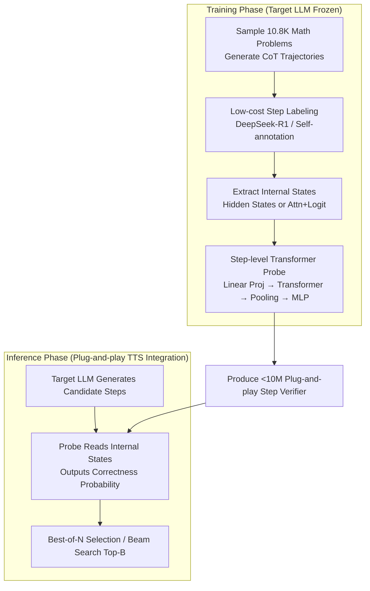

# ReProbe: Efficient Test-Time Scaling of Multi-Step Reasoning by Probing Internal States of Large Language Models

**Conference**: ACL2026  
**arXiv**: [2511.06209](https://arxiv.org/abs/2511.06209)  
**Code**: https://reprobe.github.io/  
**Area**: LLM Reasoning  
**Keywords**: Test-time scaling, process verification, internal state probes, PRM, Chain-of-Thought

## TL;DR
This paper proposes ReProbe, which uses a lightweight transformer probe with fewer than 10M parameters to read the hidden states, attention, and logits of a frozen LLM to determine the reliability of each reasoning step. It approaches or exceeds the performance of PRMs 750-810 times larger on math, planning, and QA tasks, serving as an efficient step verifier for Best-of-N and beam search.

## Background & Motivation
**Background**: Chain-of-Thought and large reasoning models enable LLMs to generate long reasoning chains. However, an error in any step can deviate the final answer. Test-time scaling (TTS) improves accuracy by sampling multiple candidate reasonings and filtering reliable intermediate steps or complete trajectories, commonly through Best-of-N and beam search.

**Limitations of Prior Work**: Current mainstream step verifiers are Process Reward Models (PRMs). PRMs are typically independent LLMs with 1.5B to 8B parameters, requiring extensive step-level labeling, Monte-Carlo rollouts, or expensive human/LLM judgments. They also incur high VRAM and latency costs during inference. Moreover, many PRMs are highly trained on math but show limited generalization to out-of-distribution (OOD) tasks like planning and QA.

**Key Challenge**: TTS requires a reliable scorer, but stronger scorers are usually larger, more expensive, and domain-specific. Simple uncertainty metrics are cheap but lack sufficient accuracy. An ideal solution should judge process quality like a PRM while remaining as lightweight as an uncertainty probe.

**Goal**: The authors aim to validate the hypothesis that while generating reasoning steps, an LLM's internal states already encode signals regarding step reliability. Extracting these signals with a small probe could replace or supplement PRMs.

**Key Insight**: Past research on hallucination detection indicates that hidden states, attention distributions, and logits contain self-awareness signals. ReProbe transfers this introspection approach from factual hallucination detection to multi-step reasoning verification.

**Core Idea**: Instead of using another large model to read and score text, a small probe directly reads the internal states generated by the target LLM and outputs the probability that the current reasoning step is correct.

## Method
ReProbe is a plug-and-play step verifier. it does not modify the supervised LLM nor generate new reasoning text; it only extracts internal features as the target model generates each step and outputs a correctness score. This score can be used like a PRM reward for Best-of-N trajectory selection or beam search.

### Overall Architecture
During training, 10.8K math problems are sampled from the PRM800K dataset. The target LLM generates multiple CoT trajectories, which are labeled as correct/incorrect at the step level using DeepSeek-R1 or the model itself. The target LLM is then frozen, internal features are extracted for each step, and a ReProbe is trained for binary classification. During inference, the target LLM generates candidate steps, ReProbe reads internal states in real-time to output step scores, and TTS strategies retain the most credible steps or trajectories.

### Key Designs

**1. Probing Internal States vs. Reviewing External Text: Deriving Verification Signals from "Internal Hesitation"**

The fundamental limitation of PRMs is that they are just another language model, observing only the reasoning text already written by the target model—surface fluency does not guarantee confidence. ReProbe directly reads the internal signals produced during generation. The authors compare two feature sets: "Attn+Logit" (attention weights and top-K logits across all layers) and "Hidden States" from all layers. Each token's features are built on the full context of the problem and history. Hidden States performed best, suggesting that representation-level confidence reflects step quality better than attention or logits.

**2. Step-level Transformer Probe: Aggregating Token Features for Step-level Judgment**

A reasoning step comprises multiple tokens. Simple linear probes look at individual tokens and fail to capture whether "the step as a whole is logically sound." ReProbe uses a linear layer for dimensionality projection, followed by transformer layers to model intra-step token dependencies. Mean pooling then produces a step vector, and a two-layer MLP outputs the correctness logit. Despite having <10M parameters, it models contextual composition within a step more accurately than linear probes.

**3. Low-cost Labeling + Plug-and-play TTS Integration: Compressing Supervision into a Small Model**

PRM training typically relies on massive manual step-level labeling. ReProbe's labels can be provided by DeepSeek-R1 or via self-annotation by the target model. Once trained, it serves as a plug-and-play verifier for TTS. In Best-of-N, step scores are aggregated to select trajectories; in beam search, weights are used to keep top-B continuations. Since expensive supervision is compressed into a <10M probe, there is no need to run a large PRM during inference, reducing VRAM and latency.

### Loss & Training
ReProbe uses standard binary cross-entropy with class weighting to handle label imbalance. The target LLM remains frozen. Primary experiments used Qwen3-8B in non-thinking CoT mode, extending to Qwen3-1.7B, Qwen3-32B in native thinking mode, and Phi-4. Training used 10.8K PRM800K problems (32K trajectories total). Generation utilized top-k 50, top-p 0.95, and temperature 1.0. A vLLM pipeline was developed for accelerated feature extraction.

## Key Experimental Results

### Main Results
Step-level error detection is measured via PR-AUC. ReProbe's performance on in-domain (ID) math is close to the strongest PRMs and superior on OOD planning and QA. Specifically, Hidden States + Self-anno achieved an overall PR-AUC of 0.604, outperforming Qwen2.5-Math-PRM-7B (0.565).

| Method | Params/Sample Size | ID Avg PR-AUC↑ | OOD Avg PR-AUC↑ | Overall PR-AUC↑ | Conclusion |
|------|---------------|----------------|-----------------|-----------------|------|
| Semantic Entropy | No training | 0.182 | 0.409 | 0.324 | Uncertainty signals are useful but insufficient |
| Skywork-PRM-1.5B | 1.5B, samples unknown | 0.281 | 0.426 | 0.371 | Small PRMs have limited generalization |
| Qwen2.5-Math-PRM-7B | 7B, 860K | 0.514 | 0.595 | 0.565 | Strong Math PRM, but matched by probe on OOD |
| ReProbe Attn+Logit Self-anno | <10M, 32K | 0.461 | 0.618 | 0.559 | Self-supervised nearly matches strong PRMs |
| ReProbe Hidden States Self-anno | <10M, 32K | 0.498 | 0.667 | 0.604 | Best overall with significant OOD advantage |
| ReProbe Hidden States DeepSeek-anno | <10M, 32K | 0.488 | 0.639 | 0.582 | External labeling is also stable and effective |

In TTS tasks, ReProbe directly replaces PRMs as a scorer. In beam search, Hidden States + DeepSeek-anno reached an overall accuracy of 76.6.

| Method | MATH↑ | GSM8K↑ | ProofNet↑ | ID Avg↑ | OOD Avg↑ | Overall↑ |
|------|-------|--------|-----------|---------|----------|----------|
| Qwen2.5-Math-7B-PRM800K | 89.8 | 80.4 | 95.2 | 88.5 | 59.0 | 71.6 |
| Qwen2.5-Math-PRM-7B | 88.1 | 95.4 | 93.6 | 92.4 | 54.4 | 70.7 |
| ReProbe Attn+Logit Self-anno | 90.3 | 95.4 | 95.1 | 93.6 | 61.9 | 75.5 |
| ReProbe Hidden States Self-anno | 84.1 | 97.3 | 90.6 | 90.7 | 60.0 | 73.2 |
| ReProbe Hidden States DeepSeek-anno | 86.8 | 98.8 | 95.6 | 93.7 | 63.7 | 76.6 |

### Ablation Study
The paper analyzes data diversity, PRM complementarity, and architecture choices. Diverse problem distributions significantly improve overall PR-AUC. Fusing ReProbe scores with PRM scores via simple logistic regression further enhances performance on some math datasets.

| Ablation/Combination | MATH PR-AUC↑ | GSM8K PR-AUC↑ | ProofNet PR-AUC↑ | Note |
|-----------|--------------|---------------|------------------|------|
| ReProbe Attn+Logit, homogeneous 6K | 0.308 | 0.549 | 0.205 | Limited generalization |
| ReProbe Attn+Logit, diverse 6K | 0.409 | 0.575 | 0.180 | Diversity boosts overall performance |
| PRM1 (Qwen2.5-Math-7B-PRM800K) | 0.586 | 0.613 | 0.301 | Strong text-based process reward model |
| ReProbe + PRM1 | 0.613 | 0.674 | 0.318 | Complements text evaluation with internal confidence |

### Key Findings
- ReProbe's advantage stems largely from OOD generalization. PRMs are strong in-domain but probes overfit less to specific math text distributions.
- Self-supervised labeling is competitive. Self-anno ReProbe matches or exceeds DeepSeek-anno in several metrics, indicating target models can provide useful process supervision.
- ReProbe can supplement PRMs. Fusion experiments show they capture different information: PRMs act as external reviewers, while ReProbe acts as the model's internal confidence meter.
- Deployment efficiency is significant. The current implementation offers 2.6× to 25× speedup over state-of-the-art PRMs.

## Highlights & Insights
- Shifting "process reward" from the text space to the state space is highly impactful. Reasoning quality is not solely determined by generated text; hidden representations contain intrinsic supervision signals.
- ReProbe provides finer cost control for TTS. It is ideal for resource-constrained systems that still require reasoning search.
- Experiments on native thinking mode demonstrate that the method does not strictly rely on structured CoT formatting, as using sentences as steps still allows for effective probe training.
- For engineering, ReProbe can serve in a cascade: use it to filter the majority of candidates, passing only uncertain samples to a heavy PRM.

## Limitations & Future Work
- ReProbe is model-specific. Since it reads internal states, different models or fine-tuned versions require separate training or adaptation.
- Performance still scales with training data size; curves for tasks like StrategyQA have not yet saturated.
- Relying on DeepSeek-R1 as a judge involves API costs and non-determinism.
- For extremely long reasoning chains, both PRMs and ReProbe degrade. Future work should address stable step segmentation and error aggregation in long contexts.

## Related Work & Insights
- **vs. PRM**: PRMs use an auxiliary LLM to score text; ReProbe uses a tiny model to read internal states, offering lower cost and better OOD generalization but requiring model-specific training.
- **vs. Unsupervised UQ**: Metrics like entropy or perplexity require no training but are less effective. ReProbe remains lightweight while capturing complex reliability patterns through supervision.
- **vs. Self-consistency**: Majority voting aggregates at the final answer level; ReProbe intervenes at the step level, making it more suitable for search.
- **vs. Formal Verification**: Formal methods are reliable but domain-restricted; ReProbe is general-purpose but does not provide formal proofs.

## Rating
- Novelty: ⭐⭐⭐⭐⭐ Systematizes internal state probing for reasoning step verification, forming a clear complement to the PRM path.
- Experimental Thoroughness: ⭐⭐⭐⭐⭐ Comprehensive coverage across PR-AUC, Best-of-N, beam search, multiple models, and efficiency analysis.
- Writing Quality: ⭐⭐⭐⭐ Clear structure and data-dense tables; training cost details are slightly complex across main text and limitations.
- Value: ⭐⭐⭐⭐⭐ Highly valuable for low-cost test-time scaling and deployable reasoning systems.

<!-- RELATED:START -->

## Related Papers

- [\[ICLR 2026\] Efficient Test-Time Scaling for Small Vision-Language Models](../../ICLR2026/llm_reasoning/efficient_test-time_scaling_for_small_vision-language_models.md)
- [\[ACL 2026\] Efficient Test-Time Scaling via Temporal Reasoning Aggregation](efficient_test-time_scaling_via_temporal_reasoning_aggregation.md)
- [\[ACL 2026\] Parallel Test-Time Scaling for Latent Reasoning Models](parallel_test-time_scaling_for_latent_reasoning_models.md)
- [\[CVPR 2026\] VisRef: Visual Refocusing while Thinking Improves Test-Time Scaling in Multi-Modal Large Reasoning Models](../../CVPR2026/llm_reasoning/visref_visual_refocusing_test_time_scaling.md)
- [\[ICML 2026\] Prism: Efficient Test-Time Scaling via Hierarchical Search and Self-Verification for Discrete Diffusion Language Models](../../ICML2026/llm_reasoning/prism_efficient_test-time_scaling_via_hierarchical_search_and_self-verification_.md)

<!-- RELATED:END -->
