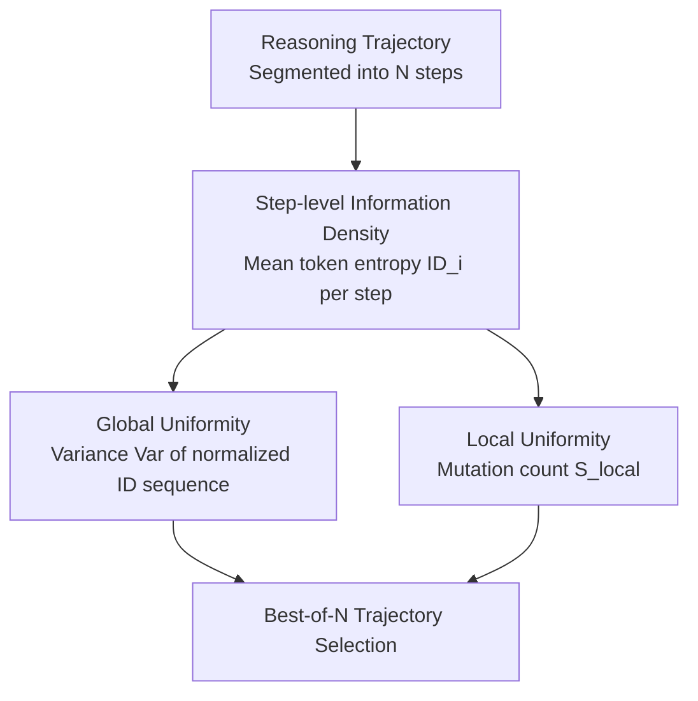

# Revisiting the Uniform Information Density Hypothesis in LLM Reasoning

**Conference**: ACL 2026 Findings  
**arXiv**: [2510.06953](https://arxiv.org/abs/2510.06953)  
**Code**: [GitHub](https://github.com/talzoomanzoo/uid-reasoning)  
**Area**: LLM Evaluation  
**Keywords**: Uniform Information Density, Reasoning Quality Assessment, Entropy Analysis, Best-of-N Selection, Chain-of-Thought

## TL;DR

This paper introduces the Uniform Information Density (UID) hypothesis from psycholinguistics into LLM reasoning analysis. It proposes an entropy-based step-level information density framework and discovers that high-quality reasoning trajectories exhibit a counter-intuitive pattern of "local uniformity + global non-uniformity." This pattern significantly outperforms traditional confidence/entropy baselines in Best-of-N sampling.

## Background & Motivation

**Background**: Chain-of-Thought (CoT) reasoning has become a core technology for improving LLM performance on complex tasks. However, quality assessment of reasoning trajectories primarily relies on coarse signals like final answer correctness or token-level confidence, lacking a structural characterization of "process quality."

**Limitations of Prior Work**: (1) Intermediate reasoning steps often suffer from logical inconsistency or incoherence; (2) existing internal signal methods (self-certainty, high confidence, low entropy) treat reasoning trajectories as a whole, failing to capture the information flow structure between steps; (3) even with long reasoning chains, models may fail to generalize on out-of-distribution tasks.

**Key Challenge**: It is impossible to judge whether an LLM is "truly reasoning" or merely generating "superficially coherent" text based solely on the final output—a framework is needed to characterize the quality of the reasoning process from an information-theoretic perspective.

**Goal**: Extend the UID hypothesis from human linguistic communication to LLM reasoning scenarios, establish a quantitative framework for step-level information density, and verify its effectiveness as a reasoning quality metric.

**Key Insight**: The UID hypothesis suggests that effective human communication requires a uniform distribution of information to reduce cognitive load. The authors draw an analogy to the reasoning process—each reasoning step is akin to a linguistic unit in communication, and its entropy variation reflects an "exploration-convergence" structure.

**Core Idea**: High-quality LLM reasoning does not follow the global uniformity of human communication. Instead, it presents a unique pattern of "smooth local transitions (high local uniformity) + global structural non-uniformity (from high-entropy exploration to low-entropy convergence)"—reflecting the fundamental difference in objectives between reasoning and communication.

## Method

### Overall Architecture

Given a reasoning trajectory $\mathbf{z} = [z_1, \dots, z_N]$ (segmented into $N$ steps by `\n\n`), each step $z_i$ contains $M_i$ tokens. The authors first calculate the predictive distribution entropy $H_t$ at each token position and then aggregate it into step-level information density $ID_i = \frac{1}{M_i}\sum_{t=1}^{M_i} H_t$. Based on this, two complementary metrics are defined: global uniformity (variance) and local uniformity (count of step-to-step mutations) for Best-of-N trajectory selection.

### Key Designs

**1. Step-level ID: Elevating reasoning from token sequences to "information per step"**

Most existing internal signals (self-certainty, confidence, log-probs) score the entire trajectory as a whole, ignoring information flow. This paper uses the entropy of the predictive distribution as a proxy for information density: for each token position, calculate the predictive entropy $H_t$, then average the entropy of all tokens in a step:

$$ID_i = \frac{1}{M_i}\sum_{t=1}^{M_i} H_t.$$

Low entropy implies model certainty, while high entropy implies hesitation between possible continuations. Entropy is used because it encodes both model certainty and reasoning difficulty—quantizing how many bits are needed to encode the distribution. Authors observe that correct trajectories show a declining $ID$ curve ("exploration to convergence"), while incorrect ones are flat noise.

**2. Global Uniformity (Measured by Variance): High-quality reasoning is "globally non-uniform"**

The original UID hypothesis suggests human communication requires uniform information distribution to ease cognitive load. Intuitively, reasoning should follow this. This paper proves the opposite: calculating variance $\text{Var}(\tilde{\mathbf{u}})$ on normalized $ID$ vectors shows high variance (global non-uniformity) in high-quality trajectories. Since LLM reasoning is a "listener-free" internal computation, it involves clear phase transitions from high-entropy exploration to low-entropy convergence. This non-uniformity is a feature of problem-solving structures.

**3. Local Uniformity (Mutation Detection): Identifying "breaks in thought"**

Beyond global structure, authors examine smooth transitions between adjacent steps. By calculating step-wise changes $\Delta_i = ID'_i - ID'_{i-1}$ and setting thresholds $T^{\pm} = \mu_\Delta \pm \tau \sigma_\Delta$ ($\tau \in \{2, 3\}$), they count upward and downward mutations $S_{\text{local}}$. Smaller $S_{\text{local}}$ represents higher local uniformity. A local mutation often corresponds to a "break in thought" or "sudden confusion," which effectively distinguishes correct from incorrect trajectories.

### Loss & Training

This is an analytical work and does not involve model training. DeepSeek-R1-Distill-Qwen-7B, DeepSeek-R1-Distill-Llama-8B, and Qwen3-8B are used as reasoning models. Evaluation is conducted under a Best-of-5 sampling setting (temperature=0.6, top-p=0.95, top-k=20).

## Key Experimental Results

### Main Results

**Best-of-5 Selection Accuracy (DS-R1-Distill-Qwen-7B)**

| Method | AIME25 | BRUMO25 | HMMT25 | MinervaMath |
|------|--------|---------|--------|-------------|
| Mean Acc. | 0.40 | 0.54 | 0.24 | 0.30 |
| Self-Certainty | 0.48 | 0.52 | 0.28 | 0.30 |
| High Conf. | 0.48 | 0.52 | 0.27 | 0.30 |
| Low Entropy | 0.48 | 0.56 | 0.24 | 0.30 |
| **Loc. uni (ours)** | **0.53** | **0.56** | **0.30** | **0.31** |
| **Glob. non-uni (ours)** | **0.52** | **0.64** | 0.26 | 0.30 |

### Ablation Study

**Model Scale Analysis (Qwen3 series, AIME2025)**

| Method | Qwen3-1.7B | Qwen3-4B | Qwen3-8B |
|------|-----------|----------|----------|
| Mean Acc. | 0.35 | 0.65 | 0.67 |
| Self-Certainty | 0.45 | 0.73 | 0.63 |
| Loc. uni | 0.41 | 0.69 | 0.69 |
| Glob. non-uni | 0.37 | 0.66 | 0.70 |

**Sample Size Analysis (Qwen3-8B, AIME2025)**

| Method | Sample-3 | Sample-5 | Sample-10 |
|------|----------|----------|-----------|
| Loc. uni | 0.73 | 0.69 | 0.72 |
| Glob. non-uni | 0.70 | 0.70 | 0.70 |
| Self-Certainty | 0.70 | 0.63 | 0.62 |
| High Conf. | 0.63 | 0.60 | 0.57 |

### Key Findings

- Local uniformity consistently outperforms traditional baselines across models; DS-R1-Qwen-7B shows a +33% Gain on AIME25.
- Global non-uniformity performs best on harder benchmarks (0.64 on BRUMO25 vs 0.52 for Self-Certainty).
- Small models benefit more from local smoothing (+17% for 1.7B), while large models better utilize global non-uniformity (8B reaches 0.70).
- As sampling size increases (Sample-10), traditional baselines degrade (High Conf. drops from 0.63 to 0.57), while UID metrics remain stable.
- Effective on non-math tasks (GPQA-D, LSAT-AR, LSAT-LR), achieving +12.7% relative gain on LSAT-AR.
- Communicative prompting experiments confirm the goal difference: "explaining to listeners" shifts models toward human UID patterns but decreases reasoning performance.

## Highlights & Insights

- The insight that "reasoning is not communication" is profound—explaining UID deviations as a difference in internal computation vs. external communication goals rather than a model flaw.
- UID metrics are sample-efficient: they do not require majority voting or external verifiers, evaluating quality solely from internal signals of a single trajectory.
- The framework can be directly applied to Best-of-N selection strategies, significantly improving accuracy under controlled computational costs.

## Limitations & Future Work

- Analysis focuses on structured reasoning datasets (math, logic); generalization to open dialogue is unverified.
- Token-level entropy is used as a proxy, but mechanistic explanations for why these UID patterns emerge are lacking.
- Step segmentation is based on `\n\n` heuristics; while robust, finer-grained segmentation strategies are worth exploring.
- No comparison with external reward models like ORM/PRM.

## Related Work & Insights

- **vs Self-Certainty (Kang et al., 2025)**: The latter uses response-level confidence; Ours proposes step-level structural signals, which are more stable as sample size increases.
- **vs ROSCOE (Golovneva et al., 2023)**: The latter requires external evaluation models; Ours relies entirely on the generative model's own distribution.

## Rating

- Novelty: ⭐⭐⭐⭐⭐ First to introduce UID to LLM reasoning, identifying counter-intuitive patterns.
- Experimental Thoroughness: ⭐⭐⭐⭐⭐ Comprehensive analysis across 7 benchmarks, 3 models, and various scales.
- Writing Quality: ⭐⭐⭐⭐⭐ Clear analogy from psycholinguistics to LLM reasoning with logical progression.
- Value: ⭐⭐⭐⭐ Provides a new theoretical perspective and practical tool for reasoning trajectory assessment.

<!-- RELATED:START -->

## Related Papers

- [\[ACL 2026\] Revisiting Entropy in Reinforcement Learning for Large Reasoning Models](revisiting_entropy_in_reinforcement_learning_for_large_reasoning_models.md)
- [\[ACL 2026\] Efficient Process Reward Modeling via Contrastive Mutual Information](efficient_process_reward_modeling_via_contrastive_mutual_information.md)
- [\[ACL 2026\] AIM-CoT: Active Information-driven Multimodal Chain-of-Thought for Vision-Language Reasoning](aim-cot_active_information-driven_multimodal_chain-of-thought_for_vision-languag.md)
- [\[ICML 2026\] An Information-Theoretic Criterion for Efficient Data Synthesis](../../ICML2026/llm_reasoning/an_information-theoretic_criterion_for_efficient_data_synthesis.md)
- [\[ACL 2026\] How Chain-of-Thought Works? Tracing Information Flow from Decoding, Projection, and Activation](how_chain-of-thought_works_tracing_information_flow_from_decoding_projection_and.md)

<!-- RELATED:END -->
