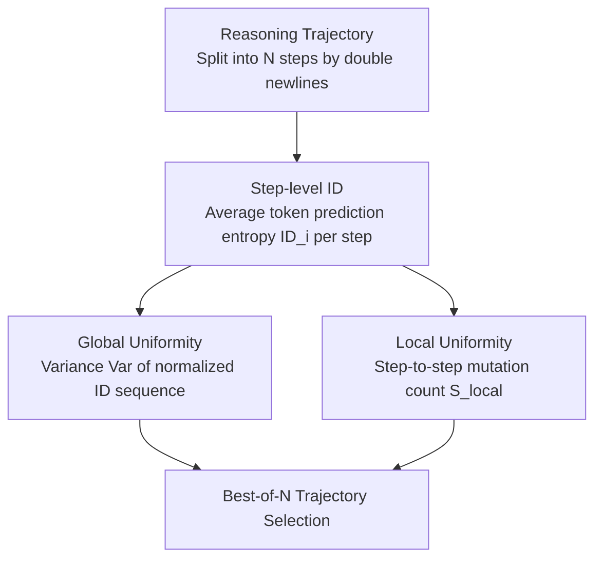

# Revisiting the Uniform Information Density Hypothesis in LLM Reasoning

**Conference**: ACL 2026 Findings  
**arXiv**: [2510.06953](https://arxiv.org/abs/2510.06953)  
**Code**: [GitHub](https://github.com/talzoomanzoo/uid-reasoning)  
**Area**: LLM Evaluation  
**Keywords**: Uniform Information Density, reasoning quality evaluation, entropy analysis, Best-of-N selection, Chain-of-Thought

## TL;DR

This paper introduces the Uniform Information Density (UID) hypothesis from psycholinguistics into LLM reasoning analysis, proposing an entropy-based step-level information density measurement framework. It discovers a counter-intuitive pattern of "local uniformity + global non-uniformity" in high-quality reasoning trajectories and demonstrates that this pattern significantly outperforms traditional confidence/entropy baselines in Best-of-N sampling.

## Background & Motivation

**Background**: Chain-of-Thought (CoT) reasoning has become a core technology for enhancing LLM performance on complex tasks. However, quality assessment of reasoning trajectories relies mainly on coarse-grained signals like final answer correctness or token-level confidence, lacking structural characterization of "process quality."

**Limitations of Prior Work**: (1) Logic inconsistencies or incoherence often occur in intermediate reasoning steps; (2) existing internal signal methods (self-certainty, high confidence, low entropy) treat reasoning trajectories as a whole, failing to capture the information flow structure between steps; (3) even with long reasoning chains, models may fail to generalize on out-of-domain tasks.

**Key Challenge**: It is impossible to determine whether an LLM is "truly reasoning" or merely generating "superficially coherent" text solely through final output—this requires a framework to characterize the quality of the reasoning process from an information-theoretic perspective.

**Goal**: To extend the UID hypothesis from human language communication to LLM reasoning scenarios, establish a quantitative framework for step-level information density, and verify its effectiveness as a reasoning quality metric.

**Key Insight**: The UID hypothesis suggests that effective human communication requires a uniform distribution of information to reduce cognitive load. The authors analogize the reasoning process—each reasoning step is similar to a linguistic unit in communication, and its entropy change reflects the "exploration-convergence" structure of information.

**Core Idea**: High-quality LLM reasoning does not follow the global uniformity of human communication. Instead, it presents a unique pattern of "smooth local transitions (high local uniformity) + global structural non-uniformity (from high-entropy exploration to low-entropy convergence)"—reflecting the fundamental difference in goals between reasoning and communication.

## Method

### Overall Architecture

Given a reasoning trajectory $\mathbf{z} = [z_1, \dots, z_N]$ (split into $N$ steps by `\n\n`), each step $z_i$ contains $M_i$ tokens. The authors first calculate the prediction distribution entropy $H_t$ for each token position, then aggregate it into step-level information density $ID_i = \frac{1}{M_i}\sum_{t=1}^{M_i} H_t$. Based on this, two complementary metrics are defined: global uniformity (variance) and local uniformity (step mutation count), used for Best-of-N reasoning trajectory selection.

### Key Designs

**1. Step-level ID: Elevating reasoning trajectories from token sequences to "information per step" perspective**

Existing internal signals (self-certainty, confidence, log-probs) mostly score the entire trajectory as a whole, failing to observe the information flow between steps. This paper uses the entropy of the prediction distribution as a proxy for information density: calculating the prediction entropy $H_t$ for each token position and averaging the entropy of all tokens within a step to obtain the information density for that step:

$$ID_i = \frac{1}{M_i}\sum_{t=1}^{M_i} H_t.$$

Low entropy implies model confidence, while high entropy implies hesitation between multiple possible continuations. Entropy is used instead of log-probability or confidence because it simultaneously encodes both the model's certainty and the reasoning difficulty of the step from an information-theoretic standpoint—it quantifies how many bits are needed to encode this prediction distribution. The authors observe that correct trajectories show a declining $ID$ curve representing "exploration then convergence," while incorrect trajectories typically show flat noise.

**2. Global Uniformity (Measured by Variance): Discovering that high-quality reasoning is "globally non-uniform"**

The UID hypothesis originally suggests that human communication requires a uniform distribution of information to reduce the listener's cognitive load. Intuition suggests reasoning should follow this as well. However, this paper finds the opposite: calculating the variance $\text{Var}(\tilde{\mathbf{u}})$ of the normalized $ID$ vector shows that high variance indicates information concentration in specific stages (global non-uniformity), while low variance indicates global uniformity. The result is that high-quality reasoning trajectories possess **high** global variance. This occurs because LLM reasoning is a "listener-less" internal computation with clear phase transitions from high-entropy exploration to low-entropy convergence. This global non-uniformity is not a flaw but a manifestation of the natural stage structure of problem-solving—direct evidence of the goal difference between reasoning and communication.

**3. Local Uniformity (Mutation Detection): Distinguishing trajectory quality by "chain of thought consistency"**

Beyond global structure, the authors investigate whether information density transitions smoothly between adjacent steps. By calculating step-to-step changes $\Delta_i = ID'_i - ID'_{i-1}$, and setting thresholds $T^{\pm} = \mu_\Delta \pm \tau \sigma_\Delta$ ($\tau \in \{2, 3\}$), they count the total number of upward and downward mutations exceeding the threshold, $S_{\text{local}}$. A smaller $S_{\text{local}}$ represents higher local uniformity. A local mutation often corresponds to a "break in thought" or "sudden confusion" in the reasoning process. This breakage is highly discriminative between correct and incorrect trajectories, making local uniformity the most stable quality signal among the three metrics. Combined, these metrics characterize a unique fingerprint of high-quality reasoning—"locally smooth + globally segmented"—which can be directly used for Best-of-N trajectory selection.

### Loss & Training

This is an analytical work and does not involve model training. DeepSeek-R1-Distill-Qwen-7B, DeepSeek-R1-Distill-Llama-8B, and Qwen3-8B were used as reasoning models. Evaluation focused on the effectiveness of UID metrics as selection criteria under a Best-of-5 sampling setting (temperature=0.6, top-p=0.95, top-k=20).

## Key Experimental Results

### Main Results

**Best-of-5 Selection Accuracy (DS-R1-Distill-Qwen-7B)**

| Method | AIME25 | BRUMO25 | HMMT25 | MinervaMath |
|------|--------|---------|--------|-------------|
| Mean Acc. | 0.40 | 0.54 | 0.24 | 0.30 |
| Self-Certainty | 0.48 | 0.52 | 0.28 | 0.30 |
| High Conf. | 0.48 | 0.52 | 0.27 | 0.30 |
| Low Entropy | 0.48 | 0.56 | 0.24 | 0.30 |
| **Loc. uni (Ours)** | **0.53** | **0.56** | **0.30** | **0.31** |
| **Glob. non-uni (Ours)** | **0.52** | **0.64** | 0.26 | 0.30 |

### Ablation Study

**Model Scale Analysis (Qwen3 Series, AIME2025)**

| Method | Qwen3-1.7B | Qwen3-4B | Qwen3-8B |
|------|-----------|----------|----------|
| Mean Acc. | 0.35 | 0.65 | 0.67 |
| Self-Certainty | 0.45 | 0.73 | 0.63 |
| Loc. uni | 0.41 | 0.69 | 0.69 |
| Glob. non-uni | 0.37 | 0.66 | 0.70 |

**Sampling Scale Analysis (Qwen3-8B, AIME2025)**

| Method | Sample-3 | Sample-5 | Sample-10 |
|------|----------|----------|-----------|
| Loc. uni | 0.73 | 0.69 | 0.72 |
| Glob. non-uni | 0.70 | 0.70 | 0.70 |
| Self-Certainty | 0.70 | 0.63 | 0.62 |
| High Conf. | 0.63 | 0.60 | 0.57 |

### Key Findings

- Local uniformity consistently outperforms traditional baselines across all models and benchmarks, with DS-R1-Qwen-7B achieving a +33% Gain on AIME25.
- Global non-uniformity performs best on harder benchmarks (reaching 0.64 on BRUMO25 vs. 0.52 for Self-Certainty).
- Smaller models benefit more from local smoothing (17% Gain for 1.7B), while larger models better utilize global non-uniformity (8B reaches an optimal 0.70).
- When sampling increases (Sample-10), traditional baselines degrade (High Conf. drops from 0.63 to 0.57), but UID metrics remain stable.
- The metrics are also effective on non-mathematical reasoning tasks (GPQA-D, LSAT-AR, LSAT-LR), achieving a +12.7% relative improvement on LSAT-AR.
- Communicative prompt experiments verify the goal difference: adding "explain to the audience" instructions shifts models toward the human UID pattern but degrades reasoning performance.

## Highlights & Insights

- The insight that "reasoning is not communication" is profound—explaining deviations from UID as differences between internal computation and external communication goals rather than model defects.
- UID metrics offer sample-efficient advantages: they do not require majority voting or external verifiers, allowing quality assessment based solely on internal signals from a single trajectory.
- The framework can be directly applied to Best-of-N selection strategies for reasoning models, significantly improving accuracy while keeping computational costs manageable.

## Limitations & Future Work

- Analysis primarily focuses on structured reasoning datasets (math, logic); generalization to open-ended dialogue or interactive scenarios is not yet verified.
- Token-level entropy is used as a proxy for information density without providing a mechanistic explanation for why these UID patterns emerge.
- Step segmentation relies on `\n\n` heuristics; although the appendix confirms robustness, finer-grained segmentation strategies are worth exploring.
- No direct comparison is made with external reward models like ORM/PRM.

## Related Work & Insights

- **vs Self-Certainty (Kang et al., 2025)**: The latter uses response-level confidence signals, whereas this paper proposes step-level structural signals—found to be more stable as sampling volume increases.
- **vs ROSCOE (Golovneva et al., 2023)**: The latter requires scoring from an external evaluation model; the UID metrics in this paper are entirely based on the generative model's own predictive distribution, requiring no additional models.

## Rating

- Novelty: ⭐⭐⭐⭐⭐ First to introduce the UID hypothesis to LLM reasoning, discovering the counter-intuitive "local uniformity + global non-uniformity" pattern.
- Experimental Thoroughness: ⭐⭐⭐⭐⭐ Comprehensive analysis across 7 benchmarks, 3 models, and various sampling and model scales.
- Writing Quality: ⭐⭐⭐⭐⭐ Clear analogy from psycholinguistics to LLM reasoning, with logical progression of experiments.
- Value: ⭐⭐⭐⭐ Provides a new theoretical perspective and practical tool for assessing the quality of reasoning trajectories.

<!-- RELATED:START -->

## Related Papers

- [\[ACL 2026\] Revisiting Entropy in Reinforcement Learning for Large Reasoning Models](revisiting_entropy_in_reinforcement_learning_for_large_reasoning_models.md)
- [\[ACL 2026\] Efficient Process Reward Modeling via Contrastive Mutual Information](efficient_process_reward_modeling_via_contrastive_mutual_information.md)
- [\[ACL 2026\] AIM-CoT: Active Information-driven Multimodal Chain-of-Thought for Vision-Language Reasoning](aim-cot_active_information-driven_multimodal_chain-of-thought_for_vision-languag.md)
- [\[CVPR 2026\] Revisiting the Necessity of Lengthy Chain-of-Thought in Vision-centric Reasoning Generalization](../../CVPR2026/llm_reasoning/revisiting_the_necessity_of_lengthy_chain-of-thought_in_vision-centric_reasoning.md)
- [\[ICML 2026\] An Information-Theoretic Criterion for Efficient Data Synthesis](../../ICML2026/llm_reasoning/an_information-theoretic_criterion_for_efficient_data_synthesis.md)

<!-- RELATED:END -->
