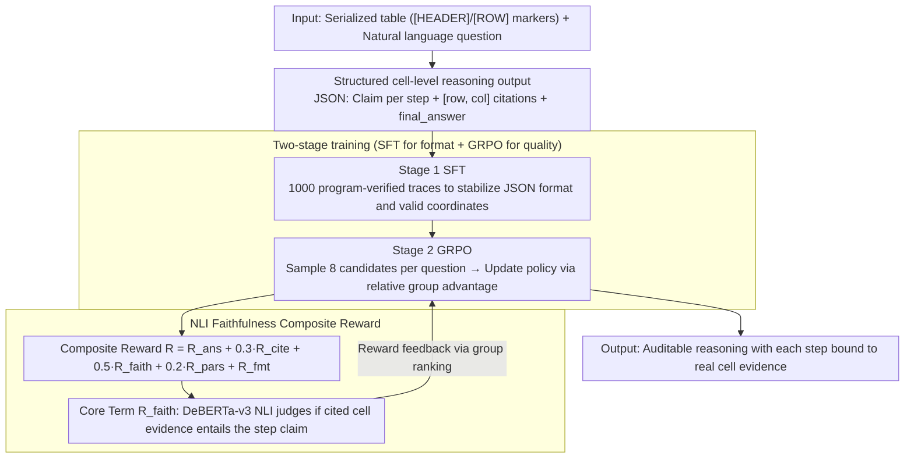

# RSAT: Structured Attribution Makes Small Language Models Faithful Table Reasoners

**Conference**: ACL2026  
**arXiv**: [2605.00199](https://arxiv.org/abs/2605.00199)  
**Code**: https://github.com/JugalGajjar/RSAT  
**Area**: LLM Reasoning / Table QA / Explainable Attribution  
**Keywords**: Table Reasoning, Cell-level Citation, GRPO, Faithfulness, Small Language Models

## TL;DR
RSAT utilizes "SFT in structured citation format + GRPO with NLI faithfulness as the core reward" to train 1B-8B small language models. This approach enables table QA to not only provide answers but also bind each reasoning step to specific table cells, increasing average faithfulness from 0.224 in SFT to 0.826.

## Background & Motivation
**Background**: Table QA and table fact verification have established pathways such as TAPAS, TAPEX, TaBERT, Binder, Chain-of-Table, and TaPERA. The mainstream objective is to improve answer accuracy or enable the model to perform table operations. Recent LLM methods generate chain-of-thought, but usually provide only natural language reasoning processes.

**Limitations of Prior Work**: When users see an answer, it is difficult to know which cells the model relied upon. Table reasoning is often used in scenarios requiring auditing, such as finance, news, and medicine, where "correct answers" are insufficient. If reasoning steps cannot correspond to evidence cells, it is impossible to determine if the model performed correct reasoning, hit high by chance, or fabricated an explanation post-hoc.

**Key Challenge**: Structural formats are easy to mimic through supervised learning, but whether the "cited cells actually support the reasoning step" is a matter of semantic faithfulness rather than format. Experiments in the paper demonstrate that SFT can achieve nearly 99% format success, but the average faithfulness remains around 22%.

**Goal**: This work aims to enable small models to generate auditable cell-level citations directly during reasoning generation, rather than generating answers first and adding citations post-hoc. Specifically, it seeks to satisfy answer quality, JSON format, valid citation coordinates, faithful citation evidence, and citation conciseness simultaneously.

**Key Insight**: RSAT designs "citation faithfulness" as a training objective. The authors first use a small number of validated structural traces to teach the model the output format, and then use GRPO to optimize a composite reward on large-scale table QA data without traces, where NLI entailment directly measures whether cited cells support the reasoning step.

**Core Idea**: Transform attribution in table reasoning from a post-processing task into a reinforcement learning objective during generation, using calculable faithfulness rewards to force small models to ground every reasoning step in real cell evidence.

## Method
The Mechanism of RSAT is straightforward: first fix the output space into a verifiable structure, and then use rewards to make this structure trustworthy. It does not seek to redesign the table encoder but trains existing instruction models via LoRA into "small reasoners capable of citing table evidence."

### Overall Architecture
The input consists of a serialized table and a natural language question. The table is flattened with markers like `[HEADER]` and `[ROW 0]`, allowing the model to map `[row, col]` coordinates in the output back to original cells. The output is a JSON object: a set of `reasoning_steps`, where each step contains a natural language claim and a list of `cited_cells` coordinates, followed by a `final_answer`.

Training is divided into two stages. The first stage is SFT, using 1,000 structural reasoning traces generated by Claude Opus 4.5 and programmatically verified to teach the model the format. The second stage is GRPO, where the model samples 8 candidate outputs for the same question, scores them using a composite reward, and updates the policy based on relative advantages within the group. Evaluation covers Qwen 2.5 Instruct (1.5B/3B/7B) and Llama 3 Instruct (1B/3B/8B), with data from WTQ, FeTaQA, and TabFact.

### Key Designs

**1. Structured cell-level reasoning output: Grounding evidence in the smallest auditable units**

When table reasoning fails, the root cause is often selecting the wrong row, the wrong column, or misinterpreting the relationship between several cells; however, if the answer is correct, these issues are masked. RSAT explicitly preserves row and column positions (using `[HEADER]`, `[ROW 0]`, etc.) during table serialization and requires each reasoning step in the output to include several `[row, col]` coordinates. Consequently, citation is no longer at the paragraph or passage level but at the smallest auditable unit in the table structure—each claim can be traced back to specific cells by a human or a program, exposing cases where the "answer is correct but evidence is wrong."

**2. SFT for format, GRPO for quality: Decoupling "output capability" from "output trustworthiness"**

Relying solely on a small number of human or teacher traces for all capabilities often results in the model performing only superficial imitation. RSAT therefore splits the process: the SFT phase uses 1,000 program-verified traces (valid JSON, valid coordinates, reasonable number of steps) to stabilize the format; the GRPO phase does not rely on traces at all, using only the gold answer and reward functions to evaluate candidates sampled by the model itself. The basis for this separation comes from a telling phenomenon—after SFT, the format success rate and citation validity already approach 99%, but the average faithfulness is only 0.224, indicating that "writing beautiful JSON" and "citations actually supporting reasoning" are two different capabilities, the latter of which cannot be achieved through supervised imitation.

**3. Composite reward centered on NLI faithfulness: Transforming "supportive citations" into an optimizable signal**

If only the answer is rewarded, the model may ignore citations; if only valid coordinates are rewarded, the model may randomly cite real but irrelevant cells. RSAT's composite reward simultaneously constrains the answer, citation validity, faithfulness, conciseness, and format:

$$R=R_{ans}+0.3R_{cite}+0.5R_{faith}+0.2R_{pars}+R_{fmt}$$

The most critical term with the highest weight is $R_{faith}$—it concatenates all cited cell values of a step into an evidence string and uses DeBERTa-v3-base NLI to determine if this evidence entails the natural language claim of that step. This quantifies "faithfulness" into a gradient signal that can be backpropagated. $R_{pars}$ penalizes citing too many cells at once (avoiding "shotgun" citations), and JSON parsing failures trigger a hard format penalty. It is this NLI term that closes the loop between table evidence, reasoning text, and RL objectives, forcing the small model to ground every reasoning step in real evidence.

### Loss & Training
SFT uses LoRA applied to linear layers including Q/K/V/O, gate, up, and down, training for 3 epochs with a learning rate of approximately $2\times 10^{-4}$. For GRPO, new LoRA weights are applied after merging SFT weights, training on 500 samples for 1 epoch. Each question generates $G=8$ candidates with a learning rate of $5\times 10^{-5}$ and a temperature of 0.9. The authors emphasize that GRPO is more suitable for single H100 GPU training as it eliminates the critic compared to PPO; total training for the six main models and ablations was approximately 36.8 GPU-hours.

## Key Experimental Results

### Main Results
RSAT outperformed zero-shot, SFT-only, and post-hoc baselines across all six models. The most significant finding is that while SFT almost solves the format issue, faithfulness remains low; GRPO significantly boosts faithfulness without sacrificing Answer F1.

| Model | Method | Answer F1 | Citation Validity | Faithfulness | Conciseness | Format Success |
|------|------|-----------|------------|--------|--------|------------|
| Qwen 1.5B | SFT | 0.371 | 0.995 | 0.149 | 0.918 | 0.998 |
| Qwen 1.5B | RSAT | 0.524 | 0.996 | 0.847 | 0.990 | 0.998 |
| Qwen 3B | SFT | 0.531 | 0.996 | 0.213 | 0.848 | 0.998 |
| Qwen 3B | RSAT | 0.592 | 0.999 | 0.946 | 0.996 | 1.000 |
| Qwen 7B | SFT | 0.576 | 1.000 | 0.234 | 0.888 | 1.000 |
| Qwen 7B | RSAT | 0.619 | 0.992 | 0.977 | 0.992 | 0.992 |
| Llama 8B | SFT | 0.555 | 0.996 | 0.288 | 0.830 | 0.998 |
| Llama 8B | RSAT | 0.647 | 1.000 | 0.972 | 1.000 | 1.000 |

The contributions of the training stages are also compelling. SFT brings an average of +0.61 format success, +0.64 citation validity, and +0.34 F1 over zero-shot, but only +0.19 faithfulness. From SFT to RSAT, the format remains nearly unchanged, while faithfulness improves by +0.60 and F1 by +0.09.

### Ablation Study

| Configuration | F1 | Faithfulness | Conciseness | Description |
|------|----|--------|--------|------|
| Qwen 7B full | 0.619 | 0.977 | 0.992 | Full RSAT |
| Qwen 7B w/o Faithfulness Reward | 0.635 | 0.117 | 1.000 | F1 increases slightly, but evidence grounding collapses |
| Qwen 7B w/o Conciseness Reward | 0.612 | 0.952 | 0.604 | Tends to over-cite 5-6 cells |
| Qwen 7B w/o Citation Validity Reward | 0.605 | 0.934 | 0.993 | Minor impact since SFT already learned coordinate validity |
| Llama 8B full | 0.647 | 0.972 | 1.000 | Full RSAT |
| Llama 8B w/o Faithfulness Reward | 0.638 | 0.031 | 0.996 | Faithfulness drops from near perfect to almost invalid |

### Key Findings
- Post-hoc attribution is nearly unusable on small models, with an average format success rate of only 12.7% and only 0.4% for Qwen 3B. This indicates that "reasoning freely before patching coordinates" places excessive demand on working memory and table look-back capabilities.
- Qwen significantly outperforms Llama at smaller scales: at approx 3B, Qwen reaches 0.946 faithfulness, whereas Llama 3B is at 0.735; they converge at 7B/8B.
- The faithfulness reward is the only irreplaceable signal. Without it, models still output clean JSON and valid coordinates, but these citations no longer truly support the reasoning.

## Highlights & Insights
- This paper concisely transforms attribution from "explaining generation results" into a "training objective during generation." It reminds us that format constraints and evidence faithfulness are two different capabilities—format success cannot substitute for grounding quality.
- Using NLI as a step-level reward is practical. Although proxy bias exists, it establishes a calculable closed loop between table evidence, reasoning text, and RL objectives, suitable for training small models.
- The failure of the post-hoc baseline is a significant negative result. Many interpretability systems assume "adding citations after the answer" is feasible, but RSAT shows that in small models and structured table scenarios, citations must be endogenous to the generation process.
- This paradigm is transferable to other structured evidence scenarios like knowledge graphs, code execution results, and tool call logs: first define an auditable output structure, then use task-specific rewards to optimize output quality.

## Limitations & Future Work
- The primary limitation is that both the training reward and the main evaluation metric rely on the same DeBERTa NLI scorer, creating a train-eval circularity. Models might learn to cater to the linguistic preferences of that scorer rather than perfectly corresponding to human judgments of faithfulness.
- Evaluation covers only WTQ, FeTaQA, and TabFact, and has not yet verified generalization across more complex schemas like financial statements, clinical tables, or scientific datasets.
- EM (Exact Match) ranges only from 0.000 to 0.018, indicating that the mapping between answer expressions and gold strings remains unstable. The paper relies mainly on F1, which affects direct comparison with traditional table QA systems.
- The conciseness reward made some models significantly shorter, potentially over-compressing reasoning steps. Future research is needed on the balance between being "sufficiently concise" and "sufficiently explanatory."
- Human evaluation is a necessary next step, especially to verify whether citations deemed faithful by NLI are truly acceptable to human auditors.

## Related Work & Insights
- **vs TAPAS / TAPEX / TaBERT**: These methods focus on table understanding and answer accuracy; RSAT focuses on the step-level evidence behind those answers. It supplements rather than replaces the table encoder with an auditable output layer.
- **vs Chain-of-Table / TaPERA**: The latter emphasize reasoning through table transformations or program decomposition; RSAT emphasizes that every reasoning step must cite original cells, providing finer explanation granularity.
- **vs Self-RAG / ALCE / RARR**: These text attribution methods typically handle passage-level evidence; RSAT extends attribution to cell-level structured evidence and directly trains small models via RL.
- **vs post-hoc attribution**: Post-hoc requires the model to map free text back to table coordinates in a second pass, whereas RSAT produces citations synchronously during the first pass of generation, making it better suited for small models.

## Rating
- Novelty: ⭐⭐⭐⭐☆ Combines GRPO and cell-level faithful attribution naturally; the core is not a brand-new algorithm but a precisely designed objective.
- Experimental Thoroughness: ⭐⭐⭐⭐☆ Six models, three data sources, post-hoc controls, and reward ablations are solid, but lacks human faithfulness evaluation and cross-domain table validation.
- Writing Quality: ⭐⭐⭐⭐⭐ Problem definition, stage contributions, and ablation conclusions are very clear; negative results are well-explained.
- Value: ⭐⭐⭐⭐⭐ Highly instructive for deploying small models requiring auditable table reasoning, especially suitable for grounded reasoning design in high-risk domains.

<!-- RELATED:START -->

## Related Papers

- [\[AAAI 2026\] SAPO: Self-Adaptive Process Optimization Makes Small Reasoners Stronger](../../AAAI2026/llm_reasoning/sapo_self-adaptive_process_optimization_makes_small_reasoners_stronger.md)
- [\[ICLR 2026\] SLM-MUX: Orchestrating Small Language Models for Reasoning](../../ICLR2026/llm_reasoning/slm-mux_orchestrating_small_language_models_for_reasoning.md)
- [\[ICLR 2026\] Thinking-Free Policy Initialization Makes Distilled Reasoning Models More Effective and Efficient Reasoners](../../ICLR2026/llm_reasoning/thinking-free_policy_initialization_makes_distilled_reasoning_models_more_effect.md)
- [\[ICML 2026\] DenseSteer: Steering Small Language Models towards Dense Math Reasoning](../../ICML2026/llm_reasoning/densesteer_steering_small_language_models_towards_dense_math_reasoning.md)
- [\[ACL 2026\] LegalDrill: Diagnosis-Driven Synthesis for Legal Reasoning in Small Language Models](legaldrill_diagnosis-driven_synthesis_for_legal_reasoning_in_small_language_mode.md)

<!-- RELATED:END -->
