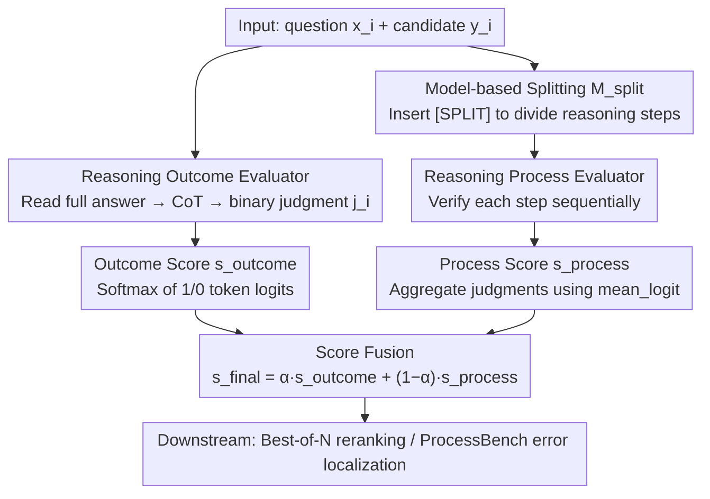

# Scaling Evaluation-Time Compute with Reasoning Models as Evaluators

**Conference**: ACL2026 Findings  
**arXiv**: [2503.19877](https://arxiv.org/abs/2503.19877)  
**Code**: None (cache not provided)  
**Area**: LLM Reasoning / LLM Evaluation / Test-time Scaling  
**Keywords**: evaluation-time compute, reasoning evaluator, process evaluation, outcome evaluation, Best-of-N

## TL;DR
This paper extends test-time scaling from "answer generation" to "answer evaluation," finding that allowing reasoning models to generate more reasoning tokens, perform step-by-step process checks, and combine outcome/process scores during evaluation allows them to outperform trained PRMs/ORMs in ProcessBench and Best-of-N reranking.

## Background & Motivation
**Background**: LLM reasoning capabilities have significantly benefited from test-time compute, such as allowing models to generate longer CoT, perform self-verification, or use multiple sampling. Simultaneously, model evaluators have become increasingly important, as they judge answer correctness, identify errors in reasoning chains, and help generators select better outputs in Best-of-N or search-based reasoning.

**Limitations of Prior Work**: Mainstream evaluators are mostly ORMs or PRMs that directly predict rewards/scores. These usually require specialized training and are prone to reward over-optimization on out-of-distribution tasks. While generative evaluators can output CoT, many fine-tuned evaluators produce short CoT that lacks the self-correction, backtracking, and edge-case analysis capabilities of reasoning models.

**Key Challenge**: If generative models can become stronger by "thinking longer," can evaluation models also become stronger by "evaluating longer"? Existing work often spends the computational budget on sampling more candidate answers without systematically comparing the trade-offs between "generating more candidates" and "evaluating candidates more carefully."

**Goal**: The authors study evaluation-time scaling: using off-the-shelf reasoning models as evaluators, forcing them to generate reasoning at both outcome-level and process-level granularities. The goal is to see if evaluation quality increases monotonically with reasoning tokens and if this stronger evaluation can, in turn, improve the generator's problem-solving performance.

**Key Insight**: The paper divides reasoning evaluators into outcome evaluators and process evaluators. The former judges whether the complete response is correct, while the latter judges each reasoning segment step-by-step, aggregating process scores into an overall score.

**Core Idea**: Transfer reasoning model problem-solving strategies to the evaluation process, allowing the evaluator to consume more evaluation-time compute through step-by-step checking, self-consistency, and outcome/process fusion.

## Method
The method does not train new models but constructs an inference-time evaluation recipe. Given a problem $x_i$ and a candidate response $y_i$, the reasoning evaluator first generates a CoT and then outputs a binary judgment; the score is derived from the logits of the "1/0" tokens. Process evaluation splits the response into multiple steps, evaluates each step, and aggregates them.

### Overall Architecture
The overall pipeline serves two purposes. The first is capability testing of the evaluator itself: in ProcessBench, the model must identify the first erroneous segment in a solution. The second is enhancing the generator: the generator samples multiple candidate answers for each question, and the evaluator scores the candidates to select the highest-scoring answer for Best-of-N output. The paper compares a direct evaluator's Best-of-64 against a reasoning evaluator's Best-of-8 under a fixed approximate compute budget. Internally, each candidate response undergoes both outcome and process evaluation, with both scores fused into a final score.

### Key Designs

**1. Reasoning Outcome Evaluator: Allow the model to read the complete answer, think before judging, and extract confidence scores from token logits.**

ORMs that directly predict rewards have a complete field of vision but compress the entire judgment into a single scalar, leaving no room for "thinking longer." The outcome evaluator prompts a reasoning model to read $(x_i, y_i)$, generate a CoT $c_i$, and then provide a binary judgment $j_i$ ("1" for correct, "0" for incorrect). Instead of a hard judgment, the score is calculated via softmax of these two token logits:

$$s_i = \frac{e^{\ell(j_i=1)}}{e^{\ell(j_i=0)} + e^{\ell(j_i=1)}}$$

This preserves the holistic perspective of judging final answer validity while supporting Best-of-N ranking with continuous scores. Its weakness is a macroscopic view that may overlook fine-grained errors in intermediate steps.

**2. Reasoning Process Evaluator: Break one-time judgment into step-by-step verification, naturally consuming more evaluation-time compute.**

A single CoT attempting to cover all steps of a reasoning segment can easily miss errors. The process evaluator instead performs sequential checks: when evaluating the $k$-th step, the model sees only the question and the previous $k$ steps, generating a specific verification CoT and judgment for $y_{ik}$. Judgments from all steps are aggregated into an overall score via an aggregation function. The paper deliberately prefers this multi-step process evaluation over a single-pass judgment of all steps—as step-by-step verification forces the model to carefully review each local inference and allows evaluation-time compute to scale naturally with the number of steps, applying the reasoning model's self-correction and backtracking where they matter most.

**3. Model-based Splitting and Outcome/Process Fusion: Ensuring process evaluation handles irregular outputs and merging complementary signals.**

Step-by-step evaluation requires answers to be split into clear steps, but many real-world answers lack regular line breaks or contain code. The paper uses a splitting model $M_{split}$ to insert `[SPLIT]` markers; when aggregating process scores, `mean_logit` was found to be more stable than the commonly used `min`. Finally, the two scores are fused via linear interpolation:

$$s_{final}=\alpha\, s_{outcome}+(1-\alpha)\, s_{process}$$

The main experiment uses $\alpha=0.5$. This is because the process evaluator has high precision but low recall (judgments are reliable when flagged, but errors are easily missed), while the outcome evaluator is more holistic but coarser. Interpolation allows the two to complement each other and mitigate the bias of a single perspective.

### Loss & Training
This paper does not propose new training losses; the core is the inference-time strategy. In ProcessBench, F1 is used to measure the accuracy of predicting the first error segment. In Best-of-N, LeetCode uses pass@1, and the other 6 benchmarks use accuracy. For a fair compute budget, the direct ORM/PRM uses Best-of-64, while the reasoning evaluator uses Best-of-8 due to higher individual evaluation costs. Candidates were sampled from Eurus-2-SFT, Llama3.1-70B-Instruct, and Qwen2.5-7B-Instruct, totaling 4,680 instances and 299,520 responses across 7 benchmarks.

## Key Experimental Results

### Main Results
On ProcessBench, both multi-step process evaluation and self-consistency improve evaluator F1. Notably, a non-specialized 32B reasoning model can outperform a 72B PRM.

| Evaluator | Setting | Avg. F1 | Key Comparison |
|-----------|---------|---------|----------------|
| Qwen2.5-Math-PRM-7B | Direct PRM | 73.5 | Trained 7B PRM |
| Qwen2.5-Math-PRM-72B | Direct PRM | 78.3 | Trained 72B PRM |
| DeepSeek-R1-Distill-Qwen-32B | Single-step reasoning | 75.5 | Single CoT insufficient to beat 72B PRM |
| DeepSeek-R1-Distill-Qwen-32B | Multi-step process | 78.6 | Slightly higher than 72B PRM |
| QwQ-32B | Multi-step process | 79.3 | Higher than 72B PRM |
| DeepSeek-R1-Distill-Qwen-32B | Multi-step + self-consistency | 82.8 | Significantly exceeds previous SOTA |
| QwQ-32B | Multi-step + self-consistency | 82.0 | Also exceeds 72B PRM |

### Ablation Study
In Best-of-N, the reasoning evaluator with only 8 candidates approaches or exceeds the performance of a direct evaluator with 64 candidates. Values in the table represent average scores across 7 benchmarks and 3 generators.

| Evaluator | N=1 | N=2 | N=4 | N=8 | N=64 / Note |
|-----------|-----|-----|-----|-----|-------------|
| Skywork-Reward-Gemma-2-27B-v0.2 | 38.2 | 41.8 | 43.4 | 44.8 | N=64 is 45.4 |
| Qwen2.5-Math-PRM-72B | 38.2 | 42.9 | 45.4 | 48.2 | N=64 is 50.6 |
| DeepSeek-R1-Distill-Qwen-32B outcome | 38.2 | 43.9 | 47.7 | 51.1 | Reasoning evaluator limited to N=8 |
| DeepSeek-R1-Distill-Qwen-32B process | 38.2 | 43.6 | 46.9 | 50.3 | Process alone near 72B PRM N=64 |
| DeepSeek-R1-Distill-Qwen-32B process + outcome | 38.2 | 44.4 | 48.5 | 52.0 | Beats Qwen2.5-Math-PRM-72B N=64 |

### Key Findings
- Multi-step process evaluation is more effective than self-consistency: e.g., QwQ-32B multi-step reaches 79.3 whereas self-consistency is 76.8; DeepSeek-R1-Distill-Qwen-32B multi-step is 78.6, higher than self-consistency at 77.8.
- Combining multi-step with self-consistency further improves scores: DeepSeek-R1-Distill-Qwen-7B improved from 54.5 (single-step) to 73.7 (multi-step + self-consistency).
- The reasoning evaluator using Best-of-8 outperforms direct evaluator using Best-of-64 by 4.30 to 6.63 percentage points under fixed budgets.
- Process evaluation is more conservative: Analysis shows higher precision but lower recall for the reasoning process evaluator; when it judges all steps as correct, the final answer is highly likely to be correct, with false positive rates of 3.8% and 3.5%.

## Highlights & Insights
- The core insight is simple: Evaluation is a reasoning task and should also benefit from test-time scaling. While compute budgets were previously spent on "generating more answers," this proves that "evaluating fewer answers more carefully" can be more cost-effective.
- The gains of multi-step process evaluation do not come solely from model size but from decomposing the task into local checkpoints, allowing the reasoning model's self-check and backtracking capabilities to manifest.
- The complementarity between outcome and process is vital. Outcome looks at the final answer, while process looks at local reasoning; interpolation reduces the bias of either single evaluation perspective.
- Insights for code tasks: Traditional PRMs are mostly trained on mathematical processes and generalize poorly to code output splitting and rewards. Reasoning evaluators can bridge this gap by reading code logic and edge conditions.

## Limitations & Future Work
- Evaluator implementation testing was concentrated on ProcessBench; while high quality, it primarily covers mathematical reasoning chain error localization.
- Best-of-N experiments focused on math and code as they are easily verifiable and fit reasoning model strengths; non-verifiable tasks like creative or scientific writing have not been systematically evaluated.
- The authors did not test some newer/stronger closed-source reasoning models due to their recency, the hardware cost of 70B-class reasoning evaluators, and API budget limits for models like OpenAI o1 or Gemini 2.5.
- Using a reasoning evaluator increases the evaluation cost per candidate. Real-world systems need to decide whether to use the full process + outcome workflow based on latency, cost, and task value.

## Related Work & Insights
- **vs ORM / PRM**: ORMs/PRMs output scores directly with low cost but require training and are prone to over-optimization; reasoning evaluators trade inference time for generalization and robust evaluation.
- **vs Self-Consistency**: Self-consistency repeatedly asks the same global judgment, while multi-step process evaluation decomposes the response for segment-by-segment checking. Experiments show the latter is more effective under similar budgets.
- **vs Best-of-N Scaling**: Traditional test-time scaling tends to generate more candidates; this indicates that investing in stronger evaluation when candidate counts are low is sometimes more effective than blindly increasing N.
- **Insight**: For agent planning, code generation, math competitions, and scientific reasoning systems, verifiers can be upgraded from lightweight scorers to "reasoning reviewers with a budget," with evaluation depth determined dynamically by task risk.

## Rating
- Novelty: ⭐⭐⭐⭐☆ Concept is straightforward but targets a new dimension of test-time scaling; definition of evaluation-time compute is clear.
- Experimental Thoroughness: ⭐⭐⭐⭐☆ ProcessBench, Best-of-N, and various model families/ablations are well-covered, though non-math/code tasks need expansion.
- Writing Quality: ⭐⭐⭐⭐☆ Methodological formulas are clear, findings directly support claims, and appendix results are substantial.
- Value: ⭐⭐⭐⭐⭐ Highly relevant for verifiers, reward models, Best-of-N, and budget allocation in reasoning systems.

<!-- RELATED:START -->

## Related Papers

- [\[ACL 2026\] Scaling Test-Time Compute to Achieve IOI Gold Medal with Open-Weight Models](scaling_test-time_compute_to_achieve_ioi_gold_medal_with_open-weight_models.md)
- [\[ICLR 2026\] T1: Tool-Integrated Verification for Test-Time Compute Scaling in Small Language Models](../../ICLR2026/llm_reasoning/t1_tool-integrated_verification_for_test-time_compute_scaling_in_small_language_.md)
- [\[ICLR 2026\] Strategic Scaling of Test-Time Compute: A Bandit Learning Approach](../../ICLR2026/llm_reasoning/strategic_scaling_of_test-time_compute_a_bandit_learning_approach.md)
- [\[NeurIPS 2025\] Provable Scaling Laws for the Test-Time Compute of Large Language Models](../../NeurIPS2025/llm_reasoning/provable_scaling_laws_for_the_testtime_compute_of_large_lang.md)
- [\[ICML 2025\] Evaluating Judges as Evaluators: The JETTS Benchmark of LLM-as-Judges as Test-Time Scaling Evaluators](../../ICML2025/llm_reasoning/evaluating_judges_as_evaluators_the_jetts_benchmark_of_llm-as-judges_as_test-tim.md)

<!-- RELATED:END -->
