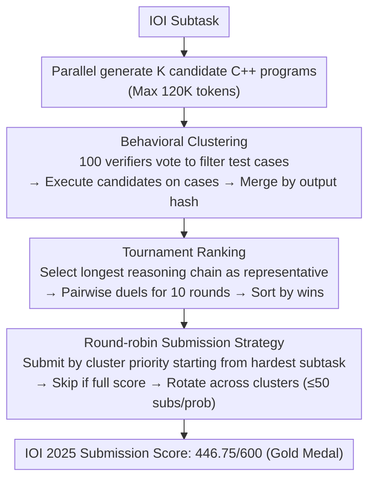

# Scaling Test-Time Compute to Achieve IOI Gold Medal with Open-Weight Models

**Conference**: ACL 2026  
**arXiv**: [2510.14232](https://arxiv.org/abs/2510.14232)  
**Code**: [NVIDIA-NeMo/Skills](https://github.com/NVIDIA-NeMo/Skills/tree/main/recipes)  
**Area**: LLM Reasoning  
**Keywords**: test-time compute, competitive programming, IOI, behavioral clustering, open-weight models

## TL;DR

Ours proposes GenCluster, a scalable test-time compute framework. Through large-scale parallel generation → behavioral clustering → tournament ranking → round-robin submission strategies, it enables the open-weight model gpt-oss-120b to achieve gold medal level (446.75/600 points) on IOI 2025 for the first time.

## Background & Motivation

**Background**: Competitive programming has become a rigorous benchmark for evaluating LLM reasoning and problem-solving capabilities. The International Olympiad in Informatics (IOI) is one of the most prestigious algorithmic programming competitions. Traditional benchmarks like HumanEval and MBPP have reached saturation, shifting research focus toward more challenging benchmarks such as LiveCodeBench and Codeforces.

**Limitations of Prior Work**: OpenAI claimed to achieve gold medals on IOI 2024/2025 with o1-ioi and o3, but the methods and models are not public. AlphaCode 2 disclosed parts of its methodology but also relies on closed-weight models. Open-weight models (e.g., DeepSeek-R1-0528, Qwen3-235B) have gained competitiveness on LiveCodeBench and Codeforces but still lag significantly at IOI-level difficulty.

**Key Challenge**: Each IOI problem allows a maximum of 50 submissions—how to efficiently select the optimal solution from thousands of candidates is the critical challenge. Existing methods are either non-public (OpenAI) or have not been validated at IOI-level difficulty.

**Goal**: Design a scalable, reproducible, and transparent test-time compute method to enable open-weight models to reach gold medal status under strict IOI submission limits.

**Key Insight**: IOI problems are essentially reasoning tasks with a "limited verification budget"—unlike math problems where majority voting is effective, majority voting fails when the accuracy rate in competitive programming is extremely low. This necessitates more refined solution selection strategies.

**Core Idea**: Generate massive candidate solutions → Group via behavioral clustering → Rank clusters using an LLM tournament → Maximize scores through round-robin submission.

## Method

### Overall Architecture

GenCluster consists of four stages: (1) Parallel generation of $K$ candidate C++ programs for each subtask; (2) Behavioral clustering—generating test inputs and grouping based on output hashes; (3) LLM-as-a-judge tournament to rank cluster representatives; (4) Round-robin submission strategy adhering to the IOI limit of 50 submissions per problem. While step (1) is a standard large-scale sampling scaffold, the latter three are the core designs.

### Key Designs

**1. Behavioral Clustering: Merging candidates by "execution output" instead of "code structure"**

Direct pairwise comparison of tens of thousands of candidates is computationally infeasible, and clustering by code text would split implementations that are functionally equivalent but written differently. GenCluster groups by behavior: first, the LLM generates 100 test input generators and 100 verifiers. Illegal inputs are filtered via verifier voting (retained only if $\ge 75\%$ of verifiers pass). Then, all candidates are executed on these 100 valid test cases. Solutions with identical output hashes are merged into the same cluster, while clusters with entirely empty outputs are discarded. Consequently, the ranking target shrinks from thousands of solutions to a few dozen clusters with distinct behaviors, where each cluster contains functionally equivalent solutions.

**2. Tournament Ranking: Using pairwise duels instead of scoring or voting when correct solutions are pathologically sparse**

At IOI difficulty, the proportion of correct solutions is extremely low; majority voting is easily overwhelmed by "reasonable-looking but incorrect" solutions. Assigning absolute scores to each solution is also unstable. GenCluster selects the solution with the longest reasoning chain from each cluster as its representative. These representatives engage in $G_n=10$ rounds of pairwise comparisons with randomly selected representatives from other clusters. In each round, an LLM judge selects a winner (with randomized presentation order to mitigate recency bias). Finally, clusters are ranked by accumulated wins. Compared to scoring, this duel-based comparison only requires the model to make local "which is better" judgments, which is more robust than estimating absolute quality.

**3. Round-Robin Submission: Maximizing the probability of "hitting" a correct solution within the 50-submission limit**

With a 50-submission limit per IOI problem and scoring based on the maximum across all submissions for a subtask, the submission sequence is an optimization problem itself. GenCluster starts from the most difficult subtasks, submitting based on cluster rank, and selecting solutions within clusters ordered by reasoning length. Once a subtask achieves a full score, it is immediately skipped to focus on the next. This rotation ensures that the limited submission budget covers as many distinct behavioral patterns as possible, rather than exhausting the budget on a single type of (potentially flawed) implementation.

**Mechanism: How an IOI subtask converges from 5000 solutions to one correct submission**

Taking $K=5000$ and gpt-oss-120b as an example: The model generates 5000 candidate C++ programs for a subtask. These are executed against 100 verified test cases and merged into a few dozen behavioral clusters via output hashing. Representatives (longest reasoning chains) from each cluster compete in random pairwise LLM-judged duels, forming a priority queue based on win rates. Finally, the round-robin strategy submits these candidates starting from the hardest subtasks. This process led gpt-oss-120b to a score of 446.75/600 in IOI 2025, crossing the ~400 point gold medal threshold.

### Loss & Training

Ours utilizes no training and is purely inference-time compute. All candidate solutions are generated in C++ with a maximum generation length of 120K tokens (gpt-oss-120b).

## Key Experimental Results

### Main Results

| Model | K=50 | K=1000 | K=5000 | Trend |
|------|------|--------|--------|------|
| gpt-oss-120b | ~332 | ~400 | **446.75** | Steady Growth |
| gpt-oss-20b | ~250 | ~300 | ~330 | Slow Growth |
| DeepSeek-R1-0528 | ~280 | ~310 | ~340 | Strong early but saturated |
| Qwen3-235B-A22B | ~290 | ~330 | ~350 | Saturated after 48K tokens |

IOI 2025 Gold Medal Line: ~400 points, total 600. GenCluster + gpt-oss-120b ($K=5000$) achieved 446.75, reaching gold level.

### Ablation Study (K=5000, gpt-oss-120b)

| Method | Use Clustering | Score | Description |
|------|---------|------|------|
| Random | No | 300.10 | Random solution selection |
| Longest | No | 277.36 | Select longest reasoning chain |
| Cluster-Size | Yes | 299.87 | Rank by cluster size |
| Cluster-Majority | Yes | 314.22 | Majority voting |
| GenCluster (Random-Rep) | Yes | 406.49 | Random representative + Tournament |
| GenCluster (Score-Based) | Yes | 441.11 | Average score ranking |
| **GenCluster** | **Yes** | **446.75** | **Longest representative + Win count ranking** |

### Key Findings

- gpt-oss-120b is the only open-weight model capable of reaching gold medal levels within 5000 generations, showing continuous scaling improvements.
- Simple majority voting (314.22) and cluster-size ranking (299.87) perform near-randomly at IOI difficulty because the proportion of correct solutions is extremely low.
- Tournament ranking is slightly superior to direct scoring (446.75 vs 441.11). Selecting the longest reasoning chain as a representative is significantly better than random selection (446.75 vs 406.49).
- Increasing test cases from 10 to 100 significantly improves clustering purity (F1) but increases the number of clusters, making selection harder.
- Reasoning chain length correlates positively with accuracy; gpt-oss models generate longer chains for difficult problems.
- Total compute: Generating 5000 candidates requires ~7.3B tokens; tournament ranking requires another ~7.3B tokens.

## Highlights & Insights

- **First Open-Weight IOI Gold Medal**: Provides a fully transparent and reproducible methodology, contrasting with OpenAI's closed methods and offering a baseline for the open-source community.
- **Sophisticated Tournament Ranking**: In difficult problems where correct solutions are rare, traditional majority voting fails. The pairwise tournament mechanism better leverages LLM judgmental capabilities.
- **Behavioral Clustering + Verifier Voting**: The generator-verifier process for test inputs is simple and effective. The 75% voting threshold balances coverage and quality.
- **Reasoning Length as Accuracy Proxy**: The heuristic of choosing the longest reasoning chain as the cluster representative provides a significant Gain over random selection and is transferable to other reasoning tasks.

## Limitations & Future Work

- Massive computational cost (~14.6B tokens per evaluation) makes it infeasible in resource-constrained environments.
- Room for improvement in ranking quality—only 35 out of 39 subtasks had their best solution appearing in the Top-50 clusters.
- Only validated on IOI 2025; generalization to other competitions (ICPC, Codeforces) remains to be tested.
- Training details of gpt-oss-120b are not disclosed, making reproducibility partially dependent on specific models.

## Related Work & Insights

- **vs AlphaCode/AlphaCode 2**: Both use large-scale generation + clustering, but AlphaCode did not solve the ranking problem under restricted submission budgets and relied on closed models.
- **vs OpenAI o1-ioi**: OpenAI reached gold (o3) with 1K solutions + simple selection, but the method is entirely private. GenCluster reaches gold with 5K solutions + tournament, offering full transparency.
- **vs Best-of-N**: Simple Best-of-N requires reliable verifiers, which are unavailable for IOI; GenCluster replaces verifiers with behavioral clustering + tournament.

## Rating

- Novelty: ⭐⭐⭐⭐ Innovative tournament ranking and round-robin strategies, though the core framework (generation + clustering + selection) extends the AlphaCode paradigm.
- Experimental Thoroughness: ⭐⭐⭐⭐⭐ Systematic scaling analysis, multi-model comparisons, and detailed ablation studies.
- Writing Quality: ⭐⭐⭐⭐ Clear methodological description, though partially dependent on the non-public gpt-oss model.
- Value: ⭐⭐⭐⭐⭐ A milestone for open-weight models in IOI, with a fully reproducible method.

<!-- RELATED:START -->

## Related Papers

- [\[ACL 2026\] Scaling Evaluation-Time Compute with Reasoning Models as Evaluators](scaling_evaluation-time_compute_with_reasoning_models_as_evaluators.md)
- [\[NeurIPS 2025\] Provable Scaling Laws for the Test-Time Compute of Large Language Models](../../NeurIPS2025/llm_reasoning/provable_scaling_laws_for_the_testtime_compute_of_large_lang.md)
- [\[ICML 2026\] Diversity Matters: Revisiting Test-Time Compute in Vision-Language Models](../../ICML2026/llm_reasoning/diversity_matters_revisiting_test-time_compute_in_vision-language_models.md)
- [\[NeurIPS 2025\] Towards Thinking-Optimal Scaling of Test-Time Compute for LLM Reasoning](../../NeurIPS2025/llm_reasoning/towards_thinking-optimal_scaling_of_test-time_compute_for_llm_reasoning.md)
- [\[ACL 2026\] Parallel Test-Time Scaling for Latent Reasoning Models](parallel_test-time_scaling_for_latent_reasoning_models.md)

<!-- RELATED:END -->
