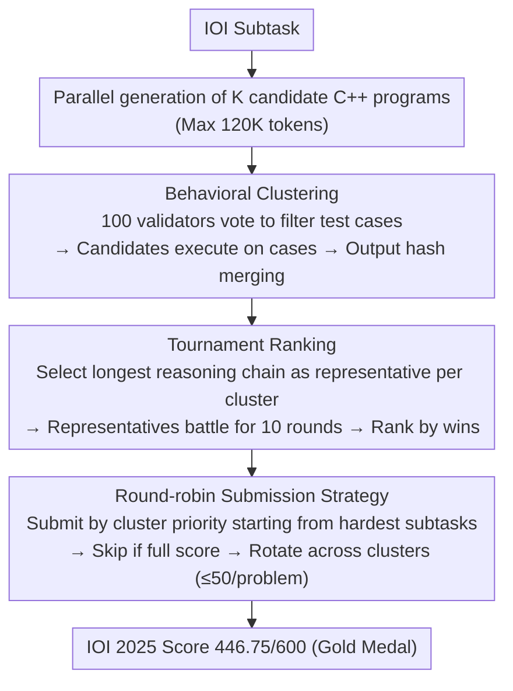

# Scaling Test-Time Compute to Achieve IOI Gold Medal with Open-Weight Models

**Conference**: ACL 2026  
**arXiv**: [2510.14232](https://arxiv.org/abs/2510.14232)  
**Code**: [NVIDIA-NeMo/Skills](https://github.com/NVIDIA-NeMo/Skills/tree/main/recipes)  
**Area**: LLM Reasoning  
**Keywords**: Test-time compute, competitive programming, IOI, behavioral clustering, open-weight models

## TL;DR

This paper proposes GenCluster, a scalable test-time compute framework. Through large-scale parallel generation → behavioral clustering → tournament ranking → round-robin submission strategy, it enables the open-weight model gpt-oss-120b to achieve gold medal level on IOI 2025 (446.75/600 points) for the first time.

## Background & Motivation

**Background**: Competitive programming has become a rigorous benchmark for evaluating LLM reasoning and problem-solving capabilities. The International Olympiad in Informatics (IOI) is one of the most prestigious algorithmic programming competitions. Traditional benchmarks like HumanEval and MBPP are nearing saturation, and research focus has shifted to more challenging benchmarks such as LiveCodeBench and Codeforces.

**Limitations of Prior Work**: OpenAI claims to have achieved gold medals at IOI 2024/2025 using o1-ioi and o3, but the methods and models used have not been disclosed. While AlphaCode 2 published part of its methodology, it also relies on closed-source models. Open-weight models (e.g., DeepSeek-R1-0528, Qwen3-235B) have shown increased competitiveness on LiveCodeBench and Codeforces but still lag significantly behind at IOI-level difficulty.

**Key Challenge**: Each IOI problem allows a maximum of 50 submissions—the critical challenge lies in efficiently selecting the optimal solution from thousands of candidates. Existing methods are either undisclosed (OpenAI) or have not been validated at IOI-level difficulty.

**Goal**: Design a scalable, reproducible, and transparent test-time compute method that enables open-weight models to reach gold medal levels under strict IOI submission limits.

**Key Insight**: IOI problems are essentially reasoning tasks with a "limited verification budget"—unlike mathematical problems where majority voting can be used, majority voting is ineffective in competitive programming when the accuracy rate is extremely low, necessitating a more refined solution selection strategy.

**Core Idea**: Generate a large number of candidate solutions → group them based on behavioral clustering → rank clusters using an LLM tournament → maximize scores through a round-robin submission strategy.

## Method

### Overall Architecture

GenCluster consists of four phases: (1) Parallel generation of $K$ candidate C++ programs for each subtask; (2) Grouping based on behavioral similarity—generating test inputs and grouping by output hashes; (3) Ranking cluster representatives through an LLM-as-a-judge tournament; (4) Round-robin submission following the IOI rule of at most 50 submissions per problem. While step (1) is standard large-scale sampling scaffolding, the three core designs lie in the subsequent steps.

### Key Designs

**1. Behavioral Clustering: Merging candidates by "execution output" rather than "code appearance"**

It is impossible to conduct pairwise comparisons for tens of thousands of candidate solutions directly. Clustering by code text would split apart implementations that are functionally equivalent but written differently. GenCluster merges by behavior instead: first, an LLM generates 100 test input generators and 100 validators, and invalid inputs are filtered by validator voting (kept only if $\ge 75\%$ of validators pass), yielding 100 valid test cases. All candidate solutions are then executed on these cases; those with identical outputs are grouped into the same cluster (using hashing for acceleration), and clusters with all empty outputs are discarded. Consequently, the ranking targets shrink from tens of thousands of solutions to a few dozen clusters with distinct behaviors, where each cluster contains truly functionally equivalent solutions.

**2. Tournament Ranking: Using pairwise battles instead of scoring or voting when correct solutions are extremely sparse**

At IOI difficulty, the proportion of correct solutions is extremely low. Majority voting would be overwhelmed by a large number of "reasonable-looking but incorrect" solutions, and direct scoring for each solution is unstable. GenCluster selects the solution with the longest reasoning chain from each cluster as its representative. It then conducts $G_n=10$ rounds of pairwise comparisons between a representative and other randomly sampled representatives, where an LLM judge selects the winner in each round (randomizing presentation order to mitigate recency bias). Finally, clusters are ranked based on accumulated wins. Compared to scoring, this tournament-style comparison only requires the model to make local "which is better" judgments, which is more robust than estimating the absolute quality of a single solution.

**3. Round-Robin Submission: Maximizing the probability of "hitting the correct solution" within the 50-submission limit**

Since IOI allows a maximum of 50 submissions per problem and scores are based on the highest score across all submissions for each subtask, the submission order is itself an optimization problem. GenCluster starts from the hardest subtask and submits following the cluster ranking, selecting solutions within each cluster sorted by reasoning length. Once a subtask achieves a full score, it is skipped to move to the next, while rotating across different clusters. This rotation ensures that the limited number of submissions covers solutions with different behavioral patterns as much as possible, rather than exhausting the budget on one type of (potentially entirely incorrect) implementation.

### A Complete Example: Converging from 5000 solutions to one correct submission for an IOI subtask

Consider an example with $K=5000$ using gpt-oss-120b: The model first generates 5000 candidate C++ programs for a specific subtask. Next, these 5000 solutions are executed on 100 test cases passed by validator voting and merged by output hashes into (for instance) dozens of behavioral clusters; clusters with empty outputs are eliminated. The solution with the longest reasoning chain in each cluster is chosen as the representative, and representatives participate in 10 rounds of randomly paired LLM-judged battles to form a priority queue based on wins. Finally, round-robin submission begins—submitting by cluster priority from the hardest subtasks. If a subtask reaches a full score, it skips to the next. This entire process allowed gpt-oss-120b to achieve 446.75/600 on IOI 2025, surpassing the gold medal threshold of approximately 400 points.

### Loss & Training

This method requires no training and is pure inference-time compute. All candidate solutions are generated in C++ with a maximum generation length of 120K tokens (gpt-oss-120b).

## Key Experimental Results

### Main Results

| Model | K=50 | K=1000 | K=5000 | Trend |
|------|------|--------|--------|------|
| gpt-oss-120b | ~332 | ~400 | **446.75** | Steady Growth |
| gpt-oss-20b | ~250 | ~300 | ~330 | Slow Growth |
| DeepSeek-R1-0528 | ~280 | ~310 | ~340 | Strong early but saturated |
| Qwen3-235B-A22B | ~290 | ~330 | ~350 | Saturated after 48K tokens |

IOI 2025 Gold Medal line: ~400 points, max 600 points. GenCluster + gpt-oss-120b (K=5000) achieved a submission score of 446.75, reaching gold.

### Ablation Study (K=5000, gpt-oss-120b)

| Method | Use Clustering | Score | Description |
|------|---------|------|------|
| Random | No | 300.10 | Random selection |
| Longest | No | 277.36 | Select longest reasoning chain |
| Cluster-Size | Yes | 299.87 | Rank by cluster size |
| Cluster-Majority | Yes | 314.22 | Majority voting |
| GenCluster (Random-Rep) | Yes | 406.49 | Random representative + Tournament |
| GenCluster (Score-Based) | Yes | 441.11 | Average score ranking |
| **GenCluster** | **Yes** | **446.75** | **Longest rep + Win ranking** |

### Key Findings

- gpt-oss-120b is the only open-weight model to reach gold medal level within 5000 generations, showing continuous improvement as generation volume increases.
- Simple majority voting (314.22) and cluster size ranking (299.87) perform similarly to random at IOI difficulty because the proportion of correct solutions is extremely low.
- Tournament ranking is slightly superior to direct scoring (446.75 vs 441.11), and selecting the longest reasoning chain as the representative is better than random selection (446.75 vs 406.49).
- Increasing the number of test cases from 10 to 100 significantly improves cluster purity (F1), though it also increases the number of clusters, making selection more difficult.
- Reasoning chain length correlates positively with accuracy; gpt-oss models generate longer chains on difficult problems.
- Total compute: generating 5000 candidates requires approximately 7.3 billion tokens, and tournament ranking requires another 7.3 billion tokens.

## Highlights & Insights

- **First Open-Weight IOI Gold Medal**: A fully transparent and reproducible methodology, contrasting with OpenAI's undisclosed methods, providing a baseline for the open-source community to catch up.
- **Exquisite Tournament Ranking Design**: For difficult problems where correct solutions are extremely sparse and traditional majority voting fails, the pairwise tournament mechanism better utilizes the LLM's judgment capabilities.
- **Behavioral Clustering + Validator Voting**: The generator-validator process for creating test inputs is simple and effective, with the 75% voting threshold balancing coverage and quality.
- **Reasoning Length as an Accuracy Proxy**: The simple heuristic of selecting the longest reasoning chain as the representative within a cluster significantly outperforms random selection and is transferable to other reasoning tasks.

## Limitations & Future Work

- Extreme computational cost (~14.6 billion tokens per evaluation), making it infeasible in resource-constrained environments.
- Room for improvement in ranking quality—only 35 of the 39 subtasks had their best solution appearing in the Top-50 clusters.
- Validated only on IOI 2025; generalization to other competitions (ICPC, Codeforces) remains to be tested.
- Training details of gpt-oss-120b are not public, meaning reproducibility of the method partially depends on specific models.

## Related Work & Insights

- **vs AlphaCode/AlphaCode 2**: Also uses large-scale generation + clustering, but AlphaCode does not solve the ranking problem under a limited submission budget and utilizes closed-source models.
- **vs OpenAI o1-ioi**: OpenAI achieved gold (o3) with 1K solutions + simple selection, but the method is entirely private; GenCluster achieves gold with 5K solutions + tournament and is fully transparent.
- **vs Best-of-N**: Simple Best-of-N requires a reliable verifier, which is not easily available for IOI; GenCluster replaces verifiers with behavioral clustering + tournament.

## Rating

- Novelty: ⭐⭐⭐⭐ Tournament ranking and round-robin submission strategies are innovative, though the core framework (generation + clustering + selection) follows the AlphaCode approach.
- Experimental Thoroughness: ⭐⭐⭐⭐⭐ Systematic scaling analysis, multi-model comparisons, and detailed ablation studies.
- Writing Quality: ⭐⭐⭐⭐ Clear description of methods and sufficient experiments, though partially dependent on the undisclosed gpt-oss model.
- Value: ⭐⭐⭐⭐⭐ A milestone work for the first open-weight IOI gold medal with a fully reproducible method.

<!-- RELATED:START -->

## Related Papers

- [\[ACL 2026\] Scaling Evaluation-Time Compute with Reasoning Models as Evaluators](scaling_evaluation-time_compute_with_reasoning_models_as_evaluators.md)
- [\[NeurIPS 2025\] Provable Scaling Laws for the Test-Time Compute of Large Language Models](../../NeurIPS2025/llm_reasoning/provable_scaling_laws_for_the_testtime_compute_of_large_lang.md)
- [\[ICML 2026\] Diversity Matters: Revisiting Test-Time Compute in Vision-Language Models](../../ICML2026/llm_reasoning/diversity_matters_revisiting_test-time_compute_in_vision-language_models.md)
- [\[ACL 2026\] Parallel Test-Time Scaling for Latent Reasoning Models](parallel_test-time_scaling_for_latent_reasoning_models.md)
- [\[NeurIPS 2025\] Towards Thinking-Optimal Scaling of Test-Time Compute for LLM Reasoning](../../NeurIPS2025/llm_reasoning/towards_thinking-optimal_scaling_of_test-time_compute_for_llm_reasoning.md)

<!-- RELATED:END -->
