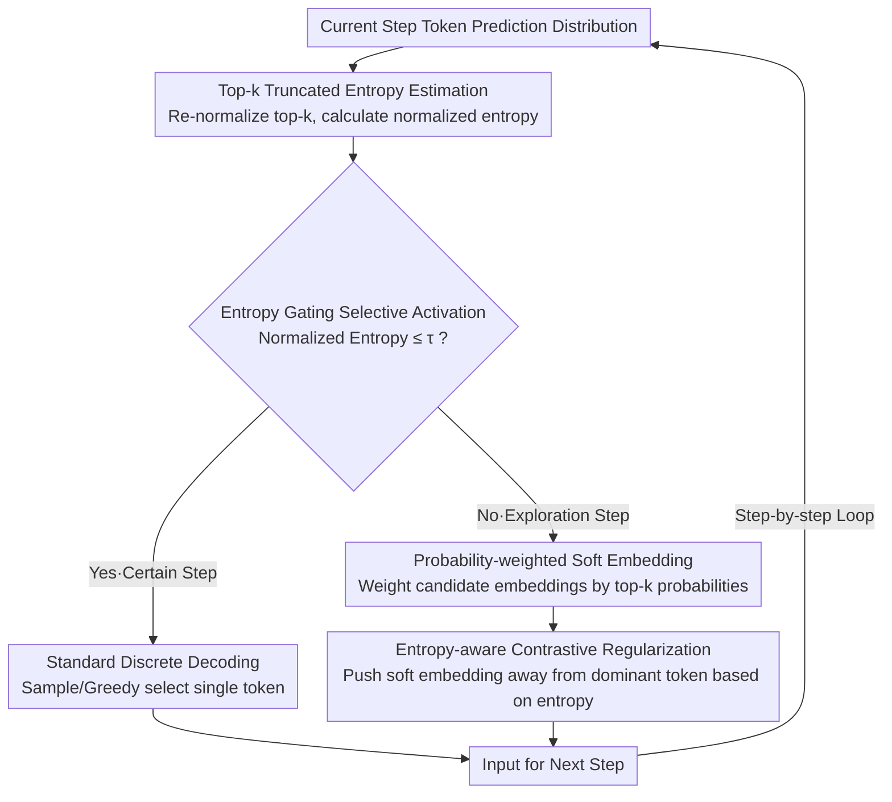

# SeLaR: Selective Latent Reasoning in Large Language Models

**Conference**: ACL 2026  
**arXiv**: [2604.08299](https://arxiv.org/abs/2604.08299)  
**Code**: [GitHub](https://github.com/Parker-rfu/SeLaReasoning)  
**Area**: Model Compression  
**Keywords**: Latent Reasoning, Entropy Gating, Soft Embeddings, Contrastive Regularization, Training-free Inference Enhancement

## TL;DR

This paper proposes SeLaR, a lightweight training-free framework that activates soft-embedding latent reasoning only during uncertain "exploration steps" via an entropy gating mechanism, while maintaining discrete decoding during high-confidence "certain steps." It introduces entropy-aware contrastive regularization to prevent soft embeddings from collapsing toward the dominant token, consistently outperforming standard CoT and SOTA training-free methods across five reasoning benchmarks.

## Background & Motivation

**Background**: Chain-of-Thought (CoT) has become the dominant paradigm for LLM multi-step reasoning, enhancing performance on complex tasks by explicitly generating intermediate reasoning steps. Recent latent reasoning methods attempt to replace discrete token sampling with soft embeddings or hidden states to implicitly explore multiple reasoning paths in a single forward pass.

**Limitations of Prior Work**: (1) Standard CoT must commit to a single discrete token at each step, discarding distributional information about alternative reasoning paths; (2) Training-based latent reasoning methods (e.g., Coconut) suffer from catastrophic forgetting due to the domain shift between hidden states and embedding spaces; (3) Training-free methods (e.g., Soft Thinking) activate soft embeddings globally, introducing unnecessary perturbations in steps where the model is already highly confident, thereby undermining reasoning stability.

**Key Challenge**: The entropy distribution during CoT decoding exhibits a clear long-tail structure—the majority of steps are low-entropy certain steps, while only a few are high-entropy exploration steps. Global activation ignores this structure, introducing noise in certain steps and losing the capacity for multi-path exploration in exploration steps due to the collapse of soft embeddings toward the dominant token.

**Goal**: To address two questions—when to activate latent reasoning (selective activation) and how to maintain effective exploration (preventing collapse).

**Key Insight**: Utilize the entropy of the token-level prediction distribution as a confidence signal to categorize decoding steps into certain steps and exploration steps, enabling latent reasoning only during critical exploration steps.

**Core Idea**: Entropy gating selective activation + entropy-aware contrastive regularization—the former determines "when" to use latent reasoning, while the latter addresses "how" to maintain multi-path exploration after activation.

## Method

### Overall Architecture

At each decoding step, SeLaR: (1) computes the normalized entropy $\bar{H}_t$ of the top-k tokens; (2) if $\bar{H}_t \leq \tau$ (certain step), standard discrete decoding is used; (3) if $\bar{H}_t > \tau$ (exploration step), a probability-weighted soft embedding of top-k candidates is constructed and contrastive regularization is applied. The regularized soft embedding serves as the input for the next step. The entire process is training-free and plug-and-play.

### Key Designs

**1. Top-k Truncated Entropy Estimation: Measuring uncertainty with the most relevant candidates**

Both gating and contrastive regularization rely on a clean confidence signal. Calculating entropy over the entire vocabulary is computationally expensive and prone to noise from long-tail, low-probability tokens. SeLaR estimates entropy only on the top-k candidates: the probabilities of these k tokens are re-normalized to $\hat{p}_t(v)$, and truncated entropy is calculated as $H_t = -\sum_{v \in \mathcal{V}_k} \hat{p}_t(v) \log \hat{p}_t(v)$, which is then normalized to $\bar{H}_t = H_t / \log k$. This measures "how much the model hesitates among the most likely candidates," capturing decision-relevant uncertainty while filtering out irrelevant noise, making the subsequent threshold $\tau$ stable.

**2. Entropy Gating Selective Activation: Utilizing latent reasoning only when the model is "uncertain"**

Prior methods (e.g., Soft Thinking) activate soft embeddings globally. However, the entropy distribution of CoT decoding is long-tailed—the model is already highly confident in most steps. Injecting soft embeddings in these certain steps introduces redundant perturbations. SeLaR utilizes the normalized entropy $\bar{H}_t$ to branch the process: when $\bar{H}_t \leq \tau$, it is deemed a certain step following standard sampling or greedy discrete decoding; when $\bar{H}_t > \tau$, it is an exploration step using the probability-weighted soft embedding $e_t = \sum_{v \in \mathcal{V}_k} \hat{p}_t(v) \cdot e_v$ as the next input. The threshold $\tau$ typically falls in the low-density transition zone of the entropy distribution, showing stable performance in the $[0.3, 0.7]$ range. Narrowing the activation to key exploration steps is critical—removing this selection and using global activation results in a 5.19% drop in average accuracy.

**3. Entropy-aware Contrastive Regularization: Preventing activated soft embeddings from reverting to greedy decoding**

Once activated in an exploration step, soft embeddings are often pulled toward the dominant token with the highest probability, degrading into standard greedy decoding and negating the purpose of multi-path exploration. SeLaR employs an entropy-linked "push-away" term to counter this collapse. It first calculates the difference vector between the soft embedding and the dominant token embedding $\Delta_t = e_t - e_{v_t^*}$. After normalizing the direction, it pushes the embedding away from the dominant direction weighted by the current entropy:

$$\tilde{e}_t = e_t + \bar{H}_t \cdot \hat{\Delta}_t \cdot \|\Delta_t\|$$

Higher entropy leads to a stronger push. As the model becomes more confident and entropy decreases, the push naturally diminishes, preventing unnecessary movement when the model should converge. Logit lens analysis confirms this: without regularization, the top-1 overlap dominates in deeper layers; with it, top-1 and top-2 overlaps remain comparable, indicating the presence of multiple reasoning trajectories. This component provides the largest contribution; removing it leads to a 7.82% average decline.

### Loss & Training

SeLaR is entirely training-free. It was evaluated using Qwen3-1.7B/8B/32B and DeepSeek-R1-Distill-Llama-8B. Decoding configurations: temperature=0.6, top-p=0.95, top-k=20, min-p=0.0.

## Key Experimental Results

### Main Results

**Accuracy comparison on five reasoning benchmarks (Qwen3-8B)**

| Method | GSM8K | MATH500 | GPQA | AIME24 | AIME25 | Avg |
|------|-------|---------|------|--------|--------|-----|
| CoT (Sampling) | 95.45 | 98.00 | 61.62 | 76.67 | 66.67 | 79.68 |
| Soft Thinking | 94.92 | 95.80 | 57.58 | 70.00 | 66.67 | 76.99 |
| SwiR | 95.68 | 97.00 | 62.63 | 60.00 | 66.67 | 76.40 |
| **SeLaR** | **95.83** | **97.00** | **61.62** | **83.33** | **80.00** | **83.56** |

### Ablation Study

**Component Ablation (Qwen3-8B)**

| Configuration | Avg | Description |
|------|-----|------|
| Full SeLaR | 83.56 | Complete model |
| w/o Selective Activation | 78.37 | Global activation drop: 5.19% |
| w/o Contrastive Regularization | 75.74 | No anti-collapse drop: 7.82% |

### Key Findings

- SeLaR consistently exceeds CoT across all model scales, achieving an average gain of +3.88% on Qwen3-8B, and is the only method to show consistent improvement across all models.
- Gains are most significant on the challenging AIME benchmarks: AIME24 +6.66%, AIME25 +13.33% (Qwen3-8B).
- Contrastive regularization is the most critical component (7.82% drop if removed), particularly on AIME24/25 where performance falls from 83.33/80.00 to 70.00/60.00.
- Computational Efficiency: On AIME24, SeLaR reduces TPCA (Tokens Per Correct Answer) by 19.2% compared to CoT, while SwiR increases it by 33.2%.
- Logit lens analysis confirms that contrastive regularization keeps top-1 and top-2 overlaps comparable, maintaining genuine multi-path exploration.

## Highlights & Insights

- The observation of the long-tail entropy distribution is the foundation of the work—most steps are already certain, and latent reasoning is only valuable in few critical steps.
- The design of contrastive regularization is elegant: using entropy as the weight for push-away strength ensures strong intervention during exploration and natural decay as certainty is reached.
- Logit lens analysis provides mechanistic evidence rather than relying solely on ablation studies—directly visualizing the coexistence of multiple trajectories.

## Limitations & Future Work

- While $\tau$ is stable within $[0.3, 0.7]$, it remains a dataset-specific hyperparameter rather than being fully adaptive.
- Performance on knowledge-intensive tasks (GPQA) is limited, as domain knowledge recall is more critical than multi-step reasoning.
- Evaluated only on reasoning-focused LLMs; performance on general instruction following or code generation tasks is unverified.
- The direction of contrastive regularization (pushing away only from top-1) may be insufficient—top-2 or top-3 might also be collapse directions requiring push-away.

## Related Work & Insights

- **vs Soft Thinking (Zhang et al., 2025)**: The latter uses global soft embedding activation; SeLaR uses selective activation. Removing selectivity leads to a 5.19% drop, validating the harm of global activation.
- **vs SwiR (Shi et al., 2025)**: The latter triggers switching based on entropy changes between adjacent steps, which is prone to false triggers requiring window smoothing. SeLaR uses an absolute entropy threshold, which is simpler and more stable.
- **vs Coconut (Hao et al., 2025)**: The latter requires fine-tuning to propagate hidden states, risking catastrophic forgetting. SeLaR is entirely training-free.

## Rating

- Novelty: ⭐⭐⭐⭐ Combination of selective activation and contrastive regularization is novel with clear motivation.
- Experimental Thoroughness: ⭐⭐⭐⭐⭐ 5 benchmarks × 4 models × detailed ablations + logit lens mechanistic analysis.
- Writing Quality: ⭐⭐⭐⭐ Complete logical chain from observation to method to analysis.
- Value: ⭐⭐⭐⭐ High practical value as a training-free, plug-and-play solution.

<!-- RELATED:START -->

## Related Papers

- [\[ACL 2026\] Large Reasoning Models Are (Not Yet) Multilingual Latent Reasoners](large_reasoning_models_are_not_yet_multilingual_latent_reasoners.md)
- [\[ACL 2026\] Foresight Optimization for Strategic Reasoning in Large Language Models](foresight_optimization_for_strategic_reasoning_in_large_language_models.md)
- [\[ACL 2026\] TInR: Exploring Tool-Internalized Reasoning in Large Language Models](tinr_exploring_tool-internalized_reasoning_in_large_language_models.md)
- [\[CVPR 2026\] ReLaX: Reasoning with Latent Exploration for Large Reasoning Models](../../CVPR2026/llm_reasoning/relax_reasoning_with_latent_exploration_for_large_reasoning_models.md)
- [\[ICLR 2026\] Adaptive Thinking: Large Language Models Know When to Think in Latent Space](../../ICLR2026/llm_reasoning/adaptive_thinking_large_language_models_know_when_to_think_in_latent_space.md)

<!-- RELATED:END -->
