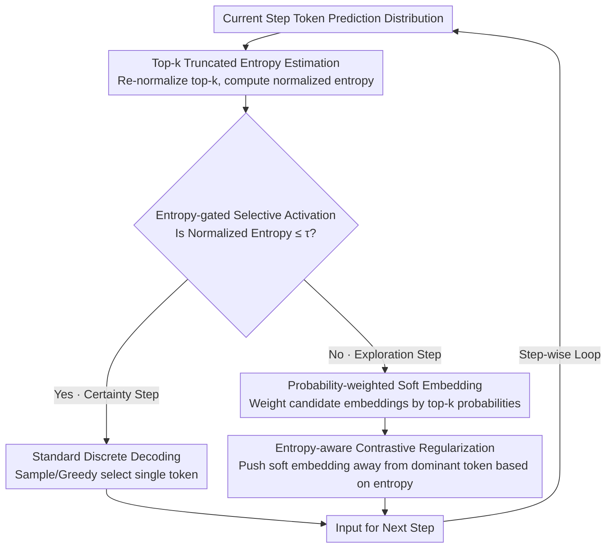

# SeLaR: Selective Latent Reasoning in Large Language Models

**Conference**: ACL 2026  
**arXiv**: [2604.08299](https://arxiv.org/abs/2604.08299)  
**Code**: [GitHub](https://github.com/Parker-rfu/SeLaReasoning)  
**Area**: Model Compression  
**Keywords**: Latent Reasoning, Entropy Gating, Soft Embeddings, Contrastive Regularization, Training-free Inference Enhancement

## TL;DR

This paper proposes SeLaR, a lightweight training-free framework that activates soft embedding latent reasoning only during uncertain "exploration steps" via an entropy gating mechanism, maintains discrete decoding during high-confidence "certainty steps", and introduces entropy-aware contrastive regularization to prevent soft embeddings from collapsing toward dominant tokens. SeLaR consistently outperforms standard CoT and SOTA training-free methods across five reasoning benchmarks.

## Background & Motivation

**Background**: Chain-of-Thought (CoT) has become the mainstream paradigm for LLM multi-step reasoning, enhancing performance on complex tasks by generating explicit intermediate reasoning steps. Recent latent reasoning methods attempt to replace discrete token sampling with soft embeddings or hidden states to implicitly explore multiple reasoning paths within a single forward pass.

**Limitations of Prior Work**: (1) Standard CoT must commit to a single discrete token at each step, discarding distribution information regarding alternative reasoning paths; (2) Training-based latent reasoning methods (e.g., Coconut) suffer from catastrophic forgetting due to domain discrepancies between hidden states and embedding spaces; (3) Training-free methods (e.g., Soft Thinking) activate soft embeddings globally, introducing unnecessary perturbations during steps where the model is already highly confident, thereby undermining reasoning stability.

**Key Challenge**: The entropy distribution during CoT decoding exhibits a clear long-tail structure—most steps are low-entropy "certainty steps," while only a few are high-entropy "exploration steps." Global activation ignores this structure, introducing noise in certainty steps and losing multi-path exploration capabilities in exploration steps due to the collapse of soft embeddings toward the dominant token.

**Goal**: To address two questions—when to activate latent reasoning (selective activation) and how to maintain effective exploration (preventing collapse).

**Key Insight**: Utilize the entropy of token-level prediction distributions as a confidence signal to categorize decoding steps into certainty and exploration steps, enabling latent reasoning only during critical exploration steps.

**Core Idea**: Entropy-gated selective activation combined with entropy-aware contrastive regularization—the former determines "when" to use latent reasoning, while the latter ensures "how" to maintain multi-path exploration after activation.

## Method

### Overall Architecture

At each decoding step, SeLaR: (1) Calculates the normalized entropy $\bar{H}_t$ of the top-k tokens; (2) If $\bar{H}_t \leq \tau$ (certainty step), standard discrete decoding is used; (3) If $\bar{H}_t > \tau$ (exploration step), it constructs probability-weighted soft embeddings from top-k candidates and applies contrastive regularization. The regularized soft embedding serves as the input for the next step. The entire process is training-free and plug-and-play.

### Key Designs

**1. Top-k Truncated Entropy Estimation: Measuring uncertainty via relevant candidates**

Both gated branching and contrastive regularization rely on a clean confidence signal. Calculating entropy over the entire vocabulary is computationally expensive and noisy due to long-tail low-probability tokens. SeLaR estimates entropy only on top-k candidates: the probabilities of these k tokens are re-normalized as $\hat{p}_t(v)$, substituted into the truncated entropy formula $H_t = -\sum_{v \in \mathcal{V}_k} \hat{p}_t(v) \log \hat{p}_t(v)$, and then normalized as $\bar{H}_t = H_t / \log k$. This measures the model's hesitation among the most likely candidates—precisely the decision-relevant uncertainty—filtering out irrelevant noise to ensure stable thresholding for $\tau$.

**2. Entropy-gated Selective Activation: Activating latent reasoning only when "uncertain"**

Prior methods (e.g., Soft Thinking) activate soft embeddings globally. However, because the entropy distribution of CoT decoding is long-tailed, injecting soft embeddings into certainty steps merely introduces irrelevant perturbations. SeLaR uses the normalized entropy $\bar{H}_t$ to branch the process: if $\bar{H}_t \leq \tau$, it is identified as a certainty step using standard discrete decoding; if $\bar{H}_t > \tau$, it is an exploration step where the probability-weighted soft embedding $e_t = \sum_{v \in \mathcal{V}_k} \hat{p}_t(v) \cdot e_v$ is used as the next input. The threshold $\tau$ typically falls in the low-density transition zone of $[0.3, 0.7]$. Restricting activation to key exploration steps is crucial—removing this selection and using global activation results in a 5.19% drop in average accuracy.

**3. Entropy-aware Contrastive Regularization: Preventing collapse back to greedy decoding**

Once activated during an exploration step, soft embeddings are often rapidly pulled toward the dominant token with the highest probability, degrading into standard greedy decoding and neutralizing the benefit of multi-path exploration. SeLaR introduces a repulsion term linked to entropy: it calculates the difference vector between the soft embedding and the dominant token embedding $\Delta_t = e_t - e_{v_t^*}$, normalizes the direction, and pushes the embedding away from the dominant direction weighted by the current entropy:

$$\tilde{e}_t = e_t + \bar{H}_t \cdot \hat{\Delta}_t \cdot \|\Delta_t\|$$

Higher entropy results in stronger repulsion. As the model becomes more confident and entropy decreases, the repulsion naturally subsides, preventing unnecessary divergence when the model should converge. Logit lens analysis confirms this: without regularization, top-1 overlap dominates in deep layers; with it, top-1 and top-2 overlaps remain comparable, indicating the simultaneous existence of multiple reasoning trajectories. This component is the largest contributor to performance, with its removal leading to a 7.82% average drop.

### Loss & Training

SeLaR is completely training-free. Evaluations were performed using Qwen3-1.7B/8B/32B and DeepSeek-R1-Distill-Llama-8B. Decoding settings: temperature=0.6, top-p=0.95, top-k=20, min-p=0.0.

## Key Experimental Results

### Main Results

**Accuracy Comparison on Five Reasoning Benchmarks (Qwen3-8B)**

| Method | GSM8K | MATH500 | GPQA | AIME24 | AIME25 | Avg |
|------|-------|---------|------|--------|--------|-----|
| CoT (Sampling) | 95.45 | 98.00 | 61.62 | 76.67 | 66.67 | 79.68 |
| Soft Thinking | 94.92 | 95.80 | 57.58 | 70.00 | 66.67 | 76.99 |
| SwiR | 95.68 | 97.00 | 62.63 | 60.00 | 66.67 | 76.40 |
| **Ours** | **95.83** | **97.00** | **61.62** | **83.33** | **80.00** | **83.56** |

### Ablation Study

**Component Ablation (Qwen3-8B)**

| Configuration | Avg | Description |
|------|-----|------|
| Full SeLaR | 83.56 | Complete Model |
| w/o Selective Activation | 78.37 | Global activation drop 5.19% |
| w/o Contrastive Regularization | 75.74 | No collapse prevention drop 7.82% |

### Key Findings

- SeLaR consistently outperforms CoT across all model scales, with an average improvement of +3.88% on Qwen3-8B, being the only method to show consistent gains across all models.
- The most significant improvements occur on the difficult AIME benchmarks: +6.66% on AIME24 and +13.33% on AIME25 (Qwen3-8B).
- Contrastive regularization is the most critical component (7.82% drop if removed), especially on AIME24/25 where performance fell from 83.33/80.00 to 70.00/60.00.
- Computational efficiency: SeLaR reduces TPCA by 19.2% on AIME24 compared to CoT, whereas SwiR increases it by 33.2%.
- Logit lens analysis validates that contrastive regularization maintains comparable overlap between top-1 and top-2 tokens, sustaining genuine multi-path exploration.

## Highlights & Insights

- The observation of long-tail entropy distribution is the cornerstone of the work—most steps are certain, and latent reasoning is only valuable in a few critical steps.
- The design of contrastive regularization is elegant: using entropy itself as the weight for repulsion strength allows for strong repulsion during exploration that naturally fades as the model reaches certainty.
- Logit lens analysis provides mechanistic evidence rather than relying solely on ablation studies, directly visualizing the coexistence of multiple trajectories.

## Limitations & Future Work

- Although the threshold $\tau$ is stable within $[0.3, 0.7]$, it remains a dataset-specific hyperparameter and is not yet fully adaptive.
- Effectiveness is limited on knowledge-intensive tasks (GPQA), as domain knowledge recall is more critical than multi-step reasoning in such cases.
- Evaluation was limited to reasoning-heavy LLMs; its effects on general instruction-following or code generation tasks have not been verified.
- The direction of contrastive regularization (only pushing away from top-1) may be insufficient; top-2 or top-3 tokens might also be directions of collapse that require repulsion.

## Related Work & Insights

- **vs Soft Thinking (Zhang et al., 2025)**: The latter activates soft embeddings globally; SeLaR uses selective activation. Removing selectivity results in a 5.19% drop, highlighting the harm of global activation.
- **vs SwiR (Shi et al., 2025)**: The latter triggers switching based on entropy changes between adjacent steps, which is prone to false triggers requiring window smoothing. SeLaR uses an absolute entropy threshold, making it simpler and more stable.
- **vs Coconut (Hao et al., 2025)**: The latter requires fine-tuning to propagate hidden states, which leads to catastrophic forgetting; SeLaR is entirely training-free.

## Rating

- Novelty: ⭐⭐⭐⭐ The combination of selective activation and contrastive regularization is novel and well-motivated.
- Experimental Thoroughness: ⭐⭐⭐⭐⭐ 5 benchmarks × 4 models × detailed ablations + logit lens mechanistic analysis.
- Writing Quality: ⭐⭐⭐⭐ Strong logical progression from observation to methodology to analysis.
- Value: ⭐⭐⭐⭐ Superior practical value as a training-free, plug-and-play method.

<!-- RELATED:START -->

## Related Papers

- [\[ACL 2026\] Large Reasoning Models Are (Not Yet) Multilingual Latent Reasoners](large_reasoning_models_are_not_yet_multilingual_latent_reasoners.md)
- [\[ACL 2026\] Foresight Optimization for Strategic Reasoning in Large Language Models](foresight_optimization_for_strategic_reasoning_in_large_language_models.md)
- [\[CVPR 2026\] ReLaX: Reasoning with Latent Exploration for Large Reasoning Models](../../CVPR2026/llm_reasoning/relax_reasoning_with_latent_exploration_for_large_reasoning_models.md)
- [\[ACL 2026\] Parallel Test-Time Scaling for Latent Reasoning Models](parallel_test-time_scaling_for_latent_reasoning_models.md)
- [\[ICML 2026\] Reasoning Structure of Large Language Models](../../ICML2026/llm_reasoning/reasoning_structure_of_large_language_models.md)

<!-- RELATED:END -->
