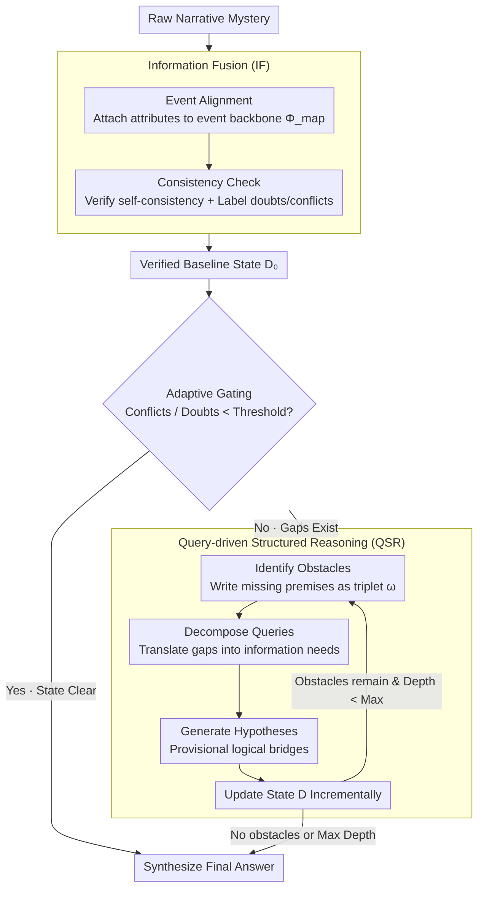

# Self-Awareness before Action: Mitigating Logical Inertia via Proactive Cognitive Awareness

**Conference**: ACL 2026  
**arXiv**: [2604.20413](https://arxiv.org/abs/2604.20413)  
**Code**: None  
**Area**: LLM Evaluation  
**Keywords**: Self-aware reasoning, non-interactive narrative reasoning, structured state management, information fusion, logical inertia

## TL;DR
This paper proposes the SABA reasoning framework, which follows a "perception before action" paradigm to explicitly construct and audit knowledge states before making final decisions—utilizing Information Fusion (IF) to integrate narratives into verifiable baseline states, and Query-driven Structured Reasoning (QSR) to recursively identify and resolve missing premises—achieving state-of-the-art performance on both detective reasoning and general reasoning benchmarks.

## Background & Motivation

**Background**: Large Language Models have demonstrated powerful capabilities in multi-step reasoning and narrative understanding. In interactive scenarios (e.g., social games), agents can acquire new information and correct beliefs through dialogue. However, in non-interactive mystery scenarios, the narrative is fixed, and models must reconstruct hidden truths solely from long texts containing implicit clues, missing links, and distractor information.

**Limitations of Prior Work**: Existing reasoning paradigms exhibit systemic flaws in non-interactive long narrative reasoning: (1) Chain-of-Thought tends to commit to an early hypothesis and expand upon it even when initial premises are weak (logical inertia); (2) decomposition methods (e.g., Least-to-Most) introduce intermediate steps but lose global coherence when narratives are long and evidence is scattered; (3) refinement methods (e.g., Self-Refine) revise after generating an answer, but often defend the same early error rather than triggering a comprehensive re-evaluation (confirmation bias).

**Key Challenge**: Once a model forms an early hypothesis under incomplete premises, this error propagates throughout the reasoning process, leading to unstable conclusions. The root cause is a lack of perception regarding the completeness of the model's own knowledge or reasoning state before "acting" (providing an answer). Existing methods are "answer first, then correct," rather than "check completeness first, then answer."

**Goal**: Design a reasoning framework that shifts the focus from "direct prediction" to "state assessment"—explicitly auditing whether current understanding is complete and consistent before any decision is made.

**Key Insight**: Redefine reasoning as a progressive state construction process rather than single-step inference. The model should act like a system auditor, first checking its knowledge state, identifying missing premises (obstacles), and then incrementally filling them through hypothesis generation and state updates until a reasoning foundation sufficient to support the final conclusion is built.

**Core Idea**: Alternating between "structured state construction" and "obstacle-driven reasoning" via a recursive control loop—first integrating narratives into a verifiable baseline, then translating missing or ambiguous premises into explicit obstacles and queries, and resolving them recursively until logical closure is achieved.

## Method

### Overall Architecture
SABA consists of two phases: Phase 1 is Information Fusion (IF), which transforms raw narratives into a structured and verified baseline state; Phase 2 is Query-driven Structured Reasoning (QSR), which recursively identifies reasoning obstacles, decomposes them into queries, generates hypotheses, and updates the state until no obstacles remain or the maximum depth is reached. An adaptive gating mechanism exists between the two phases: if conflict and doubt indicators of the baseline state are below thresholds, the iterative loop is skipped and the answer is synthesized directly.

### Key Designs

**1. Information Fusion (IF): Correlating scattered weak clues into a "verified baseline state"**

Key evidence in long narrative mysteries is often scattered across thousands of words, causing models to forget earlier information (the "lost in the middle" effect). IF performs evidence pre-integration before formal reasoning in two steps. First, **Event Alignment**: narratives are decomposed into a core event backbone $S = \{s_1, ..., s_m\}$ and a set of heterogeneous attributes $A = \{a_1, ..., a_p\}$ (actions, object states, locations, evidence descriptions, etc.). An alignment mapping $\Phi_{\text{map}}: A \to 2^S$ is used to attach each attribute to one or more backbone events, turning implicit associations into explicitly retrievable structures. Second, **Consistency Check**: for each alignment unit, a verification annotation $b_i = \psi_{\text{vfy}}(d_i, D_{\text{aligned}} \setminus d_i)$ is calculated to check temporal, entity state, and causal self-consistency, marking potential conflicts and uncertainties.

Notably, consistency checks do not discard suspicious information but label it as "uncertainty to be processed" within the state—allowing QSR to explicitly handle these doubts later. Ablations show this step is significant: removing IF causes SA to drop by 12.0% and CCR by 15.1% on DP-Complex.

**2. Query-driven Structured Reasoning (QSR): Explicitly exposing and filling "missing premises" recursively**

The logical inertia of CoT lies in extending an early hypothesis formed under incomplete premises without reviewing it. QSR reverses this by rewriting reasoning as a recursive "gap detection → gap filling" loop. Each round starts by **Identifying Obstacles** $\Omega_t = \mathcal{M}(p_{\text{aware}} \mid D_t, T)$, where each obstacle is defined as a triplet $\omega = (\tau(\omega), \text{dim}(\omega), \text{req}(\omega))$, specifying its type, the dimension it affects, and the specific requirement—turning missing premises into first-class citizens rather than vague feelings of uncertainty. Next, **Decompose Queries** $Q_{i,t} = \mathcal{M}(p_{\text{dec}} \mid \omega_i, D_t)$ translates abstract reasoning gaps into concrete information needs; then **Generate Hypotheses** $h = \mathcal{M}(p_{\text{hypo}} \mid q, D_t)$ acts as provisional logical bridges. Each round ends with a **State Update** $D_{t+1} = D_t \cup Q_t \cup H_t$, and recursion continues until $\Omega_t = \emptyset$ or max depth is reached. This "expose before fill" process replaces premature commitment with traceable, auditable incremental construction. Obstacle identification is the most critical component; removing it causes SA to plunge by 22.2%.

**3. Adaptive Gating: Preventing unnecessary recursion on simple problems**

Not every problem requires a full QSR recursion; forcing it on clearly stated narratives wastes reasoning budget. Gating assesses the "turbidity" of the base state after IF by evaluating the density of logical conflicts $\mathbb{C}$ and doubts $\mathbb{D}$. If both are below preset thresholds $x$ and $y$, it skips QSR iterations and synthesizes the answer directly. This targeted allocation allows SABA to achieve top accuracy while maintaining about one-fourth the reasoning cost of GoT.

### Loss & Training
SABA is a pure prompting framework requiring no training. It uses DeepSeek-V3 and Gemini-1.5-Flash as backbone models, with decoding temperature set to 0.0 for reproducibility. Semantic similarity is measured using all-MiniLM-L6-v2.

## Key Experimental Results

### Main Results (DeepSeek-V3)

| Method | DP-Complex SA | DP-Complex CCR | StrategyQA | BBH | Reasoning Cost T |
|------|------|------|------|------|------|
| Direct | 40.7±0.9 | 58.7±1.0 | 82.0±0.4 | 78.7±0.5 | 1.0 |
| CoT | 45.4±1.1 | 61.9±1.2 | 87.6±0.5 | 86.0±0.6 | 2.5 |
| GoT | 69.8±1.6 | 77.3±1.7 | 91.7±0.8 | 90.7±0.9 | 35.7 |
| **Ours** (SABA) | **79.3±1.2** | **83.3±0.6** | **94.4±0.4** | **93.2±0.5** | 9.2 |

### Ablation Study (DeepSeek-V3, DP-Complex)

| Config | SA | CCR | StrategyQA | Description |
|------|------|------|------|------|
| SABA (Full) | 79.3±1.2 | 83.3±0.6 | 94.4±0.4 | Full Model |
| w/o IF | 69.8±1.1 | 70.7±0.9 | 82.2±0.6 | Removing IF drops SA by 12.0% |
| Self-assess-only | 65.8±1.3 | 65.9±1.1 | 79.1±0.8 | Only retaining gap awareness |
| w/o Awareness | 61.7±1.5 | 62.2±1.2 | 76.7±0.9 | Removing obstacle detection drops SA by 22.2% |

### Key Findings
- SABA improves SA on the difficult DP-Complex from 69.8 (GoT) to 79.3 (+9.5 pts), while the reasoning cost is only 25.8% of GoT (9.2 vs 35.7).
- **Obstacle identification is the most critical component**: its removal led to the largest drop in SA (22.2%), proving that explicit diagnosis of missing premises is vital to preventing premature commitment.
- Information Fusion contributes significantly (SA drops 12.0%, CCR drops 15.1% without it), suggesting that pre-integrating scattered clues into grounded intermediate states aids subsequent reasoning.
- Clear efficiency advantage: SABA's reasoning cost (9.2) is 23.3% lower than SC (12.0) and 74.2% lower than GoT (35.7), thanks to adaptive gating and directional computation allocation.
- Cross-model generalization: Maintains stable performance on Llama-3.1-70B, proving the framework does not rely on a specific backbone.

## Highlights & Insights
- The **"perception before action" paradigm shift** is highly insightful: transforming reasoning from "answering → correcting" to "auditing → building → answering" fundamentally addresses confirmation bias. This concept can migrate to any scenario requiring reasoning under incomplete information.
- The **formal representation of obstacles** $\omega = (\tau, \text{dim}, \text{req})$ makes missing premises first-class citizens—not just "something feels wrong," but precisely "what is missing, in which dimension, and what is needed." This explicitness supports systematic follow-up.
- **Full traceability** of the reasoning trajectory (recording obstacles, queries, hypotheses, and state changes at every step) makes the reasoning process auditable, which is highly valuable for Explainable AI (XAI).
- Adaptive gating is a pragmatic engineering decision—avoiding excessive computation for tasks that do not require complex reasoning.

## Limitations & Future Work
- SABA relies on the backbone model's self-assessment capabilities; smaller models might have limited quality in obstacle detection.
- The recursive process introduces higher latency, which may affect real-time applications.
- The structured input processing in the IF module depends on the model's instruction-following capabilities; end-to-end clue extraction remains an open problem.
- Evaluation only covered detective reasoning and general QA; other reasoning types like code generation or mathematics have not been verified.
- Fixed depth limit $t_{\max}$ and gating thresholds require manual setting.

## Related Work & Insights
- **vs CoT**: CoT is a linear reasoning chain prone to committing to early hypotheses. SABA explicitly checks for completeness before reasoning to avoid error propagation.
- **vs Self-Refine/Reflexion**: These methods "answer first, then revise," which is susceptible to confirmation bias. SABA shifts the refinement target from the candidate answer to the underlying knowledge state, forcing an audit of completeness and consistency before commitment.
- **vs GoT (Graph-of-Thought)**: GoT externalizes reasoning trajectories but operates on unstructured text, lacking explicit representation of missing/inconsistent information. SABA formalizes reasoning as iterative structured state construction and verification.
- **Insight**: A state-first reasoning philosophy may be valuable for RAG systems—first constructing and verifying the retrieved knowledge state before performing reasoning based on it.

## Rating
- Novelty: ⭐⭐⭐⭐ The "perceive before act" concept is novel, though specific techniques (IF + QSR) show moderate innovation.
- Experimental Thoroughness: ⭐⭐⭐⭐ Sufficient multi-benchmark, ablation, and cross-model verification, though the detective reasoning dataset is small (31 cases).
- Writing Quality: ⭐⭐⭐⭐ Clear formal definitions and good visualization, though some formulas and symbols are quite heavy.

<!-- RELATED:START -->

## Related Papers

- [\[ICLR 2026\] The Reasoning Trap — Logical Reasoning as a Mechanistic Pathway to Situational Awareness](../../ICLR2026/llm_reasoning/the_reasoning_trap_--_logical_reasoning_as_a_mechanistic_pathway_to_situational_.md)
- [\[ICML 2026\] Verifying Meta-Awareness via Predictive Rewards in Reasoning Models](../../ICML2026/llm_reasoning/verifying_meta-awareness_via_predictive_rewards_in_reasoning_models.md)
- [\[ACL 2026\] Logical Phase Transitions: Understanding Collapse in LLM Logical Reasoning](logical_phase_transitions_understanding_collapse_in_llm_logical_reasoning.md)
- [\[ICLR 2026\] Conflict-Aware Fusion: Resolving Logic Inertia in Large Language Models via Structured Cognitive Priors](../../ICLR2026/llm_reasoning/conflict-aware_fusion_resolving_logic_inertia_in_large_language_models_via_struc.md)
- [\[ICML 2026\] Hidden Error Awareness in Chain-of-Thought Reasoning: The Signal Is Diagnostic, Not Causal](../../ICML2026/llm_reasoning/hidden_error_awareness_in_chain-of-thought_reasoning_the_signal_is_diagnostic_no.md)

<!-- RELATED:END -->
