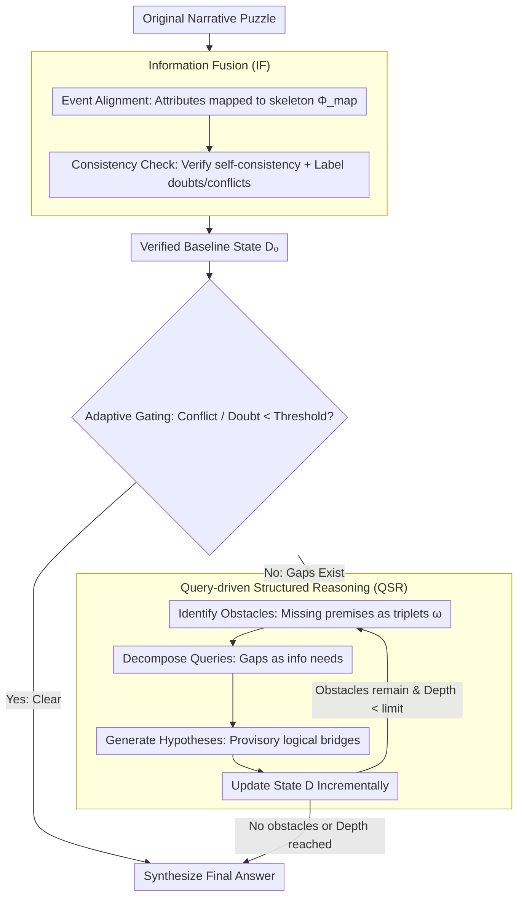

# Self-Awareness before Action: Mitigating Logical Inertia via Proactive Cognitive Awareness

**Conference**: ACL 2026  
**arXiv**: [2604.20413](https://arxiv.org/abs/2604.20413)  
**Code**: None  
**Area**: LLM Evaluation  
**Keywords**: Self-Awareness Reasoning, Non-interactive Narrative Reasoning, Structured State Management, Information Fusion, Logical Inertia

## TL;DR
The authors propose SABA, a reasoning framework based on the "perceive then act" paradigm. It explicitly constructs and audits knowledge states before making final decisions by utilizing Information Fusion (IF) to integrate narratives into verified baseline states and Query-driven Structured Reasoning (QSR) to recursively identify and resolve missing premises. SABA achieves peak performance across detective reasoning and general reasoning benchmarks.

## Background & Motivation

**Background**: Large Language Models (LLMs) have demonstrated strong capabilities in multi-step reasoning and narrative understanding. In interactive scenarios (e.g., social games), agents can acquire new information and revise beliefs through dialogue. However, in non-interactive puzzle scenarios, narratives are fixed, and models must reconstruct hidden truths solely from long texts containing implicit clues, missing links, and distractor information.

**Limitations of Prior Work**: Existing reasoning paradigms exhibit systemic flaws in non-interactive long narrative reasoning: (1) Chain-of-Thought (CoT) tends to commit to an early hypothesis and expand upon it even if the initial premise is weak (logical inertia); (2) Decomposition methods (e.g., Least-to-Most) introduce intermediate steps but lose global coherence when narratives are long and evidence is scattered; (3) Refinement methods (e.g., Self-Refine) revise after generating an answer, often defending same early errors rather than triggering a comprehensive re-evaluation (confirmation bias).

**Key Challenge**: Once a model forms an early hypothesis under incomplete premises, the error propagates throughout the reasoning process, leading to unstable conclusions. The root cause is the lack of awareness regarding the completeness of the model's own knowledge or reasoning state before "acting" (providing an answer). Existing methods are "answer then revise" rather than "check completeness then answer."

**Goal**: Design a reasoning framework that shifts the focus from "direct prediction" to "state evaluation"—explicitly auditing whether the current understanding is complete and consistent before any decision is made.

**Key Insight**: Redefine reasoning as a progressive state construction process rather than single-step inference. Models should act like system auditors, first checking their knowledge state, identifying missing premises (obstacles), and gradually filling them through hypothesis generation and state updates until a reasoning foundation sufficient to support the final conclusion is built.

**Core Idea**: Alternating between "structured state construction" and "obstacle-driven reasoning" via a recursive control loop—first integrating the narrative into a verifiable baseline, then converting missing/ambiguous premises into explicit obstacles and queries, and resolving them recursively until logical closure is achieved.

## Method

### Overall Architecture
SABA consists of two phases: Phase 1 is Information Fusion (IF), which transforms the raw narrative into a structured and verified baseline state; Phase 2 is Query-driven Structured Reasoning (QSR), which recursively identifies reasoning obstacles, decomposes them into queries, generates hypotheses, and updates the state until no obstacles remain or the maximum depth is reached. An adaptive gating mechanism exists between the two phases: if the conflict and doubt indicators of the baseline state are below a threshold, the iterative loop is skipped to synthesize the answer directly.

### Key Designs

**1. Information Fusion (IF): Correlating scattered weak clues into a "verified baseline state"**

Key evidence in long narrative puzzles is often scattered across thousands of words, causing models to forget early information and triggering the "lost in the middle" effect. IF performs evidence pre-integration before formal reasoning in two steps. First, **Event Alignment**: the narrative is decomposed into a core event skeleton $S = \{s_1, ..., s_m\}$ and a set of heterogeneous attributes $A = \{a_1, ..., a_p\}$ (actions, object states, locations, evidence descriptions, etc.). An alignment mapping $\Phi_{\text{map}}: A \to 2^S$ attaches each attribute to one or more backbone events, converting implicit associations into an explicitly retrievable structure. Second, **Consistency Check**: a verification annotation $b_i = \psi_{\text{vfy}}(d_i, D_{\text{aligned}} \setminus d_i)$ is calculated for each alignment unit, checking time, entity states, and causality for self-consistency, while labeling potential conflicts and uncertainties.

Notably, the consistency check does not discard suspicious information but labels it as "pending uncertainty" within the state—allowing QSR to explicitly handle these points rather than letting them quietly disappear. Ablation shows this step is heavy: removing IF drops SA by 12.0% and CCR by 15.1% on DP-Complex.

**2. Query-driven Structured Reasoning (QSR): Explicitly identifying "missing premises" and completing them recursively**

The logical inertia of CoT lies in expanding an early hypothesis formed under incomplete premises without reviewing it. QSR does the opposite, rewriting reasoning as a recursive loop of "detect gap → fill gap." In each round, it first **Identifies Obstacles** $\Omega_t = \mathcal{M}(p_{\text{aware}} \mid D_t, T)$, where each obstacle is written as a triplet $\omega = (\tau(\omega), \text{dim}(\omega), \text{req}(\omega))$, precisely stating its type, dimension, and requirement—missing premises thus become first-class citizens rather than vague feelings. It then **Decomposes Queries** $Q_{i,t} = \mathcal{M}(p_{\text{dec}} \mid \omega_i, D_t)$, translating abstract reasoning gaps into specific information needs; finally, it **Generates Hypotheses** $h = \mathcal{M}(p_{\text{hypo}} \mid q, D_t)$ as temporary logical bridges to fill them. Each round ends with a state update $D_{t+1} = D_t \cup Q_t \cup H_t$, continuing recursively until $\Omega_t = \emptyset$ (no obstacles remain) or the maximum depth is reached. By exposing gaps before filling them, this process replaces premature commitment with a traceable, auditable progressive construction—obstacle identification is the most critical part of the framework, as removing it causes SA to plunge by 22.2%.

**3. Adaptive Gating: Avoiding redundant recursion for simple problems**

Not every problem requires a full QSR recursion; forcing recursion on obviously clear narratives wastes the reasoning budget. After IF produces the baseline state, the gating mechanism measures the "turbidity" of the state: it evaluates the density of logical conflicts $\mathbb{C}$ and doubts $\mathbb{D}$. If both are lower than preset thresholds $x$ and $y$, the QSR iteration is skipped and the answer is synthesized directly. Recursive loops are entered only when the state contains sufficient conflicts or doubts. This targeted allocation allows SABA to reach top accuracy with reasoning costs only about one-quarter of GoT.

### Loss & Training
SABA is a pure prompting framework requiring no training. It uses DeepSeek-V3 and Gemini-1.5-Flash as backbone models with the decoding temperature set to 0.0 for reproducibility. Semantic similarity is measured using all-MiniLM-L6-v2.

## Key Experimental Results

### Main Results (DeepSeek-V3)

| Method | DP-Complex SA | DP-Complex CCR | StrategyQA | BBH | Reasoning Cost T |
|------|------|------|------|------|------|
| Direct | 40.7±0.9 | 58.7±1.0 | 82.0±0.4 | 78.7±0.5 | 1.0 |
| CoT | 45.4±1.1 | 61.9±1.2 | 87.6±0.5 | 86.0±0.6 | 2.5 |
| GoT | 69.8±1.6 | 77.3±1.7 | 91.7±0.8 | 90.7±0.9 | 35.7 |
| SABA | **79.3±1.2** | **83.3±0.6** | **94.4±0.4** | **93.2±0.5** | 9.2 |

### Ablation Study (DeepSeek-V3, DP-Complex)

| Configuration | SA | CCR | StrategyQA | Description |
|------|------|------|------|------|
| SABA (Full) | 79.3±1.2 | 83.3±0.6 | 94.4±0.4 | Full Model |
| w/o IF | 69.8±1.1 | 70.7±0.9 | 82.2±0.6 | Removing IF drops SA by 12.0% |
| Self-assess-only | 65.8±1.3 | 65.9±1.1 | 79.1±0.8 | Gap awareness only |
| w/o Awareness | 61.7±1.5 | 62.2±1.2 | 76.7±0.9 | Removing obstacle identification drops SA by 22.2% |

### Key Findings
- SABA improves SA on the most difficult DP-Complex from the strongest baseline GoT's 69.8 to 79.3 (+9.5 points), while the reasoning cost is only 25.8% of GoT (9.2 vs 35.7).
- **Obstacle identification is the most critical component**: removing it results in the largest SA drop (22.2%), proving that explicit diagnosis of missing premises is essential to prevent premature commitment.
- The contribution of Information Fusion is significant (removing it drops SA by 12.0% and CCR by 15.1%), indicating that pre-integrating scattered clues into a grounded intermediate state benefits subsequent reasoning.
- Reasoning efficiency is superior: SABA's cost (9.2) is 23.3% lower than SC (12.0) and 74.2% lower than GoT (35.7), thanks to adaptive gating and targeted computation allocation.
- Cross-model generalization: Stable performance on Llama-3.1-70B proves the framework does not depend on a specific backbone.

## Highlights & Insights
- The **"perceive then act" paradigm shift** is highly insightful: changing reasoning from "answer then revise" to "audit then build then answer" fundamentally addresses the confirmation bias problem. This concept can be transferred to any scenario requiring reasoning under incomplete information.
- The **formal representation of obstacles** $\omega = (\tau, \text{dim}, \text{req})$ makes missing premises first-class citizens—not just "something feels wrong," but precisely "what is missing, in which dimension, and what is needed." This explicitness supports subsequent systematic processing.
- The **full traceability** of the reasoning trajectory (recording obstacles, queries, hypotheses, and state changes at each step) makes the reasoning process auditable, which is highly valuable in Explainable AI (XAI).
- Adaptive gating is a pragmatic engineering decision—avoiding over-computation for tasks that do not require complex reasoning.

## Limitations & Future Work
- SABA relies on the self-assessment capability of the backbone model; smaller models may have limited obstacle detection quality.
- The recursive process introduces higher latency, which may affect real-time applications.
- Structured input processing in the IF module depends on the model's instruction-following ability; end-to-end clue extraction remains an open problem.
- Evaluation was only conducted on detective reasoning and general QA, without verification on other reasoning types like code generation or mathematics.
- The fixed maximum depth $t_{\max}$ and gating thresholds require manual setting.

## Related Work & Insights
- **vs CoT**: CoT is a linear chain and tends to commit to and expand upon early hypotheses. SABA explicitly checks for completeness before reasoning, avoiding error propagation.
- **vs Self-Refine/Reflexion**: These are "answer-then-correct" methods prone to confirmation bias. SABA shifts the correction target from candidate answers to the underlying knowledge state, forcing an audit of completeness and consistency before commitment.
- **vs GoT (Graph-of-Thought)**: GoT externalizes trajectories but operates on unstructured text, lacking explicit representation for missing/inconsistent information. SABA formalizes reasoning as iterative structured state construction and verification.
- **Insights**: The state-first reasoning concept may be valuable for RAG systems—building and verifying the retrieved knowledge state before performing reasoning based on it.

## Rating
- Novelty: ⭐⭐⭐⭐ The "perceive then act" concept is novel, though specific techniques (IF + QSR) have moderate innovation.
- Experimental Thoroughness: ⭐⭐⭐⭐ Robust across benchmarks, ablations, and models, though the detective reasoning dataset is small (31 cases).
- Writing Quality: ⭐⭐⭐⭐ Formal definitions are clear and visualizations are strong, though some mathematical notations are heavy.

<!-- RELATED:START -->

## Related Papers

- [\[ICLR 2026\] The Reasoning Trap — Logical Reasoning as a Mechanistic Pathway to Situational Awareness](../../ICLR2026/llm_reasoning/the_reasoning_trap_--_logical_reasoning_as_a_mechanistic_pathway_to_situational_.md)
- [\[ICML 2026\] Verifying Meta-Awareness via Predictive Rewards in Reasoning Models](../../ICML2026/llm_reasoning/verifying_meta-awareness_via_predictive_rewards_in_reasoning_models.md)
- [\[ACL 2026\] Logical Phase Transitions: Understanding Collapse in LLM Logical Reasoning](logical_phase_transitions_understanding_collapse_in_llm_logical_reasoning.md)
- [\[ICML 2026\] Hidden Error Awareness in Chain-of-Thought Reasoning: The Signal Is Diagnostic, Not Causal](../../ICML2026/llm_reasoning/hidden_error_awareness_in_chain-of-thought_reasoning_the_signal_is_diagnostic_no.md)
- [\[ACL 2026\] Discovering a Shared Logical Subspace: Steering LLM Logical Reasoning via Alignment of Natural-Language and Symbolic Views](discovering_a_shared_logical_subspace_steering_llm_logical_reasoning_via_alignme.md)

<!-- RELATED:END -->
