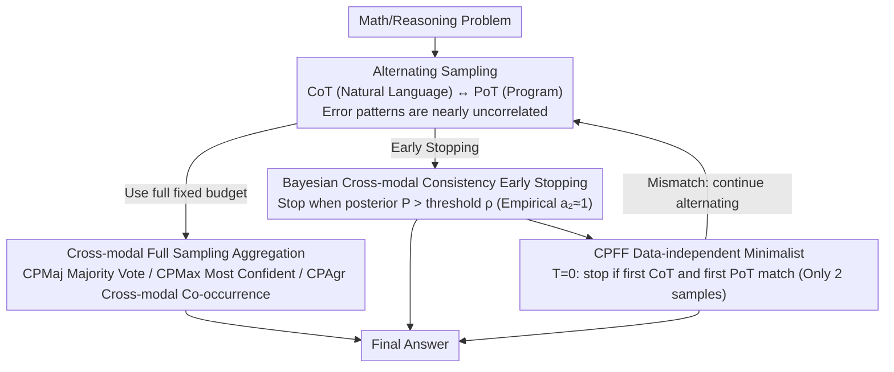

# Self-Consistency from Only Two Samples: CoT-PoT Ensembling for Efficient LLM Reasoning

**Conference**: ACL 2026 Findings  
**arXiv**: [2604.17433](https://arxiv.org/abs/2604.17433)  
**Code**: None  
**Area**: LLM Reasoning Efficiency  
**Keywords**: Self-consistency, Chain-of-Thought, Program-of-Thought, Cross-modal ensembling, Bayesian early stopping

## TL;DR

Ours proposes the CoT-PoT cross-modal ensembling method, which leverages the complementarity of two fundamentally different reasoning modalities—Chain-of-Thought (CoT) and Program-of-Thought (PoT)—to reduce the required number of samples for self-consistency by 9.3x, solving 78.6% of problems with only 2 samples.

## Background & Motivation

**Background**: Self-Consistency (SC) improves LLM reasoning accuracy by sampling multiple reasoning paths and performing a majority vote, but it incurs extreme computational costs due to the need for large sample sizes (typically 40). Existing adaptive consistency methods reduce the average number of samples but remain insufficiently efficient.

**Limitations of Prior Work**: Standard SC increases reasoning path diversity through high-temperature sampling. However, empirical observations show that multiple samples within the same modality often exhibit only surface-level phrasing variations rather than substantive semantic diversity. This implies significant informational redundancy in large-scale sampling.

**Key Challenge**: The core assumption of SC is that "different reasoning paths converging to the same answer is a strong signal of correctness." The bottleneck is reasoning path diversity rather than quantity. Existing methods only increase diversity through temperature sampling, which has limited effectiveness.

**Goal**: Maximize reasoning diversity by combining two fundamentally different reasoning modalities to achieve high accuracy with minimal samples.

**Key Insight**: CoT (step-by-step natural language reasoning) and PoT (writing programs for calculation) are inherently different. CoT is flexible but prone to calculation errors, while PoT is computationally robust but prone to symbolic representation errors. Their error patterns are highly uncorrelated.

**Core Idea**: If CoT and PoT yield the same answer for the same problem, this cross-modal consistency serves as an extremely strong signal of correctness because their error patterns are nearly independent. Based on this, a Bayesian early stopping strategy is designed, where most problems require only 1 CoT and 1 PoT sample.

## Method

### Overall Architecture

The framework includes two types of strategies: (1) Full sampling strategies—alternating between CoT and PoT sampling and using different aggregation methods (CPMaj/CPMax/CPAgr) to vote; (2) Early stopping strategies—based on a Bayesian model that terminates sampling once cross-modal consistency is observed, including data-driven and data-independent variants.

### Key Designs

**1. Cross-modal Full Sampling Aggregation: Trading modal diversity for higher accuracy under fixed budgets**

Standard SC relies on high-temperature sampling for diversity, but same-modality samples are often semantically redundant. Ours alternates the sampling budget between CoT and PoT. Since CoT is flexible but calculation-prone and PoT is robust but representation-prone, they provide higher-quality diversity. Three aggregation strategies are proposed: CPMaj (cross-modal majority vote), CPMax (selecting the most confident modality), and CPAgr (prioritizing answers appearing in both modalities). All outperform single-modal SC under the same budget.

**2. Bayesian Cross-modal Consistency Early Stopping: Stopping immediately upon cross-modal agreement**

To minimize costs, the "when to stop" decision is formulated as a Bayesian hypothesis test. Sampling alternates between CoT and PoT. When PoT provides answer $y$, the system tracks how many subsequent CoT samples match $y$. Three probabilities characterize the state: $c$ (prior probability of correctness), $a_1$ (probability of CoT matching the anchor), and $a_2$ (conditional probability that "if they match, the answer is correct"). Sampling stops when the posterior $P(C \mid k, t)$ exceeds threshold $\rho$. A key finding is $a_2 \approx 1$, meaning cross-modal agreement almost guarantees correctness.

**3. Data-independent Minimalist Strategy (CPFF): The 2-sample solution**

While data-driven variants estimate parameters from training sets, CPFF leverages the empirical rule that $a_2 \approx 1$ across models. It compares the first CoT and PoT samples at temperature 0; if they match, it stops (2 samples total). If they mismatch, it continues alternating with a Beta-test-based adaptive consistency fallback. CPFF requires no training data and achieves the highest efficiency—solving 78.6% of problems with just 2 samples.

### Loss & Training

Ours is a training-free method. Data-driven variants infer Bayesian parameters from 100 problems per benchmark training set. Evaluation is conducted on 5 benchmarks (GSM8K, MATH, FinQA, SVAMP, TabMWP) across 5 LLMs. The first sample uses temperature 0; subsequent samples use temperature 0.7.

## Key Experimental Results

### Main Results

| Method | Avg Accuracy | Avg Samples | 2-Sample Solve Rate |
|------|----------|----------|-----------|
| SCCoT (40 samples) | 84.6% | 40 | 0% |
| SCPoT (40 samples) | 82.9% | 40 | 0% |
| CPMax (Full) | **85.7%** | 40 | 0% |
| Adaptive SC | ~84% | ~10 | 0% |
| CPFF (Early Stop) | ~85% | **4.3** | **78.6%** |

### Ablation Study

| Configuration | Accuracy | Samples | Description |
|------|--------|--------|------|
| Single-modal SC | 84.6% | 40 | Baseline |
| CPMaj (Full) | 85.6% | 40 | Cross-modal aggregation |
| CPAA (Any match) | ~85% | ~4 | Efficient |
| CPFA (First+Any) | ~85% | ~4.5 | Slightly conservative |
| CPFF (First+First) | ~85% | ~4.3 | Most efficient |

### Key Findings

- Cross-modal full sampling outperforms single-modal SC (85.7% vs 84.6%) under the same budget.
- Early stopping reduces sampling by 9.3x on average, with 78.6% of problems requiring only 2 samples.
- The discovery of $a_2 \approx 1$ is critical—cross-modal consistency almost certainly implies a correct answer.
- Stronger reasoning models like DeepSeek R1 benefit more from cross-modal consistency (higher 2-sample solve rates).
- On certain benchmarks (e.g., SVAMP), the 2-sample solve rate exceeds 90%.

## Highlights & Insights

- **Insight that "diversity matters more than quantity"**: Information from 2 cross-modal samples outweighs 40 same-modality samples. This concept is extensible to other multi-step reasoning scenarios.
- **Elegant Bayesian Formalization**: Intuition (cross-modal consistency = high confidence) is transformed into a provable probabilistic model, with the key parameter $a_2 \approx 1$ strongly validated by experiments.
- **Significant Practical Value for Reasoning Models**: With the rise of o1/R1-class models, 2-sample SC can drastically reduce inference costs.

## Limitations & Future Work

- PoT depends on code execution environments, which may be unavailable in some deployment scenarios.
- PoT modesty has limited applicability for non-mathematical/non-computational tasks (e.g., commonsense reasoning).
- If both modalities exhibit systematic errors, cross-modal consistency may yield false high confidence.
- The fallback mechanism for early stopping (adaptive consistency) still requires some additional sampling.

## Related Work & Insights

- **vs Standard Self-Consistency**: Standard SC seeks quantity-based diversity within a single modality; CoT-PoT seeks modality-based diversity, which is significantly more efficient.
- **vs Adaptive Consistency**: Adaptive consistency stops based on statistical majority, often requiring at least 4 samples. The cross-modal signal in CoT-PoT is stronger, allowing termination at 2 samples.

## Rating

- Novelty: ⭐⭐⭐⭐⭐ The insight into cross-modal consistency is concise and profound; the Bayesian framework is elegant.
- Experimental Thoroughness: ⭐⭐⭐⭐⭐ Extremely thorough, covering 5 benchmarks × 5 LLMs with full, early stopping, and multiple variants.
- Writing Quality: ⭐⭐⭐⭐⭐ Clear motivation, rigorous theoretical derivation, and excellent experimental organization.

<!-- RELATED:START -->

## Related Papers

- [\[ACL 2026\] Reliability-Aware Adaptive Self-Consistency for Efficient Sampling in LLM Reasoning](reliability-aware_adaptive_self-consistency_for_efficient_sampling_in_llm_reason.md)
- [\[ACL 2026\] Does Self-Consistency Improve the Recall of Encyclopedic Knowledge?](does_self-consistency_improve_the_recall_of_encyclopedic_knowledge.md)
- [\[ICML 2025\] Self-Consistency Preference Optimization](../../ICML2025/llm_reasoning/self-consistency_preference_optimization.md)
- [\[ICLR 2026\] The Path of Least Resistance: Guiding LLM Reasoning Trajectories for Efficient Consistency](../../ICLR2026/llm_reasoning/the_path_of_least_resistance_guiding_llm_reasoning_trajectories_for_efficient_co.md)
- [\[ICML 2026\] Self-Play Only Evolves When Self-Synthetic Pipeline Ensures Learnable Information Gain](../../ICML2026/llm_reasoning/self-play_only_evolves_when_self-synthetic_pipeline_ensures_learnable_informatio.md)

<!-- RELATED:END -->
