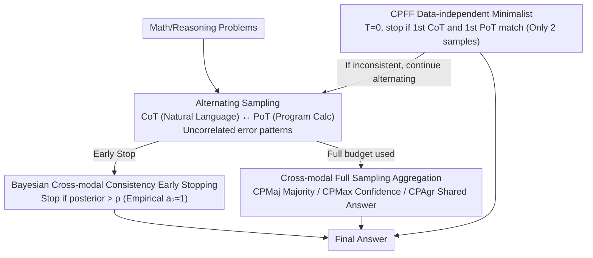

# Self-Consistency from Only Two Samples: CoT-PoT Ensembling for Efficient LLM Reasoning

**Conference**: ACL 2026 Findings  
**arXiv**: [2604.17433](https://arxiv.org/abs/2604.17433)  
**Code**: None  
**Area**: LLM Reasoning Efficiency  
**Keywords**: Self-Consistency, Chain-of-Thought, Program-of-Thought, Cross-modal ensembling, Bayesian early stopping

## TL;DR

Ours proposes the CoT-PoT cross-modal ensembling method, which leverages the complementarity of two fundamentally different reasoning modalities—Chain-of-Thought (CoT) and Program-of-Thought (PoT)—to reduce the number of samples required for self-consistency by 9.3x, solving 78.6% of problems with only 2 samples.

## Background & Motivation

**Background**: Self-Consistency (SC) improves LLM reasoning accuracy by sampling multiple reasoning paths and voting for the most frequent answer, but it requires massive sampling (typically 40 times), leading to extremely high computational costs. Existing adaptive consistency methods reduce the average sample count but remain insufficiently efficient.

**Limitations of Prior Work**: Standard SC increases reasoning path diversity through high-temperature sampling. However, empirical observations show that multiple samples within the same modality often exhibit only superficial phrasing differences rather than substantive semantic diversity. This implies significant information redundancy in large sample sets.

**Key Challenge**: The core assumption of SC is that "convergence of different reasoning paths to the same answer is a strong signal of correctness," where the key lies in the diversity of reasoning paths rather than their quantity. Existing methods only increase diversity through temperature sampling, with limited effect.

**Goal**: To achieve high accuracy with minimal samples by maximizing reasoning diversity through the combination of two fundamentally different reasoning modalities.

**Key Insight**: CoT (step-by-step natural language reasoning) and PoT (writing programs for computation) are inherently different reasoning modalities. CoT is flexible but prone to calculation errors, while PoT is computationally robust but prone to symbolic representation errors. Their error patterns are highly uncorrelated.

**Core Idea**: If CoT and PoT yield the same answer for the same problem, this cross-modal consistency serves as an extremely strong signal of correctness due to their uncorrelated error patterns. Based on this, a Bayesian early stopping strategy is designed, allowing most problems to be resolved with just 1 CoT + 1 PoT sample.

## Method

### Overall Architecture

The framework consists of two strategy types: (1) Full sampling strategies—alternating CoT and PoT samples and using different aggregation methods (CPMaj/CPMax/CPAgr) for voting; (2) Early stopping strategies—based on a Bayesian model, sampling terminates once cross-modal consistency is observed, featuring both data-driven and data-independent variants.

### Key Designs

**1. Cross-modal Full Sampling Aggregation: Swapping Modal Diversity for Higher Accuracy under Fixed Budget**

Standard SC relies on high-temperature sampling for diversity, but same-modality samples are often semantically redundant. Ours alternates between CoT and PoT within a fixed budget. Since CoT is flexible but calculation-prone and PoT is robust but symbolic-prone, they offer higher quality diversity than same-modality samples. Three aggregation strategies are proposed: CPMaj (cross-modal majority vote), CPMax (selecting the answer from the more confident modality), and CPAgr (prioritizing answers occurring in both modalities). All outperform single-modal SC under equal budgets.

**2. Bayesian Cross-modal Early Stopping: Immediate Termination upon Modal Alignment**

To suppress costs, the "when to stop" decision is formalized as a Bayesian hypothesis test. Sampling alternates between CoT and PoT. When PoT yields answer $y$, the system tracks how many subsequent CoT samples match $y$. Three core probabilities characterize the state: $c$ (prior probability of correctness), $a_1$ (probability of CoT matching the anchor answer), and $a_2$ (conditional probability that "the answer is safe given consistency"). Sampling stops when the posterior $P(C \mid k, t)$ exceeds threshold $\rho$. A key empirical finding is $a_2 \approx 1$—if modalities align, the answer is almost certainly correct, providing theoretical support for "stopping at the first consistency."

**3. Data-independent Minimalist Strategy CPFF: Pushing $a_2 \approx 1$ to the Limit for 2-Sample Efficiency**

While data-driven variants require parameter estimation, CPFF directly adopts the empirical rule of $a_2 \approx 1$ (near 0.99 across models). It compares the first CoT and first PoT answers at temperature 0. If consistent, it stops (only 2 samples total). If inconsistent, it proceeds with alternating sampling and uses an adaptive consistency Beta test as a fallback. Requiring no training data, it achieves the highest efficiency, solving 78.6% of problems with only 2 samples.

### Loss & Training

A training-free method. Data-driven variants infer Bayesian parameters from 100 problems per benchmark training set. Evaluation spans 5 benchmarks (GSM8K, MATH, FinQA, SVAMP, TabMWP) and 5 LLMs. The first sample uses temperature 0, and subsequent samples use temperature 0.7.

## Key Experimental Results

### Main Results

| Method | Avg. Accuracy | Avg. Samples | 2-Sample Solve Rate |
|------|----------|----------|-----------|
| SCCoT (40 samples) | 84.6% | 40 | 0% |
| SCPoT (40 samples) | 82.9% | 40 | 0% |
| CPMax (Full) | **85.7%** | 40 | 0% |
| Adaptive SC | ~84% | ~10 | 0% |
| CPFF (Early Stop) | ~85% | **4.3** | **78.6%** |

### Ablation Study

| Configuration | Accuracy | Sample Count | Description |
|------|--------|--------|------|
| Single-modal SC | 84.6% | 40 | Baseline |
| CPMaj (Full) | 85.6% | 40 | Cross-modal aggregation |
| CPAA (Any Consistency) | ~85% | ~4 | Efficient |
| CPFA (1st + Any) | ~85% | ~4.5 | Slightly conservative |
| CPFF (1st + 1st) | ~85% | **4.3** | Most efficient |

### Key Findings

- Cross-modal full sampling outperforms single-modal SC (85.7% vs 84.6%) under the same budget.
- Early stopping strategies reduce sampling by 9.3x on average, with 78.6% of problems requiring only 2 samples.
- The discovery of $a_2 \approx 1$ is pivotal—cross-modal consistency is a near-certain indicator of correctness.
- Stronger reasoning models like DeepSeek R1 benefit more from cross-modal consistency (higher 2-sample solve rates).
- On specific benchmarks like SVAMP, the 2-sample solve rate exceeds 90%.

## Highlights & Insights

- **Insight that "Diversity is more important than quantity"**: The information in 40 same-modality samples may be less than that in 2 cross-modal samples. This approach can generalize to other multi-step reasoning scenarios.
- **Elegant Bayesian Framework**: Transforms intuition (cross-modal consistency = high confidence) into a provable probabilistic model, with the crucial parameter $a_2 \approx 1$ strongly validated by experiments.
- **Significant Utility for Reasoning Models**: As o1/R1-class models proliferate, 2-sample SC can drastically reduce inference costs.

## Limitations & Future Work

- PoT depends on a code execution environment, which may be unavailable in some deployment scenarios.
- The PoT modality has limited applicability for non-mathematical/non-computational reasoning tasks (e.g., commonsense reasoning).
- If both modalities make systematic errors, cross-modal consistency may yield false high confidence.
- The fallback mechanism (adaptive consistency) for the early stopping strategy still requires a certain number of additional samples.

## Related Work & Insights

- **vs Standard Self-Consistency**: Standard SC seeks quantitative diversity within a single modality; CoT-PoT seeks modal diversity, which is more efficient.
- **vs Adaptive Consistency**: Adaptive consistency stops by measuring statistical majority, usually requiring at least 4 samples. CoT-PoT's cross-modal consistency is a stronger signal, allowing for termination at 2 samples.

## Rating

- Novelty: ⭐⭐⭐⭐⭐ The insight into cross-modal consistency is simple and profound; the Bayesian framework is elegant.
- Experimental Thoroughness: ⭐⭐⭐⭐⭐ 5 benchmarks × 5 LLMs, including full/early stop/variant analysis, extremely thorough.
- Writing Quality: ⭐⭐⭐⭐⭐ Clear motivation, rigorous theoretical derivation, and excellent experimental organization.

<!-- RELATED:START -->

## Related Papers

- [\[ACL 2026\] Reliability-Aware Adaptive Self-Consistency for Efficient Sampling in LLM Reasoning](reliability-aware_adaptive_self-consistency_for_efficient_sampling_in_llm_reason.md)
- [\[ACL 2026\] Does Self-Consistency Improve the Recall of Encyclopedic Knowledge?](does_self-consistency_improve_the_recall_of_encyclopedic_knowledge.md)
- [\[ICLR 2026\] The Path of Least Resistance: Guiding LLM Reasoning Trajectories for Efficient Consistency](../../ICLR2026/llm_reasoning/the_path_of_least_resistance_guiding_llm_reasoning_trajectories_for_efficient_co.md)
- [\[ICML 2025\] Self-Consistency Preference Optimization](../../ICML2025/llm_reasoning/self-consistency_preference_optimization.md)
- [\[NeurIPS 2025\] A Theoretical Study on Bridging Internal Probability and Self-Consistency for LLM Reasoning](../../NeurIPS2025/llm_reasoning/a_theoretical_study_on_bridging_internal_probability_and_sel.md)

<!-- RELATED:END -->
