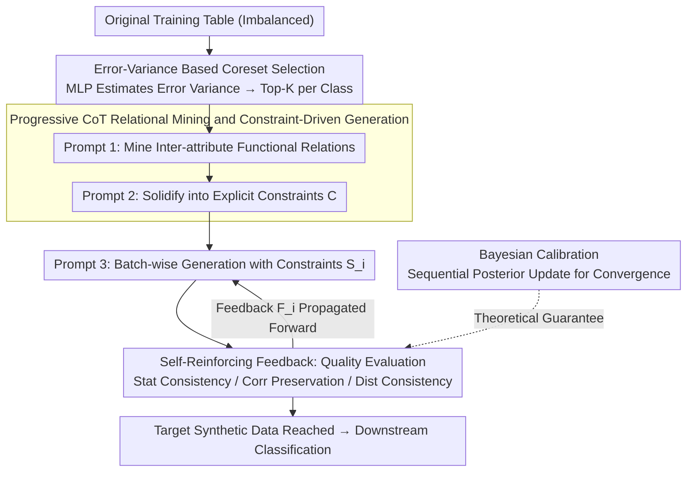

# Self-Reinforcing Controllable Synthesis of Rare Relational Data via Bayesian Calibration

**Conference**: ACL 2026 Findings  
**arXiv**: [2604.16817](https://arxiv.org/abs/2604.16817)  
**Code**: [GitHub](https://github.com/cszhangLMU/RDDG)  
**Area**: LLM Reasoning / Tabular Data Generation  
**Keywords**: Tabular Data Synthesis, Imbalanced Classification, Self-Reinforcing Feedback, Bayesian Calibration, In-Context Learning

## TL;DR

This paper proposes RDDG, a tabular data synthesis framework based on progressive Chain-of-Thought (CoT). It guides Large Language Models (LLMs) to generate high-fidelity tabular data through coreset selection, relational mining, and a self-reinforcing feedback mechanism, achieving an average Macro-F1 improvement of over 2% in imbalanced classification tasks.

## Background & Motivation

**Background**: Imbalanced data is ubiquitous in real-world applications, and data synthesis is a common approach to alleviate the scarcity of rare class samples. While LLMs have revolutionized text generation and multi-modal foundation models are being used for image data augmentation in visual learning, the application of LLMs to relational/structured tabular data synthesis remains under-explored. In contrast, non-LLM methods like GANs and Diffusion models have already been proven effective for tabular data generation.

**Limitations of Prior Work**: Existing LLM-based tabular synthesis methods suffer from two gaps. First, there is a distinct misalignment between the data generation objective and the downstream task objective (especially for imbalanced classification)—generation focuses solely on resembling real data without targeting what the classifier requires. Second, there is a lack of an internal self-reinforcing feedback mechanism to continuously guide the LLM in optimizing generation quality during the in-context synthesis process, rather than relying on a one-time generation.

**Key Challenge**: Attributes in tabular data exhibit complex functional relationships and correlation constraints. Allowing LLMs to generate freely often leads to deviations from the true distribution. However, cramming these constraints into prompts is limited by the context window length, and static constraints cannot dynamically correct errors during the generation process.

**Goal**: To propose RDDG (Relational Data generator with Dynamic Guidance), a unified in-context learning framework that uses progressive CoT steps to generate tabular data to improve downstream imbalanced classification performance, supported by theoretical guarantees of Bayesian calibration for the self-reinforcing feedback mechanism.

**Core Idea**: representative samples are first compressed via coreset selection to bypass context limits; then, relational mining is used to solidify functional relationships between attributes into explicit constraints. Finally, a self-reinforcing feedback loop that propagates quality evaluation forward to the next batch is established, allowing generation quality to improve across batches—proving that this loop essentially performs sequential Bayesian calibration.

## Method

### Overall Architecture

RDDG aims to "enable LLMs to synthesize high-fidelity tabular data for imbalanced classification without fine-tuning." The pipeline consists of three steps: **Coreset Construction**, which selects a small set of representative samples from the original training data to bypass LLM context window limits; **Relational Mining**, which uses in-context learning to extract latent patterns and correlations between attributes from the coreset and solidifies them into explicit structural constraints; and **Data Generation and Constraint Optimization**, where the training set is divided into multiple batches acting as reference sets for batch-wise generation. After each batch, a self-reinforcing feedback mechanism evaluates the quality and converts the results into feedback prompts for the next batch. Formally, the $i$-th batch of synthetic data is generated by $\mathcal{S}_i = S_\phi(\mathcal{R}_i, \mathcal{C}, \mathcal{F}_{i-1})$, where $\mathcal{R}_i$ is the real reference set, $\mathcal{C}$ represents the constraints from relational mining, and $\mathcal{F}_{i-1}$ is the feedback from the previous batch. The overall goal is to approximate $\min_{\mathcal{S}_i} d(\hat{\mathbb{P}}_{\mathcal{S}_i}, \mathbb{P}_{\mathcal{R}})$ (where $d$ is a distributional distance like KL divergence).

### Key Designs

**1. Error-Variance Based Coreset Selection: Supporting the Distribution with "Hardest to Learn" Samples**

The LLM context window cannot accommodate the entire training table, and hard truncation risks losing the tail of the distribution, which harms rare classes. RDDG adopts coreset selection: a simple MLP is trained, and the training process is divided into early, middle, and late stages. For each sample, the L2 prediction error $\mathcal{L}_2(\mathbf{y}_{\text{pred}}, \mathbf{y}_{\text{true}}) = \|\mathbf{y}_{\text{pred}} - \mathbf{y}_{\text{true}}\|_2^2$ is calculated per epoch. The mean and variance of errors in the early and late stages are computed, and the Top-K samples with the highest variance per class are selected: $\text{Top}_k(k) = \arg\text{top}_K([\text{Var}_i \mid i \in N_k])$. If a class has fewer than $K$ samples, repeated sampling is used. Samples with high error variance often lie near decision boundaries and carry the most information; this per-class balancing strategy ensures minority classes are not overwhelmed by majority classes.

**2. Progressive CoT Relational Mining and Constraint-Driven Generation: Externalizing Domain Priors into Controllable Rules**

Directly generating tabular rows often results in contradictory attributes or loss of correlation structure. RDDG decomposes generation into a CoT-like reasoning chain: Prompt 1 directs the LLM to analyze functional relationships (patterns and inter-attribute correlations) from the coreset; Prompt 2 synthesizes the coreset, metadata, and mined relationships into explicit generation rules and constraints; Prompt 3_1 then generates new samples batch-wise, using the training set as a reference while adhering to these constraints. This transforms domain priors from being "hidden in data" to being "written in constraints," achieving controllable, constraint-driven synthesis.

**3. Dynamic Guidance through Self-Reinforcing Feedback: Standing on the Shoulders of Previous Batches**

One-time generation offers no opportunity for correction. RDDG evaluates quality across three dimensions immediately after each batch: Statistical Consistency (comparing means and standard deviations), Correlation Preservation (calculating Pearson coefficients), and Distribution Consistency (via Kolmogorov-Smirnov tests). Crucially, the feedback from batch $i$ is **not** used to regenerate the same batch but is converted into a feedback prompt $\mathcal{F}_{i-1}$ propagated forward to batch $i+1$, combined with existing constraints in the next round of in-context learning: $\mathcal{S}_i = S_\phi(\mathcal{R}_i, \mathcal{C}, \mathcal{F}_{i-1})$. This continues until the target volume is reached, creating a self-optimizing pipeline where semantic consistency and statistical fidelity improve incrementally.

**4. Bayesian Calibration Perspective: Theoretical Assurance for the Feedback Loop**

Why does self-reinforcing feedback lead to improvement rather than a random walk? The paper formalizes this process as Bayesian calibration: the generator hyperparameter $\phi$ is treated as an unknown variable with a prior $p(\phi)$ encoding structural beliefs from relational mining. Summary targets $T(\mathcal{R})$ (mean, std, Pearson, KS distance) are used to construct a likelihood $p(T(\mathcal{R}) \mid T(S_\phi))$ to score synthetic batches. The posterior is $p(\phi \mid T(\mathcal{R})) \propto p(T(\mathcal{R}) \mid T(S_\phi)) \, p(\phi)$. The loop performs sequential Bayesian updates across batches $i=1,2,\dots$, where feedback metrics $F_i$ act as a posterior predictive check, pushing $\phi$ toward a state that both maintains functional relationships and addresses class imbalance. Theorem 1 proves that the Bayes-optimal prompt $\phi^\star$ maximizing expected posterior utility minimizes expected posterior regret. Proposition 1 uses Robbins–Monro stochastic approximation to prove that, under suitable step-size conditions, the sequence $\phi_i$ converges almost surely to the Bayes-optimal set $\Phi^\star$.

### Loss & Training

RDDG **does not fine-tune the LLM**; synthesis is driven entirely by in-context learning. The only training involved is the simple MLP used for error-variance estimation in coreset selection. The default LLM is GPT-3.5-turbo-0125, with Llama 3.0 and Mistral Max used for additional validation. The optimization goal is to minimize the divergence between the empirical distributions of synthetic and real data batch-wise: $\min_{\mathcal{S}_i} d(\hat{\mathbb{P}}_{\mathcal{S}_i}, \mathbb{P}_{\mathcal{R}})$.

## Key Experimental Results

### Main Results

Evaluation was conducted on 8 datasets: 4 real-world (Travel, Sick, Heloc, Thyroid) and 4 synthetic avec explicit correlations (Consumer Behavior, Health Metrics, Real Estate, Social Network), using an 80%/20% train/test split. Baselines include GReaT, EPIC, TabDDPM, CDTD, REaLTabFormer, ADS-GAN, and the "Original" training data. Results for the Travel dataset (GPT-3.5 default) are summarized below:

| Method | Macro-F1 | Balanced Acc |
|------|----------|--------------|
| Original | 58.12 | 71.21 |
| TabDDPM | 65.32 | 73.19 |
| CDTD | 66.32 | 74.82 |
| EPIC (Prev. SOTA) | 66.65 | 78.23 |
| **RDDG (Ours)** | **68.63** | **79.67** |

Across all datasets, RDDG achieves an average Gain of **>2% weighted Macro-F1** and **>1% Balanced Accuracy** compared to EPIC, the previous strongest in-context method, while maintaining superior data fidelity.

### Key Findings

- On the Travel dataset, RDDG matched EPIC's minority class Sensitivity (78.23) while outperforming it in Macro-F1 and Balanced Accuracy, indicating that the fidelity gains from self-reinforcing feedback successfully translate into downstream classification performance.
- On more balanced datasets like Sick, RDDG's Balanced Accuracy (93.62) still led CDTD (93.25) and EPIC (92.45), showing the framework does not sacrifice the majority class to improve the minority.
- Performance gains were consistent across GPT-3.5, Llama 3.0, and Mistral Max, demonstrating that the benefits stem from the framework design rather than a specific model.

## Highlights & Insights

- **Theoretical Grounding for Empirical Feedback**: Unlike most LLM synthesis methods that rely on engineering intuition for "iterative refinement," RDDG uses Bayesian calibration to prove that sequential feedback converges to a Bayes-optimal prompt.
- **Forward Propagation of Feedback**: Propagating batch $i$ evaluations to batch $i+1$ rather than regenerating the same batch avoids overfitting to a single batch and allows the reference set to rotate effectively.
- **Coreset Selection via Error-Variance**: Under context constraints, selecting high-information samples near boundaries via error variance is more effective than uniform sampling and naturally balances class representation for the LLM.

## Limitations & Future Work

- Coreset selection depends on an external MLP; for extremely high-dimensional or extremely sparse classes, this proxy model itself may be unstable.
- The default dimensions for feedback (statistical consistency, correlation, etc.) are hand-crafted and might not fully capture highly non-linear or high-order interactions.
- Theoretical proofs for Bayesian optimality rely on idealized assumptions (unbiased gradients, compact space, specific step sizes) that may differ from the discrete reality of prompt engineering.
- The experiments focus primarily on tabular classification; migration to other structured formats like regression or time-series remains to be verified.

## Related Work & Insights

- **vs. Most Relevant Work A**: This work improves upon key dimensions.
- **vs. Most Relevant Work B**: This work provides a different solution path.

## Rating

- Novelty: ⭐⭐⭐⭐ Innovative, though some components combine existing techniques.
- Experimental Thoroughness: ⭐⭐⭐⭐ Comprehensive evaluation.
- Writing Quality: ⭐⭐⭐⭐ Clear structure.
- Value: ⭐⭐⭐⭐ Significant practical contribution to the field.

<!-- RELATED:START -->

## Related Papers

- [\[ACL 2026\] Efficient PRM Training Data Synthesis via Formal Verification](efficient_prm_training_data_synthesis_via_formal_verification.md)
- [\[ACL 2026\] MathAgent: Adversarial Evolution of Constraint Graphs for Mathematical Reasoning Data Synthesis](mathagent_adversarial_evolution_of_constraint_graphs_for_mathematical_reasoning_.md)
- [\[ICML 2026\] An Information-Theoretic Criterion for Efficient Data Synthesis](../../ICML2026/llm_reasoning/an_information-theoretic_criterion_for_efficient_data_synthesis.md)
- [\[ICML 2026\] Evaluating Relational Reasoning in LLMs with REL](../../ICML2026/llm_reasoning/evaluating_relational_reasoning_in_llms_with_rel.md)
- [\[ACL 2026\] Calibration-Aware Policy Optimization for Reasoning LLMs](calibration-aware_policy_optimization_for_reasoning_llms.md)

<!-- RELATED:END -->
