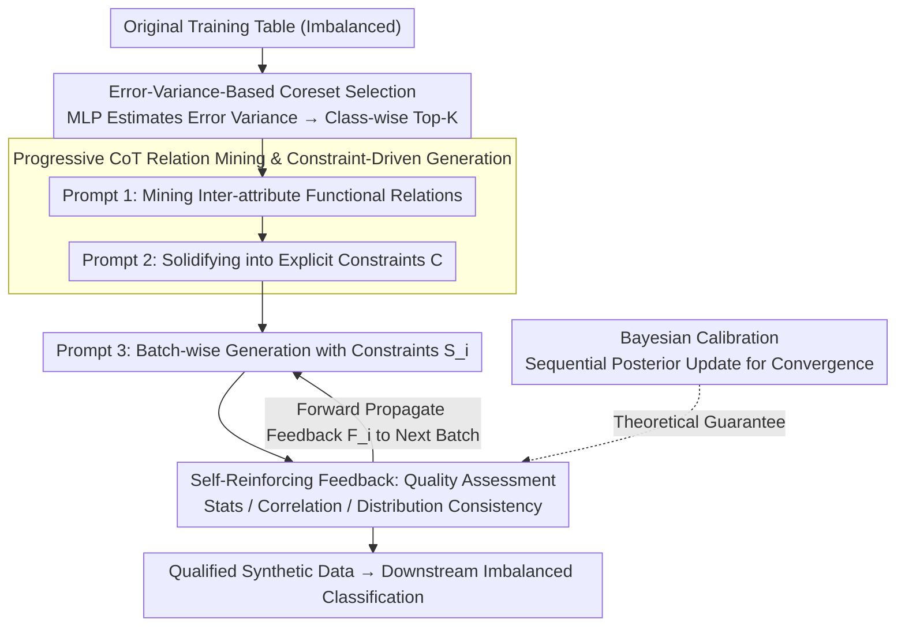

# Self-Reinforcing Controllable Synthesis of Rare Relational Data via Bayesian Calibration

**Conference**: ACL 2026 Findings  
**arXiv**: [2604.16817](https://arxiv.org/abs/2604.16817)  
**Code**: [GitHub](https://github.com/cszhangLMU/RDDG)  
**Area**: LLM Reasoning / Tabular Data Generation  
**Keywords**: Tabular data synthesis, imbalanced classification, self-reinforcing feedback, Bayesian calibration, in-context learning

## TL;DR

This paper proposes RDDG, a progressive CoT-based tabular data synthesis framework. By integrating coreset selection, relation mining, and a self-reinforcing feedback mechanism, it guides LLMs to generate high-fidelity tabular data, achieving an average improvement of over 2% in Macro-F1 for imbalanced classification tasks.

## Background & Motivation

**Background**: Imbalanced data is ubiquitous in real-world applications, and data synthesis is a common approach to alleviate the scarcity of rare class samples. While Large Language Models (LLMs) have revolutionized text generation and multimodal foundation models have been used for image data augmentation, the application of LLMs to relational/structured tabular data synthesis remains under-explored. In contrast, non-LLM methods such as GANs and diffusion models have already been validated as effective for tabular data generation.

**Limitations of Prior Work**: Existing LLM-based tabular synthesis methods suffer from two gaps. First, there is a clear misalignment between the data generation objective and the optimization goals of downstream tasks (especially imbalanced classification)—generation focuses on looking like real data but neglects the requirements of the classifier. Second, there is a lack of an internal self-reinforcing feedback mechanism that can continuously guide the LLM to optimize generation quality during the in-context synthesis process, rather than relying on a one-time generation.

**Key Challenge**: Attributes in tabular data have complex functional relationships and correlation constraints. Allowing LLMs to generate freely often results in data that deviates from the true distribution. However, incorporating these constraints into prompts is limited by the context window length, and static constraints cannot dynamically correct errors during the generation process.

**Goal**: To propose RDDG (Relational Data generator with Dynamic Guidance), a unified in-context learning framework that uses progressive CoT steps to generate tabular data for improving downstream imbalanced classification performance, supported by theoretical guarantees of Bayesian calibration for the self-reinforcing feedback mechanism.

**Core Idea**: representative samples are first compressed using coreset selection to bypass context limits. Then, relation mining is used to solidify functional relationships between attributes into explicit constraints. Finally, a self-reinforcing feedback loop forward-propagates quality assessments to the next batch, allowing generation quality to improve across batches—proven fundamentally to be performing sequential Bayesian calibration.

## Method

### Overall Architecture

RDDG aims to "enable LLMs to synthesize high-fidelity tabular data for imbalanced classification without fine-tuning." The pipeline consists of three steps: **Coreset Construction**, which selects a small number of representative samples from the original training data to bypass LLM context window limits; **Relation Mining**, which uses in-context learning to extract latent patterns and correlations from the coreset and solidifies them into explicit structural constraints; and finally **Data Generation and Constraint Optimization**, where the training set is partitioned into batches as reference sets for sequential generation. After each batch, a self-reinforcing feedback mechanism evaluates quality and converts the assessment into feedback prompts for the next batch. Formally, the $i$-th batch of synthetic data is produced by $\mathcal{S}_i = S_\phi(\mathcal{R}_i, \mathcal{C}, \mathcal{F}_{i-1})$, where $\mathcal{R}_i$ is the real reference set, $\mathcal{C}$ represents the constraints from relation mining, and $\mathcal{F}_{i-1}$ is the feedback from the previous batch. The overall objective is to approximate $\min_{\mathcal{S}_i} d(\hat{\mathbb{P}}_{\mathcal{S}_i}, \mathbb{P}_{\mathcal{R}})$ (where $d$ is a distributional distance such as KL divergence).

### Key Designs

**1. Error-Variance-Based Coreset Selection: Using the "Hardest to Learn" Samples to Represent the Distribution**

The LLM context window cannot fit the entire training table, and simple truncation loses the tail of the distribution, which is detrimental to rare classes. RDDG adopts a coreset selection approach: a simple MLP is trained, and the training process is divided into early, middle, and late stages. For each sample at each epoch, the L1/L2 prediction error $\mathcal{L}_2(\mathbf{y}_{\text{pred}}, \mathbf{y}_{\text{true}}) = \|\mathbf{y}_{\text{pred}} - \mathbf{y}_{\text{true}}\|_2^2$ is calculated. The mean and variance of the errors in the early and late stages are computed, and the Top-K samples with the highest variance are selected per class: $\text{Top}_k(k) = \arg\text{top}_K([\text{Var}_i \mid i \in N_k])$. If a class has fewer than $K$ samples, oversampling is used. Samples with high error variance tend to be near the decision boundary and are most informative; the class-wise Top-K strategy ensures minority classes are not overwhelmed by majority classes in the LLM prompt.

**2. Progressive CoT Relation Mining and Constraint-Driven Generation: Explicitly Turning Domain Priors into Controllable Rules**

Directly asking an LLM to generate tabular rows often leads to contradictory attributes and a loss of real correlation structures. RDDG breaks generation into a CoT-like reasoning chain: Prompt 1 tasks the LLM with analyzing functional relationships (patterns and inter-attribute correlations) from the coreset; Prompt 2 asks it to synthesize the coreset, metadata, and the previous step's relations into explicit generation rules and constraints; Prompt 3 then generates new samples batch-by-batch using these constraints. This transforms domain priors from being "hidden in the data" to being "written in constraints," facilitating constraint-driven, controllable synthesis.

**3. Dynamic Guidance via Self-Reinforcing Feedback: Standing on the Shoulders of Previous Batches**

One-time generation offers no opportunity for error correction. RDDG evaluates quality across three dimensions immediately after each batch is generated: Statistical Consistency (comparing means and standard deviations), Correlation Preservation (checking inter-attribute relationships via Pearson correlation), and Distribution Consistency (verified via Kolmogorov-Smirnov tests). Crucially, feedback from batch $i$ is **not** used to regenerate the same batch but is converted into a feedback prompt $\mathcal{F}_{i-1}$ forward-propagated to batch $i+1$. This is incorporated into the next round of in-context learning: $\mathcal{S}_i = S_\phi(\mathcal{R}_i, \mathcal{C}, \mathcal{F}_{i-1})$. This creates a self-optimizing pipeline where semantic consistency and statistical fidelity escalate batch-by-batch.

**4. Bayesian Calibration Perspective: Theoretical Assurance for the Feedback Loop**

Why does self-reinforcing feedback lead to improvement rather than a random walk? The paper formalizes this sequential process as Bayesian calibration: the generator hyperparameters $\phi$ are treated as unknowns with a prior $p(\phi)$ encoding structural beliefs from the relation mining stage. Summary targets $T(\mathcal{R})$ (mean, std, Pearson, KS distance) are used to construct a likelihood $p(T(\mathcal{R}) \mid T(S_\phi))$ to score synthetic batches. The posterior is $p(\phi \mid T(\mathcal{R})) \propto p(T(\mathcal{R}) \mid T(S_\phi)) \, p(\phi)$. The loop performs sequential Bayesian updates for batches $i=1,2,\dots$, where feedback metrics $F_i$ act as posterior predictive checks, pushing $\phi$ toward a state that "maintains functional relations while improving imbalanced classification targets." Theorem 1 proves that the Bayes-optimal prompt $\phi^\star$ maximizing the expected posterior utility minimizes the expected posterior regret; Proposition 1 further uses Robbins–Monro stochastic approximation to prove that the sequence $\phi_i$ converges almost surely to the Bayes optimal set $\Phi^\star$.

### Loss & Training

RDDG **does not fine-tune the LLM**; the synthesis relies entirely on in-context learning. The only component requiring training is the MLP used for error variance estimation in coreset selection. The default LLM is GPT-3.5-turbo-0125, with additional tests on Llama 3.0 and Mistral Max. The optimization goal is to minimize the divergence between the empirical distributions of synthetic and real data batch-wise: $\min_{\mathcal{S}_i} d(\hat{\mathbb{P}}_{\mathcal{S}_i}, \mathbb{P}_{\mathcal{R}})$.

## Key Experimental Results

### Main Results

Evaluations were conducted on 8 datasets: 4 real-world datasets (Travel, Sick, Heloc, Thyroid) and 4 synthetic datasets with explicit inter-attribute correlations (Consumer Behavior, Health Metrics, Real Estate, Social Network), using an 80%/20% train/test split. Baselines included GReaT, EPIC, TabDDPM, CDTD, REaLTabFormer, ADS-GAN, and the Original data (no synthesis). Results for the Travel dataset (GPT-3.5) are as follows:

| Method | Macro-F1 | Balanced Acc |
| :--- | :--- | :--- |
| Original | 58.12 | 71.21 |
| TabDDPM | 65.32 | 73.19 |
| CDTD | 66.32 | 74.82 |
| EPIC (Prev. SOTA) | 66.65 | 78.23 |
| **RDDG (Ours)** | **68.63** | **79.67** |

Across all datasets, RDDG achieved an average improvement of **>2% weighted Macro-F1** and **>1% Balanced Accuracy** compared to the strongest in-context baseline, EPIC, while maintaining superior data fidelity.

### Key Findings

- In the Travel dataset, RDDG achieved minority class sensitivity (78.23) comparable to EPIC while outperforming it in Macro-F1 and Balanced Accuracy, indicating that fidelity gains from self-reinforcing feedback directly translate into downstream classification performance.
- On more balanced datasets like Sick, RDDG’s Balanced Accuracy (93.62) still outperformed CDTD (93.25) and EPIC (92.45), showing the framework does not sacrifice the majority class to benefit the minority class.
- Gains were consistent across GPT-3.5, Llama 3.0, and Mistral Max, confirming that the improvements stem from the framework design rather than specific model capabilities.

## Highlights & Insights

- **Elevating Feedback from Empirical Heuristic to Theoretical Guarantee**: While many LLM synthesis methods use "iterative refinement," it is often based on engineering intuition. RDDG uses Bayesian calibration to prove that sequential feedback converges to a Bayes-optimal prompt—a rare theoretical grounding in this field.
- **Forward Propagation vs. Local Regeneration**: Propagating batch $i$ quality assessments to $i+1$ instead of repeatedly refining the same batch avoids overfitting to a single batch and allows the reference set to rotate, a pragmatic design choice.
- **Error-Variance-Based Coreset**: Under strict context constraints, selecting high-information boundary samples is more effective at representing the distribution than uniform sampling, and naturally supports imbalanced classes.

## Limitations & Future Work

- Coreset selection relies on an auxiliary MLP; for very high-dimensional data or extremely small rare classes, this proxy model itself may be unstable.
- The three quality dimensions for feedback (stats, correlation, distribution) are hand-crafted and may not fully capture highly non-linear or high-order attribute interactions.
- The proof of Bayesian optimality relies on several idealized assumptions (unbiased gradients, compact parameter space, proper step size) which may differ from the discrete reality of prompt engineering.
- Experiments focus on tabular classification; transferability to regression or time-series data remains to be verified.

## Related Work & Insights

- **vs. EPIC**: RDDG improves upon EPIC by introducing dynamic feedback and theoretical calibration rather than relying on static in-context samples.
- **vs. GReaT**: Unlike GReaT which requires fine-tuning, RDDG achieves controllable synthesis through pure in-context learning with explicit structural constraints.

## Rating

- Novelty: ⭐⭐⭐⭐ Innovative, though some components combine existing techniques.
- Experimental Thoroughness: ⭐⭐⭐⭐ Comprehensive evaluation.
- Writing Quality: ⭐⭐⭐⭐ Clearly structured.
- Value: ⭐⭐⭐⭐ Significant practical contribution to the field.

<!-- RELATED:START -->

- **GReaT**: Language Models are Realistic Tabular Data Generators (ICLR 2023)
- **EPIC**: Effective Prompting for In-Context Tabular Data Synthesis (arXiv 2024)

## Related Papers

- [\[ACL 2026\] Efficient PRM Training Data Synthesis via Formal Verification](efficient_prm_training_data_synthesis_via_formal_verification.md)
- [\[ACL 2026\] MathAgent: Adversarial Evolution of Constraint Graphs for Mathematical Reasoning Data Synthesis](mathagent_adversarial_evolution_of_constraint_graphs_for_mathematical_reasoning_.md)
- [\[ICML 2026\] An Information-Theoretic Criterion for Efficient Data Synthesis](../../ICML2026/llm_reasoning/an_information-theoretic_criterion_for_efficient_data_synthesis.md)
- [\[ICLR 2026\] DESIGNER: Design-Logic-Guided Multidisciplinary Data Synthesis for LLM Reasoning](../../ICLR2026/llm_reasoning/designer_design-logic-guided_multidisciplinary_data_synthesis_for_llm_reasoning.md)
- [\[ACL 2026\] Calibration-Aware Policy Optimization for Reasoning LLMs](calibration-aware_policy_optimization_for_reasoning_llms.md)

<!-- RELATED:END -->
