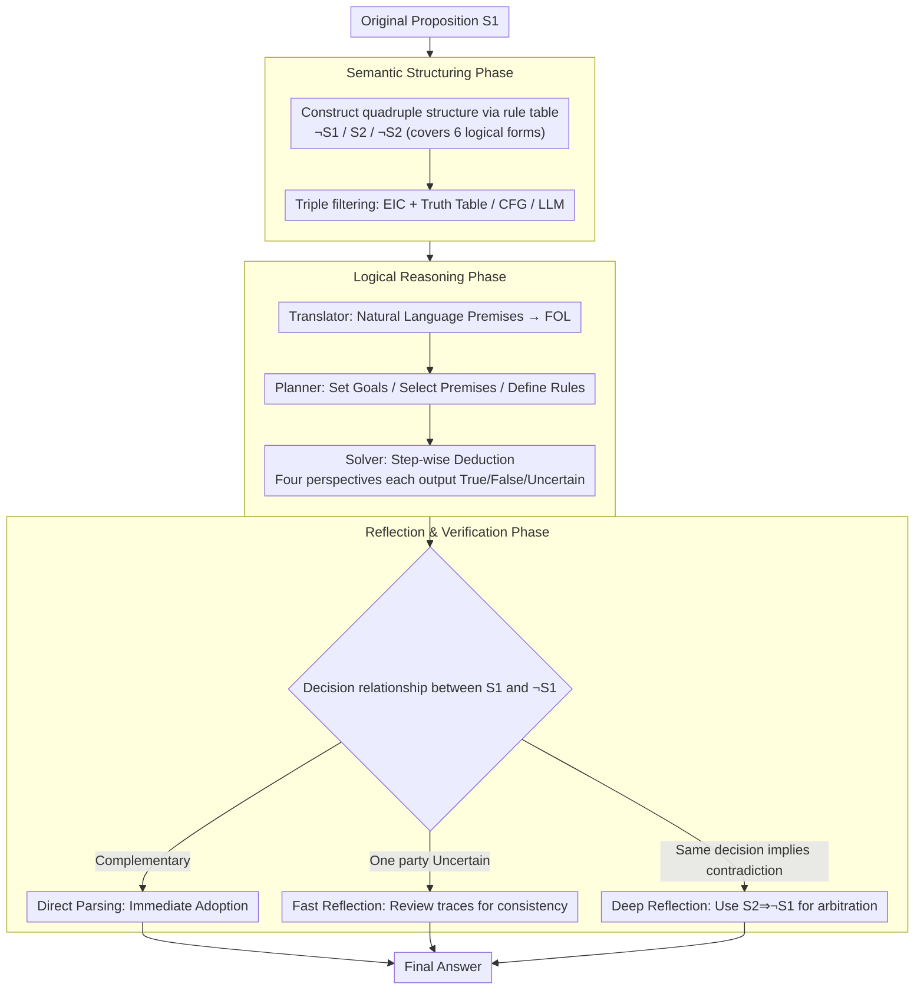

# Semantic-Aware Logical Reasoning via a Semiotic Framework

**Conference**: ACL 2026  
**arXiv**: [2509.24765](https://arxiv.org/abs/2509.24765)  
**Code**: [GitHub](https://github.com/AI4SS/Logic-Agent)  
**Area**: LLM Reasoning / Logical Reasoning  
**Keywords**: Symbolic Reasoning, Greimas Semiotic Square, Logical Reasoning, Semantic Complexity, Multi-Perspective Reasoning

## TL;DR

Ours proposes LogicAgent, a logical reasoning framework based on the Greimas Semiotic Square, achieving SOTA logical reasoning performance under the dual challenges of semantic and logical complexity through multi-perspective semantic analysis and reflective verification.

## Background & Motivation

**Background**: The logical reasoning capability of LLMs is one of its core competencies. Existing methods are primarily divided into three categories: linear reasoning (CoT), aggregated reasoning (multi-trajectory aggregation like ToT/CR), and symbolic reasoning (Logic-LM, etc., combined with FOL solvers). These methods perform well on benchmarks with clear logical structures.

**Limitations of Prior Work**: Existing methods almost exclusively focus on **logical complexity** (reasoning depth, number of steps) while ignoring **semantic complexity** (abstract propositions, ambiguous contexts, opposing stances). In real-world reasoning, semantic ambiguity and abstraction are often intertwined with logical complexity—for instance, philosophical propositions like "Is justice always beneficial?" require not only deep reasoning but also multi-angled interpretations of abstract concepts.

**Key Challenge**: Existing benchmarks (ProntoQA, ProofWriter, etc.) are mostly generated based on templates with clear and unambiguous propositions, failing to test the model's reasoning robustness in semantically complex scenarios. In the real world, the coupling of semantic complexity and logical complexity is the true challenge of reasoning.

**Goal**: To build a reasoning framework capable of addressing both semantic and logical complexity simultaneously, and to provide a benchmark that can evaluate this coupled challenge.

**Key Insight**: Ours draws from the Greimas Semiotic Square in structuralist semantics, expanding a proposition into a quadruple structure (original $S_1$, contradictory $\lnot S_1$, contrary $S_2$, and contradictory of the contrary $\lnot S_2$). By conducting reasoning and cross-verification from multiple perspectives, reasoning robustness is enhanced under semantic ambiguity.

## Method

### Overall Architecture

LogicAgent aims to solve the problem where single-perspective reasoning easily gets "locked" into one interpretation when semantic and logical complexities are intertwined. It expands a proposition into the quadruple structure of the Greimas Semiotic Square, executes formal deductive reasoning for each perspective, and finally uses the inherent structural relationships of the square for cross-arbitration. The pipeline consists of three stages: **Semantic Structuring** expands proposition $S_1$ into four related propositions $\lnot S_1, S_2, \lnot S_2$ and verifies FOL consistency; **Logical Reasoning** translates natural language premises into FOL, plans paths, and step-wise deduces the decision for each perspective; **Reflection & Verification** uses a three-tier progressive mechanism to compare conclusions from different perspectives and output a consistent final answer.

### Key Designs

**1. Semantic Structuring Phase: Expanding a single proposition into a quadruple semantic space to force out potential ambiguity**

Natural language propositions often imply multiple interpretations; locking in one interpretation too early misses opposing stances—for example, in "Is justice always beneficial?", both affirmation and negation have their merits. In this stage, given the original $S_1$, its contradictory $\lnot S_1$ (strict negation), contrary $S_2$ (cannot both be true but can both be false), and contradictory of the contrary $\lnot S_2$ are constructed according to a unified rule table. The rule table covers six logical forms: universal, existential, implication, conjunction, disjunction, and biconditional. To avoid "vacuous truth" loopholes in the null domain for contrary relationships, an Existential Import Check (EIC) is introduced. All candidate propositions pass through triple filtering (Truth Table validation, CFG syntax check, LLM semantic validation) to ensure the quadruple structure is both syntactically valid and semantically relevant. Thus, subsequent reasoning unfolds in a structured multi-perspective space rather than focusing solely on the original proposition.

**2. Logical Reasoning Phase: Performing formal symbolic deduction for each proposition in the square**

Pure LLM reasoning is unreliable, prone to skipping steps or self-contradiction. Therefore, this stage assigns reasoning to three functional units. The Translator converts natural language premises into FOL using unified mapping specifications (entities to unary predicates, actions to binary predicates, and evaluative properties to predicates). The Planner constructs a reasoning blueprint, setting goals, selecting relevant premises, and identifying reasoning rules (e.g., Modus Ponens / Modus Tollens). The Solver performs step-wise deduction based on the blueprint, outputting transparent reasoning trajectories and a three-valued decision of True / False / Uncertain. The LLM's linguistic understanding maps fuzzy natural language to symbols, while the rigorous deduction of symbolic logic ensures every step is traceable, compensating for the unreliability of end-to-end LLMs.

**3. Reflection & Verification Phase: Using structural relationships of the square for cross-arbitration to resolve inconsistencies**

After the four perspectives provide their decisions, how is a reliable conclusion synthesized? This stage designs a three-tier progressive mechanism to precisely match different inconsistency patterns. When $S_1$ and $\lnot S_1$ give complementary decisions (one True, one False), **Direct Parsing** is used to adopt the result. When one party is Uncertain, **Fast Reflection** is triggered, allowing the LLM to review reasoning trajectories for internal consistency. When $S_1$ and $\lnot S_1$ yield the same decision (a contradiction), **Deep Reflection** is invoked, utilizing the entailment relationships $S_1 \Rightarrow \lnot S_2$ and $S_2 \Rightarrow \lnot S_1$ to bring in the reasoning results of $S_2$ and $\lnot S_2$ for arbitration. The three structural relationships (contradiction, contrariety, and entailment) of the semiotic square form a natural cross-verification network, exposing and correcting contradictions during reasoning.

### An Example: Determining "Is justice always beneficial?"

Take the philosophical proposition $S_1$ = "Justice is always beneficial." The Semantic Structuring stage expands it into a quadruple structure: $\lnot S_1$ = "Justice is not always beneficial", $S_2$ = "Justice is always harmful", and $\lnot S_2$, confirmed as FOL-valid via EIC and triple filtering. In the Logical Reasoning stage, the Translator / Planner / Solver independently deduce for the four propositions. In the Reflection & Verification stage, if $S_1$ is True and $\lnot S_1$ is False, Direct Parsing adopts True. However, if both are True (contradiction), Deep Reflection is triggered, using $S_2 \Rightarrow \lnot S_1$ to bring in the contrary proposition's decision for arbitration, ultimately yielding a multi-perspective consistent conclusion. This process prevents the model from being misled by semantic ambiguity from only looking at the original proposition.

### Loss & Training

LogicAgent is a training-free reasoning framework implemented via prompt engineering based on existing LLMs (Qwen2.5-32B, GPT-4o). CFG syntax checking uses the `nltk` library, and the decoding temperature is set to 0.

## Key Experimental Results

### Main Results

| Benchmark | LogicAgent | Best Baseline | Gain |
|------|-----------|---------|------|
| RepublicQA (Qwen2.5) | 82.50 | 76.00 (SymbCoT) | +6.50 |
| RepublicQA (GPT-4o) | 87.00 | 82.50 (Aristotle) | +4.50 |
| ProntoQA | 97.80 | 95.20 (SymbCoT) | +2.60 |
| ProofWriter | 71.95 | 64.67 (SymbCoT) | +7.28 |
| FOLIO | 79.90 | 72.54 (ToT) | +7.97 |
| ProverQA | 68.60 | 62.40 (Logic-LM) | +6.20 |
| **Average** | **79.56** | - | **+7.05** |

### Ablation Study

| Configuration | Avg | Description |
|------|-----|------|
| Full LogicAgent | 76.36 | Complete model |
| w/o Square | 67.58 | Largest drop; multi-perspective reasoning is critical |
| w/o Plan | 69.70 | Planning significantly aids complex reasoning |
| w/o Reflect | - | Reflection verification further enhances reliability |

### Key Findings
- RepublicQA's semantic complexity metrics surpass existing benchmarks (FKGL=11.94 at college level; contrary construction rate 0.70 vs. 0-0.30 elsewhere).
- Logic-LM performs near the naive baseline on RepublicQA, indicating pure symbolic enhancement fails under semantic ambiguity.
- The semiotic square provides the largest contribution (average drop of ~8.8 points when removed), validating the value of multi-perspective reasoning.
- LogicAgent consistently improves on both simple benchmarks (ProntoQA) and complex ones (ProverQA), showing good generalization.

## Highlights & Insights
- **Interdisciplinary fusion of linguistics and AI reasoning**: Porting the Greimas Semiotic Square from structuralist semantics to computational logical reasoning provides both theoretical depth and practical efficacy.
- **First systematization of semantic complexity**: Defined multi-dimensional semantic complexity metrics and constructed a specialized benchmark, filling an important gap.
- **Progressive design of the three-tier reflection mechanism**: Automatically matches different inconsistency patterns from direct parsing to fast and deep reflection.
- **Rigor of Existential Import Check (EIC)**: Ensures the logical correctness of contrary relationships in the FOL framework, avoiding logical loopholes in empty domains.

## Limitations & Future Work
- RepublicQA focuses on philosophy/ethics, with limited coverage of scientific and commonsense reasoning.
- The framework depends on the LLM's ability to correctly execute FOL translation and semiotic square construction; weak models may produce low-quality intermediate results.
- Deep Reflection introduces additional reasoning overhead (requiring complete reasoning for $S_2$ and $\lnot S_2$).
- The three-valued logic (True/False/Uncertain) may be inflexible; future work could explore probabilistic reasoning.
- Future work could integrate the semiotic square with test-time compute.

## Related Work & Insights
- **vs. SymbCoT**: SymbCoT combines CoT and symbolic reasoning but lacks multi-perspective validation; LogicAgent improves significantly through semiotic square cross-verification.
- **vs. Logic-LM**: Logic-LM directly calls FOL solvers, which is limited under semantic ambiguity; LogicAgent addresses ambiguity via semantic structuring first.
- **vs. Aristotle**: Aristotle combines aggregation and symbolic reasoning but lacks a systematic reflection mechanism; LogicAgent's three-tier reflection is more effective at contradiction detection.

## Rating
- Novelty: ⭐⭐⭐⭐⭐ The application of the Greimas Semiotic Square in AI reasoning is highly original, and the RepublicQA benchmark is a unique contribution.
- Experimental Thoroughness: ⭐⭐⭐⭐ 5 benchmarks, multiple baselines, and ablation analysis, though model coverage (only 2 LLMs) is slightly limited.
- Writing Quality: ⭐⭐⭐⭐ Rigorous theoretical derivation with clear definitions and theorems, though high symbol density increases the reading threshold.
- Value: ⭐⭐⭐⭐ Introduces the dimension of semantic complexity to logical reasoning; both the framework and benchmark provide independent contributions.

<!-- RELATED:START -->

## Related Papers

- [\[ACL 2026\] Logical Phase Transitions: Understanding Collapse in LLM Logical Reasoning](logical_phase_transitions_understanding_collapse_in_llm_logical_reasoning.md)
- [\[ACL 2025\] Aristotle: Mastering Logical Reasoning with A Logic-Complete Decompose-Search-Resolve Framework](../../ACL2025/llm_reasoning/aristotle_logical_reasoning.md)
- [\[ACL 2026\] Discovering a Shared Logical Subspace: Steering LLM Logical Reasoning via Alignment of Natural-Language and Symbolic Views](discovering_a_shared_logical_subspace_steering_llm_logical_reasoning_via_alignme.md)
- [\[ACL 2026\] Calibration-Aware Policy Optimization for Reasoning LLMs](calibration-aware_policy_optimization_for_reasoning_llms.md)
- [\[ICLR 2026\] ActivationReasoning: Logical Reasoning in Latent Activation Spaces](../../ICLR2026/llm_reasoning/activationreasoning_logical_reasoning_in_latent_activation_spaces.md)

<!-- RELATED:END -->
