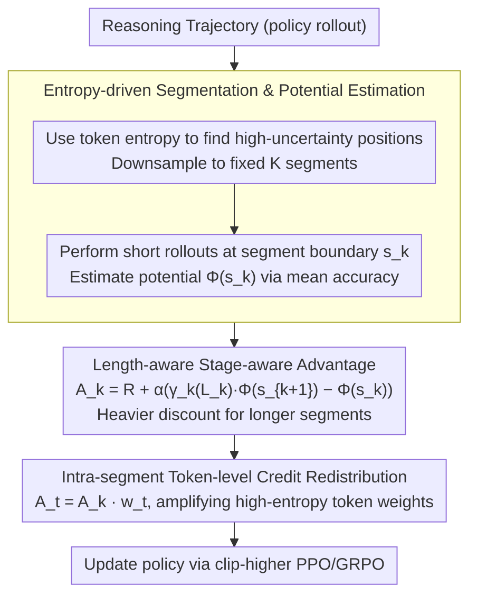

# SHAPE: Stage-aware Hierarchical Advantage via Potential Estimation for LLM Reasoning

**Conference**: ACL2026  
**arXiv**: [2604.06636](https://arxiv.org/abs/2604.06636)  
**Code**: Not disclosed  
**Area**: LLM Evaluation / LLM Reasoning  
**Keywords**: Process Supervision, Potential Estimation, Credit Assignment, Mathematical Reasoning, Token Efficiency

## TL;DR
SHAPE conceptualizes LLM reasoning as trajectories within a "solvability potential" state space. It utilizes length-aware stage-level advantages and entropy-driven token-level redistribution to simultaneously enhance mathematical reasoning accuracy and reduce generated tokens by approximately 30%.

## Background & Motivation
**Background**: Post-training for mathematical reasoning LLMs primarily relies on RLVR. Typical algorithms like GRPO provide rewards based solely on the correctness of the final answer. Due to the sparsity of outcome rewards, models may suffer from inefficient exploration, overthinking, repetitive long-chain reasoning, or achieving correct answers through mere luck during training.

**Limitations of Prior Work**: Process supervision provides denser feedback, but learning-based PRMs require additional annotation or model training and are susceptible to reward hacking. Rule-based process rewards like MRT estimate the solvability of intermediate states via rollouts to avoid training a reward model. However, three issues remain: they do not explicitly reward local potential improvement, which may encourage "sandbagging" (deteriorating paths to later "save" them); they lack length penalties and fail to distinguish concise breakthroughs from redundant detours; and they broadcast the same segment-level advantage to all tokens, failing to highlight critical decision points.

**Key Challenge**: A good reasoning chain should progressively approach the answer, achieve genuine breakthroughs during difficult stages, and avoid meaningless verbosity. Existing rewards either focus only on final correctness or coarse-grained processes, making it difficult to simultaneously characterize progress, stage difficulty, and efficiency.

**Goal**: The authors aim to design a hierarchical credit assignment mechanism that requires no additional PRM training and can be embedded into RL post-training. This mechanism encourages effective breakthroughs in low-potential states and imposes pressure on redundant tokens in high-potential states.

**Key Insight**: The paper uses Reasoning Potential $\Phi$ to represent the empirical solvability of a specific intermediate reasoning state. Low $\Phi$ indicates a confused path, while high $\Phi$ indicates proximity to the answer. The key is to reward the effective rise from $\Phi(s_k)$ to $\Phi(s_{k+1})$ rather than just final success.

**Core Idea**: Transforming Potential-Based Reward Shaping into a length-aware segment-level advantage function, with local credit redistribution using token entropy within segments. This ensures the reward possesses stage awareness, progress constraints, and efficiency preferences.

## Method

### Overall Architecture
The SHAPE pipeline consists of three steps. First, the reasoning trajectory generated by the model is partitioned into semantic segments, and the solvability potential of the current state is estimated at each segment boundary. Second, a stage-aware segment-level advantage is calculated between adjacent segments, using a dynamic discount factor to reward potential improvement and penalize redundant segments. Third, credit is redistributed within each segment based on token entropy, ensuring stronger supervision for high-uncertainty tokens that likely represent key reasoning pivots.

Compared to MRT, the core difference of SHAPE is the explicit comparison between adjacent states $\Phi(s_k)$ and $\Phi(s_{k+1})$. If a segment causes a drop in potential, it is penalized; if a segment is long but offers minimal improvement, it is suppressed by the discount term. This makes the reward more resistant to "long-winded recovery" strategies.

### Key Designs
**1. Entropy-driven Segmentation and Potential Estimation: Partitioning at logical pivots instead of format boundaries**

Using rigid delimiters like newlines often cuts at formatting boundaries rather than logical ones, leading to noisier potential estimates. SHAPE adapts the adaptive cutpoint partition from SPO but uses token-level entropy instead of low-probability tokens to locate high-uncertainty positions. Positions exceeding a threshold are used as candidate cutpoints and downsampled to a fixed number of segments $K$. At each boundary state $s_k$, the model executes several short rollouts to estimate the solvability potential $\Phi(s_k)$ via the mean accuracy. To control costs, vLLM prefix caching and restricted rollout lengths are employed. Segments partitioned this way align closer to where the model is "unsure and needs to make critical choices," as key transitions in mathematical reasoning often occur at points of uncertainty.

**2. Length-aware Stage-aware Advantage: Rewarding progress and penalizing verbosity in a single formula**

Rule-based process rewards like MRT have three flaws: they don't explicitly reward local potential gains, they lack length penalties, and they broadcast segment advantages uniformly. SHAPE addresses this using a segment-level advantage $A_k = R_{outcome} + \alpha(\gamma_k(L_k)\Phi(s_{k+1}) - \Phi(s_k))$, where the discount factor $\gamma_k(L_k)$ decreases linearly with segment length $L_k$ to a minimum $\gamma_{min}$. Expanding the shaping term reveals it is approximately the potential gain $\Delta_k$ minus a "reasoning tax" $(1-\gamma_k)\Phi(s_k)$. Longer segments incur a higher tax, and higher current potential makes verbosity more costly. This encodes two intuitions: breakthroughs in low-potential states are harder and more valuable; redundant refinement in high-potential states is often overthinking and should be suppressed. This potential-coupled tax is more stable than blunt length penalties because necessary long reasoning can still be justified by sufficient potential gains.

**3. Intra-segment Token-level Credit Redistribution: Not all tokens in a segment are equal**

Segment-level advantages treat all tokens identically, but reasoning directions are often changed by a few high-uncertainty tokens. SHAPE applies z-score normalization to token entropy within each segment to obtain local importance weights $w_t = clip(1 + \beta \tilde{H}(x_t), \delta_{min}, \delta_{max})$. The final token-level advantage is $A_t = A_k \cdot w_t$. Tokens with average entropy retain the segment advantage, while high-entropy tokens are amplified. Using the segment-level reward as a stable anchor for local redistribution results in lower variance than global outcome-based token shaping, highlighting decision points without over-destabilizing the signal.

### Loss & Training
The experiment is implemented based on the VeRL framework, using a clip-higher PPO/GRPO variant with $\epsilon_{high}=0.28$, $\epsilon_{low}=0.2$, and a KL coefficient of 0. The global batch size is 128, the mini-batch size is 32, and the learning rate is $1 \times 10^{-6}$ for 360 steps. For the 1.5B model, the maximum response length is 8,192 tokens with $K=8$; for Qwen3-4B, it is 16,384 tokens with $K=16$. The default process reward coefficient $\alpha=0.3$, and the discount lower bound $\gamma_{min}=0.9$.

## Key Experimental Results

### Main Results
Experiments were conducted on DeepSeek-R1-Distill-Qwen-1.5B, DeepScaleR-1.5B-Preview, and Qwen3-4B backbones using the rStar2A training set. Evaluation covered AIME 2024/2025, AMC 2023, MATH500, and MinervaMATH. The table below summarizes the average accuracy and generated tokens across datasets.

| Backbone | Method | Overall Acc | Avg Tokens | Change vs GRPO |
|----------|------|-------------|------------|----------------|
| DS-R1-Distill-Qwen-1.5B | GRPO | 52.1 | 6111 | Baseline |
| DS-R1-Distill-Qwen-1.5B | MRT | 51.9 | 4632 | Tokens down, Acc drops |
| DS-R1-Distill-Qwen-1.5B | SHAPE | 54.7 | 4165 | +2.6 Acc, -31.8% tokens |
| DeepScaleR-1.5B | GRPO | 55.6 | 5416 | Baseline |
| DeepScaleR-1.5B | MRT | 57.1 | 4238 | Improved |
| DeepScaleR-1.5B | SHAPE | 59.4 | 3765 | +3.8 Acc, -30.5% tokens |
| Qwen3-4B | GRPO | 74.4 | 9650 | Baseline |
| Qwen3-4B | MRT | 74.2 | 8295 | Tokens down, Acc drops |
| Qwen3-4B | SHAPE | 77.5 | 7404 | +3.1 Acc, -23.3% tokens |

SHAPE established a superior accuracy-token Pareto frontier across all three backbones, yielding an average accuracy increase of ~3% and a token reduction of ~30%.

### Ablation Study
The following table summarizes core ablations on AIME 2024/2025 using DeepSeek-R1-Distill-Qwen-1.5B.

| Configuration | AIME24 Acc | AIME24 Tokens | AIME25 Acc | AIME25 Tokens | Note |
|------|------------|---------------|------------|---------------|------|
| GRPO | 34.7 | 8772 | 27.5 | 8109 | Outcome-only RL |
| SHAPE | 37.1 | 6164 | 31.8 | 5425 | Full method |
| w/o EBS | 36.8 | 6380 | 31.6 | 5590 | No entropy segmentation |
| w/o TCR | 36.2 | 6080 | 29.8 | 5250 | No token redistribution |
| Fixed $\gamma_k=0.9$ | 36.5 | 6955 | 32.5 | 6610 | Static discount fails length control |
| $\gamma_{min}=0.95$ | 37.6 | 6340 | 30.7 | 5769 | Weak penalty, more tokens |
| $\gamma_{min}=0.8$ | 36.3 | 5720 | 30.9 | 5010 | Shorter but accuracy drops |
| $\gamma_{min}=0.7$ | 30.8 | 4580 | 26.2 | 3920 | Strong penalty causes truncation |

| OOD Benchmark | Backbone | GRPO | MRT | SHAPE | Conclusion |
|---------------|----------|------|-----|-------|------|
| GPQA Diamond | DS-Qwen-1.5B | 36.6 | 35.9 | 38.4 | No harm to science QA |
| LiveCodeBench | DS-Qwen-1.5B | 19.1 | 18.4 | 22.3 | Positive transfer to code |
| GPQA Diamond | Qwen3-4B | 52.8 | 52.5 | 54.4 | Gains preserved at 4B |
| LiveCodeBench | Qwen3-4B | 54.4 | 54.1 | 56.7 | Transferable efficiency bias |

### Key Findings
- Potential gains are more valuable in low-potential states. Regression analysis shows a slope of ~0.65 for the "Low Start" group vs ~0.55 for "High Start," suggesting that saving a path from a poor state has a higher marginal benefit for success.
- SHAPE shifts the model's learning focus. The contribution of potential gains from Low Start states increased from 40.6% (MRT) to 44.4%, while easy gains from high-potential states were suppressed.
- MRT's potential drop rate exhibits spikes in late training, supporting concerns about sandbagging risks. SHAPE's drop rate is more stable, indicating that adjacent state difference constraints inhibit regressive steps.
- A cost-benefit balance exists for segment counts. Accuracy gains saturate at $K=8$; training overhead is ~1.17x compared to $K=1$, but it yields ~30% token savings during long-term inference.

## Highlights & Insights
- SHAPE integrates "thinking less" and "thinking correctly" into a single reward formula rather than using separate penalties. This is more stable than blunt length penalties, as necessary long reasoning can survive through sufficient potential gains.
- The critique of MRT is insightful: if rewards are only given for recovery from low potential, models might learn to manufacture those low-potential states. This issue is often overlooked in process reward design.
- Token entropy serves dual roles: defining segment boundaries and aiding credit redistribution. While not a task label, it effectively flags critical decision points.
- From a deployment perspective, trading higher rollout costs during training for sustained token reduction during inference is a highly practical cost-shifting strategy.

## Limitations & Future Work
- Current experiments are limited to mathematical reasoning where correctness is objective and potential $\Phi$ can be estimated via rollout accuracy. Defining quality for intermediate states in open-ended writing or dialogue is harder.
- Potential estimation still requires additional rollouts. Despite prefix caching, training overhead is non-negligible.
- Dynamic discounts and segment counts involve manual hyperparameters that may require tuning for different model scales or tasks.
- The analysis primarily focuses on token count and accuracy, lacking deep exploration into answer readability, proof rigor, or specific error type shifts.

## Related Work & Insights
- **vs GRPO**: GRPO only considers final correctness, offering low overhead but sparse rewards. SHAPE adds process potential to GRPO to provide denser signals.
- **vs MRT**: MRT constructs a progress reward from current potential and the final outcome. SHAPE uses adjacent potential differences and length discounts to reduce incentives for detours and regression.
- **vs PRM**: PRMs require manual or model-labeled process scores. SHAPE uses rule-based rollouts to estimate potential without training an auxiliary reward model.
- **vs Length Penalty**: standard length penalties often penalize necessary reasoning. SHAPE's tax is coupled with current potential and segment length, acting as a "redundancy penalty in high-confidence states."

## Rating
- Novelty: ⭐⭐⭐⭐⭐ Beautifully unifies stage awareness and token efficiency via length-aware PBRS.
- Experimental Thoroughness: ⭐⭐⭐⭐ Solid results across three backbones and five math benchmarks, though open-ended tasks are not verified.
- Writing Quality: ⭐⭐⭐⭐ Complete motivation, theory, and analysis, though some notation may be difficult for non-RL readers.
- Value: ⭐⭐⭐⭐⭐ Directly valuable for post-training reasoning models, process rewards, and inference cost reduction.

<!-- RELATED:START -->

## Related Papers

- [\[ICLR 2026\] Quantile Advantage Estimation: Stabilizing RLVR for LLM Reasoning](../../ICLR2026/llm_reasoning/quantile_advantage_estimation_stabilizing_rlvr_for_llm_reasoning.md)
- [\[ICLR 2026\] Conditional Advantage Estimation for Reinforcement Learning in Large Reasoning Models](../../ICLR2026/llm_reasoning/conditional_advantage_estimation_for_reinforcement_learning_in_large_reasoning_m.md)
- [\[ACL 2026\] Stabilizing Efficient Reasoning with Step-Level Advantage Selection](stabilizing_efficient_reasoning_with_step-level_advantage_selection.md)
- [\[ACL 2026\] Reliability-Aware Adaptive Self-Consistency for Efficient Sampling in LLM Reasoning](reliability-aware_adaptive_self-consistency_for_efficient_sampling_in_llm_reason.md)
- [\[NeurIPS 2025\] KTAE: A Model-Free Algorithm to Key-Tokens Advantage Estimation in Mathematical Reasoning](../../NeurIPS2025/llm_reasoning/ktae_a_model-free_algorithm_to_key-tokens_advantage_estimation_in_mathematical_r.md)

<!-- RELATED:END -->
