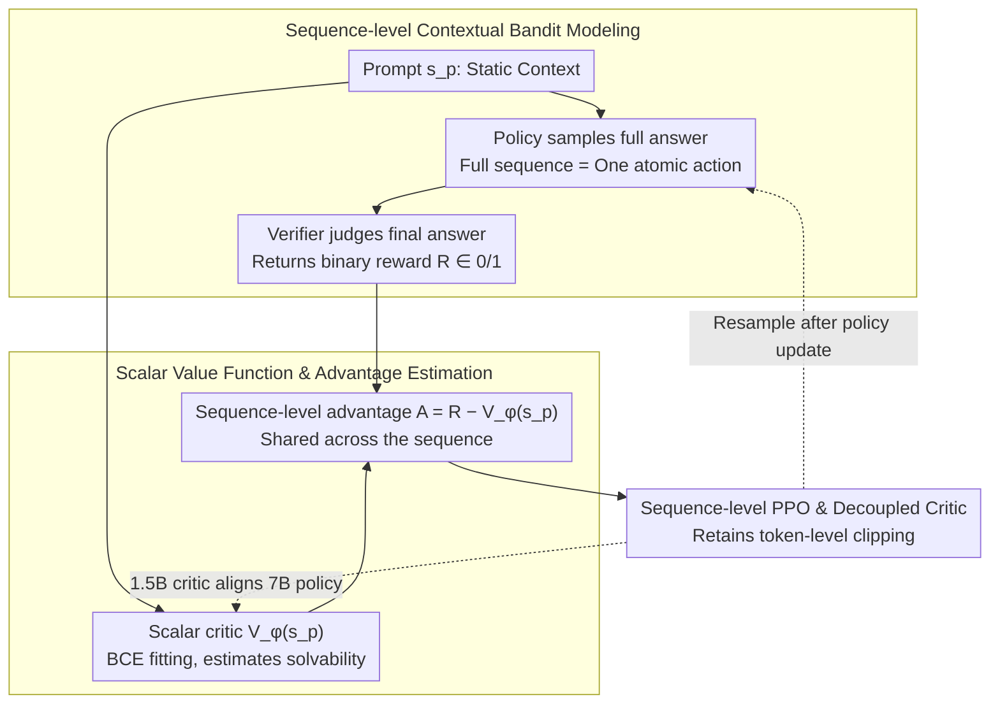

# SPPO: Sequence-Level PPO for Long-Horizon Reasoning Tasks

**Conference**: ACL 2026  
**arXiv**: [2604.08865](https://arxiv.org/abs/2604.08865)  
**Code**: https://github.com/sustech-nlp/SPPO  
**Area**: LLM Reasoning / Reinforcement Learning / RLVR  
**Keywords**: Sequence-Level PPO, Long-Horizon Reasoning, RLVR, Scalar Value Function, Contextual Bandit

## TL;DR
SPPO reformulates RLVR in long-chain CoT reasoning from a token-level MDP into a sequence-level contextual bandit. By utilizing a scalar critic that only observes the prompt to estimate problem solvability, SPPO achieves stability and performance comparable to or exceeding GRPO using single-sample PPO. This approach yields approximately 5.9x training acceleration and lower GPU memory consumption.

## Background & Motivation
**Background**: Tasks such as mathematical reasoning, code generation, and verifiable QA commonly employ RLVR to enhance LLMs, where rewards are typically based on the correctness of the final answer. Standard PPO utilizes token-level critics and GAE to propagate final rewards back through long CoT sequences token-by-token. Conversely, GRPO removes the critic and estimates a baseline through the relative performance of multiple samples for the same prompt.

**Limitations of Prior Work**: Standard PPO is unstable in the presence of long-chain sparse rewards, as the critic often only perceives answer cues at the end of the sequence, causing advantage signals to vanish or become misaligned during the actual reasoning process. Although GRPO circumvents the token-level critic, it requires sampling multiple responses per prompt to estimate a group baseline, which limits training throughput.

**Key Challenge**: The reward for long-chain reasoning is global—whether the entire reasoning path is successful—yet token-level PPO forces this into a per-step credit assignment. Meanwhile, group-based methods treat the sequence as a whole but trade efficiency for stability through high-cost multi-sampling.

**Goal**: The authors aim to retain the single-sample efficiency of PPO while achieving the stability of "sequence-level updates" characteristic of GRPO, particularly for verifiable mathematical reasoning tasks like AIME, AMC, MATH500, and Minerva Math.

**Key Insight**: The paper reinterprets the success of GRPO: the key is not the absence of a critic, but rather the implicit treatment of the reasoning process as a sequence-level contextual bandit, where the prompt is the context, the entire response is an action, and the final reward is the action return.

**Core Idea**: Explicitly adopt a sequence-level bandit perspective. Use a scalar value model to estimate the success probability of a prompt, and then use $A=R-V_\phi(s_p)$ as a shared advantage signal for the entire response sequence back into PPO.

## Method
The core of SPPO is not merely a change in the loss function name, but a shift in the semantics of the value function. While a standard PPO critic attempts to answer "how much future reward can be obtained given the current t-th token," the SPPO critic answers "what is the probability that the current policy can solve this prompt." This task is closer to problem difficulty estimation and is significantly simpler than token-by-token state valuation.

### Overall Architecture
Given a prompt $s_p$, the policy samples a complete response sequence $a_{seq}=(y_1,\dots,y_T)$, and an external verifier returns a binary reward $R \in \{0,1\}$. The value model $V_\phi(s_p)$ outputs a prompt-level success probability. SPPO constructs a sequence-level advantage using $R-V_\phi(s_p)$ and assigns this same advantage to all tokens in the sequence within the PPO clipped objective.

### Key Designs

**1. From token-level MDP to sequence-level contextual bandit: Compressing the horizon to 1 to align modeling granularity with reward granularity**

The pain point of long CoT is reward sparsity—the verifier only provides a 0/1 signal at the end of the sequence. Token-level PPO attempts to spread this terminal signal across thousands of tokens, resulting in advantage signals filled with temporal credit assignment noise. SPPO abandons step-by-step modeling: it treats the prompt $s_p$ as a static context and the entire response $a_{seq}=(y_1,\dots,y_T)$ as an atomic action. The reward $R$ evaluates the overall correctness of this action. This conceptually compresses the horizon to 1, reducing the problem from an MDP to a contextual bandit. This is effective because mathematical verifiers only judge the final answer; aligning the modeling granularity with the true reward granularity eliminates positional bias introduced by "forced intermediate token valuation."

**2. Scalar value function and advantage estimation: Using a prompt-only critic to estimate solvability as a multi-sampling baseline replacement**

Since the action is the entire sequence, the baseline only needs to estimate a scalar for the prompt. The SPPO value model $V_\phi(s_p)$ fits the binary outcome using BCE, with the objective $L_V=-E[R\log V_\phi(s_p)+(1-R)\log(1-V_\phi(s_p))]$. The output represents the probability the current policy will solve the prompt (i.e., problem solvability). The policy advantage is $A(s_p,a)=R-V_\phi(s_p)$: correctly solving a difficult problem yields a strong positive advantage, while failing an easy problem yields a strong negative advantage. This replaces the costly requirement in GRPO to sample $N$ responses per prompt to estimate a group baseline—a calibrated scalar critic approximates the same "problem difficulty" information.

**3. Sequence-level PPO and decoupled critic: Retaining PPO clipping while sharing advantage across the sequence with a smaller critic**

While the modeling changes, the implementation remains stable: the clipped probability ratio is still calculated per token, preserving PPO's mature clipping stability. The difference is that the advantage $A(s_p,a)$ no longer varies by token but is shared. This avoids the "tail effect" typical of token-level GAE under sparse rewards (where signals are clear at the end but blurred at the beginning). Furthermore, the authors verify that a decoupled configuration—using a 1.5B critic to align a 7B policy—remains effective. Since the critic's task is merely "estimating problem difficulty," which is simpler than "generating reasoning chains," the actor and critic do not need to be the same size, reducing memory pressure.

### Loss & Training
Experiments used DeepSeek-R1-Distill-Qwen-1.5B and 7B, fine-tuned on DeepScaleR and DAPO-17K respectively. Rewards are based on the correctness of the boxed answer (1 for correct, 0 for incorrect). The actor learning rate is 1e-6, the critic learning rate is 5e-6, and PPO parameters $\gamma=1, \lambda=1$ are used to match sparse terminal rewards. 1.5B experiments used 4×A100, while 7B used 4×H100.

## Key Experimental Results

### Main Results

| Model Size | Method | AIME24 | AIME25 | AMC23 | MATH500 | Minerva | Avg |
|--------|------|------|------|------|------|------|------|
| 1.5B | Base | 27.50 | 21.67 | 71.56 | 83.73 | 20.35 | 44.96 |
| 1.5B | PPO | 27.50 | 20.83 | 70.63 | 81.38 | 19.89 | 44.06 |
| 1.5B | GRPO N=8 | 30.00 | 26.25 | 73.13 | 83.88 | 22.15 | 47.08 |
| 1.5B | SPPO | 34.17 | 25.83 | 74.38 | 83.78 | 22.15 | 48.06 |
| 7B | PPO | 45.20 | 35.42 | 85.31 | 88.48 | 27.80 | 56.44 |
| 7B | GRPO N=8 | 47.08 | 35.00 | 86.25 | 90.15 | 28.74 | 57.44 |
| 7B | SPPO | 50.83 | 35.00 | 86.25 | 90.13 | 28.35 | 58.11 |
| 7B | SPPO + 1.5B critic | 52.29 | 34.58 | 87.19 | 89.88 | 28.86 | 58.56 |

### Ablation Study

| Analysis Item | Key Metric | Description |
|------|------|------|
| PPO + BCE | Performance collapse around 500 steps | Adding BCE loss to token-level PPO does not replicate SPPO, indicating gains come from the sequence-level bandit formulation. |
| Training Efficiency | ~22 hours for 7B to reach Avg ~58 | Single-sample updates converge faster than multi-sampling baselines like GRPO / RLOO. |
| Value Calibration | Pearson 0.642, Spearman 0.664 | Prompt-level critic distinguishes problem difficulty; though conservative, it serves as an effective baseline. |
| Memory Efficiency | Decoupled critic reduces memory by ~12.8% | 1.5B critic aligned with 7B policy still achieves the highest average score. |

### Key Findings
- SPPO outperforms the average score of GRPO at both 1.5B and 7B scales while requiring only single-sample updates, suggesting that "sequence-level advantage" is a more fundamental source of stability than "multi-sample normalization."
- A smaller critic did not hinder the 7B policy; instead, it achieved the highest average of 58.56, supporting the hypothesis that prompt solvability estimation is simpler than generative reasoning.
- SPPO also demonstrates greater stability than standard PPO in sparse binary control tasks (Precision CartPole, MountainCar, etc.), indicating the conclusions are not merely due to specific engineering optimizations in `verl`.

## Highlights & Insights
- The most valuable contribution is the re-interpretation of GRPO: its success may stem from "treating the response as a holistic action" rather than "having no critic." This perspective bridges the pros and cons of PPO and GRPO.
- SPPO does not completely discard PPO but adjusts the advantage granularity to the sequence level, making it easier to integrate into existing RLHF/RLVR frameworks.
- The small critic result is illuminating: LLM RL does not strictly require the actor and critic to be of the same scale. If the critic's task is to estimate problem difficulty, a smaller model can suffice, lowering the barrier to training.

## Limitations & Future Work
- SPPO relies on verifiable outcomes to train the value model, making it naturally suited for math, code, and rule-based tasks. It is not directly transferable to open-ended writing or dialogue quality where objective verifiers are absent.
- Sequence-level advantages reinforce or penalize the entire reasoning chain, still failing to distinguish which specific steps within a sequence contributed to the correct answer.
- The calibration quality of the value model is critical. While the paper shows good correlation, the distribution is conservative; future work could explore stronger calibration or uncertainty estimation.
- Experiments focused on the DeepSeek-R1-Distill-Qwen series and math tasks; further validation is needed across more model families, code tasks, and multi-turn agent scenarios.

## Related Work & Insights
- **vs Standard PPO**: Standard PPO uses token-level values and GAE for long-range credit assignment. SPPO uses prompt-level scalar values to avoid the tail effect and improve stability.
- **vs GRPO**: GRPO constructs a group baseline via N=8 sampling. SPPO replaces this with a learned critic, enabling higher throughput.
- **vs ReMax / RLOO**: These sequence-level REINFORCE variants also focus on whole-sequence rewards, but SPPO retains PPO clipping and uses a value baseline to reduce variance.
- **vs DAPO / Dr.GRPO**: These methods often patch sampling and gradient dynamics via group-relative metrics. SPPO focuses on the underlying modeling granularity: rewriting the reasoning environment as a sequence-level bandit.

## Rating
- Novelty: ⭐⭐⭐⭐☆ Not just parameter tuning, but a clear reconstruction of RLVR credit assignment granularity.
- Experimental Thoroughness: ⭐⭐⭐⭐☆ Covers math benchmarks, efficiency, value calibration, and control tasks; open-ended tasks are still missing.
- Writing Quality: ⭐⭐⭐⭐☆ Problem definition, intuition, and empirical evidence are clear; formulas and diagrams support each other well.
- Value: ⭐⭐⭐⭐⭐ Highly practical for teams aiming to reduce the training cost of reasoning models using RLVR.

<!-- RELATED:START -->

## Related Papers

- [\[ACL 2026\] FS-Researcher: Test-Time Scaling for Long-Horizon Research Tasks with File-System-Based Agents](fs-researcher_test-time_scaling_for_long-horizon_research_tasks_with_file-system.md)
- [\[ACL 2026\] Evo-Attacker: Memory-Augmented Reinforcement Learning for Long-Horizon Tool Attacks on LLM-MAS](evo-attacker_memory-augmented_reinforcement_learning_for_long-horizon_tool_attac.md)
- [\[ICML 2026\] ToolMATH: A Math Tool Benchmark for Realistic Long-Horizon Multi-Tool Reasoning](../../ICML2026/llm_reasoning/toolmath_a_math_tool_benchmark_for_realistic_long-horizon_multi-tool_reasoning.md)
- [\[ACL 2026\] Long-Context Reasoning Through Proxy-Based Chain-of-Thought Tuning](long-context_reasoning_through_proxy-based_chain-of-thought_tuning.md)
- [\[ICLR 2026\] Segment-Level Attribution for Selective Learning of Long Reasoning Traces](../../ICLR2026/llm_reasoning/segment-level_attribution_for_selective_learning_of_long_reasoning_traces.md)

<!-- RELATED:END -->
