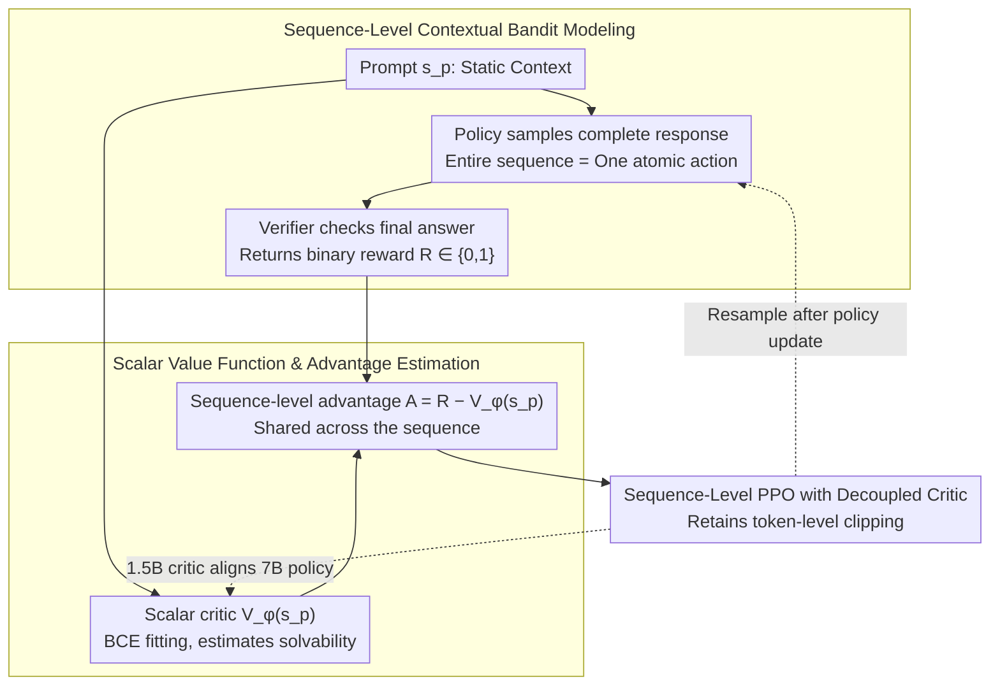

# SPPO: Sequence-Level PPO for Long-Horizon Reasoning Tasks

**Conference**: ACL 2026  
**arXiv**: [2604.08865](https://arxiv.org/abs/2604.08865)  
**Code**: https://github.com/sustech-nlp/SPPO  
**Area**: LLM Reasoning / Reinforcement Learning / RLVR  
**Keywords**: Sequence-Level PPO, Long-Horizon Reasoning, RLVR, Scalar Value Function, Contextual Bandit

## TL;DR
SPPO reformulates RLVR in long-chain CoT reasoning from element-wise token-level MDP to sequence-level contextual bandit. By using a scalar critic that observes only the prompt to estimate task solvability, it achieves stability and performance comparable to or exceeding GRPO using single-sample PPO, while providing approximately 5.9x training acceleration and lower memory consumption.

## Background & Motivation
**Background**: Tasks such as mathematical reasoning, code generation, and verifiable QA commonly use RLVR to enhance large models, where rewards typically reflect whether the final answer is correct. Standard PPO utilizes a token-level critic and GAE to propagate final rewards token-by-token along long CoTs; GRPO removes the critic and estimates the baseline through the relative performance of multiple samples under the same prompt.

**Limitations of Prior Work**: Standard PPO is unstable under long-chain sparse rewards, as the critic often observes answer cues only at the end of the sequence, causing advantage signals to disappear or misalign during the actual reasoning steps. Although GRPO bypasses the token-level critic, it requires sampling multiple responses per prompt to estimate the group baseline, which limits training throughput.

**Key Challenge**: The reward for long-chain reasoning is "whether the entire reasoning process succeeded," yet token-level PPO forces this into per-step credit assignment. Conversely, group-based methods treat the sequence as a whole but exchange stability for high-cost multi-sampling.

**Goal**: The authors aim to retain the single-sample efficiency of PPO while achieving the stability of "sequence-level updates" seen in GRPO, particularly for verifiable mathematical reasoning tasks such as AIME, AMC, MATH500, and Minerva Math.

**Key Insight**: The paper reinterprets the success of GRPO: the key is not the "absence of a critic," but rather that it implicitly treats the reasoning process as a sequence-level contextual bandit, where the prompt is the context, the entire response is an action, and the final reward is the action return.

**Core Idea**: Explicitly adopt a sequence-level bandit perspective. Use a scalar value model to estimate the success probability of a prompt, and then feed $A=R-V_\phi(s_p)$ back to PPO as a shared advantage signal for the entire response.

## Method
The core of SPPO is not simply changing a loss name, but altering the semantics of the value function. A standard PPO critic attempts to answer "what is the future return given the current $t$-th token," whereas the SPPO critic answers "how likely is the current policy to solve this prompt." This task is closer to task difficulty estimation and is significantly simpler than token-by-token reasoning state valuation.

### Overall Architecture
Given a prompt $s_p$, the policy samples a complete response sequence $a_{seq}=(y_1,\dots,y_T)$, and an external verifier returns a binary reward $R\in\{0,1\}$. The value model $V_\phi(s_p)$ outputs a prompt-level success probability. SPPO constructs a sequence-level advantage using $R-V_\phi(s_p)$ and distributes this same advantage to all tokens in the sequence within the clipped PPO objective.

### Key Designs

**1. From token-level MDP to sequence-level contextual bandit: Compressing the horizon to 1 to align modeling granularity with reward granularity**

The pain point of long CoT is sparse rewards—the verifier gives a 0/1 only at the end, yet token-level PPO forces this terminal signal back across thousands of tokens. This results in advantages for intermediate steps filled with temporal credit assignment noise. SPPO abandons step-by-step modeling: treating the prompt $s_p$ as static context and the entire response $a_{seq}$ as an atomic action. The reward $R$ evaluates the action as a whole. The horizon is conceptually compressed to 1, and the problem reduces from an MDP to a contextual bandit. This is effective because mathematical verifiers only judge the final answer; once modeling granularity aligns with actual reward granularity, position bias introduced by "forced valuation of intermediate tokens" is eliminated.

**2. Scalar value function and advantage estimation: Using a prompt-only critic to estimate solvability as a substitute for multi-sample baselines**

Since the action is the entire sequence, the baseline only needs to estimate a scalar for the prompt. The SPPO value model $V_\phi(s_p)$ fits binary outcomes via BCE, with the objective $L_V=-E[R\log V_\phi(s_p)+(1-R)\log(1-V_\phi(s_p))]$. The output represents "the probability the current policy solves this prompt," i.e., task difficulty. The policy advantage is $A(s_p,a)=R-V_\phi(s_p)$: solving a difficult problem correctly yields a strong positive advantage, while failing a simple problem yields a strong negative advantage. This replaces the expensive requirement in GRPO to sample $N$ responses per prompt to estimate a group baseline—a calibrated scalar critic approximates the same "problem difficulty" information.

**3. Sequence-level PPO and decoupled critic: Retaining PPO clipping while sharing advantages across the sequence with smaller critics**

The modeling changes, but the implementation remains stable: the clipped probability ratio is still calculated per token, preserving PPO's stability. The difference is that the advantage $A(s_p,a)$ is uniform for all tokens in the sequence. This avoids the "tail effect" typical of token-level GAE under sparse rewards (where signals are clear only at the end). Furthermore, the authors verify that a decoupled configuration using a 1.5B critic to align with a 7B policy remains effective—since the critic's task is "estimating difficulty," which is simpler than "generating reasoning chains," the actor and critic do not need to be the same size, reducing memory pressure.

### Loss & Training
Experiments utilize DeepSeek-R1-Distill-Qwen-1.5B and 7B, fine-tuned on DeepScaleR and DAPO-17K respectively. Rewards are binary ($R=1$ if the boxed answer is correct, 0 otherwise). Actor learning rate is 1e-6, critic learning rate is 5e-6. In PPO, $\gamma=1, \lambda=1$ is set to match sparse terminal rewards. 1.5B experiments used 4×A100; 7B experiments used 4×H100.

## Key Experimental Results

### Main Results

| Model Size | Method | AIME24 | AIME25 | AMC23 | MATH500 | Minerva | Avg |
|--------|------|------|------|------|------|------|------|
| 1.5B | Base | 27.50 | 21.67 | 71.56 | 83.73 | 20.35 | 44.96 |
| 1.5B | PPO | 27.50 | 20.83 | 70.63 | 81.38 | 19.89 | 44.06 |
| 1.5B | GRPO N=8 | 30.00 | 26.25 | 73.13 | 83.88 | 22.15 | 47.08 |
| 1.5B | SPPO | 34.17 | 25.83 | 74.38 | 83.78 | 22.15 | 48.06 |
| 7B | PPO | 45.20 | 35.42 | 85.31 | 88.48 | 27.80 | 56.44 |
| 7B | GRPO N=8 | 47.08 | 35.00 | 86.25 | 90.15 | 28.74 | 57.44 |
| 7B | SPPO | 50.83 | 35.00 | 86.25 | 90.13 | 28.35 | 58.11 |
| 7B | SPPO + 1.5B critic | 52.29 | 34.58 | 87.19 | 89.88 | 28.86 | 58.56 |

### Ablation Study

| Analysis Item | Key Metric | Description |
|------|------|------|
| PPO + BCE | Performance collapse around 500 steps | Adding BCE loss to token-level PPO does not replicate SPPO, indicating gains come from the sequence-level bandit formulation. |
| Training Efficiency | 7B model reaches ~58 average in ~22 hours | Single-sample updates converge faster than multi-sample baselines like GRPO/RLOO. |
| Value Calibration | Pearson 0.642, Spearman 0.664 | Prompt-level critic distinguishes problem difficulty; though conservative, it serves as an effective baseline. |
| Memory Efficiency | Decoupled critic reduces VRAM by ~12.8% | Using a 1.5B critic with a 7B policy still achieved the highest average score. |

### Key Findings
- SPPO outperforms the average score of GRPO at both 1.5B and 7B scales while requiring only single-sample updates, suggesting "sequence-level advantage" is a more fundamental source of stability than "multi-sample normalization."
- Smaller critics do not hinder the 7B policy; instead, they achieved the highest Avg (58.56), supporting the hypothesis that prompt solvability estimation is simpler than generative reasoning.
- In sparse binary control tasks such as Precision CartPole, MountainCar, Hopper, LunarLander, and Pendulum, SPPO is more stable than standard PPO, indicating the conclusion is not merely an artifact of verl engineering optimizations.

## Highlights & Insights
- The most valuable contribution of this paper is the reinterpretation of GRPO: its success may not stem from "having no critic," but rather from "treating the response as a holistic action." This perspective bridges the advantages and disadvantages of PPO and GRPO.
- SPPO does not completely discard PPO; it modifies the advantage granularity to the sequence level, making it easier to integrate into existing RLHF/RLVR frameworks.
- The small critic results are enlightening: LLM RL does not necessarily require the actor and critic to be at the same scale. If the critic's task is estimating task difficulty, a smaller model can suffice, lowering training barriers.

## Limitations & Future Work
- SPPO relies on verifiable outcomes to train the value model, making it naturally suited for math, code, and logic tasks. Transferring this to open-ended writing or dialogue quality is not direct due to the lack of objective verifiers.
- Sequence-level advantages reinforce the entire successful reasoning chain and punish the entire failed chain, still failing to distinguish which specific steps within a sequence contributed to the correct answer.
- The calibration quality of the value model is critical. While correlation is good, the predicted distribution is conservative; future work could explore stronger calibration or uncertainty estimation.
- Experiments focused on the DeepSeek-R1-Distill-Qwen series and math tasks; further validation is needed for other model families, code tasks, and multi-turn agent scenarios.

## Related Work & Insights
- **vs Standard PPO**: Standard PPO uses token-level values and GAE for long-range credit assignment. SPPO uses prompt-level scalar values to avoid the tail effect, improving stability.
- **vs GRPO**: GRPO constructs a group baseline through N=8 multi-sampling. SPPO replaces the multi-sample baseline with a learned critic, achieving higher throughput.
- **vs ReMax / RLOO**: These sequence-level REINFORCE variants also focus on total sequence rewards, but SPPO retains PPO clipping and uses a value baseline to reduce variance.
- **vs DAPO / Dr.GRPO**: These methods often patch group-relative sampling and gradient dynamics. SPPO focuses on the underlying modeling granularity: rewriting the reasoning environment as a sequence-level bandit.

## Rating
- Novelty: ⭐⭐⭐⭐☆ Not simple hyperparameter tuning; provides a clear restructuring of credit assignment granularity in RLVR.
- Experimental Thoroughness: ⭐⭐⭐⭐☆ Covers math benchmarks, efficiency, value calibration, and control tasks; lacks experiments on open-ended tasks.
- Writing Quality: ⭐⭐⭐⭐☆ Clear problem definition, intuition, and empirical chain; formulas and diagrams support each other well.
- Value: ⭐⭐⭐⭐⭐ Highly practical for teams aiming to reduce RLVR training costs for reasoning models.

<!-- RELATED:START -->

## Related Papers

- [\[ACL 2026\] FS-Researcher: Test-Time Scaling for Long-Horizon Research Tasks with File-System-Based Agents](fs-researcher_test-time_scaling_for_long-horizon_research_tasks_with_file-system.md)
- [\[ICLR 2026\] Segment-Level Attribution for Selective Learning of Long Reasoning Traces](../../ICLR2026/llm_reasoning/segment-level_attribution_for_selective_learning_of_long_reasoning_traces.md)
- [\[ACL 2026\] Evo-Attacker: Memory-Augmented Reinforcement Learning for Long-Horizon Tool Attacks on LLM-MAS](evo-attacker_memory-augmented_reinforcement_learning_for_long-horizon_tool_attac.md)
- [\[ICLR 2026\] The Illusion of Diminishing Returns: Measuring Long Horizon Execution in LLMs](../../ICLR2026/llm_reasoning/the_illusion_of_diminishing_returns_measuring_long_horizon_execution_in_llms.md)
- [\[ICML 2026\] ToolMATH: A Math Tool Benchmark for Realistic Long-Horizon Multi-Tool Reasoning](../../ICML2026/llm_reasoning/toolmath_a_math_tool_benchmark_for_realistic_long-horizon_multi-tool_reasoning.md)

<!-- RELATED:END -->
