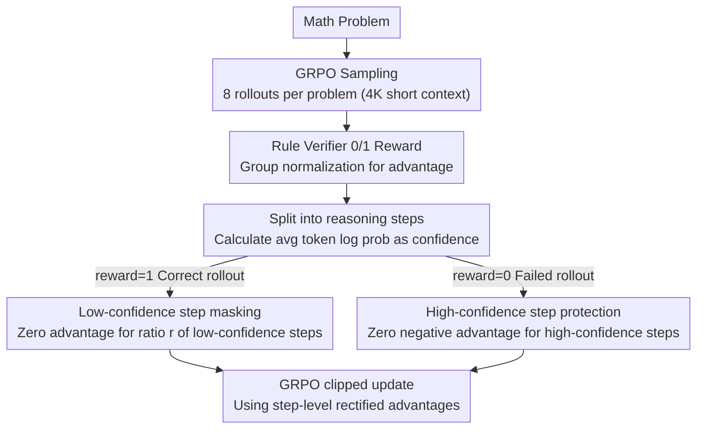

# Stabilizing Efficient Reasoning with Step-Level Advantage Selection

**Conference**: ACL2026 Findings  
**arXiv**: [2604.24003](https://arxiv.org/abs/2604.24003)  
**Code**: https://github.com/HanNight/SAS  
**Area**: Model Compression / Efficient LLM Inference  
**Keywords**: Reasoning Compression, GRPO, Credit Assignment, Short-context Training, step-level advantage

## TL;DR
This paper discovers that short-context GRPO inherently provides strong compression of reasoning length, but leads to training instability due to erroneous credit assignment of truncated samples. The authors propose Step-level Advantage Selection (SAS) to selectively zero out advantages at the reasoning step granularity, significantly reducing inference tokens while maintaining or even improving Pass@1.

## Background & Motivation
**Background**: Long-chain reasoning and test-time scaling have enhanced LLM performance in math, logic, and coding tasks, albeit at the cost of increasingly long reasoning trajectories, leading to significantly higher inference latency and costs. Recent efficient reasoning methods typically introduce length penalties, token budgets, or pruning mechanisms during RL post-training to encourage the model to be concise without losing accuracy.

**Limitations of Prior Work**: Many length control methods simultaneously employ an easily overlooked training condition: they transition reasoning models originally trained in 16K to 24K long contexts into 4K short contexts for post-training. Consequently, it has been unclear whether the reduction in output length stems from explicit length rewards or the short-context constraint itself.

**Key Challenge**: While short contexts indeed compress reasoning, they misclassify rollouts that are logically correct but truncated at the end as failures. In standard GRPO, all tokens of a failed rollout receive a negative advantage, while all tokens of a successful rollout receive a positive advantage. This simultaneously punishes useful intermediate reasoning and reinforces redundant steps in correct answers.

**Goal**: The authors aim to preserve the compression signals provided by short contexts while correcting the issue of coarse-grained rollout-level credit assignment. Specifically, the method must identify which reasoning steps are reliable and which are noisy, ensuring policy updates only derive from more trustworthy steps.

**Key Insight**: The paper treats reasoning trajectories as comprising discrete reasoning steps rather than inseparable strings. The model's own token log probabilities can serve as a proxy for step confidence, avoiding the need for an external process reward model.

**Core Idea**: Instead of explicit length rewards, the method performs selective zeroing of advantages at the step granularity. This prevents low-confidence steps in correct rollouts from being reinforced and protects high-confidence steps in failed rollouts from being penalized.

## Method

### Overall Architecture
The training of SAS is built upon GRPO: multiple rollouts are sampled for each math problem, 0/1 rewards are obtained via a rule-based verifier, and advantages are computed through group-relative normalization. The distinction is that SAS does not assign the same rollout-level advantage to every token. Instead, it first partitions the output into reasoning steps (using double newlines), sorts them based on the average token log probability of each step, and finally sets the advantage of certain steps to zero.

This "zeroing" operation has different semantics for correct and failed rollouts. For correct rollouts where the original advantage is positive, zeroing reduces the reinforcement of low-confidence steps. For failed rollouts where the original advantage is negative, it protects high-confidence steps from erroneous punishment. The method requires no changes to model architecture or the sampling process, needs no extra reward model, and involves only lightweight post-processing during training.

### Key Designs

**1. Decoupling short-context compression: Proving 4K post-training is a strong compression signal**

Many efficient reasoning methods attribute shorter outputs to their added length rewards, while quietly switching models from 16K–24K training to 4K short contexts. The authors designed a controlled experiment: starting from DeepScaleR-1.5B-Preview, they used standard GRPO with only correctness rewards under a 4K maximum context without any length penalty. Results showed that output length dropped rapidly in early training, becoming comparable to or shorter than specialized methods like LAPO or ThinkPrune. This observation is the premise for the subsequent design: without decoupling context length, it is impossible to determine if gains come from length rewards or context changes. It also explains why simple short-context training "seems effective" but suffers from late-stage accuracy fluctuations and entropy collapse.

**2. Masking low-confidence steps in correct rollouts: Avoiding the "correct answer = perfect steps" fallacy**

Short contexts compress length, but rollout-level positive feedback can solidify self-doubt, repetitive checks, or irrelevant detours within a correct answer, exacerbating over-reasoning. SAS partitions reward=1 rollouts into steps, calculates the average token log probability as confidence, and selects a ratio $r$ of the lowest-confidence steps to set their advantages to 0. Using internal log probability as confidence avoids training a process reward model (PRM) and correlates highly with external PRMs. Setting the advantage to 0 rather than a negative value means the model simply "stops reinforcing these low-quality steps" instead of punishing them.

**3. Protecting high-confidence steps in failed rollouts: Salvaging correct reasoning killed by truncation**

Conversely, the authors found that when 8K correct rollouts are truncated to 4K, approximately 29% are judged as failures by the verifier due to a missing final answer, even if the intermediate reasoning is correct. Standard GRPO would apply a negative signal to the entire trajectory, erroneously punishing these correct steps and causing instability. SAS applies a symmetric strategy: it identifies high-confidence steps in reward=0 rollouts and sets their negative advantages to 0, allowing only low-confidence or clearly erroneous steps to retain the negative signal. This distinguishes "false failures caused by truncation" from "truly incorrect reasoning" in credit assignment. This design leverages the sign structure of GRPO advantages to give the zeroing operation different semantic meanings: denoising for positive samples and protection for negative samples.

### Loss & Training
The training objective remains a PPO-style GRPO clipped surrogate, utilizing the token-level advantages modified by SAS. The main experiments use approximately 40K math problems from the DeepScaleR-Preview-Dataset. The base model is DeepScaleR-1.5B-Preview, with a fixed 4K training context, a learning rate of 1e-6, a batch size of 128, and 8 rollouts per prompt over 500 steps. The default selection ratio is $r=0.3$, and checkpoints are selected based on the Accuracy-Efficiency Score (AES) on the AIME24 validation set.

## Key Experimental Results

### Main Results
The main results for mathematical reasoning show that SAS simultaneously improves accuracy and compresses output length, outperforming baselines using explicit length rewards or pruning.

| Method | Avg Pass@1 | Avg Output Tokens | AES | Observation |
|------|-------------|----------------|-----|------|
| DeepScaleR | 52.37 | 5118 | 0.00 | Long-context base model, long outputs |
| GRPO-4K | 53.61 | 3775 | 0.33 | Short context compresses significantly, but is unstable |
| L1-Max | 51.97 | 2071 | 0.33 | Most aggressive compression, noticeable accuracy loss |
| LAPO-I | 53.68 | 4001 | 0.30 | Biased toward accuracy, limited compression |
| ThinkPrune-4k | 53.66 | 3878 | 0.33 | Pruning is effective, but trade-off is inferior to SAS |
| SAS | 54.54 | 3407 | 0.46 | Highest accuracy, shorter than strong baselines |

Across math datasets, SAS maintains or exceeds GRPO-4K performance on AIME2024, MATH, AMC, and OlympiadBench, reducing the average output from DeepScaleR's 5118 tokens to 3407 tokens.

| Dataset | DeepScaleR Pass@1 / Token | GRPO-4K Pass@1 / Token | SAS Pass@1 / Token |
|--------|----------------------------|--------------------------|--------------------|
| AIME2024 | 33.75 / 6755 | 38.75 / 5282 | 39.79 / 4876 |
| AIME2025 | 26.88 / 6444 | 25.42 / 4812 | 26.67 / 4295 |
| MATH | 86.36 / 2809 | 85.09 / 1976 | 86.58 / 1768 |
| AMC | 67.62 / 4761 | 70.18 / 3636 | 71.46 / 3090 |
| OlympiadBench | 47.23 / 4824 | 47.62 / 3651 | 48.19 / 3008 |

Generalization experiments further support the conclusions: on GPQA-Diamond, LSAT, and MMLU, SAS achieves an average Pass@1 of 38.30 with 2729 tokens, compared to DeepScaleR's 37.44 / 4416.

| Method | GPQA-Diamond | LSAT | MMLU | Avg Pass@1 | Avg Token | AES |
|------|--------------|------|------|-------------|------------|-----|
| DeepScaleR | 35.70 | 28.64 | 47.99 | 37.44 | 4416 | 0.00 |
| GRPO-4K | 32.48 | 28.45 | 48.73 | 36.55 | 2496 | 0.32 |
| L1-Max | 36.05 | 26.66 | 48.94 | 37.22 | 2242 | 0.46 |
| LAPO-I | 36.17 | 28.42 | 48.71 | 37.77 | 3331 | 0.27 |
| ThinkPrune-4k | 35.83 | 28.13 | 48.91 | 37.62 | 3127 | 0.31 |
| SAS | 37.18 | 28.32 | 49.39 | 38.30 | 2729 | 0.45 |

### Ablation Study
Ablations indicate that gains come from specifically processing correct and failed rollouts at the step level according to confidence, rather than mere advantage sparsification.

| Configuration | Avg Pass@1 | Avg Token | AES | Description |
|------|-------------|------------|-----|------|
| SAS full | 54.54 | 3407 | 0.46 | Complete method |
| Only Correct | 53.90 | near full | 0.43 | Stability drops without failure protection |
| Random Steps | Not given | longer | 0.38 | Random selection is much weaker than confidence sorting |
| Token Level | below full | longer | 0.39 | Token granularity is less stable than step granularity |
| Selection ratio 0.1 | 53.52 | 3259 | 0.43 | Strong compression, slightly lower accuracy than 0.3 |
| Selection ratio 0.3 | 54.54 | 3407 | 0.46 | Best default configuration |
| Selection ratio 0.9 | 53.06 | 3482 | 0.36 | Still better than base, showing robustness |

### Key Findings
- Short-context post-training itself is a powerful compression signal; shorter outputs should not be attributed solely to explicit length rewards.
- Verifier failures caused by truncation are a major source of training noise; ~29% of 8K correct rollouts are judged as failures when truncated to 4K.
- Step-level confidence correlates with the external Qwen2.5-Math-PRM-7B (nDCG@k reaches 0.9022), proving policy log probabilities are a low-cost proxy for step quality.
- SAS increases training time per step from 279.08s to 327.15s (approx. 17% overhead) but adds no extra forward/rollout passes or model memory.

## Highlights & Insights
- The most significant value of this paper is not the design of another length penalty, but the identification of "short-context training" as a hidden variable that compresses reasoning. This discovery changes how we interpret experimental gains in efficient reasoning literature.
- The zeroing operation in SAS is elegant. It takes on different semantics in positive vs. negative rollouts (denoising vs. protection), cleverly utilizing the sign structure of GRPO advantages.
- Using step-average log probability as confidence avoids the risks of PRM training and reward hacking, making it easier to integrate into existing RL pipelines.
- This approach is transferable to code generation, tool use, and long-form planning: as long as outputs can be segmented into semantic steps, rollout-level feedback can be decomposed into step-level credit assignment.

## Limitations & Future Work
- Experiments primarily focus on a single 1.5B model; it is unclear if the method is equally stable on larger models or different RL recipes.
- All main experiments use a fixed 4K short context; truncation ratios and optimal SAS selection ratios may vary as context length changes from 2K to 16K.
- Step segmentation relies on double newlines, which matches the DeepScaleR/Qwen data format but may not apply to all model families or output styles.
- Confidence is derived from the current policy; while it correlates with PRM rankings, it might underestimate rare but correct reasoning steps in out-of-distribution tasks.
- Future work could combine SAS with adaptive contexts, dynamic step segmentation, and task-level verifier confidence to reduce reliance on fixed hyperparameters.

## Related Work & Insights
- **vs L1 / LCPO**: L1 methods penalize length explicitly, achieving strong compression but often sacrificing accuracy; SAS corrects credit assignment under short contexts instead.
- **vs LAPO**: LAPO models the length distribution of successful solutions; SAS focuses on which steps within a trajectory should participate in updates. The two are complementary.
- **vs ThinkPrune**: ThinkPrune prunes redundant reasoning via progressive token limits; SAS reduces reinforcement of redundant steps at the signal level, which is a lighter mechanism.
- **vs entropy/confidence RL**: Related methods modify rewards using entropy or confidence; SAS leaves rewards unchanged and uses confidence to decide if the advantage should trigger an update, acting more like credit assignment correction.
- **Insight**: Efficient reasoning does not necessarily require "shortness" to be written into the reward function. The more fundamental issue may be determining which steps in a long output are worth learning and which are merely noise caused by the verifier or context constraints.

## Rating
- Novelty: ⭐⭐⭐⭐☆ Insights into short-context hidden variables and step-level credit assignment are more profound than standard length rewards.
- Experimental Thoroughness: ⭐⭐⭐⭐☆ Math, general reasoning, ablations, and confidence validation are comprehensive, though model scale coverage is limited.
- Writing Quality: ⭐⭐⭐⭐☆ Clear motivational chain; tables and analysis support claims well.
- Value: ⭐⭐⭐⭐⭐ Direct practical value for RL-based efficient reasoning and CoT compression; serves as a reminder to control for the short-context variable in future work.

<!-- RELATED:START -->

## Related Papers

- [\[ACL 2026\] On the Step Length Confounding in LLM Reasoning Data Selection](on_the_step_length_confounding_in_llm_reasoning_data_selection.md)
- [\[ACL 2026\] Step-GRPO: Internalizing Dynamic Early Exit for Efficient Reasoning](step-grpo_internalizing_dynamic_early_exit_for_efficient_reasoning.md)
- [\[ICLR 2026\] Stabilizing Policy Gradients for Sample-Efficient Reinforcement Learning in LLM Reasoning](../../ICLR2026/llm_reasoning/stabilizing_policy_gradients_for_sample-efficient_reinforcement_learning_in_llm_.md)
- [\[ACL 2026\] SHAPE: Stage-aware Hierarchical Advantage via Potential Estimation for LLM Reasoning](shape_stage-aware_hierarchical_advantage_via_potential_estimation_for_llm_reason.md)
- [\[ACL 2026\] Process Reward Models Meet Planning: Generating Precise and Scalable Datasets for Step-Level Rewards](process_reward_models_meet_planning_generating_precise_and_scalable_datasets_for.md)

<!-- RELATED:END -->
