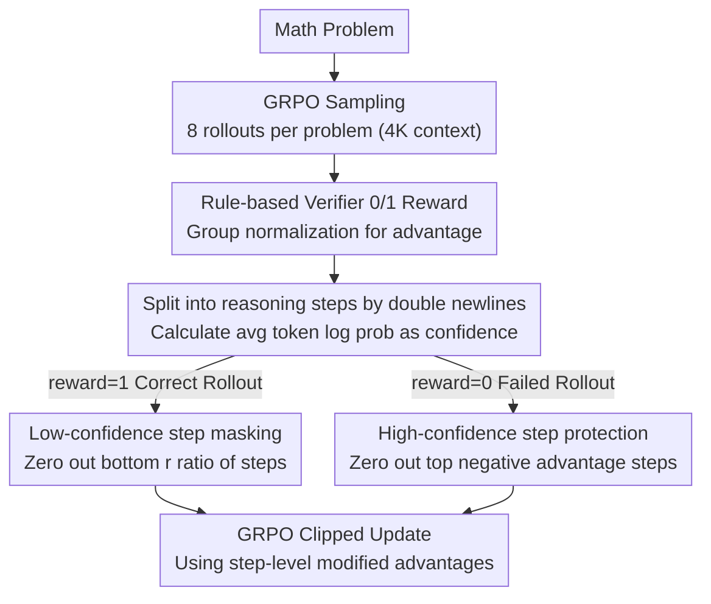

# Stabilizing Efficient Reasoning with Step-Level Advantage Selection

**Conference**: ACL2026 Findings  
**arXiv**: [2604.24003](https://arxiv.org/abs/2604.24003)  
**Code**: https://github.com/HanNight/SAS  
**Area**: Model Compression / LLM Efficient Inference  
**Keywords**: Reasoning Compression, GRPO, Credit Assignment, Short-context Training, step-level advantage

## TL;DR
This paper discovers that short-context GRPO inherently compresses reasoning length but suffers from training instability due to incorrect credit assignment of truncated samples. The authors propose Step-level Advantage Selection (SAS), which selectively zeroes out advantages at the granularity of reasoning steps to significantly reduce inference tokens while maintaining or even improving Pass@1.

## Background & Motivation
**Background**: Long-chain reasoning and test-time scaling enhance LLM performance in math, logic, and coding tasks at the cost of increasing reasoning trajectories, latency, and costs. Recent efficient inference methods typically incorporate length penalties, token budgets, or pruning mechanisms during RL post-training to encourage models to be concise without sacrificing accuracy.

**Limitations of Prior Work**: Many length-control methods simultaneously utilize a factor that is often overlooked: they move reasoning models originally trained on 16K to 24K long contexts into a 4K short context during post-training. Consequently, it has been unclear whether the reduction in output length stems from explicit length rewards or the short-context constraint itself.

**Key Challenge**: While short contexts indeed compress reasoning, they misclassify rollouts that are logically correct but truncated at the end as failures. In standard GRPO, all tokens of a failed rollout receive a negative advantage, while all tokens of a successful one receive a positive advantage. This simultaneously penalizes useful intermediate reasoning and reinforces redundant steps in correct answers.

**Goal**: The authors aim to retain the compression signal brought by short contexts while correcting the coarse rollout-level credit assignment. Specifically, the method needs to identify which reasoning steps are reliable and which are noisy, ensuring policy updates only originate from trustworthy steps.

**Key Insight**: The paper views reasoning trajectories as composed of discrete reasoning steps rather than inseparable strings. The model's own token log probabilities can serve as an approximation of step confidence, avoiding the introduction of an external process reward model (PRM).

**Core Idea**: Instead of using explicit length rewards, the method selectively zeroes out advantages at the step level. This prevents the reinforcement of low-confidence steps in correct rollouts and the penalization of high-confidence steps in failed rollouts.

## Method

### Overall Architecture
The training of SAS is still built on GRPO: multiple rollouts are sampled for each math problem, 0/1 rewards are obtained via a rule-based verifier, and advantages are computed through group-relative normalization. The difference is that SAS does not assign the same rollout advantage to all tokens. Instead, it splits the output into reasoning steps based on double newlines, ranks them by average token log probability, and modifies the advantages of certain steps to zero.

This "zeroing" operation has different semantics for correct and failed rollouts. For correct rollouts, where the original advantage is positive, zeroing lowers the reinforcement intensity of low-confidence steps. For failed rollouts, where the original advantage is negative, zeroing protects high-confidence steps from incorrect penalization. The method requires no changes to model architecture or sampling and avoids extra reward models, performing only lightweight post-processing during training.

### Key Designs

**1. Decoupling the short-context compression effect: Proving 4K post-training itself is a strong compression signal**

Many efficient reasoning methods attribute shortened outputs to their added length rewards while quietly switching models from 16K-24K context to 4K, leaving the contributions of each factor unexamined. The authors conducted a clean controlled experiment: starting from DeepScaleR-1.5B-Preview and using standard GRPO with only correctness rewards in a 4K context without length penalties. Results showed that output length dropped rapidly early in training, becoming comparable to or shorter than specialized methods like LAPO and ThinkPrune. This observation is the premise for the subsequent design: without decoupling context length, it is impossible to determine if gains come from length rewards or context changes; it also explains why simple short-context training "seems effective" yet suffers from late-stage accuracy fluctuations and entropy collapse.

**2. Masking low-confidence steps in correct rollouts: Don't mistake "getting it right" for "every step is worth learning"**

Short contexts compress length, but rollout-level positive feedback solidifies self-doubt, repeated checks, and irrelevant detours within correct answers, exacerbating over-reasoning. SAS splits reward=1 rollouts into steps, calculates the average token log probability as confidence, and selects a ratio $r$ of low-confidence steps to zero out their token advantages. Using the model's own log probability as confidence avoids training an additional PRM and correlates highly with external PRMs in experiments. Zeroing rather than assigning negative values means "no longer reinforcing these low-quality steps" rather than penalizing them.

**3. Protecting high-confidence steps in failed rollouts: Rescuing correct reasoning killed by truncation**

The flip side of short contexts is that when an 8K correct rollout is truncated to 4K, approximately 29% are judged as failures by the verifier due to missing final answers, even if the intermediate logic is correct. Standard GRPO penalizes the entire trajectory, mis-penalizing these correct steps and causing instability. SAS's counter-strategy is symmetric: for reward=0 rollouts, it also calculates step confidence but protects high-confidence steps by zeroing their negative advantages, leaving only low-confidence or clearly erroneous steps to be penalized. This distinguishes "false failures caused by truncation" from "truly incorrect reasoning" in credit assignment. The sign structure of GRPO advantages allows the zeroing operation to produce different semantics across samples: denoising for positive samples and protection for negative ones.

### Loss & Training
The training objective remains a PPO-style GRPO clipped surrogate, utilizing the token-level advantages modified by SAS. Main experiments use approximately 40K math problems from the DeepScaleR-Preview-Dataset with DeepScaleR-1.5B-Preview as the base model. Training context is fixed at 4K, learning rate at 1e-6, batch size at 128, with 8 rollouts per prompt over 500 steps. The default selection ratio is $r=0.3$, and checkpoints are selected based on the Accuracy-Efficiency Score (AES) on the AIME24 validation set.

## Key Experimental Results

### Main Results
The main results for mathematical reasoning show that SAS simultaneously improves accuracy and compresses output length, outperforming explicit length rewards or pruning baselines.

| Method | Avg Pass@1 | Avg Output Tokens | AES | Observation |
|------|-------------|----------------|-----|------|
| DeepScaleR | 52.37 | 5118 | 0.00 | Long-context base model, long outputs |
| GRPO-4K | 53.61 | 3775 | 0.33 | Short context compresses but lacks stability |
| L1-Max | 51.97 | 2071 | 0.33 | Most aggressive compression, significant accuracy loss |
| LAPO-I | 53.68 | 4001 | 0.30 | Biased toward accuracy, limited compression |
| ThinkPrune-4k | 53.66 | 3878 | 0.33 | Pruning is effective, but trade-off is inferior to SAS |
| SAS | 54.54 | 3407 | 0.46 | Highest accuracy, shorter than strong baselines |

Across mathematical datasets, SAS maintains or exceeds GRPO-4K performance on AIME2024, MATH, AMC, and OlympiadBench, reducing the average output from DeepScaleR's 5118 tokens to 3407 tokens.

| Dataset | DeepScaleR Pass@1 / token | GRPO-4K Pass@1 / token | SAS Pass@1 / token |
|--------|----------------------------|--------------------------|--------------------|
| AIME2024 | 33.75 / 6755 | 38.75 / 5282 | 39.79 / 4876 |
| AIME2025 | 26.88 / 6444 | 25.42 / 4812 | 26.67 / 4295 |
| MATH | 86.36 / 2809 | 85.09 / 1976 | 86.58 / 1768 |
| AMC | 67.62 / 4761 | 70.18 / 3636 | 71.46 / 3090 |
| OlympiadBench | 47.23 / 4824 | 47.62 / 3651 | 48.19 / 3008 |

Generalization experiments further support the findings: on GPQA-Diamond, LSAT, and MMLU, SAS achieves an average Pass@1 of 38.30 with 2729 tokens; compared to DeepScaleR's 37.44 / 4416, it is both more accurate and shorter.

| Method | GPQA-Diamond | LSAT | MMLU | Avg Pass@1 | Avg token | AES |
|------|--------------|------|------|-------------|------------|-----|
| DeepScaleR | 35.70 | 28.64 | 47.99 | 37.44 | 4416 | 0.00 |
| GRPO-4K | 32.48 | 28.45 | 48.73 | 36.55 | 2496 | 0.32 |
| L1-Max | 36.05 | 26.66 | 48.94 | 37.22 | 2242 | 0.46 |
| LAPO-I | 36.17 | 28.42 | 48.71 | 37.77 | 3331 | 0.27 |
| ThinkPrune-4k | 35.83 | 28.13 | 48.91 | 37.62 | 3127 | 0.31 |
| SAS | 37.18 | 28.32 | 49.39 | 38.30 | 2729 | 0.45 |

### Ablation Study
Ablations indicate that gains do not come from simple advantage sparsification, but from "confidence-based, step-level, dual-rollout handling."

| Configuration | Avg Pass@1 | Avg token | AES | Description |
|------|-------------|------------|-----|------|
| SAS full | 54.54 | 3407 | 0.46 | Complete method |
| Only Correct | 53.90 | Approx full | 0.43 | Stability drops without protecting failed rollouts |
| Random Steps | N/A | Longer | 0.38 | Random selection is significantly weaker than confidence |
| Token Level | Below full | Longer | 0.39 | Token granularity is less stable than semantic steps |
| Selection ratio 0.1 | 53.52 | 3259 | 0.43 | Strong compression, slightly lower accuracy than 0.3 |
| Selection ratio 0.3 | 54.54 | 3407 | 0.46 | Best default configuration |
| Selection ratio 0.9 | 53.06 | 3482 | 0.36 | Still superior to base, method is robust to the ratio |

### Key Findings
- Short-context post-training is intrinsically a strong compression signal; shortening cannot be solely attributed to explicit length rewards.
- Verifier failures caused by truncation are a major source of training noise; approx. 29% of originally correct 8K outputs are judged as failures when truncated to 4K.
- Step-level confidence correlates with external Qwen2.5-Math-PRM-7B ranking (nDCG@k of 0.9022), indicating that internal log probability is a low-cost proxy for step quality.
- SAS increases per-step training time from 279.08s to 327.15s (approx. 17% overhead) but adds no extra forward/rollout passes or model memory.

## Highlights & Insights
- The most valuable contribution is pointing out "short-context training" as a hidden variable that compresses reasoning. This discovery changes how we interpret experimental gains in efficient inference papers.
- SAS's zeroing operation is simple but produces different semantics across positive and negative rollouts: denoising for positives and protection for negatives.
- Using average log probability as confidence avoids PRM training and reward hacking risks, making it easier to integrate into existing RL pipelines.
- This logic applies to code generation, tool use, and long-form planning: as long as outputs can be split into semantic steps, rollout-level feedback can be refined into step-level credit assignment.

## Limitations & Future Work
- Experiments primarily center on a single 1.5B base model; stability across larger models, different RL recipes, or pre-training sources remains to be seen.
- All main experiments use a fixed 4K short context; as context length varies from 2K to 16K, truncation ratios and optimal selection ratios may change.
- Step splitting relies on double newlines, which matches DeepScaleR/Qwen data formats but may not apply to all model families or output styles.
- Confidence is derived from the current policy itself; while highly correlated with PRMs, it might underestimate rare but correct reasoning steps in poorly calibrated models or OOD tasks.
- Future work could combine SAS with adaptive contexts, dynamic step segmentation, or task-level verifier confidence to further reduce hyperparameter dependence.

## Related Work & Insights
- **vs L1 / LCPO**: L1 methods explicitly penalize length, providing strong compression at the risk of accuracy; SAS corrects credit assignment under short contexts instead.
- **vs LAPO**: LAPO models the length distribution of successful solutions; SAS focuses on which steps within a trajectory should participate in updates. They are complementary.
- **vs ThinkPrune**: ThinkPrune prunes redundancy via gradual token limits; SAS reduces reinforcement of redundant steps at the signal level, which is a lighter mechanism.
- **vs Entropy/Confidence RL**: Related methods modify rewards using entropy or confidence; SAS does not modify rewards but uses confidence to decide if an advantage participates in updates, acting as credit assignment calibration.
- **Insight**: Efficient inference doesn't necessarily require "brevity" in the reward function. The more fundamental issue may be which steps are worth learning and which are simply noise caused by verifiers and context constraints.

## Rating
- Novelty: ⭐⭐⭐⭐☆ Anchoring the problem on short-context hidden variables and step-level credit assignment provides more insight than standard rewards.
- Experimental Thoroughness: ⭐⭐⭐⭐☆ Comprehensive coverage of math, general reasoning, ablations, and confidence validation, though model scale coverage is limited.
- Writing Quality: ⭐⭐⭐⭐☆ Clear motivation, data supports claims, though some math formatting in text is dense.
- Value: ⭐⭐⭐⭐⭐ Direct practical value for RL efficient inference and CoT compression while reminding researchers to control the short-context variable.

<!-- RELATED:START -->

## Related Papers

- [\[ICLR 2026\] Quantile Advantage Estimation: Stabilizing RLVR for LLM Reasoning](../../ICLR2026/llm_reasoning/quantile_advantage_estimation_stabilizing_rlvr_for_llm_reasoning.md)
- [\[ACL 2026\] On the Step Length Confounding in LLM Reasoning Data Selection](on_the_step_length_confounding_in_llm_reasoning_data_selection.md)
- [\[ACL 2026\] Step-GRPO: Internalizing Dynamic Early Exit for Efficient Reasoning](step-grpo_internalizing_dynamic_early_exit_for_efficient_reasoning.md)
- [\[ICLR 2026\] Stabilizing Policy Gradients for Sample-Efficient Reinforcement Learning in LLM Reasoning](../../ICLR2026/llm_reasoning/stabilizing_policy_gradients_for_sample-efficient_reinforcement_learning_in_llm_.md)
- [\[ACL 2026\] SHAPE: Stage-aware Hierarchical Advantage via Potential Estimation for LLM Reasoning](shape_stage-aware_hierarchical_advantage_via_potential_estimation_for_llm_reason.md)

<!-- RELATED:END -->
