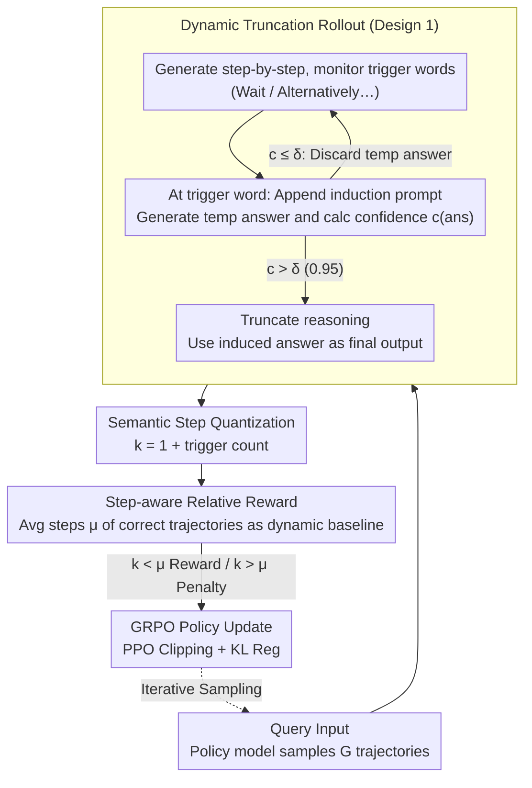

# Step-GRPO: Internalizing Dynamic Early Exit for Efficient Reasoning

**Conference**: ACL 2026  
**arXiv**: [2604.16890](https://arxiv.org/abs/2604.16890)  
**Code**: None  
**Area**: LLM Reasoning Efficiency / Reinforcement Learning  
**Keywords**: Efficient Reasoning, GRPO, Semantic Steps, Dynamic Truncation, Overthinking

## TL;DR

This paper proposes Step-GRPO, which internalizes dynamic early exit capabilities into the model. It measures reasoning complexity through semantic steps rather than raw tokens and utilizes dynamic truncation Rollout to expose short, correct trajectories. Combined with a step-aware relative reward to guide the model to stop reasoning at appropriate moments, it achieves a 32% reduction in token consumption on Qwen3-8B without a drop in accuracy.

## Background & Motivation

**Background**: Large reasoning models (such as DeepSeek-R1 and Qwen3) solve complex problems through long chains of thought (CoT). However, they suffer from a severe "overthinking" phenomenon—the model continues to generate unnecessary verification steps or repetitive explanations even after finding the correct answer.

**Limitations of Prior Work**: (1) Training-time length penalty methods (e.g., GRPO+LP) suffer from a "grammatical blind spot"—token-based counting cannot distinguish between redundant and necessary reasoning, forcing the model to cut critical verification steps and leading to performance collapse. (2) SFT distillation methods (e.g., DEER+SFT) rely on expensive rejection sampling to construct concise samples and exhibit poor generalization—models mimic a concise style superficially without learning the underlying decision strategy. (3) Inference-time early exit methods increase system overhead.

**Key Challenge**: There is a need for the model to learn "when to stop reasoning" during the training phase. However, token-based penalties are semantics-blind, and SFT-based methods lack exploration.

**Goal**: Internalize dynamic early exit capabilities within the GRPO training framework, enabling the model to autonomously learn the minimal sufficient reasoning path with zero inference overhead.

**Key Insight**: Elevate the optimization target from token granularity to semantic step granularity. Language markers (e.g., "Wait", "Alternatively") are used as boundaries for reasoning steps, allowing reasoning redundancy to be measured and penalized based on steps rather than tokens.

**Core Idea**: (1) Dynamic Truncation Rollout: During training sampling, whenever a step boundary is encountered, an answer is induced and its confidence evaluated; if confidence is high, the generation is truncated. (2) Step-aware Relative Reward: The average number of steps for correct answers within a group is used as a dynamic baseline. Rewards are given for step counts below the baseline, while penalties are applied for those above.

## Method

### Overall Architecture

Step-GRPO introduces three components into the GRPO framework: (1) Dynamic Truncation Rollout, which mixes natural trajectories and truncated trajectories during exploration; (2) Semantic Step Quantization, which uses trigger word counts instead of token counts to measure reasoning complexity; and (3) Step-aware Relative Reward, which assigns efficiency rewards/penalties based on a dynamic baseline of correct answers within the group.

### Key Designs

**1. Dynamic Truncation Rollout: Moving inference-time early exit decisions into training sampling to let the model see "stopping early is also correct."**

Standard GRPO sampling produces only full-length trajectories, giving the model no opportunity to see samples where "stopping early yields the correct answer," thus failing to learn early exits. Step-GRPO continuously monitors trigger words ("Wait", "Alternatively", etc.) during generation. Each time one is detected, standard generation is suspended, and an answer induction prompt ("</think> The final answer is") is appended. The model generates a temporary answer and calculates its confidence (average log probability of answer tokens). If confidence $c(ans) > \delta$ (threshold 0.95), the reasoning is truncated, and the induced answer is used as final output; otherwise, the temporary answer is discarded, and generation continues. This ensures the exploration phase mixes natural trajectories with truncated "stop early and correct" trajectories, simulating the inference-time early exit decision process during training.

**2. Semantic Step Quantization: Using logical segment counts instead of token counts to measure reasoning redundancy.**

Token-based penalties suffer from a "grammatical blind spot"—they cannot distinguish between a necessary long verification step and two redundant short steps, forcing the model to cut critical steps and causing performance collapse. Step-GRPO instead uses semantic step counts $k_i = 1 + N_{\text{trig}}(o_i)$ to measure complexity, where $N_{\text{trig}}$ is the frequency of trigger words, and the plus one accounts for the final segment containing the answer. This quantization is insensitive to wordiness and focuses only on how many logical segments the reasoning is divided into, thus reflecting logical complexity more accurately without misjudging "verbosity" as "excessive steps."

**3. Step-aware Relative Reward: Using intra-group dynamic baselines to make efficiency rewards/penalties adaptive to problem difficulty.**

Static length penalties do not account for problem difficulty: 1 step might suffice for a simple problem, while 10 steps are not excessive for a complex one. A one-size-fits-all approach harms performance on difficult tasks. Step-GRPO calculates the average step count $\mu$ for correct answers in each sampled group as a dynamic baseline. The total reward is:

$$R_i = \alpha \cdot R_{\text{acc}}^{(i)} \cdot \left[1 - \beta \cdot \tanh\left(\frac{k_i - \mu}{\mu}\right)\right] + (1-\alpha) \cdot R_{\text{form}}^{(i)}$$

When $k_i < \mu$, the tanh term is negative and the reward increases (efficiency reward); when $k_i > \mu$, the tanh term is positive and the reward decreases (redundancy penalty). The tanh function also limits the efficiency incentive to $(-\beta, \beta)$ to prevent extreme values. Since the baseline is calculated dynamically from correct answers within the group, simple problems naturally have lower baseline steps while difficult ones have higher ones, avoiding the rigid one-size-fits-all approach of static penalties.

### Loss & Training

Standard GRPO policy gradient objective + PPO clipping + KL regularization. Hyperparameters: $\alpha=0.1$, $\beta=0.5$, $G=5$, $\delta=0.95$, learning rate $1 \times 10^{-6}$. Training data: DAPO-Math-17k. Evaluation conducted on Qwen3-1.7B/4B/8B.

## Key Experimental Results

### Main Results

| Method | Qwen3-8B Avg Accuracy | Compression Rate |
|------|-------------------|--------|
| Vanilla | 79.9% | 100% |
| GRPO | 80.9% | 89.7% |
| GRPO+LP | 78.4% | 53.2% |
| GRPO-λ | 79.9% | 62.9% |
| DEER+SFT | 72.6% | 78.9% |
| Step-GRPO | **82.1%** | **68.0%** |

### Ablation Study

| Config | Accuracy | Compression Rate | Description |
|------|--------|--------|------|
| GRPO (No Efficiency) | 80.9% | 89.7% | No length control |
| GRPO+LP | 78.4% | 53.2% | Token-level penalty; capability collapse |
| Step-GRPO (Full) | 82.1% | 68.0% | Semantic step-level; optimal tradeoff |
| DEER+SFT | 72.6% | 78.9% | SFT approach; poor generalization |

### Key Findings

- Step-GRPO improves accuracy by 2.2% (82.1% vs 79.9%) while reducing tokens by 32%, likely due to the elimination of potential errors in redundant reasoning.
- While GRPO+LP achieves high compression (53.2%), its accuracy drops significantly (78.4%), confirming the "grammatical blind spot" problem of token-level penalties.
- DEER+SFT shows the worst accuracy (72.6%), proving that SFT-based methods lack sufficient generalization for efficient reasoning.
- On the most difficult benchmarks like AIME 2025, Step-GRPO's accuracy significantly outperforms other efficiency methods (73.3% vs 60-66.7%).

## Highlights & Insights

- **The granularity shift from "token to semantic step" addresses the core problem**: The grammatical blind spot is a fatal flaw in all token-based penalty methods. Step-GRPO bypasses this via semantic step quantization.
- **Dynamic Truncation Rollout internalizes inference-time ability into training-time strategy**: The model learns to "stop when confident enough" during training, resulting in zero inference overhead.
- **Intra-group dynamic baselines adapt to problem difficulty**: Baseline step counts are naturally lower for simple problems within the same group, avoiding indiscriminate penalties.

## Limitations & Future Work

- The selection of trigger word sets requires manual specification; different models/tasks may require different triggers.
- Confidence evaluation in Truncated Rollout increases the forward pass cost during training.
- Validated only on mathematical reasoning tasks; effectiveness for code or logical reasoning remains unknown.
- Definition of semantic steps relies on trigger words; it may not be applicable if the model's generation style changes.

## Related Work & Insights

- **vs GRPO+LP/SOP (Token-level penalties)**: These methods rely on token counts and cannot distinguish redundancy from necessity. Step-GRPO uses semantic steps to maintain reasoning integrity.
- **vs DEER+SFT (Distillation methods)**: SFT mimics concise styles superficially but fails to learn the underlying strategy. Step-GRPO learns actual decision-making capabilities through RL exploration.

## Rating

- Novelty: ⭐⭐⭐⭐ The design of semantic step quantization and truncated Rollout is clever, though the overall framework is an incremental improvement on GRPO.
- Experimental Thoroughness: ⭐⭐⭐⭐⭐ Extremely thorough, covering three model scales, six benchmarks, and seven baselines.
- Writing Quality: ⭐⭐⭐⭐ Clear problem analysis, systematic method descriptions, and good use of diagrams to aid understanding.

<!-- RELATED:START -->

## Related Papers

- [\[ACL 2026\] When Is Thinking Enough? Early Exit via Sufficiency Assessment for Efficient Reasoning](when_is_thinking_enough_early_exit_via_sufficiency_assessment_for_efficient_reas.md)
- [\[ACL 2026\] Reinforced Efficient Reasoning via Semantically Diverse Exploration](reinforced_efficient_reasoning_via_semantically_diverse_exploration.md)
- [\[ACL 2026\] DRP: Distilled Reasoning Pruning with Skill-aware Step Decomposition for Efficient Large Reasoning Models](drp_distilled_reasoning_pruning_with_skill-aware_step_decomposition_for_efficien.md)
- [\[ACL 2026\] Stabilizing Efficient Reasoning with Step-Level Advantage Selection](stabilizing_efficient_reasoning_with_step-level_advantage_selection.md)
- [\[ACL 2026\] ETR: Entropy Trend Reward for Efficient Chain-of-Thought Reasoning](etr_entropy_trend_reward_for_efficient_chain-of-thought_reasoning.md)

<!-- RELATED:END -->
