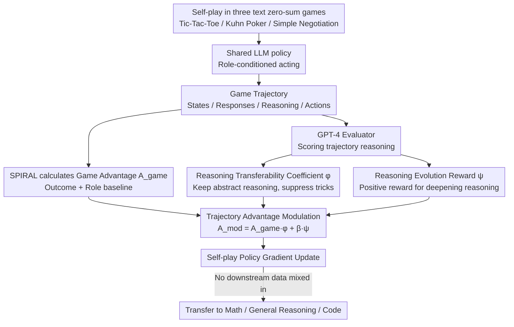

# Stratagem: Learning Transferable Reasoning via Trajectory-Modulated Game Self-Play

**Conference**: ACL2026  
**arXiv**: [2604.17696](https://arxiv.org/abs/2604.17696)  
**Code**: https://github.com/ydyyyy/Stratagem  
**Area**: Code Intelligence / LLM Reasoning / Self-play RL  
**Keywords**: self-play, transferable reasoning, trajectory advantage modulation, mathematical reasoning, code generation

## TL;DR
Instead of reinforcing models based solely on win/loss outcomes in text-style game self-play, Stratagem modulates the advantage signal using "abstract transferability" and "reasoning evolution." This ensures that policies learned from games transfer effectively to mathematics, general reasoning, and code generation tasks.

## Background & Motivation
**Background**: Training agents via games is a classic RL approach recently applied to LLM training. Methods like SPIRAL allow language models to engage in self-play within zero-sum text games, updating policies via end-game win/loss signals with the hope that planning, probabilistic judgment, and decision-making capabilities transfer to math and code tasks.

**Limitations of Prior Work**: Final win/loss outcomes only indicate success or failure but fail to distinguish which reasoning steps are transferable abstract strategies versus game-specific tricks. For example, memorizing rules like "Kings beat Queens" might win a card game but does not necessarily assist in solving math problems.

**Key Challenge**: While self-play produces rich trajectories, traditional advantage focuses only on the game outcome. Models may reinforce domain-specific heuristics rather than prioritizing transferable patterns such as enumeration, proof by contradiction, conditional decomposition, and probabilistic reasoning.

**Goal**: The authors aim to sift through game trajectories for reasoning patterns that truly transfer to downstream tasks without relying on human reasoning data, biasing the training signal toward these trajectories.

**Key Insight**: Transfer failures are attributed to two causes: domain specificity (confining the model to game semantics) and contextual stasis (a lack of deepening reasoning as the context evolves).

**Core Idea**: Add trajectory-level modulation to the SPIRAL game advantage. Trajectories with higher abstraction retain more advantage, while those where reasoning evolves across multiple rounds receive additional rewards.

## Method
Stratagem's approach is constrained: it neither redesigns the game environment nor mixes math problems into training. Instead, it modifies the training weights of self-play trajectories. Given a trajectory, Stratagem modulates the original SPIRAL advantage (calculated from game outcomes and role baselines) using a Reasoning Transferability Coefficient and a Reasoning Evolution Reward to produce a modified advantage for policy gradient updates.

### Overall Architecture
The training environment includes three text-based zero-sum games: Tic-Tac-Toe, Kuhn Poker, and Simple Negotiation, covering spatial planning, probabilistic reasoning, and strategic optimization. Both players share the same LLM policy, distinguished by role-conditioning.

Each trajectory consists of multiple rounds of states, model responses, reasoning chain text, and actions. Whereas SPIRAL relies on outcome-based role-conditioned advantage, Stratagem computes a Reasoning Transferability Coefficient ($\phi$) and a Reasoning Evolution Reward ($\psi$) to update the model using the formula $A_{\text{mod}} = A_{\text{game}} \cdot \phi + \beta \cdot \psi$.

The experiment uses Qwen3-4B-Base as the backbone. $\phi$ and $\psi$ are scored by GPT-4 as an evaluator, with $\beta$ set to 0.2 by default. Computational costs are managed via trajectory sub-sampling, requiring approximately 30 GPU-hours on 2 A100s, with GPT-4 evaluation costs around $100.

### Key Designs

**1. Reasoning Transferability Coefficient ($\phi$): Gating winning trajectories with an abstraction coefficient to separate "how to win" from "why it wins"**

The issue with outcome rewards is that they reinforce all winning behaviors equally, including game-specific rules. Stratagem uses a GPT-4 evaluator to assign a transferability coefficient $\phi \in \{0, 0.5, 1\}$. When trajectories are dominated by game-specific rules, the weight is suppressed. When abstract reasoning like enumeration, probability estimation, or constraint decomposition appears, the advantage is preserved. This ensures the model learns "universal reasoning structures" rather than "memorized rules."

**2. Reasoning Evolution Reward ($\psi$): Rewarding reasoning that deepens as the game progresses to avoid static templates**

Math and code tasks require dynamic reasoning where subsequent logic must adapt to intermediate results. $\psi \in \{-1, 0, +1\}$ evaluates whether reasoning adjusts based on new states, maintains consistency across steps, and evolves from shallow reactions into complete plans. While $\phi$ focuses on abstraction, $\psi$ focuses on contextual progression.

**3. Trajectory-Modulated Training: Merging signals into a modified advantage**

Stratagem integrates these signals into the advantage without changing the environment:

$$A_{\text{mod}} = A_{\text{game}} \cdot \phi + \beta \cdot \psi$$

The multiplicative term $A_{\text{game}} \cdot \phi$ acts as a gate—limiting the influence of non-transferable winning trajectories. The additive term $\beta \cdot \psi$ provides an auxiliary reward for evolving reasoning, independent of the game outcome, with $\beta$ defaulting to $0.2$. Together, they shift the optimization objective from "winning the game" to "learning transferable reasoning."

### Loss & Training
Training utilizes self-play policy gradients. The update replaces `A_game` with `A_mod`. After sampling trajectories, the system calculates final payoffs, role baselines, $\phi$, and $\psi$, then computes log-probability gradients for the generated responses.

Downstream benchmarks are never used as training rewards; thus, improvements in math and code are interpreted as cross-domain transfer rather than direct optimization on target tasks.

## Key Experimental Results

### Main Results
Evaluation covers mathematical reasoning, general reasoning, and code generation. All tests use zero-shot prompting; code tasks use HumanEval pass@1.

| Model | MATH500 | AIME24 | AIME25 | AMC-23 | GPQA | MMLU-Pro | HumanEval |
|------|---------|--------|--------|--------|------|----------|-----------|
| Qwen3-4B-Base | 65.80 | 10.00 | 3.30 | 50.00 | 30.60 | 47.20 | 67.93 |
| SPIRAL | 71.00 | 10.00 | 6.70 | 45.00 | 36.41 | 53.93 | 77.44 |
| Stratagem | 76.00 | 20.00 | 13.30 | 60.00 | 38.23 | 57.83 | 77.93 |
| Stratagem vs Base | +10.20 | +10.00 | +10.00 | +10.00 | +7.63 | +10.63 | +10.00 |
| Stratagem vs SPIRAL | +5.00 | +10.00 | +6.60 | +15.00 | +1.82 | +3.90 | +0.49 |

The most significant gains are in competition math: AIME24 increased from 10.00 to 20.00, and AMC-23 from 50.00 to 60.00. This supports the hypothesis that complex multi-step reasoning relies more on transferable strategic structures.

### Ablation Study

| Configuration | MATH500 | AIME24 | AIME25 | OlympiadBench | AMC-23 | GPQA | MMLU-Pro | HumanEval |
|------|---------|--------|--------|---------------|--------|------|----------|-----------|
| Stratagem full | 76.00 | 20.00 | 13.30 | 39.90 | 60.00 | 38.23 | 57.83 | 77.93 |
| w/o Evolution Reward | 74.60 | 13.30 | 10.00 | 39.30 | 52.50 | 37.22 | 56.92 | 77.80 |
| Gain | +1.40 | +6.70 | +3.30 | +0.60 | +7.50 | +1.01 | +0.91 | +0.13 |

| Human Eval Dimensions | Qwen3-4B-Base | SPIRAL | Stratagem w/o evolution | Stratagem |
|----------------|--------------|--------|--------------------------|-----------|
| Reasoning Abstraction | 2.48 | 3.24 | 3.82 | 4.06 |
| Reasoning Progression | 2.32 | 3.08 | 3.36 | 4.18 |

### Key Findings
- $\psi$ contributes most significantly to AIME24 and AMC-23, suggesting "contextual evolution" is vital for competition math.
- Parameter sensitivity shows $\beta = 0.20$ is optimal; too small a value resembles removing the evolution reward, while too large a value destabilizes training by overshadowing game objectives.
- Human evaluation shows that without $\psi$, abstraction remains relatively high, but progression scores drop significantly, confirming that $\phi$ and $\psi$ target distinct capabilities.

## Highlights & Insights
- The paper addresses the core challenge of self-play transfer: it is not about data quantity, but identifying which trajectories are worth learning.
- The combination of $\phi$ and $\psi$ is intuitive, targeting "how to abstract" and "how to progress."
- While code generation gains are less dramatic than math, the improvement over SPIRAL on HumanEval suggests that structured planning from games transfers weakly to program synthesis.
- Stratagem provides a general paradigm: when environment rewards are sparse/outcome-only, a trajectory-level meta-evaluator can weight process quality without requiring per-step human labels.

## Limitations & Future Work
- Dependency on GPT-4 for trajectory scoring introduces costs, biases, and reproducibility concerns.
- The use of only three text games limits the diversity of reasoning types. Future work should explore tool-use, code debugging, or multi-agent collaboration.
- Discrete scoring for $\phi$ and $\psi$ may lack the granularity needed to capture trajectories containing mixed (transferable and game-specific) strategies.
- There is no direct proof that internal representations shifted from game semantics to math semantics; evidence remains focused on downstream scores and human ratings.

## Related Work & Insights
- **vs SPIRAL**: SPIRAL uses only outcome rewards; Stratagem adds trajectory modulation to explain why certain wins are more valuable.
- **vs Absolute Zero / Self-play Reasoning**: Unlike works emphasizing zero-data generation, Stratagem focuses on reward shaping to isolate transferable signals.
- **vs RLHF / RLAIF**: While RLHF evaluates response preference, Stratagem evaluates the abstraction and evolution of entire interaction trajectories.
- **Insight**: In code intelligence, one could treat unit test pass rates as $A_{\text{game}}$ and introduce "solution abstraction" and "debugging progression" as modulation signals to prevent models from learning brittle, test-case-specific hacks.

## Rating
- Novelty: ⭐⭐⭐⭐☆ Excellent use of trajectory modulation to improve transfer from games to reasoning tasks.
- Experimental Thoroughness: ⭐⭐⭐⭐☆ Good coverage across domains, though game environments and model scales are limited.
- Writing Quality: ⭐⭐⭐⭐☆ Clear definitions, though some scoring details for $\phi$ and $\psi$ could be more transparent.
- Value: ⭐⭐⭐⭐☆ Highly relevant for self-play training and RL for code/reasoning, especially where outcome rewards are sparse.

<!-- RELATED:START -->

## Related Papers

- [\[ICML 2026\] Self-Play Only Evolves When Self-Synthetic Pipeline Ensures Learnable Information Gain](../../ICML2026/llm_reasoning/self-play_only_evolves_when_self-synthetic_pipeline_ensures_learnable_informatio.md)
- [\[ACL 2026\] HISR: Hindsight Information Modulated Segmental Process Rewards for Multi-turn Agentic Reinforcement Learning](hisr_hindsight_information_modulated_segmental_process_rewards_for_multi-turn_ag.md)
- [\[ICML 2025\] Improving Rationality in the Reasoning Process of Language Models through Self-playing Game](../../ICML2025/llm_reasoning/improving_rationality_in_the_reasoning_process_of_language_models_through_self-p.md)
- [\[AAAI 2026\] LLMs for Game Theory: Entropy-Guided In-Context Learning and Adaptive CoT Reasoning](../../AAAI2026/llm_reasoning/llms_for_game_theory_entropy-guided_in-context_learning_and_adaptive_cot_reasoni.md)
- [\[ICLR 2026\] Off-Trajectory Reasoning: Can LLMs Collaborate on Reasoning Trajectories?](../../ICLR2026/llm_reasoning/off-trajectory_reasoning_can_llms_collaborate_on_reasoning_trajectories.md)

<!-- RELATED:END -->
