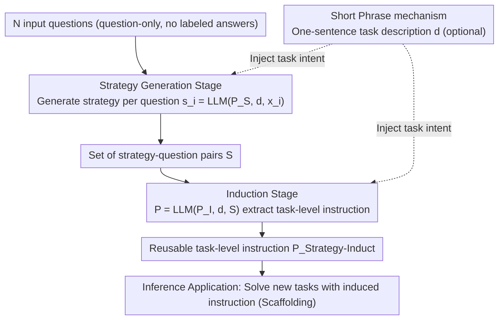

# Strategy-Induct: Task-Level Strategy Induction for Instruction Generation

**Conference**: ACL2026 Findings  
**arXiv**: [2605.20924](https://arxiv.org/abs/2605.20924)
**Code**: TBD
**Area**: LLM Reasoning
**Keywords**: Instruction Induction, Reasoning Strategy, Prompt Engineering, Question-only, Task-level Instruction, Cross-model Generalization

## TL;DR

Strategy-Induct proposes a framework for inducing task-level instructions using only a few input questions (without labeled answers). It first generates reasoning strategies for each individual question and then induces reusable task-level instructions from these strategy-question pairs. It outperforms existing SOTA methods on the BBH-Induct, Evals-Induct, and Shift Cipher benchmarks.

## Background & Motivation

High-quality task instructions are critical to LLM performance, yet manual instruction design requires domain expertise and is costly. Existing instruction induction methods rely on input-output pairs; however, in practical applications, obtaining labeled answers is often difficult or expensive. This paper proposes that effective task instructions can be induced from questions alone in a **question-only** setting, eliminating the dependency on labeled answers.

## Method

### Overall Architecture

In the **question-only** setting (given questions without labeled answers), Strategy-Induct follows a three-step process: First, **Strategy Generation** produces a reasoning strategy for each input question, using the strategy as a substitute for expensive labeled answers. Second, **Induction** extracts a reusable task-level instruction from these strategy-question pairs. Finally, **Inference Application** uses the induced instruction to guide the LLM in solving new questions for the same task. The Short Phrase mechanism, used throughout the first two steps, provides a one-sentence task description to help anchor the task intent of the LLM.

### Key Designs

1.  **Strategy Stage**: Given N input questions $\mathcal{X} = \{x_1, ..., x_N\}$, a meta-prompt $P_S$ and an optional Short Phrase description $d$ are used to generate a reasoning strategy $s_i = \text{LLM}(P_S, d, x_i)$ for each question, forming a set of strategy-question pairs $\mathcal{S}$. Strategies replace the role of labeled answers in traditional methods, providing structured reasoning signals.
2.  **Induct Stage**: The strategy-question pairs $\mathcal{S}$ are combined with a meta-prompt $P_I$ and the Short Phrase $d$ to induce a reusable task-level instruction $P_{\text{Strategy-Induct}} = \text{LLM}(P_I, d, \mathcal{S})$.
3.  **Short Phrase Mechanism**: Brief task descriptions (e.g., one or two words) are employed to help convey task intent, lowering the barrier for user prompt writing. This can be omitted if the question is self-explanatory.

### Loss & Training

No training process is involved. The entire framework is based on the in-context learning capabilities of LLMs, defaulting to $N=3$ example questions and temperature=0 to ensure deterministic output.

## Key Experimental Results

### Main Results

Evaluations across 18 models (BBH-Induct / Evals-Induct / Shift Cipher) compared against ZCoT, SCoT, and INDUCT:

| Model | ZCoT | SCoT | INDUCT | Strategy-Induct |
|---|---|---|---|---|
| Llama 3.1 8B (BBH) | 62.03 | 56.29 | 59.48 | **65.33** |
| Llama 3.1 70B (BBH) | 82.09 | 84.52 | 86.03 | **88.99** |
| GPT-4o (BBH) | 84.12 | 87.83 | 87.94 | **87.65** |
| GPT o3 mini high (BBH) | 88.87 | 89.91 | 89.74 | **91.30** |
| Gemini 2.0 Flash (Shift) | 54.24 | 53.44 | 65.60 | **67.04** |

Overall versus ZCoT: 50 wins, 3 ties, 7 losses; versus INDUCT: 44 wins, 3 ties, 13 losses.

### Ablation Study

| Model | N=1 | N=3 | N=5 |
|---|---|---|---|
| Llama 3.1 8B | 64.35 | **65.33** | 61.74 |
| Llama 3.1 70B | 87.54 | 88.99 | **89.97** |
| Mistral Large 2 | **84.87** | 85.97 | 84.58 |

$N=3$ is identified as the optimal balance point—$N=1$ lacks diversity, while $N=5$ may exceed the context processing capabilities of smaller models.

### Key Findings

*   Smaller models (8B-12B) consistently benefit from Strategy-Induct, achieving a 10-3-2 win-tie-loss record against INDUCT.
*   The largest improvements were observed in knowledge-intensive sub-tasks (e.g., snarks, sports understanding), ranging from 8 to 60 percentage points.
*   As reasoning intensity increases for Large Reasoning Models (LRM like GPT o3 mini), the gains from Strategy-Induct also increase.
*   On Shift Cipher, the most significant improvements occurred for low-frequency shift values (non-ROT-1/3/13), where the strategy explicitly guided the LLM to handle the letter wrap-around effect.

## Highlights & Insights

*   **Instruction Induction without Labeled Answers**: Replacing expensive gold answers with LLM-generated reasoning strategies represents a paradigm shift in instruction induction.
*   **Cross-model Generalization**: Induced instructions can be transferred between different models without the need for model-specific re-optimization.
*   **LLM + LRM Synergy**: Combining LLMs for instruction generation and LRMs for reasoning execution can further enhance performance.

## Limitations & Future Work

*   Performance for some small models decreased at $N=5$, suggesting that the scale of strategy-question pairs is limited by the model's context window and inductive capacity.
*   Strategy quality depends on the LLM's intrinsic reasoning ability; strategies generated by small models may be of lower quality.
*   The framework has only been validated on classification and decoding tasks; its applicability to open-ended generation tasks remains to be explored.

## Related Work & Insights

*   **INDUCT-LEARN** (Chen et al., 2024b): Current SOTA instruction induction method, but requires input-output pairs; Ours surpasses it in the question-only setting.
*   **SCoT** (Wang et al., 2024): Automatic strategy reasoning chain, but is an instance-level method that cannot reuse instructions.
*   **APE** (Zhou et al., 2022): Pioneer in automatic prompt engineering, requiring extensive external resources or initial instructions.

## Rating

| Dimension | Score (1-10) |
|---|---|
| Innovation | 7 |
| Practicality | 8 |
| Clarity | 8 |
| Experimental Thoroughness | 9 |

## Rating
- Novelty: TBD
- Experimental Thoroughness: TBD
- Writing Quality: TBD
- Value: TBD

<!-- RELATED:START -->

## Related Papers

- [\[ECCV 2024\] Controllable Navigation Instruction Generation with Chain of Thought Prompting](../../ECCV2024/llm_reasoning/controllable_navigation_instruction_generation_with_chain_of_thought_prompting.md)
- [\[ACL 2026\] Stabilizing Efficient Reasoning with Step-Level Advantage Selection](stabilizing_efficient_reasoning_with_step-level_advantage_selection.md)
- [\[ACL 2026\] ChAIRO: Contextual Hierarchical Analogical Induction and Reasoning Optimization for LLMs](chairo_contextual_hierarchical_analogical_induction_and_reasoning_optimization_f.md)
- [\[ACL 2026\] Learning to Edit Knowledge via Instruction-based Chain-of-Thought Prompting](learning_to_edit_knowledge_via_instruction-based_chain-of-thought_prompting.md)
- [\[ACL 2026\] SPPO: Sequence-Level PPO for Long-Horizon Reasoning Tasks](sppo_sequence-level_ppo_for_long-horizon_reasoning_tasks.md)

<!-- RELATED:END -->
