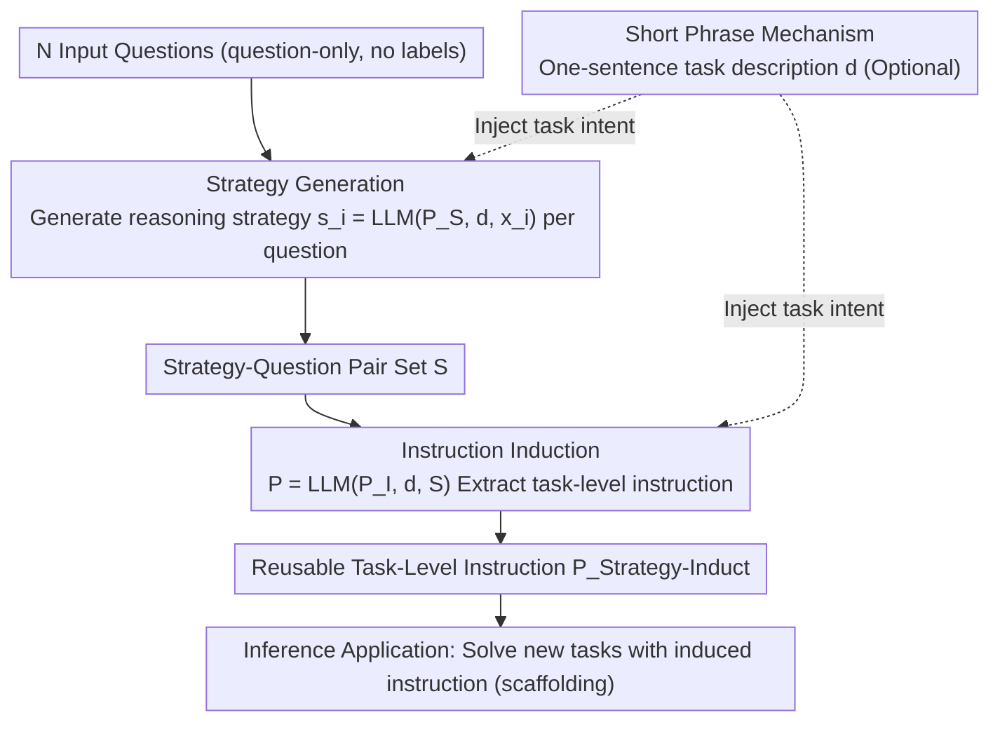

# Strategy-Induct: Task-Level Strategy Induction for Instruction Generation

**Conference**: ACL2026 Findings  
**arXiv**: [2605.20924](https://arxiv.org/abs/2605.20924)  
**Code**: To be confirmed  
**Area**: LLM Reasoning  
**Keywords**: Instruction Induction, Reasoning Strategy, Prompt Engineering, Question-only, Task-level Instructions, Cross-model Generalization

## TL;DR

Strategy-Induct proposes a framework for inducing task-level instructions using only a few input questions without requiring ground-truth labels. By first generating reasoning strategies for individual questions and then inducing reusable task instructions from strategy-question pairs, the method surpasses current SOTA approaches on BBH-Induct, Evals-Induct, and Shift Cipher benchmarks.

## Background & Motivation

High-quality task instructions are critical for LLM performance, but manual design requires domain expertise and is costly. Existing instruction induction methods rely on input-output pairs, yet obtaining labeled answers is often difficult or expensive in practical scenarios. This paper proposes inducing effective task instructions in a **question-only** setting solely from the questions themselves, eliminating the dependency on labeled data.

## Method

### Overall Architecture

Strategy-Induct operates in a **question-only** setting (given questions without labels) through three stages: **Strategy Generation**, producing a reasoning strategy for each input question to replace expensive labels; **Instruction Induction**, extracting a reusable task-level instruction from these strategy-question pairs; and **Inference Application**, using the induced instruction to guide LLMs in solving new problems within the same task. The Short Phrase mechanism provides a one-sentence task description throughout the first two steps to help the LLM align with task intent.

### Key Designs

1.  **Strategy Stage**: Given N input questions $\mathcal{X} = \{x_1, ..., x_N\}$, the model uses a meta-prompt $P_S$ and an optional Short Phrase description $d$ to generate a reasoning strategy $s_i = \text{LLM}(P_S, d, x_i)$ for each question, forming a strategy-question pair set $\mathcal{S}$. Strategies replace ground-truth labels used in traditional methods, providing structured reasoning signals.
2.  **Induct Stage**: By combining the strategy-question pairs $\mathcal{S}$ with a meta-prompt $P_I$ and Short Phrase $d$, the system induces a reusable task-level instruction $P_{\text{Strategy-Induct}} = \text{LLM}(P_I, d, \mathcal{S})$.
3.  **Short Phrase Mechanism**: Brief task descriptions (e.g., one or two words) are used to help convey task intent, lowering the barrier for user prompt engineering. This can be omitted if the questions are self-explanatory.

### Loss & Training

No training process is involved. The framework relies on the in-context learning capabilities of LLMs, defaulting to N=3 example questions and temperature=0 to ensure deterministic outputs.

## Key Experimental Results

### Main Results

Evaluated across 18 models (BBH-Induct / Evals-Induct / Shift Cipher), compared against ZCoT, SCoT, and INDUCT:

| Model | ZCoT | SCoT | INDUCT | Strategy-Induct |
|---|---|---|---|---|
| Llama 3.1 8B (BBH) | 62.03 | 56.29 | 59.48 | **65.33** |
| Llama 3.1 70B (BBH) | 82.09 | 84.52 | 86.03 | **88.99** |
| GPT-4o (BBH) | 84.12 | 87.83 | 87.94 | **87.65** |
| GPT o3 mini high (BBH) | 88.87 | 89.91 | 89.74 | **91.30** |
| Gemini 2.0 Flash (Shift) | 54.24 | 53.44 | 65.60 | **67.04** |

Overall vs. ZCoT: 50 wins, 3 ties, 7 losses; vs. INDUCT: 44 wins, 3 ties, 13 losses.

### Ablation Study

| Model | N=1 | N=3 | N=5 |
|---|---|---|---|
| Llama 3.1 8B | 64.35 | **65.33** | 61.74 |
| Llama 3.1 70B | 87.54 | 88.99 | **89.97** |
| Mistral Large 2 | **84.87** | 85.97 | 84.58 |

N=3 is the optimal balance point—N=1 lacks diversity, while N=5 may exceed the context processing capabilities of smaller models.

### Key Findings

- Small models (8B-12B) generally benefit from Strategy-Induct, achieving a 10-3-2 record against INDUCT.
- The greatest improvements (8-60 percentage points) occur in knowledge-intensive subtasks (e.g., snarks, sports understanding).
- For LRMs (GPT o3 mini), Strategy-Induct's gains increase as reasoning intensity grows.
- On Shift Cipher, improvements are most significant for low-frequency shift values (non-ROT-1/3/13), as the strategy explicitly guides the LLM to handle character wrap-around effects.

## Highlights & Insights

- **Instruction Induction Without Ground Truth**: Replacing expensive labeled answers with LLM-generated reasoning strategies marks a paradigm shift in instruction induction.
- **Cross-model Generalization**: Induced instructions can be transferred across different models without requiring re-optimization for specific targets.
- **LLM + LRM Synergy**: Combining LLMs for instruction generation and LRMs for reasoning execution can further enhance performance.

## Limitations & Future Work

- Performance for some small models drops at N=5, suggesting the scale of strategy-question pairs is limited by model context windows and induction capabilities.
- Strategy quality depends on the LLM's inherent reasoning ability; strategies generated by smaller models may be of lower quality.
- The method was only validated on classification and decoding tasks; applicability to open-ended generation tasks remains to be explored.

## Related Work & Insights

- **INDUCT-LEARN** (Chen et al., 2024b): Current SOTA for instruction induction, but requires input-output pairs; ours surpasses it in question-only settings.
- **SCoT** (Wang et al., 2024): Automatic strategy reasoning chain; however, it is an instance-level method and cannot reuse instructions.
- **APE** (Zhou et al., 2022): Pioneer in automatic prompt engineering, requiring significant external resources or initial instructions.

## Rating

| Dimension | Score (1-10) |
|---|---|
| Novelty | 7 |
| Value | 8 |
| Writing Quality | 8 |
| Experimental Thoroughness | 9 |

## Rating
- Novelty: TBD
- Experimental Thoroughness: TBD
- Writing Quality: TBD
- Value: TBD

<!-- RELATED:START -->

## Related Papers

- [\[ICLR 2026\] DeepCompress: A Dual Reward Strategy for Dynamically Exploring and Compressing Reasoning Chains](../../ICLR2026/llm_reasoning/deepcompress_a_dual_reward_strategy_for_dynamically_exploring_and_compressing_re.md)
- [\[ECCV 2024\] Controllable Navigation Instruction Generation with Chain of Thought Prompting](../../ECCV2024/llm_reasoning/controllable_navigation_instruction_generation_with_chain_of_thought_prompting.md)
- [\[ACL 2026\] ChAIRO: Contextual Hierarchical Analogical Induction and Reasoning Optimization for LLMs](chairo_contextual_hierarchical_analogical_induction_and_reasoning_optimization_f.md)
- [\[ACL 2026\] Learning to Edit Knowledge via Instruction-based Chain-of-Thought Prompting](learning_to_edit_knowledge_via_instruction-based_chain-of-thought_prompting.md)
- [\[ACL 2026\] Stabilizing Efficient Reasoning with Step-Level Advantage Selection](stabilizing_efficient_reasoning_with_step-level_advantage_selection.md)

<!-- RELATED:END -->
