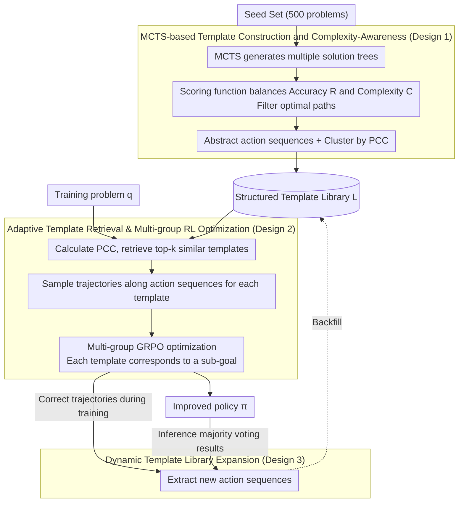

# TemplateRL: Structured Template-Guided Reinforcement Learning for LLM Reasoning

**Conference**: ACL 2026  
**arXiv**: [2505.15692](https://arxiv.org/abs/2505.15692)  
**Code**: https://github.com/THU-KEG/TemplateRL  
**Area**: LLM Reasoning / Reinforcement Learning  
**Keywords**: Reinforcement Learning, Template-Guided, Reasoning Path, LLM Optimization, GRPO

## TL;DR

TemplateRL abstracts structured reasoning templates from a small seed set using MCTS and introduces these templates as explicit guidance during reinforcement learning training. This significantly improves the efficiency and stability of multi-step reasoning in LLMs, achieving a 99% improvement over GRPO on AIME.

## Background & Motivation

**Limitations of Prior Work**: Recently, reinforcement learning has been proven effective for enhancing LLM reasoning (e.g., o1, DeepSeek-R1). However, existing methods like GRPO primarily rely on unstructured self-sampling, allowing the model to explore blindly and learn from scalar rewards. This leads to three key issues: (1) Low sampling efficiency—success rates for high-quality trajectories are low, causing training to collapse on weak models; (2) Difficulty in learning transferable high-level strategies—models tend to memorize surface-level steps rather than distilling general divide-and-conquer or step-by-step thinking patterns; (3) Lack of interpretability—the reasoning process lacks a clear strategic structure, making diagnosis and intervention difficult.

**Key Insight**: Cognitive psychology research (Kahneman 2011) suggests that humans solve complex problems by applying "templates" induced from similar problems rather than starting from scratch. Such high-level templates help humans quickly adapt to new problems.

**Design Motivation**: For multi-step reasoning tasks, the probability of a model generating a single correct step is much higher than completing the entire reasoning chain at once. Therefore, an explicit template library can be constructed to adaptively retrieve relevant templates during RL training, guiding policy generation around these templates. This provides both structured strategy guidance and allows the model to learn general reasoning paths.

**Core Idea**: Replace unstructured exploration with a human-inspired template library, decomposing the RL learning process into multiple template-guided sub-goal optimizations to enhance sampling quality, model stability, and reasoning interpretability.

## Method

### Overall Architecture

TemplateRL consists of three stages:

**Stage 1 — Template Library Construction**: Multi-step solution paths are generated via MCTS on a small seed set (500 problems). The optimal path for each problem is filtered (balancing accuracy and complexity), and action sequences are abstracted as templates and clustered by problem complexity features.

**Stage 2 — Template-Guided Training**: For each training problem, its complexity is calculated and matched with templates in the library to select the $k$ most similar templates. For each template, the model generates reasoning trajectories step-by-step following the corresponding action sequence. Sampling results from these $k$ templates are aggregated for multi-group GRPO optimization, where each template corresponds to an optimization sub-goal.

**Stage 3 — Optional Dynamic Expansion**: If new correct reasoning paths are discovered during training or inference, their action sequences are automatically extracted and added to the library to continuously enrich its coverage.

### Key Designs

**1. MCTS-based Template Construction and Complexity-Awareness: Abstracting "how to solve" into reusable action sequences from few-shot high-quality examples.**

The root cause of unstructured self-sampling is blind exploration, where model success rates for high-quality trajectories are low and only surface steps are recorded. TemplateRL addresses this by first building multiple solution trees using MCTS on 500 seed problems, where each edge represents an "action" (e.g., "propose sub-problem," "derive next step"). For each path in the tree, a scoring function $\text{Score}(\mathbf{s}_i, \mathbf{t}_{i,j}) = b \cdot R(\mathbf{t}_{i,j}|\mathbf{s}_i) - (1-b) \cdot C(\mathbf{t}_{i,j})$ balances correctness $R$ and complexity $C$ to filter the optimal path, then abstracts its action sequence into a template.

Templates are clustered by "Problem Condition Complexity" (PCC, the number of preconditions in a problem) to form the template library $\mathcal{L} = \{\hat{T}_1, \ldots, \hat{T}_{|\mathcal{L}|}\}$. PCC acts as a proxy for problem difficulty; clustering allows the retrieval process to quickly match templates appropriate for the complexity of new problems, avoiding applying simple strategies to complex problems or vice versa.

**2. Adaptive Template Retrieval and Multi-group RL Optimization: Decomposing single scalar reward learning into multiple template sub-goals.**

During the training phase, for each problem $\mathbf{q}$, its PCC is calculated, and its distance to templates is measured as $d(\mathbf{q}, \hat{T}_j) = |{\rm PCC}(\mathbf{q}) - {\rm PCC}_{T_j}|$ to select the top-$k$ nearest neighbors. For each template $T_i$, $G_i$ trajectories are sampled along its action sequence, and trajectories from all groups are combined into the GRPO loss:

$$\tilde{\mathcal{J}}_{\text{GRPO}}(\pi_\theta) = \frac{1}{\sum_i G_i} \sum_i \sum_j \sum_t \min[\rho_{i,j,t} A_{i,t}, \hat{\rho}_{i,j,t} A_{i,t}]$$

where $\rho$ is the probability ratio and $A$ is the advantage estimate. This is equivalent to defining an optimization sub-goal $\mathcal{J}_i(\pi_\theta)$ for each template, with the overall objective being their weighted average. This decomposition ensures: (1) Strategy diversity is maintained as different templates correspond to different strategic patterns; (2) Theoretical support (Prop 3.1 & 3.2) shows that multi-grouping increases the probability of obtaining at least one positive trajectory and that template transfer across similar problems further boosts success rates.

**3. Dynamic Template Library Expansion: Enabling the library to grow during training and inference.**

Since an initial library may not cover all scenarios, TemplateRL allows for continuous evolution. During training, action sequences $T' = (a_1', \ldots, a_d')$ are extracted from correct trajectories via keyword extraction or lightweight model parsing and added to the library. During inference, multiple paths are generated using 5 templates per test sample, the answer is determined by majority voting, and new templates are extracted and added to the library before processing the next sample. This forms a continuous learning loop, helping the model accumulate reasoning skills in specific domains.

## Key Experimental Results

### Main Results

| Method | MATH500 ↑ | AIME24 ↑ | AMC ↑ | Minerva ↑ | Olympiad ↑ | Average ↑ |
|------|----------|---------|-------|-----------|-----------|--------|
| Qwen2.5-Math-7B-Base | 50.8 | 13.3 | 42.5 | 12.1 | 17.2 | 27.2 |
| SimpleRL-Zero | 74.6 | 26.7 | 60.0 | 27.6 | 35.8 | 44.9 |
| Oat-Zero | 79.6 | 30.0 | 60.0 | 34.2 | 39.9 | 48.7 |
| **GRPO (Baseline)** | **76.2** | **16.7** | **55.0** | **32.7** | **38.1** | **43.8** |
| **Ours** | **83.4** | **33.3** | **77.5** | **38.2** | **46.2** | **55.8** |
| **Gain** | **+9.4%** | **+99.4%** | **+40.9%** | **+16.8%** | **+21.2%** | **+27.4%** |

TemplateRL outperforms the GRPO baseline across all benchmarks, with the most significant improvement on AIME24 (+99.4%), indicating that template guidance is most beneficial for complex reasoning problems.

### Ablation Study

| Experiment | Conclusion |
|------|------|
| Training Stability (Llama-3.2-3B) | GRPO collapses to 0 reward after 100 steps; TemplateRL remains > 0.25 |
| Cross-domain Generalization (BALROG/GPQA-D/MMLU-Pro) | Average 6%+ gain over GRPO |
| Multimodal Extension (Qwen2.5-VL) | Average +8.4% on MathVision/MathVerse/MMMU/BLINK |
| Dynamic Template Expansion (Training) | AIME24 improved from 33.3% to 36.7% (+10.2%) |
| Dynamic Template Expansion (Inference) | GPQA-D improved from 37.9% to 40.4% (+6.6%) |
| Template Group Count $\|g\|$ | $\|g\|=2$ provides the optimal balance |

## Highlights & Insights

- **Human-inspired design with theoretical backing**: Starting from cognitive psychology and replacing unstructured exploration with templates is an intuitive strategy. critically, the paper provides theoretical propositions (Prop 3.1, 3.2) proving that multi-grouping increases positive sample probability and template transfer improves success rates.
- **Comprehensive experimental design and strong results**: Validation spans various model scales (1.5B–8B), architectures (Qwen/Llama), and modalities. Cross-domain experiments (BALROG, GPQA-D) also demonstrate that the method is not merely overfitting to mathematics.
- **Dynamic expansion mechanism enhances practicality**: Unlike many RL works with fixed policies, TemplateRL supports online updates to the template library, which is valuable for scenarios requiring continuous adaptation (e.g., medical reasoning, scientific discovery).

## Limitations & Future Work

**Current Limitations**:

- Initialization of the template library relies on MCTS exploration and manual definition of the action space. It is unclear if specific tasks require re-defining the action space.
- Experiments focus primarily on math and logical reasoning. Performance on other long-chain reasoning tasks such as code generation or scientific experiment design remains to be verified.
- Although improved interpretability is claimed, the paper lacks quantitative evaluations of interpretability.

**Future Directions**:

- Automatic action space discovery: Instead of manual definitions, could task-general "action" concepts be learned automatically from correct trajectories?
- Broader application exploration: Extension to code synthesis, scientific reasoning, and dialogue generation.
- Quantifying template interpretability: Measuring the abstraction levels and coverage of learned templates.

## Related Work & Insights

- **vs. GRPO/RL Baselines**: These methods typically focus on algorithm-level improvements (e.g., handling length bias or KL constraints) based on unstructured self-sampling. TemplateRL breaks this bottleneck by introducing explicit structures, representing an architectural innovation.
- **vs. Test-time Template Methods** (RAG, Decomposition): Prior works use templates at inference but do not integrate them into RL training. The novelty of TemplateRL lies in its unified training-inference template-guided mechanism.
- **Insight**: This work demonstrates the effectiveness of combining human-inspired structures with RL optimization. Similar approaches could be applied to other tasks requiring high-level strategies, such as planning or multi-agent coordination.

## Rating

- **Novelty**: ⭐⭐⭐⭐⭐ Introducing structured templates into RL training is a fresh perspective with clear theoretical support and intuitive design.
- **Experimental Thoroughness**: ⭐⭐⭐⭐⭐ Covers multiple scales, architectures, domains, and modalities; comprehensive ablation and stability validation.
- **Writing Quality**: ⭐⭐⭐⭐ Generally clear with distinct theoretical markings; the discussion on action space definition could be deeper.
- **Value**: ⭐⭐⭐⭐⭐ Given GRPO is a mainstream RL method, a 99% improvement is substantial; stability improvements are practical for smaller models, and cross-domain results prove generalizability.

<!-- RELATED:START -->

## Related Papers

- [\[ICLR 2026\] Curriculum Reinforcement Learning from Easy to Hard Tasks Improves LLM Reasoning](../../ICLR2026/llm_reasoning/curriculum_reinforcement_learning_from_easy_to_hard_tasks_improves_llm_reasoning.md)
- [\[ICLR 2026\] NFT: Bridging Supervised Learning and Reinforcement Learning in Math Reasoning](../../ICLR2026/llm_reasoning/nft_bridging_supervised_learning_and_reinforcement_learning_in_math_reasoning.md)
- [\[ICLR 2026\] Learning to Reason over Continuous Tokens with Reinforcement Learning (HyRea)](../../ICLR2026/llm_reasoning/learning_to_reason_over_continuous_tokens_with_reinforcement_learning.md)
- [\[ICLR 2026\] Emergent Hierarchical Reasoning in LLMs through Reinforcement Learning](../../ICLR2026/llm_reasoning/emergent_hierarchical_reasoning_in_llms_through_reinforcement_learning.md)
- [\[NeurIPS 2025\] SRPO: Enhancing Multimodal LLM Reasoning via Reflection-Aware Reinforcement Learning](../../NeurIPS2025/llm_reasoning/srpo_enhancing_multimodal_llm_reasoning_via_reflection-aware_reinforcement_learn.md)

<!-- RELATED:END -->
