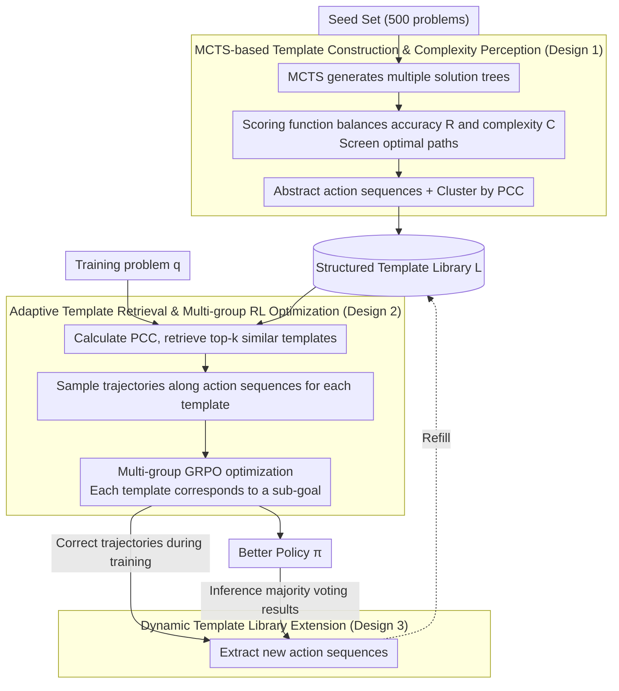

# TemplateRL: Structured Template-Guided Reinforcement Learning for LLM Reasoning

**Conference**: ACL 2026  
**arXiv**: [2505.15692](https://arxiv.org/abs/2505.15692)  
**Code**: https://github.com/THU-KEG/TemplateRL  
**Area**: LLM Reasoning / Reinforcement Learning  
**Keywords**: Reinforcement Learning, Template Guidance, Reasoning Path, LLM Optimization, GRPO

## TL;DR

TemplateRL abstracts structured reasoning templates from a small seed set using MCTS and introduces these templates as explicit guidance during reinforcement learning training. This significantly improves the efficiency and stability of multi-step reasoning in LLMs, achieving a 99% improvement over GRPO on AIME.

## Background & Motivation

**Limitations of Prior Work**: Reinforcement learning has proven to be an effective paradigm for enhancing LLM reasoning (e.g., o1, DeepSeek-R1). However, existing methods like GRPO primarily rely on unstructured self-sampling, allowing the model to explore blindly and learn from scalar reward signals. This leads to three critical issues: (1) Low sampling efficiency—the hit rate for high-quality trajectories is low, and training on weak models is prone to collapse; (2) Difficulty in learning transferable high-level strategies—models tend to memorize surface-level steps rather than distilling general "divide-and-conquer" or step-by-step thinking patterns; (3) Lack of interpretability—the reasoning process lacks an explicit strategic structure, making it difficult to diagnose and intervene.

**Key Insight**: Cognitive psychology research (Kahneman 2011) indicates that when humans solve complex problems, they do not start from scratch but apply "templates" summarized from similar problems. These high-level templates help humans adapt quickly to new problems.

**Design Motivation**: For multi-step reasoning tasks, the probability of a model generating a single correct step is much higher than completing the entire reasoning chain at once. Therefore, an explicit template library can be constructed to adaptively retrieve relevant templates during RL training, guiding the policy to generate trajectories around these templates. This provides structured strategic guidance while allowing the model to learn general reasoning approaches.

**Core Idea**: Replace unstructured exploration with a human-inspired template library, decomposing the RL learning process into multiple template-guided sub-goal optimizations to improve sampling quality, model stability, and reasoning interpretability.

## Method

### Overall Architecture

TemplateRL consists of three phases:

**Phase 1 — Template Library Construction**: MCTS is used on a small seed set (500 problems) to generate multiple solution paths. For each problem, the optimal path is selected (balancing accuracy and complexity), and the action sequence is abstracted as a template. These are clustered by problem complexity features to form a structured template library.

**Phase 2 — Template-Guided Training**: For each training problem, its complexity is calculated and matched against the template library to select the top-$k$ most similar templates. For each template, the model generates reasoning trajectories step-by-step following the template's action sequence. Sampling results from these $k$ templates are aggregated for multi-group GRPO optimization, where each template corresponds to an optimization sub-goal.

**Phase 3 — Optional Dynamic Extension**: If new correct reasoning paths are discovered during training or inference, their action sequences are automatically extracted and added to the template library to continuously enrich coverage.

### Key Designs

**1. MCTS-based Template Construction & Complexity Perception: Abstracting "How to Solve" from Few High-Quality Examples**

The root of unstructured self-sampling is that models explore blindly from scratch, resulting in low hit rates for high-quality trajectories. TemplateRL's countermeasure is to use MCTS to construct multiple solution trees on 500 seed problems, where each edge represents an "action" (e.g., "propose sub-problem," "derive next step"). For each path in the tree, a scoring function $\text{Score}(\mathbf{s}_i, \mathbf{t}_{i,j}) = b \cdot R(\mathbf{t}_{i,j}|\mathbf{s}_i) - (1-b) \cdot C(\mathbf{t}_{i,j})$ balances correctness $R$ and complexity $C$ to filter the optimal path, which is then abstracted into a template.

These templates are clustered by "Problem Condition Complexity" (PCC, the number of preconditions in a problem) to form a library $\mathcal{L} = \{\hat{T}_1, \ldots, \hat{T}_{|\mathcal{L}|}\}$. PCC acts as a proxy for problem difficulty; grouping by PCC allows retrieval to quickly match templates appropriate for the new problem's difficulty.

**2. Adaptive Template Retrieval & Multi-group RL Optimization: Decomposing Scalar Rewards into Sub-goals**

During training, the PCC of each problem $\mathbf{q}$ is calculated, and its distance to templates is measured by $d(\mathbf{q}, \hat{T}_j) = |{\rm PCC}(\mathbf{q}) - {\rm PCC}_{T_j}|$ to select the top-$k$ templates. For each template $T_i$, $G_i$ trajectories are sampled along its action sequence. The trajectories of all groups are merged into the GRPO loss:

$$\tilde{\mathcal{J}}_{\text{GRPO}}(\pi_\theta) = \frac{1}{\sum_i G_i} \sum_i \sum_j \sum_t \min[\rho_{i,j,t} A_{i,t}, \hat{\rho}_{i,j,t} A_{i,t}]$$

where $\rho$ is the probability ratio and $A$ is the advantage estimate. This is equivalent to defining a sub-goal $\mathcal{J}_i(\pi_\theta)$ for each template. The benefits are twofold: first, different templates maintain policy diversity; second, theoretically, multi-grouping increases the probability of obtaining at least one positive trajectory (Prop 3.1) and template transfer between similar problems further raises the success rate (Prop 3.2).

**3. Dynamic Template Library Extension: Enabling Continuous Growth During Training and Inference**

To overcome the limitations of a static library, TemplateRL allows for continuous evolution. During training, action sequences $T' = (a_1', \ldots, a_d')$ are parsed from correct trajectories using keyword extraction or lightweight models and added to the library. During inference, multiple paths are generated using 5 templates for each sample; the majority-voted answer is used to extract new templates for the library before processing the next sample.

## Key Experimental Results

### Main Results

| Method | MATH500 ↑ | AIME24 ↑ | AMC ↑ | Minerva ↑ | Olympiad ↑ | Average ↑ |
|------|----------|---------|-------|-----------|-----------|--------|
| Qwen2.5-Math-7B-Base | 50.8 | 13.3 | 42.5 | 12.1 | 17.2 | 27.2 |
| SimpleRL-Zero | 74.6 | 26.7 | 60.0 | 27.6 | 35.8 | 44.9 |
| Oat-Zero | 79.6 | 30.0 | 60.0 | 34.2 | 39.9 | 48.7 |
| **GRPO (Baseline)** | **76.2** | **16.7** | **55.0** | **32.7** | **38.1** | **43.8** |
| **TemplateRL (Ours)** | **83.4** | **33.3** | **77.5** | **38.2** | **46.2** | **55.8** |
| **Rel. Gain** | **+9.4%** | **+99.4%** | **+40.9%** | **+16.8%** | **+21.2%** | **+27.4%** |

TemplateRL outperforms the GRPO baseline across all benchmarks, with the most significant improvement on AIME24 (+99.4%), indicating that template guidance is most beneficial for complex reasoning problems.

### Ablation Study

| Experiment | Conclusion |
|------|------|
| Training Stability (Llama-3.2-3B) | GRPO reward collapses to 0 after 100 steps; TemplateRL remains > 0.25 |
| Cross-domain Generalization (BALROG/GPQA-D/MMLU-Pro) | Average improvement of 6%+ over GRPO |
| Multi-modal Extension (Qwen2.5-VL) | Average +8.4% on MathVision/MathVerse/MMMU/BLINK |
| Dynamic Extension (Training) | AIME24 improved from 33.3% to 36.7% (+10.2%) |
| Dynamic Extension (Inference) | GPQA-D improved from 37.9% to 40.4% (+6.6%) |
| Template Group Size $\|g\|$ | $\|g\|=2$ is the optimal balance |

## Highlights & Insights

- **Human-inspired Design with Theoretical Support**: Replacing unstructured exploration with templates is a natural idea derived from cognitive psychology. Crucially, the paper provides theoretical propositions (Prop 3.1, 3.2) proving that multi-grouping increases positive sample probability and template transfer enhances success rates.
- **Comprehensive Experimental Design & Strong Results**: Validated not only on math competitions (AIME +99%) but also across different model scales (1.5B–8B), architectures (Qwen/Llama), and modalities. Cross-domain experiments (BALROG, GPQA-D) prove it is not just overfitting to the mathematical domain.
- **Practicality of Dynamic Extension**: Unlike many RL works with fixed policies, TemplateRL supports online updates of the template library, which is valuable for scenarios requiring continuous adaptation (e.g., medical reasoning, scientific discovery).

## Limitations & Future Work

**Current Limitations**:

- Template library initialization depends on MCTS exploration and manual action space definitions. It is unclear if action spaces need redefinition for different tasks.
- Experiments focus mainly on mathematical and logical reasoning. Performance on other long-chain reasoning tasks (e.g., code generation, scientific experiment design) remains to be verified.
- The paper claims improved interpretability but lacks quantitative interpretability evaluations.

**Future Work**:

- Automatic Discovery of Action Spaces: Can task-general "action" concepts be learned automatically from correct trajectories without manual definition?
- Broader Application Exploration: Extending to code synthesis, scientific reasoning, and dialogue generation.
- Interpretability Analysis: Quantitatively measuring the abstraction level and coverage of learned templates.

## Related Work & Insights

- **vs GRPO/RL Baselines**: While other methods improve algorithms (e.g., handling length bias, KL constraints), they still rely on unstructured self-sampling. TemplateRL breaks this bottleneck through architectural innovation by introducing explicit structures.
- **vs Inference-time Template Methods** (RAG, Decomposition): Previous works used templates at inference time but did not integrate them into RL training. TemplateRL’s novelty lies in its unified training-inference template guidance mechanism.
- **Insight**: This work proves the power of "human-inspired structure + RL optimization." This approach could be applied to other tasks requiring high-level strategies, such as planning or multi-agent collaboration.

## Rating

- **Novelty**: ⭐⭐⭐⭐⭐ Introducing structured templates into RL training is a fresh perspective with clear theoretical support and intuitive design.
- **Experimental Thoroughness**: ⭐⭐⭐⭐⭐ Covers multiple model scales, architectures, domains, and modalities, with comprehensive ablations and stability checks.
- **Writing Quality**: ⭐⭐⭐⭐ Generally clear with well-marked theoretical sections, though the discussion on action space definitions could be deeper.
- **Value**: ⭐⭐⭐⭐⭐ GRPO is a mainstream RL method; a 99% improvement is significant. Stability improvements are practical for smaller models, and cross-domain generalization proves versatility.

<!-- RELATED:START -->

## Related Papers

- [\[NeurIPS 2025\] SRPO: Enhancing Multimodal LLM Reasoning via Reflection-Aware Reinforcement Learning](../../NeurIPS2025/llm_reasoning/srpo_enhancing_multimodal_llm_reasoning_via_reflection-aware_reinforcement_learn.md)
- [\[ACL 2026\] Revisiting Entropy in Reinforcement Learning for Large Reasoning Models](revisiting_entropy_in_reinforcement_learning_for_large_reasoning_models.md)
- [\[ICLR 2026\] Stabilizing Policy Gradients for Sample-Efficient Reinforcement Learning in LLM Reasoning](../../ICLR2026/llm_reasoning/stabilizing_policy_gradients_for_sample-efficient_reinforcement_learning_in_llm_.md)
- [\[NeurIPS 2025\] ExPO: Unlocking Hard Reasoning with Self-Explanation-Guided Reinforcement Learning](../../NeurIPS2025/llm_reasoning/expo_unlocking_hard_reasoning_with_self-explanation-guided_reinforcement_learnin.md)
- [\[CVPR 2026\] Scaling Agentic Reinforcement Learning for Tool-Integrated Reasoning in VLMs](../../CVPR2026/llm_reasoning/scaling_agentic_reinforcement_learning_for_tool-integrated_reasoning_in_vlms.md)

<!-- RELATED:END -->
