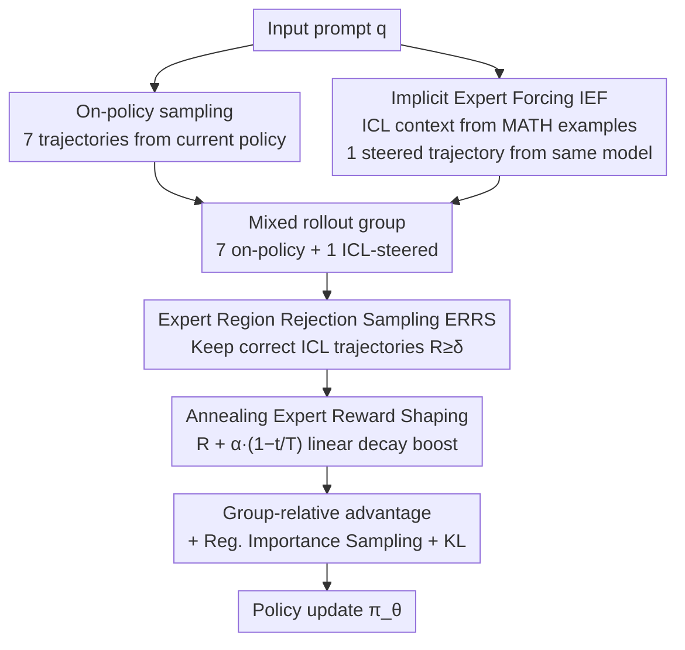

# Think Outside the Policy: In-Context Steered Policy Optimization

**Conference**: ACL 2026 Findings  
**arXiv**: [2510.26519](https://arxiv.org/abs/2510.26519)  
**Code**: [GitHub](https://github.com/Celine-hxy/ICPO)  
**Area**: LLM Reasoning / Reinforcement Learning  
**Keywords**: Reinforcement Learning, In-Context Steering, Policy Optimization, Exploration Enhancement, Mathematical Reasoning

## TL;DR

Ours proposes ICPO (In-Context Steered Policy Optimization), which leverages the large language model's own in-context learning (ICL) capability as implicit expert steering to expand the policy exploration space in RLVR training, eliminating the dependency on reasoning trajectories from external stronger models.

## Background & Motivation

**Background**: Reinforcement Learning with Verifiable Rewards (RLVR), particularly the GRPO algorithm, has become the mainstream paradigm for enhancing the mathematical reasoning capabilities of Large Reasoning Models (LRMs). However, GRPO relies on on-policy sampling, where all trajectories originate from the current policy distribution, leading to limited exploration diversity.

**Limitations of Prior Work**: (1) On-policy exploration is trapped within the current policy distribution, resulting in insufficient trajectory diversity and a tendency to fall into local optima; (2) Existing methods for expanding exploration space (e.g., LUFFY) rely on reasoning trajectories generated by stronger LRMs as off-policy samples, but these advanced models are computationally expensive and not always accessible; (3) Direct introduction of external trajectories may introduce noise, affecting training stability.

**Key Challenge**: RLVR requires sufficient exploration diversity to discover superior policies, yet on-policy sampling naturally restricts the exploration range; while introducing external expert trajectories is effective, it introduces dependency on external resources.

**Goal**: Design an RLVR framework that does not rely on external stronger models, utilizing the model's own capabilities to expand the exploration space and enhance training performance.

**Key Insight**: ICL is essentially implicit expert-conditioned reasoning—by providing examples in the input, the model shifts its reasoning distribution closer to the expert region without parameter changes. Incorporating these ICL-steered trajectories into GRPO training achieves "Implicit Expert Forcing."

**Core Idea**: Use examples from existing datasets (e.g., MATH training set) as ICL demonstrations to steer the model in generating off-policy trajectories without external stronger models, while ensuring training stability through rejection sampling and annealing reward shaping.

## Method

### Overall Architecture

ICPO introduces three components building upon standard GRPO: (1) Hybrid Policy GRPO + Implicit Expert Forcing (IEF): utilizing ICL to generate off-policy trajectories to expand the exploration space; (2) Expert Region Rejection Sampling (ERRS): filtering low-quality off-policy trajectories; (3) Annealing Expert Reward Shaping (RS): balancing early expert steering with late-stage autonomous optimization. For each prompt, 8 trajectories are generated (7 on-policy + 1 off-policy ICL-steered), and the three components are applied sequentially to the GRPO "sampling $\rightarrow$ filtering $\rightarrow$ advantage calculation $\rightarrow$ update" workflow.

### Key Designs

**1. Hybrid Policy GRPO + Implicit Expert Forcing (IEF): Using the model's own ICL capability to create off-policy trajectories without external models**

The exploration bottleneck of GRPO lies in all trajectories being sampled from the current policy distribution, which naturally limits diversity and leads to local optima. Unlike LUFFY, which uses expensive external models, ICPO's key innovation is: for each prompt $q$, randomly sample examples $\mathcal{D}$ from the MATH dataset to form $x_{\mathrm{exp}}=[\mathcal{D};q]$, then have the same model generate an ICL-steered trajectory $\tau_{\mathrm{exp}} \sim \pi_\theta(\tau|x_{\mathrm{exp}})$. From the ICL hypothesis class perspective, the Transformer encodes these examples into a task vector $\vartheta = A(\mathcal{D})$, implicitly injecting expert priors and shifting the reasoning distribution toward expert-aligned regions without modifying parameters. Each prompt results in 8 trajectories (7 on-policy + 1 ICL-steered), and group-relative advantages are recalculated over the mixed rollout group. Although all trajectories come from the same $\pi_\theta$, the ICL conditioning changes the input distribution, effectively performing "input-conditioned off-policy" sampling with zero extra model costs.

**2. Expert Region Rejection Sampling (ERRS): Training only on correct ICL trajectories to block noisy gradients**

ICL steering does not guarantee correctness. Accepting all off-policy trajectories would introduce misleading gradients and contaminate policy updates. ERRS defines an expert region $\mathcal{E}_{\mathrm{exp}} = \{(x_{\mathrm{exp}}, \tau_j) \mid R(\tau_j) \geq \delta\}$, where ICL trajectories are only included in training if their reward exceeds the threshold $\delta=1.0$ (i.e., the answer is correct). The rejection sampling operator $\rho$ ensures only high-reward trajectories participate in updates. This step is crucial for stabilizing the hybrid policy—it decouples "expanded exploration" from "guaranteed signal reliability."

**3. Annealing Expert Reward Shaping: Heavier expert imitation early on, autonomous exploration later**

A fixed expert reward boost might cause the model to over-rely on expert behavior. ICPO applies a reward for correct trajectories within the expert region that decays linearly over time:

$$R_{\mathrm{shaped}}(\tau) = R(\tau) + \alpha \cdot \gamma(t), \quad \gamma(t) = 1 - t/T$$

In early training, $\gamma(t)$ is near 1, providing strong expert steering to help the model quickly enter better policy regions. As training progresses, $\gamma(t)$ decreases and the expert boost fades, allowing the model to transition smoothly to autonomous reasoning. This "follow first, release later" annealing schedule reaps the early benefits of expert steering while avoiding long-term path dependency on expert styles.

### Loss & Training

The final objective function $\mathcal{J}_{\mathrm{ICPO}}(\theta)$ consists of on-policy and off-policy components, with the off-policy part adjusted via rejection sampling and importance ratios. Regularized importance sampling $f(x) = x/(x+\lambda)$ ($\lambda=0.01$) is used for policy shaping of off-policy trajectories. KL regularization is maintained to prevent excessive policy shift.

## Key Experimental Results

### Main Results

| Model | Method | AIME24/25 | MATH-500 | Olympiad | Avg. | Gain |
|------|------|-----------|----------|----------|------|---------|
| Qwen3-1.7B | GRPO | 28.4/22.5 | 83.6 | 48.2 | 48.4 | - |
| Qwen3-1.7B | ICPO | 31.3/26.3 | 86.8 | 56.4 | 52.5 | +4.1 |
| Qwen3-8B | GRPO | 54.8/38.5 | 91.0 | 62.4 | 63.5 | - |
| Qwen3-8B | ICPO | 55.2/43.7 | 92.0 | 65.2 | 65.7 | +2.2 |
| Qwen2.5-Math-7B | LUFFY | - | 87.6 | 57.2 | 50.1 | - |
| Qwen2.5-Math-7B | ICPO† | - | 86.6 | 53.6 | 53.4 | +3.3 vs LUFFY |

### Ablation Study

| Configuration | Avg.(1.7B) | Avg.(8B) | Description |
|------|-----------|----------|------|
| ICPO (Full) | 51.8 | 65.8 | Complete model |
| - ERRS | 50.6 | 65.0 | Removing rejection sampling reduces performance |
| - IEF (=GRPO) | 48.4 | 63.8 | Removing ICL steering reverts to standard GRPO |
| CoT vs PoT Expert Data | 51.8 vs 51.5 | 65.8 vs 65.1 | Robust to expert data types |

### Key Findings
- ICL-steered trajectories not only improve accuracy but also enhance trajectory diversity (larger edit distance) and distribution quality (higher "flip" ratio—from incorrect to correct).
- ICPO maintains higher policy entropy throughout training, reflecting broader policy support and more thorough exploration.
- ICPO is robust to expert data selection—consistent gains are achieved even using cross-domain data in Program-of-Thought (PoT) format.
- The ICPO† variant with reward shaping performs better on OOD benchmarks, indicating that the annealing strategy aids generalization.

## Highlights & Insights
- **Theoretical Perspective of ICL as Implicit Expert Forcing**: Decomposing ICL hypothesis classes and linking them to expert forcing provides an elegant theoretical explanation.
- **Zero Extra Model Dependency**: Compared to methods like LUFFY, ICPO requires no external stronger models, using only existing datasets as ICL demonstrations.
- **Plug-and-play Framework Design**: The target policy distribution can be flexibly adjusted by changing expert data, offering high scalability.
- **Visualization of Training Dynamics**: Reward and entropy curves clearly demonstrate ICPO's advantages over standard GRPO.

## Limitations & Future Work
- Experiments primarily focused on mathematical reasoning; cross-domain generalization (e.g., code generation, common sense reasoning) remains to be fully verified.
- The quality of ICL steering depends on the quality of demonstrations; effectiveness may be limited for extremely difficult problems.
- Only 1 off-policy trajectory is used per prompt (7+1 configuration); more flexible ratio strategies are worth exploring.
- Future work could combine ICPO with other exploration enhancement techniques (e.g., temperature tuning, replay buffers).

## Related Work & Insights
- **vs LUFFY**: LUFFY requires reasoning trajectories from stronger LRMs as off-policy samples; ICPO replaces external models with ICL, outperforming LUFFY by +3.3 on Qwen2.5-Math-7B.
- **vs GRPO + Extra Rollouts**: Simply increasing the number of rollouts yields limited benefits; ICPO's ICL steering provides much more effective exploration signals.
- **vs ReLIFT**: ReLIFT alternates between RL and SFT, introducing training instability; ICPO unifies SFT signals and RL optimization within a single framework.

## Rating
- Novelty: ⭐⭐⭐⭐ Reinterpreting ICL as implicit expert forcing within an RLVR framework is a novel approach.
- Experimental Thoroughness: ⭐⭐⭐⭐ Comprehensive evaluation across multiple models and benchmarks, including ablations, data type analysis, and training dynamics.
- Writing Quality: ⭐⭐⭐⭐ Clear framework, complete derivations, and good integration of theoretical motivation with experimental validation.
- Value: ⭐⭐⭐⭐ Provides a low-cost RLVR exploration enhancement paradigm with practical value for LRM post-training.

<!-- RELATED:START -->

## Related Papers

- [\[ICLR 2026\] Slow-Fast Policy Optimization: Reposition-Before-Update for LLM Reasoning](../../ICLR2026/llm_reasoning/slow-fast_policy_optimization_reposition-before-update_for_llm_reasoning.md)
- [\[ACL 2026\] Adapt to Thrive! Adaptive Power-Mean Policy Optimization for Improved LLM Reasoning](adapt_to_thrive_adaptive_power-mean_policy_optimization_for_improved_llm_reasoni.md)
- [\[CVPR 2026\] APPO: Attention-guided Perception Policy Optimization for Video Reasoning](../../CVPR2026/llm_reasoning/appo_attention-guided_perception_policy_optimization_for_video_reasoning.md)
- [\[ACL 2026\] Calibration-Aware Policy Optimization for Reasoning LLMs](calibration-aware_policy_optimization_for_reasoning_llms.md)
- [\[ICLR 2026\] Scaf-GRPO: Scaffolded Group Relative Policy Optimization for Enhancing LLM Reasoning](../../ICLR2026/llm_reasoning/scaf-grpo_scaffolded_group_relative_policy_optimization_for_enhancing_llm_reason.md)

<!-- RELATED:END -->
