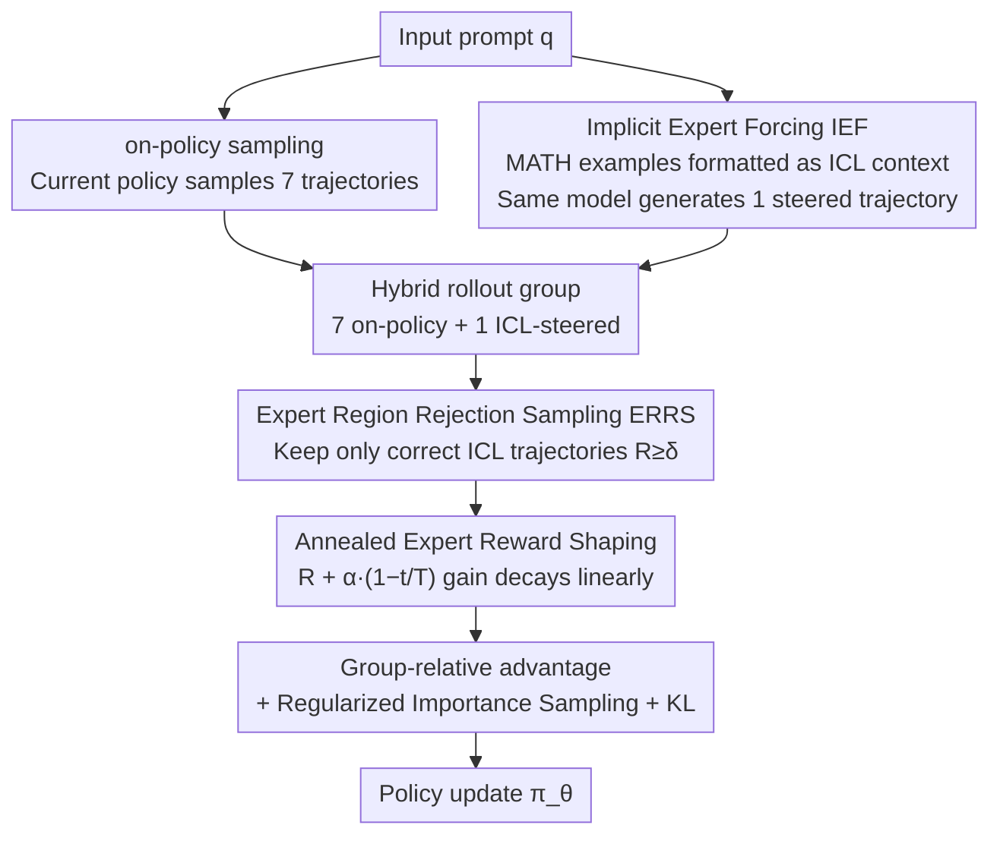

# Think Outside the Policy: In-Context Steered Policy Optimization

**Conference**: ACL 2026 Findings  
**arXiv**: [2510.26519](https://arxiv.org/abs/2510.26519)  
**Code**: [GitHub](https://github.com/Celine-hxy/ICPO)  
**Area**: LLM Reasoning / Reinforcement Learning  
**Keywords**: Reinforcement Learning, In-Context Steering, Policy Optimization, Exploration Enhancement, Mathematical Reasoning

## TL;DR

Ours proposes ICPO (In-Context Steered Policy Optimization), which leverages the large language model's inherent in-context learning (ICL) capability as an implicit expert steer to expand the policy exploration space during RLVR training, without depending on reasoning trajectories from external stronger models.

## Background & Motivation

**Background**: Reinforcement Learning from Verifiable Rewards (RLVR), particularly the GRPO algorithm, has become a mainstream paradigm for enhancing the mathematical reasoning capabilities of Large Reasoning Models (LRMs). However, GRPO relies on on-policy sampling, where all trajectories originate from the current policy distribution, leading to limited exploration diversity.

**Limitations of Prior Work**: (1) On-policy exploration is confined to the current policy distribution, lacking trajectory diversity and easily falling into local optima; (2) Existing methods to expand exploration space (e.g., LUFFY) depend on reasoning trajectories generated by stronger LRMs as off-policy samples, but these advanced models are computationally expensive and not always accessible; (3) Direct introduction of external trajectories may introduce noise, affecting training stability.

**Key Challenge**: RLVR requires sufficient exploration diversity to discover better policies, but on-policy sampling naturally limits the exploration range; while introducing external expert trajectories is effective, it introduces dependency on external resources.

**Goal**: To design an RLVR framework that does not rely on external stronger models, utilizing the model's own capabilities to expand the exploration space and enhance training performance.

**Key Insight**: ICL is essentially implicit expert-conditioned reasoning—by providing examples in the input, the model shifts its reasoning distribution closer to the expert region without parameter changes. Incorporating these ICL-steered trajectories into GRPO training achieves "Implicit Expert Forcing."

**Core Idea**: Use examples from existing datasets (e.g., MATH training set) as ICL demonstrations to guide the model in generating off-policy trajectories, eliminating the need for external stronger models, while ensuring training stability through rejection sampling and annealed reward shaping.

## Method

### Overall Architecture

ICPO introduces three components based on standard GRPO: (1) Hybrid Policy GRPO + Implicit Expert Forcing (IEF): uses ICL to generate off-policy trajectories and expand the exploration space; (2) Expert Region Rejection Sampling (ERRS): filters low-quality off-policy trajectories; (3) Annealed Expert Reward Shaping (RS): balances early expert steering with later autonomous optimization. For each prompt, 8 trajectories are generated (7 on-policy + 1 off-policy ICL-steered), which are sequentially processed through the GRPO "sampling → filtering → advantage calculation → update" pipeline.

### Key Designs

**1. Mixed Policy GRPO + Implicit Expert Forcing (IEF): Using model's ICL capability to create off-policy trajectories without external stronger models**

The exploration bottleneck of GRPO is that all trajectories are sampled from the current policy distribution, which limits diversity and risks local optima. Unlike LUFFY, which requires external strong models, ICPO's approach is: for each prompt $q$, randomly sample several examples $\mathcal{D}$ from the MATH dataset to form $x_{\mathrm{exp}}=[\mathcal{D};q]$, and let the same model generate an ICL-steered trajectory $\tau_{\mathrm{exp}} \sim \pi_\theta(\tau|x_{\mathrm{exp}})$. From the perspective of Transformer hypothesis classes, these examples are encoded internally as a task vector $\vartheta = A(\mathcal{D})$, essentially injecting an implicit expert prior without moving parameters, shifting the reasoning distribution toward expert-aligned regions. Each prompt group eventually contains 8 trajectories (7 on-policy + 1 ICL-steered) to recompute group-relative advantage. Although all trajectories come from the same $\pi_\theta$, ICL conditioning changes the input distribution, performing "input-conditioned off-policy" sampling without extra models.

**2. Expert Region Rejection Sampling (ERRS): Only allow correct ICL trajectories into training to block noisy gradients**

ICL steering does not guarantee correctness. Accepting all off-policy trajectories could introduce misleading gradients and contaminate policy updates. ERRS defines an expert region $\mathcal{E}_{\mathrm{exp}} = \{(x_{\mathrm{exp}}, \tau_j) \mid R(\tau_j) \geq \delta\}$. Only when the ICL trajectory reward exceeds the threshold $\delta=1.0$ (i.e., the answer is correct) is it included in training. The rejection sampling operator $\rho$ ensures only high-reward trajectories participate in updates. This step is critical for stabilization, decoupling exploration expansion from signal reliability.

**3. Annealed Expert Reward Shaping: Emulate experts early, explore autonomously later**

A fixed expert reward bonus might lead to over-reliance on expert behavior. ICPO applies a reward bonus to correct trajectories within the expert region that decays linearly over time:

$$R_{\mathrm{shaped}}(\tau) = R(\tau) + \alpha \cdot \gamma(t), \quad \gamma(t) = 1 - t/T$$

Early in training, $\gamma(t)$ is close to 1, providing strong expert steering to help the model quickly reach better policy regions. As training progresses, $\gamma(t)$ decreases and the expert bonus fades, allowing the model to transition smoothly to autonomous reasoning. This "emulate then release" annealing schedule captures early gains while avoiding long-term path dependency on expert styles.

### Loss & Training

The final objective function $\mathcal{J}_{\mathrm{ICPO}}(\theta)$ consists of on-policy and off-policy components, with the off-policy part adjusted via rejection sampling and importance ratios. Regularized importance sampling $f(x) = x/(x+\lambda)$ with $\lambda=0.01$ is used for policy shaping of off-policy trajectories. KL regularization is maintained to prevent excessive policy drift.

## Key Experimental Results

### Main Results

| Model | Method | AIME24/25 | MATH-500 | Olympiad | Avg. | Gain |
|------|------|-----------|----------|----------|------|---------|
| Qwen3-1.7B | GRPO | 28.4/22.5 | 83.6 | 48.2 | 48.4 | - |
| Qwen3-1.7B | ICPO | 31.3/26.3 | 86.8 | 56.4 | 52.5 | +4.1 |
| Qwen3-8B | GRPO | 54.8/38.5 | 91.0 | 62.4 | 63.5 | - |
| Qwen3-8B | ICPO | 55.2/43.7 | 92.0 | 65.2 | 65.7 | +2.2 |
| Qwen2.5-Math-7B | LUFFY | - | 87.6 | 57.2 | 50.1 | - |
| Qwen2.5-Math-7B | ICPO† | - | 86.6 | 53.6 | 53.4 | +3.3 vs LUFFY |

### Ablation Study

| Configuration | Avg.(1.7B) | Avg.(8B) | Description |
|------|-----------|----------|------|
| ICPO (Full) | 51.8 | 65.8 | Complete model |
| - ERRS | 50.6 | 65.0 | Removing rejection sampling reduces performance |
| - IEF (=GRPO) | 48.4 | 63.8 | Removing ICL steering reverts to standard GRPO |
| CoT vs PoT data | 51.8 vs 51.5 | 65.8 vs 65.1 | Robust to expert data types |

### Key Findings
- ICL-steered trajectories not only improve accuracy but also enhance trajectory diversity (larger edit distance) and distribution quality (higher "flipping" ratio—from incorrect to correct).
- ICPO maintains higher policy entropy during training, reflecting broader policy support and more thorough exploration.
- ICPO is robust to the choice of expert data—consistent gains are observed even when using cross-domain data in Program-of-Thought (PoT) format.
- The ICPO† variant with reward shaping performs better on OOD benchmarks, indicating that annealing strategies aid generalization.

## Highlights & Insights
- **Theoretical perspective of ICL as Implicit Expert Forcing**: Anchoring ICL hypothesis class decomposition to Expert Forcing provides an elegant theoretical explanation.
- **Zero additional model dependency**: Unlike LUFFY, ICPO requires no external stronger models, only existing datasets as ICL demonstrations.
- **Plug-and-play framework design**: Replacing expert data allows flexible control over target policy distributions, offering high scalability.
- **Visualization of training dynamics**: Reward and entropy curves clearly demonstrate ICPO's advantages over GRPO.

## Limitations & Future Work
- Experiments primarily focused on mathematical reasoning; cross-domain generalization (e.g., code generation, common sense reasoning) requires further verification.
- The quality of ICL steering depends on the quality of demonstrations, which may have limited effects on extremely difficult problems.
- Each prompt uses only 1 off-policy trajectory (7+1 configuration); more flexible ratio strategies are worth exploring.
- Future work could combine ICPO with other exploration enhancement techniques such as temperature tuning or replay buffers.

## Related Work & Insights
- **vs LUFFY**: LUFFY requires reasoning trajectories from stronger LRMs as off-policy samples. ICPO replaces external models with ICL, outperforming LUFFY by +3.3 on Qwen2.5-Math-7B.
- **vs GRPO + Extra Rollouts**: Simply increasing rollout numbers shows limited effect; ICPO's ICL steering provides more effective exploration signals.
- **vs ReLIFT**: ReLIFT alternates between RL and SFT, introducing training instability. ICPO unifies SFT signals and RL optimization within a single framework.

## Rating
- Novelty: ⭐⭐⭐⭐ Reinterpreting ICL as implicit expert forcing and integrating it into RLVR is a novel approach.
- Experimental Thoroughness: ⭐⭐⭐⭐ Comprehensive evaluation across multiple models and benchmarks, including ablation, expert data analysis, and training dynamics.
- Writing Quality: ⭐⭐⭐⭐ Clear framework, complete derivations, and strong coupling between theoretical motivation and experimental validation.
- Value: ⭐⭐⭐⭐ Provides a low-cost exploration enhancement paradigm for RLVR, offering practical value for LRM post-training.

<!-- RELATED:START -->

## Related Papers

- [\[ICML 2026\] UCPO: Uncertainty-Aware Policy Optimization](../../ICML2026/llm_reasoning/ucpo_uncertainty-aware_policy_optimization.md)
- [\[ICLR 2026\] Slow-Fast Policy Optimization: Reposition-Before-Update for LLM Reasoning](../../ICLR2026/llm_reasoning/slow-fast_policy_optimization_reposition-before-update_for_llm_reasoning.md)
- [\[ACL 2026\] Adapt to Thrive! Adaptive Power-Mean Policy Optimization for Improved LLM Reasoning](adapt_to_thrive_adaptive_power-mean_policy_optimization_for_improved_llm_reasoni.md)
- [\[CVPR 2026\] APPO: Attention-guided Perception Policy Optimization for Video Reasoning](../../CVPR2026/llm_reasoning/appo_attention-guided_perception_policy_optimization_for_video_reasoning.md)
- [\[ACL 2026\] N-GRPO: Embedding-Level Neighbor Mixing for Enhanced Policy Optimization](n-grpo_embedding-level_neighbor_mixing_for_enhanced_policy_optimization.md)

<!-- RELATED:END -->
