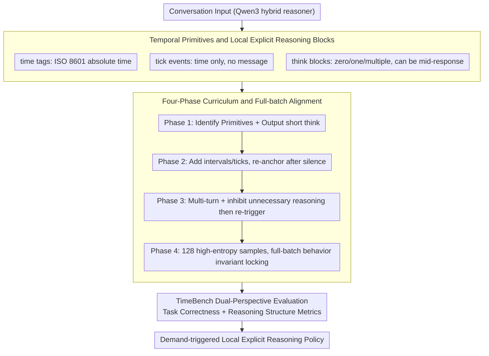

# TIME: Temporally Intelligent Meta-Reasoning Engine for Context-Triggered Explicit Reasoning

**Conference**: ACL 2026 Findings  
**arXiv**: [2601.05300](https://arxiv.org/abs/2601.05300)  
**Code**: https://github.com/The-Coherence-Initiative/TIME / https://github.com/The-Coherence-Initiative/TIMEBench  
**Area**: LLM Reasoning / Temporal Reasoning / Behavioral Alignment  
**Keywords**: Explicit reasoning control, Temporal context, Meta-reasoning, TimeBench, QLoRA alignment  

## TL;DR
TIME transforms explicit reasoning from a "permanently active long chain-of-thought" into a locally controlled strategy triggered by temporal and discourse cues. Through `time` tags, tick events, short `think` blocks, and a four-phase QLoRA curriculum, Qwen3 models significantly outperform thinking/no-thinking baselines on TimeBench while compressing reasoning tokens by approximately an order of magnitude.

## Background & Motivation
**Background**: Reasoning language models typically utilize explicit reasoning traces to improve performance in arithmetic, coding, and multi-step QA. Many systems design this ability as an inference-time mode: either consistently outputting long chains-of-thought or disabling them entirely via a toggle.

**Limitations of Prior Work**: Fixed reasoning modes are cumbersome. Long, prefixed reasoning blocks increase token costs and latency; they usually cover the entire response at once, making the mapping between individual claims and specific evidence unclear. More importantly, once a model begins its formal response, it is difficult to re-enter an explicit checking state midway due to new cues.

**Key Challenge**: Reasoning requirements in real conversations are determined not only by task type but also by changes in context state. The underlying state differs significantly whether a user replies after two seconds or two weeks: deadlines may have passed, plans may have expired, or user circumstances may have changed. Standard models that cannot perceive or utilize temporal structures treat these interaction state differences as irrelevant noise.

**Goal**: The authors aim to align explicit reasoning as a context-triggered control policy: the model independently decides when brief explicit reasoning is necessary. Reasoning blocks can appear at the beginning, middle, or end of a response, triggering only when cues such as time, contradictions, silence, or target shifts suggest a need for "re-anchoring."

**Key Insight**: Time serves as an effective probe. Its purpose is not to test how many temporal facts a model remembers, but to create controllable latent state changes: long intervals, textless ticks, invalid dates, timezone shifts, approaching deadlines, or temporal reversals can all trigger the model to re-examine assumptions.

**Core Idea**: Teach the model "when to reason, where to reason, and for how long" using lightweight temporal primitives and short `think` blocks, then utilize TimeBench to evaluate both task correctness and structural changes in explicit reasoning.

## Method
The objective of TIME is not to train a model that memorizes temporal knowledge more effectively, but to train a model that better allocates explicit reasoning resources. It is built upon Qwen3 dense hybrid reasoners, as Qwen3 natively supports both thinking and no-thinking modes, making it suitable for learning fine-grained intermediate strategies.

### Overall Architecture
Conversation inputs carry three types of textual primitives. The first is the `time` tag, providing an absolute timestamp for user turns in ISO 8601 format. The second is the `think` block, serving as a short burst of explicit reasoning in model outputs, which can occur zero, one, or multiple times, including in the middle of a response. The third is the tick event, where a user turn contains only a time tag without a message, representing silence and the passage of time.

Training employs a four-phase SFT curriculum. Phase 1 teaches the model to identify primitives and formats, outputting short and clearly bounded `think` blocks; Phase 2 introduces two-turn dialogues, temporal intervals, and ticks to enable re-anchoring after silence; Phase 3 extends this to multi-turn interactions, topic shifts, and contextual modulation, training the model to inhibit unnecessary reasoning and re-trigger it later; Phase 4 uses 128 manually constructed dialogues that are superficially diverse but share the same behavioral invariant to perform full-batch alignment, optimizing the policy of "triggering local reasoning via contextual cues."

Evaluation utilizes TimeBench, which consists of 77 scenarios across 7 diagnostic categories. Each scenario is sampled 10 times for a total of 770 runs. TimeBench does not test temporal fact recall but rather whether the model can infer latent context states from temporal structures and adjust the final response. Besides binary task success rates, it records `think` block occurrence, position, count, reasoning tokens, output tokens, markdown usage, and degeneracy rates.

### Key Designs

**1. Temporal Primitives and Local Explicit Reasoning Blocks: Deconstructing reasoning from "long prefixes" to "on-demand short checks"**

The greatest flaw of fixed reasoning modes is that once the model starts formalizing an answer, it becomes difficult to return to an explicit checking state due to new cues. Many errors in real interactions arise from stale assumptions rather than a lack of knowledge. TIME introduces three lightweight primitives to turn implicit state changes into learnable signals: `time` tags provide absolute time for each turn via ISO 8601, allowing the model to perceive intervals directly; tick events represent turns with only time tags and no messages, conveying "silence + passage of time"; `think` blocks are no longer monolithic prefixes but localized checks that can appear zero, one, or multiple times, even mid-response. This allows the model to trigger a brief reasoning burst to re-anchor when it perceives an assumption might be stale, strictly limiting reasoning costs to where they are truly needed.

**2. Four-Phase Curriculum and Full-batch Alignment: Forcing the model to learn "triggering strategies" rather than "superficial correlations"**

Performing SFT on a small number of target samples can cause the model to memorize superficial correlations like topics or styles, leading to templated reasoning or format breakdown rather than learning the behavioral invariant of "triggering local reasoning via contextual cues." TIME addresses this by splitting training into a four-phase curriculum: Phase 1 teaches primitive identification and bounded `think` outputs; Phase 2 introduces multi-turn gaps and ticks for re-anchoring; Phase 3 expands to contextual modulation and inhibiting unnecessary reasoning; these first three phases include 25% replay to preserve prior behaviors. Phase 4 removes replay and Uses 128 manually constructed, high-entropy dialogues to perform full-batch updates—where the only commonality is "triggering a brief `think` block when temporal or discourse cues require it." By exposing the gradient to the full diversity of high-entropy samples simultaneously, updates concentrate on this invariant behavior.

**3. TimeBench Dual-Perspective Evaluation: Assessing correctness alongside reasoning strategy shifts**

Relying solely on accuracy metrics is risky, as score improvements might result from longer outputs or judge preferences for verbosity rather than actual strategy shifts. TimeBench records both task correctness and reasoning structural signals. It comprises 77 scenarios across 7 diagnostic categories (chronological retrospection, invalid time detection, temporal adaptivity, temporal contextual awareness, temporal flow anomaly detection, time gap awareness, timezone sensitivity). Each output is scored by a blind LLM-as-a-judge on a binary objective, while structural analysis tracks `think` block occurrence, position, count, tokens, and degeneracy rates. This dual-metric approach verifies that TIME genuinely shifts from long redundant reasoning to short, localized, demand-triggered reasoning, rather than simply inflating scores with token volume.

### Loss & Training
Training uses QLoRA supervised fine-tuning with frozen base model weights. Phases 1-3 use consistent settings: rank 32, $\alpha=32$, dropout 0.05, AdamW-8bit, learning rate $2\times 10^{-5}$, effective batch size 32, 3 epochs, and gradient checkpointing with 25% replay. Data sizes are 2,188 train / 387 test for Phase 1, 5,291 train / 935 test for Phase 2, and 5,878 train / 1,039 test for Phase 3.

Phase 4 utilizes 128 manual multi-turn dialogues with an effective batch size of 128 (viewing the whole set each step); learning rate $1.5\times 10^{-4}$ with 6 warm-up steps. The authors noted a narrow stability window for Phase 4: early stopping fails to learn the strategy, while late stopping leads to infinite loops and style collapse. Checkpoints where training loss first enters $[1.045, 1.050]$ were selected, corresponding to epoch 18/24/30/31 for the 32B/14B/8B/4B models respectively.

## Key Experimental Results

### Main Results
TIME outperforms both Qwen3 thinking and no-thinking baselines across all four model scales. Improvement is significant even at 32B, rising from 37.40 in thinking mode to 64.81. Scenario-level Wilcoxon signed-rank tests confirmed that gains relative to the thinking baseline are $p<0.001$ for every scale.

| Model Size | Qwen3 No-Thinking | Qwen3 Thinking | TIME | Gain vs. Thinking |
|------------|-------------------|----------------|------|-------------------|
| 4B         | 17.53             | 30.13          | 52.60| +22.47            |
| 8B         | 21.56             | 32.99          | 59.87| +26.88            |
| 14B        | 29.48             | 34.42          | 64.80| +30.38            |
| 32B        | 31.82             | 37.40          | 64.81| +27.41            |

Confidence intervals support these conclusions. The 95% CI for TIME-4B is 44.55-60.39 (vs. 23.90-36.36 for the thinking baseline), and for TIME-32B it is 58.18-71.17 (vs. 31.56-43.51 for the thinking baseline). Across all scales, TIME CI ranges do not overlap with their respective thinking baselines.

| Model | TimeBench Score | 95% CI | WSR p-value vs Thinking | Conclusion |
|-------|-----------------|--------|-------------------------|------------|
| TIME-4B | 52.60          | 44.55-60.39 | 3.8e-4 | Small models clearly learned the strategy |
| TIME-8B | 59.87          | 53.38-66.23 | 1.9e-5 | Performance nears 14B/32B levels |
| TIME-14B| 64.80          | 59.09-70.39 | 1.6e-6 | One of the top overall performers |
| TIME-32B| 64.81          | 58.18-71.17 | 5.0e-7 | Large models benefit significantly |

### Ablation Study
Phase-wise ablation for the 32B model demonstrates how capabilities and structure evolve together. The standard thinking mode outputs a long `think` block at the start nearly every time, averaging 910.52 thinking tokens and 1573.47 total tokens with an 18.18% degeneracy rate. After Phase 2, reasoning tokens drop to 76.59 and mid-turn `think` blocks begin to appear. The final TIME-32B averages 84.16 thinking tokens and 332.64 total tokens while achieving the highest score.

| Model / Phase | Score | Runs w/ `think` | Mean # `think` | Think Position Start/Mid/End | Thinking Tokens | Output Tokens | Degeneracy |
|---------------|-------|-----------------|----------------|-------------------------------|-----------------|---------------|------------|
| No-Thinking   | 31.82 | 0.0%            | 0.00           | -                             | 0.00            | 608.96        | 4.42%      |
| Thinking      | 37.40 | 99.2%           | 0.99           | 100.0 / 0.0 / 0.0             | 910.52          | 1573.47       | 18.18%     |
| Phase 1       | 42.47 | 99.5%           | 0.99           | 100.0 / 0.0 / 0.0             | 803.52          | 1434.56       | 13.90%     |
| Phase 2       | 56.88 | 95.6%           | 1.12           | 70.7 / 29.1 / 0.2             | 76.59           | 362.45        | 4.68%      |
| Phase 3       | 52.08 | 89.2%           | 1.25           | 55.0 / 44.6 / 0.4             | 52.94           | 294.51        | 0.78%      |
| TIME          | 64.81 | 80.6%           | 1.67           | 24.1 / 75.6 / 0.2             | 84.16           | 332.64        | 3.64%      |

### Key Findings
- Gains from TIME do not come from "thinking longer." Compared to Qwen3 thinking, TIME-32B thinking tokens dropped from 910.52 to 84.16, while the TimeBench score rose from 37.40 to 64.81.
- Phase 2 is a behavioral turning point. After introducing intervals and ticks, the score rose from 42.47 (Phase 1) to 56.88, while reasoning length dropped sharply, indicating temporal exposure helps models escape fixed prefix-based reasoning.
- Phase 3 emphasizes stability and inhibition, reducing degeneracy to 0.78%, though scores in some anomaly categories fluctuated. Final Phase 4 training improved these categories while maintaining brevity.
- Mid-turn reasoning is a critical structural change. In the final TIME-32B model, 75.6% of `think` blocks are positioned mid-turn, whereas they were 100% at the start in original thinking modes.
- Temporal cues are probes, not the sole triggers. Post-training analysis suggests the strategy also reacts to purely textual cues like contradictions or target changes.

## Highlights & Insights
- The paper reframes explicit reasoning from a capability issue into a resource scheduling problem. The focus is not on "if the model can think," but "when it is worth externalizing that thought."
- TimeBench's design is insightful: it avoids testing historical date knowledge and treats time as an observable signal of latent state changes, which is more relevant for assistants and agents than standard temporal QA.
- Phase 4's full-batch alignment is a notable recipe for low-data behavioral alignment. By minimizing superficial correlations through high diversity, the behavioral invariant becomes the primary gradient direction.
- Structural metrics lend credibility. Score gains alone might be dismissed as judge bias, but the simultaneous decrease in reasoning tokens and increase in mid-turn triggers prove a fundamental change in behavior.

## Limitations & Future Work
- Experiments are restricted to Qwen3 dense hybrid reasoners. Transferability to pure instruct models, MoE hybrid reasoners, or other model families has not been verified.
- Evaluation is limited to TimeBench. Absence of systematic testing on general benchmarks (math, code, tool use) means potential side effects on general reasoning are unknown.
- TimeBench contains only 77 scenarios and was developed alongside the framework, lacking the scale of independent massive benchmarks.
- Scoring relies on LLM-as-a-judge. While the judge is blinded and uses repetition and bootstrapping, false positives/negatives remain possible.
- Focus is primarily on English scenarios. Multilingual performance, safety, and fairness in high-stakes temporal decisions have not been explored.

## Related Work & Insights
- **vs. Chain-of-Thought prompting**: Whereas CoT treats reasoning as a long prefix, TIME turns it into a short, injectable, and repeatable local action.
- **vs. hybrid reasoning / think-only-when-needed**: Existing hybrid reasoning often relies on task difficulty; TIME focuses on context state changes, especially assumption invalidation from temporal cues.
- **vs. temporal knowledge modeling**: Unlike Time-Aware LM or ChronoSense which focus on temporal facts/events, TIME treats time as a dialogue state and meta-reasoning trigger.
- **Inspiration for future research**: Temporal cues could be replaced by other state signals (tool failure, goal updates, retrieval conflicts) to train models to trigger reasoning bursts at those specific nodes.

## Rating
- Novelty: ⭐⭐⭐⭐☆ Using temporal cues for explicit reasoning control rather than QA is a fresh perspective.
- Experimental Thoroughness: ⭐⭐⭐⭐☆ Covers four model scales and includes curriculum ablation, though restricted to TimeBench.
- Writing Quality: ⭐⭐⭐⭐☆ Clear narrative with natural transitions between methodology and structural metrics.
- Value: ⭐⭐⭐⭐☆ Highly insightful for "on-demand brief reasoning" in agents needing low latency and context re-anchoring.

<!-- RELATED:START -->

## Related Papers

- [\[ICLR 2026\] C-Voting: Confidence-Based Test-Time Voting without Explicit Energy Functions](../../ICLR2026/llm_reasoning/c-voting_confidence-based_test-time_voting_without_explicit_energy_functions.md)
- [\[ICML 2026\] Verifying Meta-Awareness via Predictive Rewards in Reasoning Models](../../ICML2026/llm_reasoning/verifying_meta-awareness_via_predictive_rewards_in_reasoning_models.md)
- [\[ACL 2026\] DELTA: Dynamic Layer-Aware Token Attention for Efficient Long-Context Reasoning](delta_dynamic_layer-aware_token_attention_for_efficient_long-context_reasoning.md)
- [\[ACL 2026\] Think Outside the Policy: In-Context Steered Policy Optimization](think_outside_the_policy_in-context_steered_policy_optimization.md)
- [\[ACL 2026\] Long-Context Reasoning Through Proxy-Based Chain-of-Thought Tuning](long-context_reasoning_through_proxy-based_chain-of-thought_tuning.md)

<!-- RELATED:END -->
