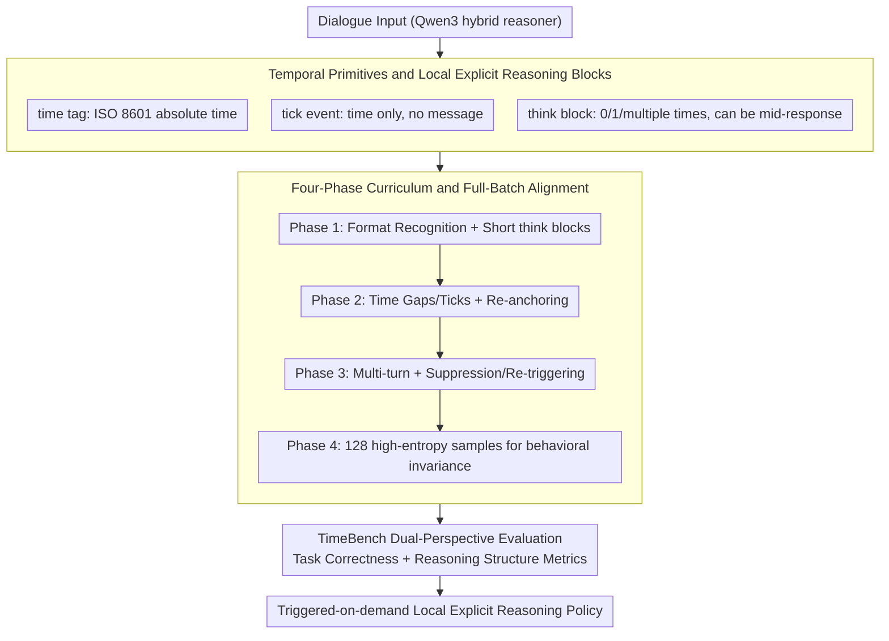

# TIME: Temporally Intelligent Meta-Reasoning Engine for Context-Triggered Explicit Reasoning

**Conference**: ACL 2026 Findings  
**arXiv**: [2601.05300](https://arxiv.org/abs/2601.05300)  
**Code**: https://github.com/The-Coherence-Initiative/TIME / https://github.com/The-Coherence-Initiative/TIMEBench  
**Area**: LLM Reasoning / Temporal Reasoning / Behavioral Alignment  
**Keywords**: Explicit Reasoning Control, Temporal Context, Meta-Reasoning, TimeBench, QLoRA Alignment  

## TL;DR
TIME transforms explicit reasoning from an "always-on long chain-of-thought" into a locally controlled strategy triggered by temporal and discourse cues. By utilizing `time` tags, tick events, short `think` blocks, and a four-phase QLoRA curriculum training, the Qwen3 series significantly outperforms thinking/no-thinking baselines on TimeBench while compressing reasoning tokens to approximately one-tenth of the original scale.

## Background & Motivation
**Background**: Reasoning language models typically utilize explicit reasoning traces to improve performance in arithmetic, coding, and multi-step QA tasks. Many systems design this capability as an inference-time mode: either outputting a long chain-of-thought by default or turning it off entirely via a toggle.

**Limitations of Prior Work**: Fixed reasoning modes are cumbersome. Long, prefix-heavy reasoning blocks increase token costs and latency; they usually cover the entire response at once, leading to unclear correspondences between individual claims and specific evidence. More importantly, once a model begins its formal response, it is difficult to re-enter an explicit checking state midway due to new cues.

**Key Challenge**: Reasoning needs in real-world conversations are determined not only by task type but also by changes in context state. A user replying after two seconds versus two weeks may use similar text, but the underlying states are different: deadlines may have passed, plans may have expired, or the user's situation may have changed. Standard models that cannot see or utilize temporal structures treat these interaction state differences as irrelevant information.

**Goal**: The authors aim to align explicit reasoning as a context-triggered control policy: the model independently decides when brief explicit reasoning is necessary. Reasoning blocks can appear at the beginning, middle, or end of a response and are triggered only when cues such as time, contradictions, silence, or goal changes signal a "need for re-anchoring."

**Key Insight**: Time serves as an excellent probe. It is not intended to test how many temporal facts the model remembers, but to create controllable latent state changes: long intervals, text-less ticks, invalid dates, timezone shifts, approaching deadlines, or temporal reversals can all trigger the model to re-examine its hypotheses.

**Core Idea**: Use lightweight temporal primitives and short `think` blocks to teach the model "when to reason, where to reason, and how long to reason," then evaluate both task correctness and structural changes in explicit reasoning using TimeBench.

## Method
The goal of TIME is not to train a model to better memorize temporal knowledge, but to train a model to better allocate explicit reasoning resources. It is based on Qwen3 dense hybrid reasoners, as Qwen3 natively supports both thinking and no-thinking modes, making it suitable for learning more fine-grained intermediate strategies.

### Overall Architecture
Input dialogues can carry three types of textual primitives. The first is the `time` tag, which adds absolute time to user turns in ISO 8601 format. The second is the `think` block, serving as a short burst of explicit reasoning in the model's output, which can appear zero, one, or multiple times, and can be situated in the middle of a response. The third is the tick event, where a user turn contains only a time tag and no message, representing silence and the passage of time.

Training employs a four-phase SFT curriculum. Phase 1 teaches the model to recognize primitives and formats, outputting short and clearly bounded `think` blocks; Phase 2 introduces two-turn dialogues, time intervals, and ticks, allowing the model to re-anchor after silence; Phase 3 extends to multi-turn dialogues, topic changes, and contextual modulation, training the model to suppress unnecessary reasoning and re-trigger it later; Phase 4 uses 128 manually constructed dialogues that are surface-diverse but share the same behavioral invariant for full-batch alignment, focusing optimization on the "local reasoning triggered by contextual cues" policy.

Evaluation uses TimeBench, which includes 77 scenarios across 7 diagnostic categories, with 11 scenarios per category; each scenario is sampled 10 times for a total of 770 runs. TimeBench does not test temporal fact recall but assesses whether the model can infer latent context states from temporal structures and adjust the final turn's response. In addition to binary task success rates, it records `think` block presence, position, count, reasoning tokens, output tokens, markdown usage, and the proportion of degenerate outputs.

### Key Designs

**1. Temporal Primitives and Local Explicit Reasoning Blocks: Decoupling reasoning from "long prefixes" to "on-demand short checks"**

The primary flaw of fixed reasoning modes is that once a model starts its formal response, it is difficult to return to an explicit checking state due to new cues. Many errors in real interactions stem from stale assumptions rather than a lack of knowledge. TIME introduces three lightweight textual primitives to transform these implicit state changes into learnable signals: `time` tags provide ISO 8601 absolute time for each user turn, allowing the model to directly see intervals; tick events represent turns with only time tags and no messages, expressing "silence + elapsed time"; `think` blocks are no longer long monolithic chains at the start but local checks that can occur at any point. This allows the model to trigger a brief reasoning burst to re-anchor when it detects a potentially expired assumption, strictly limiting reasoning costs to where they are truly needed.

**2. Four-Phase Curriculum and Full-Batch Alignment: Using gradual difficulty + high-entropy small samples to force learning of "trigger policies" over "surface correlations"**

Directly applying SFT with a small number of target samples often leads to models memorizing surface correlations like topics or styles, resulting in templated reasoning or broken formats rather than the behavioral invariant of "context-triggered local reasoning." TIME addresses this via a four-phase curriculum: Phase 1 teaches primitive recognition and boundary-clear `think` outputs; Phase 2 introduces time gaps and ticks for re-anchoring; Phase 3 expands to multi-turn context modulation and suppression of unnecessary reasoning; these phases include 25% replay to maintain prior behaviors. Phase 4 removes replay and uses 128 manually constructed, surface-diverse dialogues sharing the same behavioral invariant for full-batch updates—the only commonality is "inserting a brief `think` block when temporal or discourse cues require it, otherwise remaining concise." Ensuring every gradient step sees the full high-entropy diversity forces updates to concentrate on the invariant policy.

**3. Dual-Perspective Evaluation with TimeBench: Assessing both correctness and changes in reasoning strategy**

Relying solely on accuracy Risks credit assignment issues: score improvements might stem from longer outputs or judge preference for length rather than strategy changes. TimeBench therefore tracks both task correctness and reasoning structural signals. It contains 77 scenarios across 7 diagnostic categories (chronological retrospection, invalid time detection, temporal adaptivity, temporal contextual awareness, temporal flow anomaly detection, time gap awareness, timezone sensitivity). Each output is scored by a blind LLM-as-a-judge on a binary objective, while structural analysis counts `think` block occurrences, positions, reasoning tokens, and degeneracy rates. Together, these metrics verify if TIME has shifted from long prefix reasoning to short, local, on-demand reasoning without simply relying on token inflation. Notably, TimeBench treats time as an observable probe for latent state changes rather than a test of temporal fact recall.

### Loss & Training
Training utilizes QLoRA supervised fine-tuning, where base model weights are frozen and only LoRA adapters are updated. Phases 1-3 use consistent settings: rank 32, $\alpha=32$, dropout 0.05, AdamW-8bit, learning rate $2\times 10^{-5}$, effective batch size 32, 3 epochs, gradient checkpointing, and 25% replay. Data scales are 2,188 train / 387 test for Phase 1, 5,291 train / 935 test for Phase 2, and 5,878 train / 1,039 test for Phase 3.

Phase 4 utilizes 128 manual multi-turn dialogues with an effective batch size of 128 (seeing the full dataset every step), a learning rate of $1.5\times 10^{-4}$, and 6 warm-up steps. The authors noted a narrow stability window for Phase 4: stopping too early results in poor policy learning, while stopping too late leads to infinite loops, formatting leaks, and style collapse. Checkpoints are selected when the training loss first enters $[1.045, 1.050]$, corresponding to epochs 18/24/30/31 for the 32B/14B/8B/4B models respectively.

## Key Experimental Results

### Main Results
TIME outperforms Qwen3 thinking and no-thinking baselines across all four model scales. Gains are significant not only for small models but also for the 32B model, which improved from 37.40 (thinking mode) to 64.81. Scenario-level Wilcoxon signed-rank tests confirmed that improvements for every scale relative to the thinking baseline reached $p < 0.001$.

| Model Size | Qwen3 No-Thinking | Qwen3 Thinking | TIME (Ours) | Gain vs Thinking |
|------------|-------------------|----------------|-------------|------------------|
| 4B         | 17.53             | 30.13          | 52.60       | +22.47           |
| 8B         | 21.56             | 32.99          | 59.87       | +26.88           |
| 14B        | 29.48             | 34.42          | 64.80       | +30.38           |
| 32B        | 31.82             | 37.40          | 64.81       | +27.41           |

Confidence intervals further support this conclusion. The 95% CI for TIME-4B is 44.55-60.39 compared to 23.90-36.36 for its thinking baseline; TIME-32B is 58.18-71.17 compared to 31.56-43.51. Across all scales, TIME's intervals do not overlap with their respective thinking baselines.

| Model    | TimeBench Score | 95% CI      | WSR p-value vs Thinking | Conclusion                                      |
|----------|-----------------|-------------|-------------------------|-------------------------------------------------|
| TIME-4B  | 52.60           | 44.55-60.39 | 3.8e-4                  | Small models clearly learned triggering policy  |
| TIME-8B  | 59.87           | 53.38-66.23 | 1.9e-5                  | Score approaches 14B/32B levels                 |
| TIME-14B | 64.80           | 59.09-70.39 | 1.6e-6                  | One of the highest overall performers           |
| TIME-32B | 64.81           | 58.18-71.17 | 5.0e-7                  | Large models also benefit significantly         |

### Ablation Study
Phase-wise ablation for the 32B model illustrates how capability and structure evolve together. The standard thinking mode almost always outputs a long `think` block at the start, averaging 910.52 thinking tokens and 1573.47 total tokens with an 18.18% degeneracy rate. After Phase 2, reasoning tokens drop to 76.59 and mid-turn `think` blocks emerge. The final TIME-32B achieves the highest score with an average of 84.16 thinking tokens and 332.64 output tokens.

| Model / Phase | Score | Runs w/ `think` | Mean # `think` | Think Position Start/Mid/End | Thinking Tokens | Output Tokens | Degeneracy |
|---------------|-------|-----------------|----------------|-------------------------------|-----------------|---------------|------------|
| No-Thinking   | 31.82 | 0.0%            | 0.00           | -                             | 0.00            | 608.96        | 4.42%      |
| Thinking      | 37.40 | 99.2%           | 0.99           | 100.0 / 0.0 / 0.0             | 910.52          | 1573.47       | 18.18%     |
| Phase 1       | 42.47 | 99.5%           | 0.99           | 100.0 / 0.0 / 0.0             | 803.52          | 1434.56       | 13.90%     |
| Phase 2       | 56.88 | 95.6%           | 1.12           | 70.7 / 29.1 / 0.2             | 76.59           | 362.45        | 4.68%      |
| Phase 3       | 52.08 | 89.2%           | 1.25           | 55.0 / 44.6 / 0.4             | 52.94           | 294.51        | 0.78%      |
| TIME (Ours)   | 64.81 | 80.6%           | 1.67           | 24.1 / 75.6 / 0.2             | 84.16           | 332.64        | 3.64%      |

### Key Findings
- TIME's gains do not come from "thinking longer." Compared to Qwen3 thinking, TIME-32B's thinking tokens decreased from 910.52 to 84.16, while its TimeBench score rose from 37.40 to 64.81.
- Phase 2 is the behavioral turning point. Introducing time gaps and ticks increased the score from 42.47 (Phase 1) to 56.88 while drastically reducing reasoning length, indicating that temporal exposure helps models move away from fixed prefix reasoning.
- Phase 3 emphasizes suppression and stability, reducing degeneracy to 0.78%, though gains in some anomaly/discontinuity categories regressed. Phase 4 successfully recovers these categories while maintaining short reasoning.
- Mid-turn reasoning is a critical structural change. In the final TIME-32B model, 75.6% of `think` blocks occur in the middle of a response, whereas Qwen3 thinking and Phase 1 placed them 100% at the start.
- Temporal cues are probes, not the sole triggers. Post-training, the strategy can also react to purely textual cues such as contradictions, goal changes, or uncertainty.

## Highlights & Insights
- The paper reframes explicit reasoning from a capability problem into a resource scheduling problem. The key is not "can the model think," but "when is it worth making the thinking explicit."
- The design of TimeBench is insightful: it avoids testing historical date knowledge and instead treats time as an observable signal of latent state changes. This is closer to real-world dialogue and agent scenarios than standard temporal QA.
- Phase 4's full-batch alignment is an interesting low-data recipe for behavioral alignment. By suppressing surface correlations through maximal diversity, the behavioral invariant becomes the primary gradient direction even with only 128 samples.
- Structural metrics enhance the paper's credibility. Score gains alone could be interpreted as judge bias, but the combination of decreased reasoning tokens, increased mid-turn occurrences, and reduced degeneracy confirms a genuine behavioral shift.

## Limitations & Future Work
- All experiments are based on Qwen3 dense hybrid reasoners, which natively support thinking modes. Transferability to pure instruct models, MoE hybrid reasoners, or other model families has not been verified.
- Evaluation is limited to TimeBench. Systematic testing on general benchmarks (math, code, tool-use, factoid QA) was not conducted, so potential side effects on general reasoning capabilities are unknown.
- TimeBench consists of only 77 scenarios and was developed alongside the framework, rather than being a completely independent large-scale benchmark.
- Scoring relies on LLM-as-a-judge. While the judge is blind to the original prompt and timestamps and uses repetitive sampling, false positives/negatives may still exist, and strict token-level reproducibility is unattainable.
- The paper primarily validates English scenarios and does not discuss multilingualism, safety, fairness, or the exposure of explicit reasoning in high-stakes decision-making. Auditable `think` blocks do not equate to mechanistic interpretability.

## Related Work & Insights
- **vs Chain-of-Thought prompting**: CoT typically treats reasoning as a long prefix; TIME treats reasoning as an insertable, repeatable, and concise local action.
- **vs hybrid reasoning / think-only-when-needed**: Existing hybrid reasoning often decides to "think" based on task difficulty; TIME focuses on context state changes, especially hypothesis expiration due to temporal cues.
- **vs temporal knowledge modeling**: Work such as Time-Aware LM, ChronoSense, TimE, and EvolveBench focuses on temporal facts and event ordering; TIME treats time as a dialogue state and meta-reasoning trigger.
- **Inspiration for future research**: Temporal signals could be replaced by other state signals—such as tool execution failures, user goal shifts, retrieval conflicts, or long-term memory updates—to train models to trigger short reasoning bursts at these nodes.

## Rating
- Novelty: ⭐⭐⭐⭐☆ Using temporal cues for explicit reasoning control rather than factoid QA is a fresh perspective; the core primitives are elegantly lightweight.
- Experimental Thoroughness: ⭐⭐⭐⭐☆ Includes four model scales, curriculum ablation, structural metrics, and confidence intervals, though validated only on TimeBench.
- Writing Quality: ⭐⭐⭐⭐☆ Clear narrative with natural transitions between methodology and behavioral metrics; some claims are limited by the custom benchmark and LLM judge.
- Value: ⭐⭐⭐⭐☆ Highly insightful for "on-demand brief reasoning" in interactive assistants and agents, particularly in scenarios requiring low latency and contextual re-anchoring.

<!-- RELATED:START -->

## Related Papers

- [\[ICML 2026\] Verifying Meta-Awareness via Predictive Rewards in Reasoning Models](../../ICML2026/llm_reasoning/verifying_meta-awareness_via_predictive_rewards_in_reasoning_models.md)
- [\[ACL 2026\] DELTA: Dynamic Layer-Aware Token Attention for Efficient Long-Context Reasoning](delta_dynamic_layer-aware_token_attention_for_efficient_long-context_reasoning.md)
- [\[ACL 2026\] Think Outside the Policy: In-Context Steered Policy Optimization](think_outside_the_policy_in-context_steered_policy_optimization.md)
- [\[ACL 2026\] Long-Context Reasoning Through Proxy-Based Chain-of-Thought Tuning](long-context_reasoning_through_proxy-based_chain-of-thought_tuning.md)
- [\[ACL 2026\] Efficient Test-Time Scaling via Temporal Reasoning Aggregation](efficient_test-time_scaling_via_temporal_reasoning_aggregation.md)

<!-- RELATED:END -->
