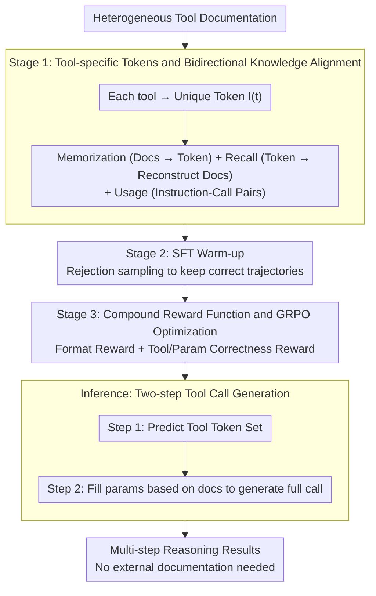

# TInR: Exploring Tool-Internalized Reasoning in Large Language Models

**Conference**: ACL 2026  
**arXiv**: [2604.10788](https://arxiv.org/abs/2604.10788)  
**Code**: https://github.com/travis-xu/TInR  
**Area**: LLM Reasoning / Tool Use  
**Keywords**: Tool Internalization, Reasoning, LLM, Reinforcement Learning, Tool Calling

## TL;DR
This paper proposes the TInR-U framework, which achieves efficient and reliable tool-assisted reasoning by internalizing tool knowledge into LLM parameters (rather than relying on external documentation), outperforming existing methods in both in-domain and out-of-domain tests.

## Background & Motivation

**Background**: Tool-integrated reasoning (TIR) has become a mainstream direction for extending LLM capabilities. By allowing models to call external tools during the reasoning process, TIR addresses tasks beyond their inherent capabilities, such as knowledge updates and real-time queries. Existing TIR methods primarily rely on two types of training strategies: In-Context Learning (ICL) and Supervised Fine-Tuning (SFT). Subsequently, Reinforcement Learning (RL) methods have been introduced to enhance exploration and adaptability.

**Limitations of Prior Work**: Despite significant progress, existing TIR methods still suffer from three fundamental issues. First, tool documentation is diverse and inconsistent; LLMs struggle to quickly master heterogeneous tool knowledge, creating a gap between external documentation and internal understanding. Second, as the number of tools grows, it becomes impossible to include all documentation within the context window; while retrieval strategies offer a partial mitigation, they increase process complexity and risk mismatch between retrieval and actual use. Third, long tool documentation significantly increases prompt length, leading to higher inference latency and computational overhead.

**Key Challenge**: The current paradigm involves an irreconcilable tradeoff between efficiency, scalability, and accuracy. The external dependency model reflects a passive query mindset rather than active tool mastery.

**Goal**: To explore Tool-Internalized Reasoning (TInR), enabling LLMs to encode tool knowledge into parameters so the model can reason without relying on external documentation. This requires meeting two key demands: (1) Tool internalization—encoding tool functions and usage rules into parameters; (2) Tool-reasoning coordination—seamlessly integrating tool knowledge for adaptive tool use during reasoning.

**Key Insight**: Inspired by humans internalizing tool knowledge in the brain for continuous application, this paper proposes implementing a similar internalization mechanism in LLMs. The core observation is that if the model can "understand" tools rather than "query" documentation every time, it can simultaneously achieve knowledge uniformity, context efficiency, and reasoning fluidity.

**Core Idea**: A three-stage training pipeline (Tool Internalization → SFT Warm-up → Reinforcement Learning) is used to gradually empower LLMs with internalized tool reasoning capabilities. It uses dedicated tool tokens as parameterized representations and ensures a balance between fine-grained fidelity and holistic understanding through bidirectional knowledge alignment.

## Method

### Overall Architecture

The TInR-U framework consists of three progressive training stages. First, in the tool internalization stage, the model learns to map tool documentation to dedicated tokens and vice versa through a bidirectional knowledge alignment strategy, while also undergoing tool usage training to ensure alignment with actual applications. Second, in the SFT warm-up stage, high-quality reasoning trajectories are constructed via rejection sampling to establish a foundation for reasoning capability. Finally, in the reinforcement learning stage, the model is optimized using a compound reward function designed specifically for tool reasoning. During inference, the model solely utilizes internalized tool knowledge for multi-step reasoning and tool calling, without requiring external documentation.

### Key Designs

**1. Tool-specific Tokens and Bidirectional Knowledge Alignment: Enabling the model to "understand" tools rather than "consult documentation" every time**

Existing TIR approaches cram heterogeneous tool documentation into the context, causing prompt inflation and retrieval complexity, while creating a divide between external docs and internal model understanding. TInR-U assigns each tool a unique token $I(t)$ as a parameterized representation and uses three complementary losses to embed tool knowledge into parameters. The tool memorization objective teaches the model to map from documentation to the token:

$$\mathcal{L}_{\text{memorization}}=-\sum_{t\in\mathcal{T}}\log P(I(t)\mid D(t))$$

The tool recall objective conversely requires the model to reconstruct the original documentation from the token to preserve fine-grained details:

$$\mathcal{L}_{\text{recall}}=-\sum_{t\in\mathcal{T}}\sum_{s=1}^{|D(t)|}\log P(D(t)_s\mid I(t),D(t)_{<s})$$

The tool usage objective $\mathcal{L}_{\text{usage}}$ is trained directly on instruction-tool call pairs to ensure internalized knowledge is applicable. These are combined as $\mathcal{L}_{\text{Phase1}}=\mathcal{L}_{\text{memorization}}+\alpha\mathcal{L}_{\text{recall}}+\beta\mathcal{L}_{\text{usage}}$. This "Memorization + Recall" bidirectional design is critical: memorization builds holistic understanding, while the recall task forces the model to retain documentation details, forming complementary learning signals anchored to actual reasoning by the usage task.

**2. Two-step Tool Call Generation: Selecting tools first, then filling parameters, splitting a difficult task into two simpler sub-tasks**

Generating a complete JSON tool call in one go forces the model to simultaneously worry about function selection and parameter filling, which is burdensome and error-prone. TInR-U decouples the process using two control tags: step one predicts the set of tool tokens $\{I(t_i)\}_{i=1}^K$ within the `<tool_token>` scope; step two pairs each token with specific parameters to generate the full call within the `<tool_call>` scope based on the corresponding documentation $\{D(t_i)\}_{i=1}^K$. By determining structure before details, constraints are stronger and the search space is smaller for each step, making it easier for the model to succeed. This decoupling is essential: removing the two-step design causes the tool call EM to drop from 61.31% to 43.40%.

**3. Compound Reward Function and GRPO Optimization: Constraining both structural validity and semantic correctness in the RL stage**

SFT-based tool reasoning is often unstable in multi-step or unseen-tool scenarios, necessitating RL for enhanced exploration and adaptation. TInR-U employs a compound reward in the third stage: the format reward $R_{\text{format}}$ checks if trajectories contain special tags in the correct order to ensure structural validity; for correctness, the tool reward $r_{\text{tool}}$ and parameter reward $r_{\text{param}}$ use Jaccard similarity to measure correctly selected tools and parameters, respectively, resulting in a total reward $R=R_{\text{format}}+R_{\text{correct}}$. Optimization is performed using Group Relative Policy Optimization (GRPO), employing a PPO-style objective and normalizing relative advantage within the same group to stabilize training. Splitting format and correctness ensures that formatting errors do not negate semantic value, and semantic correctness is not lost to invalid formatting.

### Data Construction & Training Strategy

In the SFT stage, 10 candidate tools (including ground truth, retrieved, and random tools) are collected for each instruction from datasets like ToolACE, xLAM, and BFCL. Large reasoning models (LRM) are used to generate multiple reasoning trajectories, keeping only those verified as correct by ground-truth tools. Tool names in the reasoning content are further replaced with corresponding tokens through data formatting.

## Key Experimental Results

### Main Results (Seen/Unseen Tools)

| Method | Seen-Tool EM | Seen-Tool Call EM | Unseen-Tool EM | Unseen-Tool Call EM |
|------|-----|-----|-----|-----|
| ToolRetriever+ToolRL | 63.78 | 61.08 | 59.66 | 51.72 |
| ToolGen | 83.78 | 71.89 | 73.79 | 55.86 |
| **TInR-U** | **85.95** | **74.05** | **75.86** | **57.24** |

### Out-of-Domain BFCL Results

| Method | Tool Identification-EM | Tool Call-EM | Tool Accuracy | Param Accuracy |
|------|-----------|----------|---------|---------|
| ToolRetriever+ToolRL | 30.56 | 16.63 | 37.35 | 28.45 |
| ToolGen | 34.89 | 22.01 | 30.91 | 48.24 |
| **TInR-U** | **38.06** | **26.00** | **35.83** | **50.12** |
| Relative Gain | +9.09% | +18.13% | -4.07% | +3.90% |

### Ablation Study

| Configuration | Tool Identification-EM | Tool Call-EM | Tool Accuracy |
|------|-----------|----------|---------|
| Full Model | 78.30 | 61.31 | 77.25 |
| W/o Bidirectional Alignment | 49.67 | 40.39 | 48.63 |
| W/o RL | 76.47 | 59.61 | 74.90 |
| W/o Two-step Design | — | 43.40 | 72.94 |
| Memorization Objective Only | 58.43 | 45.49 | 57.25 |

### Key Findings

- **Outstanding Generalization**: On unseen tool sets, TInR-U improves tool identification EM by 2.81% compared to ToolGen, with an 18.13% relative gain in out-of-domain generalization.
- **Obvious Efficiency Advantages**: As the toolset size increases, ToolRL's inference speed continues to decline, while TInR-U maintains constant efficiency.
- **Strong Multi-step Reasoning**: TInR-U consistently outperforms ToolGen in multi-step/multi-turn tool usage scenarios.
- **Good Model Compatibility**: TInR-U outperforms ToolGen across three mainstream models: Qwen-2.5B, LLaMA-3.1-8B, and Mistral-7B.
- **Ablation Study**: Bidirectional knowledge alignment and RL training are essential components; the two-step tool call generation is critical (its removal leads to a 30%+ drop in tool call EM).

## Highlights & Insights

- **Novelty**: The combination of tool-specific tokens and bidirectional alignment is a clever design that avoids ambiguity issues in traditional embedding methods. Compared to pure semantic, numerical, and hierarchical indexing, dedicated tokens lead by over 30 percentage points in tool identification EM.
- **Mechanism**: The two-step generation framework decomposes complex tasks into two more constrained sub-problems. This "select tool then fill parameters" design logic is transferable to any multi-step decision problem.
- **Efficiency**: Unlike dynamic queries in retrieval or agentic frameworks, TInR-U achieves a "reasoning-as-encoding" fully parameterized mode, decoupling inference speed from toolset size.
- **Clever RL Usage**: Compound reward design constrains both format and semantics simultaneously, while GRPO's group relative normalization avoids sparse reward issues.

## Limitations & Future Work

**Limitations acknowledged by the authors**:
- Evaluation datasets may not fully cover the diversity of real-world tools.
- "False negatives" may exist in datasets (where functionally similar tools are not labeled as valid).

**Self-identified limitations**:
- **Update Costs**: Parameterization means introducing new tools requires fine-tuning, which may lack flexibility for frequently updated tool ecosystems.
- **Fidelity Tradeoffs**: Parameterized compression inevitably loses some information.
- **Foundation Model Dependency**: Absolute performance on smaller models still faces ceilings.

**Future Work**: Developing incremental adaptation algorithms to integrate new tools more efficiently; introducing verifiable knowledge distillation methods; extending to multimodal tool scenarios; designing hybrid paradigms that retain a small amount of document recall as a fallback mechanism under extreme resource constraints.

## Related Work & Insights

**vs. Traditional Tool-Integrated Reasoning (TIR)**: Traditional methods rely on external documentation during inference. This paper avoids context inflation and frequent retrieval costs through parameterized internalized knowledge.

**vs. Other Internalization Attempts (ToolkenGPT, etc.)**: Previous work was limited to small toolsets, simple reasoning strategies, or unstable LLM evaluations. This paper provides more rigorous evaluation, validation in complex tool environments, and a three-stage pipeline designed specifically for reasoning.

**vs. Agentic Frameworks (DeepAgent, etc.)**: Agentic frameworks improve tool selection via iterative reasoning and scalable tool search but still depend on dynamic retrieval and introduce additional latency. TInR-U avoids these overheads through full parameterization.

**Insights**: This paper proves that LLMs can effectively internalize large-scale heterogeneous knowledge and apply it flexibly in reasoning, opening possibilities for parameterized knowledge representation across multiple domains.

## Rating

- **Novelty**: ⭐⭐⭐⭐⭐ The paradigm shift to tool internalization (from "consulting docs" to "parameter internalization") proposes a fundamentally different technical route.
- **Experimental Thoroughness**: ⭐⭐⭐⭐⭐ Covers three large-scale datasets, evaluates both in-domain and out-of-domain generalization, and includes detailed ablations, multi-foundation model validation, and inference efficiency analysis.
- **Writing Quality**: ⭐⭐⭐⭐ Logic is clear and motivation is well-articulated, though some mathematical expressions could be more intuitive.
- **Value**: ⭐⭐⭐⭐⭐ High practical industrial value, significantly improving inference efficiency with direct application potential in large-scale tool environments like data centers and API gateways.

<!-- RELATED:START -->

## Related Papers

- [\[ACL 2026\] Do Not Step Into the Same River Twice: Learning to Reason from Trial and Error](do_not_step_into_the_same_river_twice_learning_to_reason_from_trial_and_error.md)
- [\[ACL 2026\] TemplateRL: Structured Template-Guided Reinforcement Learning for LLM Reasoning](templaterl_structured_template-guided_reinforcement_learning_for_llm_reasoning.md)
- [\[ACL 2026\] Language Model as Planner and Formalizer under Constraints](language_model_as_planner_and_formalizer_under_constraints.md)
- [\[ACL 2026\] When Is Thinking Enough? Early Exit via Sufficiency Assessment for Efficient Reasoning](when_is_thinking_enough_early_exit_via_sufficiency_assessment_for_efficient_reas.md)
- [\[ACL 2026\] Efficient Process Reward Modeling via Contrastive Mutual Information](efficient_process_reward_modeling_via_contrastive_mutual_information.md)

<!-- RELATED:END -->
