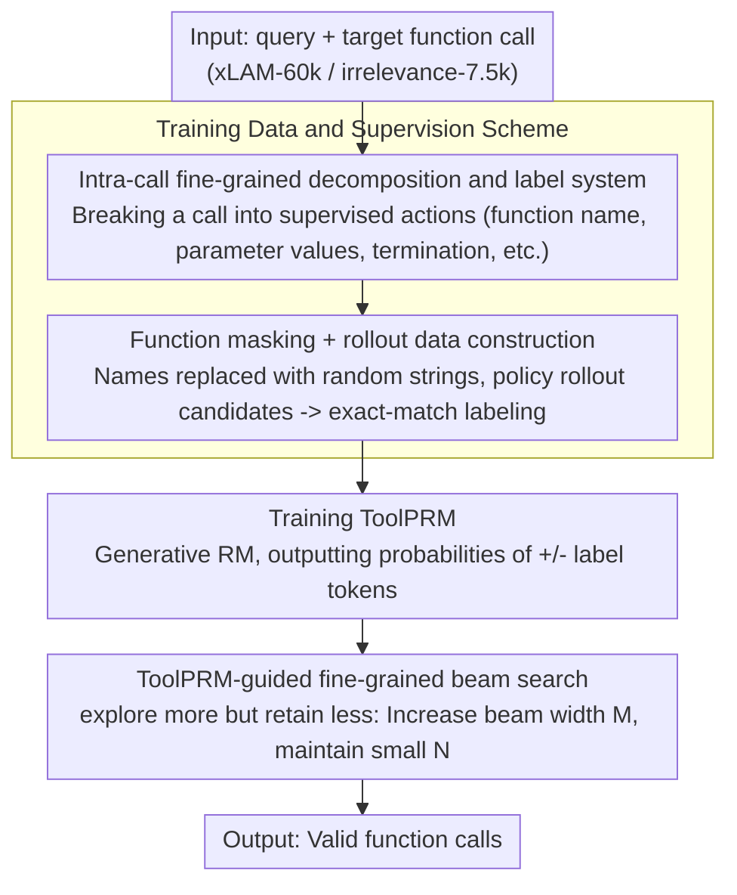

# ToolPRM: Fine-Grained Inference Scaling of Structured Outputs for Function Calling

**Conference**: ACL2026  
**arXiv**: [2510.14703](https://arxiv.org/abs/2510.14703)  
**Code**: To be confirmed  
**Area**: LLM Inference / Tool Calling  
**Keywords**: Function Calling, Process Reward Model, Structured Output, Inference Scaling, Beam Search

## TL;DR
ToolPRM decomposes function calling into fine-grained decisions, such as function name selection, parameter name selection, and value filling. It trains an intra-call process reward model to guide beam search and proposes the "explore more but retain less" principle for structured output inference scaling, achieving consistent improvements for Hammer2.1 series tool-calling models on BFCL and ToolAlpaca.

## Background & Motivation
**Background**: Inference-time scaling has been widely applied in unstructured generation tasks like mathematics and logical reasoning using techniques such as self-consistency, Best-of-N, Tree-of-Thought, beam search, or MCTS. These typically rely on outcome reward models or process reward models to score and filter multiple candidate reasoning paths.

**Limitations of Prior Work**: Function calling involves structured outputs where the model must not only generate natural language but also select correct function names, fill accurate parameter names/values, and maintain valid JSON or Python-style formatting. Existing scaling methods often treat an entire function call as a single candidate for scoring. This granularity is too coarse to prune early errors, such as incorrect function selection or invalid parameter values, when they first occur.

**Key Challenge**: In unstructured reasoning, early errors can sometimes be corrected through subsequent reflection or modification. However, structured outputs in function calling are generally unrecoverable; an incorrect function name or parameter invalidates the entire trajectory. Thus, structured outputs require broader exploration to find correct decisions but cannot afford to retain too many erroneous candidates that consume the computational budget.

**Goal**: The authors aim to construct the first fine-grained process supervision dataset for intra-call decisions in function calling, train ToolPRM to score each local decision, and use it to guide search, enabling smaller tool-calling models to achieve higher accuracy through additional test-time computation.

**Key Insight**: A function call is decomposed into a state transition process: first selecting the function name, then sequentially choosing parameter names and filling values, and finally determining the end of parameters and the call. This allows the PRM to score each local action immediately rather than waiting for the complete JSON to be generated.

**Core Idea**: Fine-grained positive and negative step labels are automatically collected through function masking and rollouts. A generative reward model is trained to output "+" or "-" tokens. During beam search, the strategy "explore more but retain less" is applied to concentrate the computational budget on correct structural paths by increasing the width of candidates per step while limiting the number of retained beams.

## Method

### Overall Architecture
The ToolPRM workflow consists of three stages. First, fine-grained supervision data is constructed by extracting natural language queries and target function calls from xLAM-function-calling-60k and xLAM-irrelevance-7.5k. Function and parameter names are masked to force the model to understand tools based on descriptions rather than memorization. Hammer2.1-3B/7B is then used as the policy model to rollout candidate function calls.

Second, local decisions in each candidate trajectory are automatically labeled. Several labels are defined: correct function name selection, correct parameter name-value pairs, completion of all parameters, correctness of a single function call, and overall response correctness. Each label is assigned a binary positive/negative value via exact match with the ground truth.

Third, ToolPRM is trained and utilized for inference scaling. ToolPRM is itself an LLM that takes the current state and candidate action as input to output the probability of "+" or "-". In beam search, multiple candidates are expanded at each step, then ranked and pruned using ToolPRM scores. Given the irrecoverable nature of early structured errors, the authors advocate for increasing the beam width to explore more local choices while keeping the number of retained beams low.

### Key Designs
**1. Intra-call fine-grained decomposition and label system: Breaking a function call from "whole JSON" into step-by-step supervised decisions**

Existing methods treat entire function calls as single candidates, which is too coarse. By the time a full JSON is generated, early errors like an incorrect function name cannot be pruned. ToolPRM decomposes a call into a series of supervised local actions with specific labels: `<FUNC_NAME>` for function name correctness, `<ARG_VALUE>` for parameter name-value matches, and `<TOTAL_FINISH>` to verify if the entire sequence is complete and correct. This allows the reward model to detect the source of errors much earlier. Experiments show that specific labels like `<ARG_VALUE>` actually enhance trajectory-level judgment rather than causing the model to focus only on local features.

**2. Function masking + rollout data construction: Forcing the reward model to understand semantics instead of memorizing tool names**

If function and parameter names in the training data are recognizable, the reward model may rely on memorization, leading to poor generalization when tool schemas change. ToolPRM replaces names and identifiers with random strings during data construction. The policy model then performs rollouts against these masked function candidates. Each step is labeled using exact matching, creating both step-level and trajectory-level data. By masking superficial names, the reward model must focus on query intent, function descriptions, and structural context.

**3. ToolPRM-guided fine-grained beam search: Allocating extra budget to "exploring more, retaining less" during test time**

There is a fundamental difference between structured output and free-text reasoning: while early errors in math can be corrected through subsequent turns, an incorrect JSON branch is usually unrecoverable. The optimal strategy is early pruning to save budget for correct structures. During search, ToolPRM outputs logits for "+" and "-" label tokens to calculate a local correctness score:

$$s=\frac{e^{s_+}}{e^{s_+}+e^{s_-}}$$

Beam search retains the top-$N$ beams, with each beam expanding $M$ subsequent candidates. The authors suggest increasing $M$ for horizontal exploration while maintaining a small $N$ to prevent erroneous candidates from consuming resources. Budget analysis confirms this: increasing $M$ with $N=4$ fixed improves the ToolAlpaca F1 score, whereas increasing $N$ with $M=4$ yields diminishing or even negative returns.

### Loss & Training
ToolPRM utilizes generative process reward modeling. Given a trajectory $\mathcal{T}=\{(s_t,a_t,r_t)\}$ where $r_t\in\{+,-\}$, the objective is to maximize the probability of the correct label token by minimizing $-\log p_\theta(r_t|s_t,a_t)$. Hammer2.1-3B is used as the backbone. The model is fine-tuned for 5 epochs using the Adam optimizer with a batch size of 1024, a learning rate of $1e-3$, a warmup ratio of 0.008, and weight decay of $1e-5$. For inference, the temperature is set to 0.8, and the beam parameters $N$ and $M$ are selected from $\{1,2,4,8,16\}$.

## Key Experimental Results

### Main Results
The ToolPRM dataset is large-scale, reporting both step and trajectory granularities.

| Sample Granularity / Split | Positive | Negative | Total |
|------------------|----------|----------|-------|
| Step / Train | 4,380,323 | 731,665 | 5,111,988 |
| Trajectory / Train | 466,786 | 127,648 | 594,434 |
| Step / Test | 488,611 | 81,366 | 569,977 |
| Trajectory / Test | 52,030 | 14,019 | 66,049 |

Reward model accuracy indicates that finer supervision granularity improves the model's ability to judge complete function call trajectories. ToolPRM outperforms outcome-only and coarse PRMs across loss, step accuracy, and trajectory accuracy.

| Reward Model | Loss ↓ | Step Acc ↑ | Trajectory Acc ↑ |
|--------------|--------|------------|------------------|
| ORM | 0.0536 | 98.39% | 98.39% |
| C-PRM | 0.0371 | 98.87% | 99.06% |
| ToolPRM | 0.0286 | 99.11% | 99.38% |

### Ablation Study
Inference scaling results show that ToolPRM is more stable than token-level beam search, majority voting, and Best-of-N, particularly for smaller models.

| Policy Model | Method | BFCL Avg. | ToolAlpaca Avg. | Main Findings |
|-------------|------|-----------|-----------------|----------|
| Hammer2.1-7B | Base | 88.65 | 72.77 | Strong base performance |
| Hammer2.1-7B | + ToolPRM | 89.52 | 73.36 | Small but stable gain |
| Hammer2.1-3B | Base | 86.86 | 71.57 | Close to 7B base |
| Hammer2.1-3B | + ToolPRM | 88.88 | 71.96 | BFCL close to 7B + ToolPRM |
| Hammer2.1-1.5B | Base | 82.79 | 69.30 | Small models have more structural errors |
| Hammer2.1-1.5B | + ToolPRM | 85.61 | 72.93 | Most significant gain, nearing larger base |

Budget analysis validates "explore more but retain less": with $N=4$ fixed, ToolAlpaca F1 generally increases with $M$. Conversely, with $M=4$ fixed, increasing $N$ provides lower gains and sometimes causes performance to drop, suggesting that retaining too many candidates allows erroneous branches to distract the search.

### Key Findings
- Fine-grained supervision improves both step-level and trajectory-level accuracy, proving that local labels help judge the overall correctness rather than causing over-focus on local details.
- ToolPRM offers higher marginal utility for smaller models. Adding ToolPRM to the 1.5B Hammer model increases BFCL Avg. from 82.79 to 85.61 and ToolAlpaca Avg. from 69.30 to 72.93, matching or exceeding some larger base models.
- Standard inference scaling methods are unstable. Token-level beam search often underperforms the base model in several settings because early structural errors are unrecoverable.

## Highlights & Insights
- The paper highlights the fundamental difference between structured output and free-text reasoning: while math tasks can recover from early errors, function calling is more like program construction where early schema failures are lethal.
- "Explore more but retain less" is a practical principle for inference scaling. It is more specific than simply increasing test-time compute, suggesting that budget should be spent on horizontal exploration at each step rather than maintaining historical error branches.
- The data construction method for ToolPRM (function masking, step-level exact-match labeling, and generative sequence prediction) is highly transferable to tasks like SQL generation, workflow orchestration, and robot action parameterization.

## Limitations & Future Work
- ToolPRM discretizes function calls into explicit states and labels, but model internals may harbor implicit reasoning or uncertainty not fully captured by these states.
- The method requires additional reward models, masking rules, and state definitions, making it more complex than simple Best-of-N; label quality heavily depends on the API schema.
- The optimal $M/N$ trade-off for the "explore more but retain less" strategy is currently found via grid search and is not yet adaptive to input complexity or PRM confidence.
- Automatic labeling relies on exact match ground truth, which may penalize semantically equivalent but formatted differently calls or fail to account for side effects and runtime failures in real tool environments.

## Related Work & Insights
- **vs ORM / Best-of-N**: ORM only evaluates the final output, making it suitable for full answer selection; ToolPRM prunes at the function and parameter stages, making it superior for structured outputs with irrecoverable errors.
- **vs coarse PRM**: While coarse PRMs are better than ORMs, they omit parameter-level labels like `<ARG_VALUE>`; ToolPRM's finer granularity leads to higher trajectory accuracy.
- **vs General beam search / Majority voting**: These methods increase candidate volume but lack local structural rewards, often retaining invalid JSON branches. ToolPRM's value lies in using process rewards to decide which branches are worth pursuing.

## Rating
- Novelty: ⭐⭐⭐⭐☆ Precisely addresses structured output scaling by applying PRM at the intra-call level.
- Experimental Thoroughness: ⭐⭐⭐⭐☆ Comprehensive data statistics, granularity comparisons, and budget analysis, though real-world multi-turn environments could be further explored.
- Writing Quality: ⭐⭐⭐⭐☆ Clear structure with well-explained diagrams and state transitions.
- Value: ⭐⭐⭐⭐⭐ High practical value for agent engineering, especially for enhancing small edge-device models with extra inference budget.

<!-- RELATED:START -->

## Related Papers

- [\[ACL 2026\] DVMap: Fine-Grained Pluralistic Value Alignment via High-Consensus Demographic-Value Mapping](dvmap_fine-grained_pluralistic_value_alignment_via_high-consensus_demographic-va.md)
- [\[ICLR 2026\] Fine-R1: Make Multi-modal LLMs Excel in Fine-Grained Visual Recognition by Chain-of-Thought Reasoning](../../ICLR2026/llm_reasoning/fine-r1_make_multi-modal_llms_excel_in_fine-grained_visual_recognition_by_chain-.md)
- [\[AAAI 2026\] Small Language Models for Efficient Agentic Tool Calling: Outperforming Large Models with Targeted Fine-tuning](../../AAAI2026/llm_reasoning/small_language_models_for_efficient_agentic_tool_calling_outperforming_large_mod.md)
- [\[CVPR 2026\] E-comIQ-ZH: A Human-Aligned Dataset and Benchmark for Fine-Grained Evaluation of E-commerce Posters with Chain-of-Thought](../../CVPR2026/llm_reasoning/e-comiq-zh_a_human-aligned_dataset_and_benchmark_for_fine-grained_evaluation_of_.md)
- [\[ACL 2025\] Beyond the Answer: Advancing Multi-Hop QA with Fine-Grained Graph Reasoning and Evaluation](../../ACL2025/llm_reasoning/beyond_the_answer_advancing_multi-hop_qa_with_fine-grained_graph_reasoning_and_e.md)

<!-- RELATED:END -->
