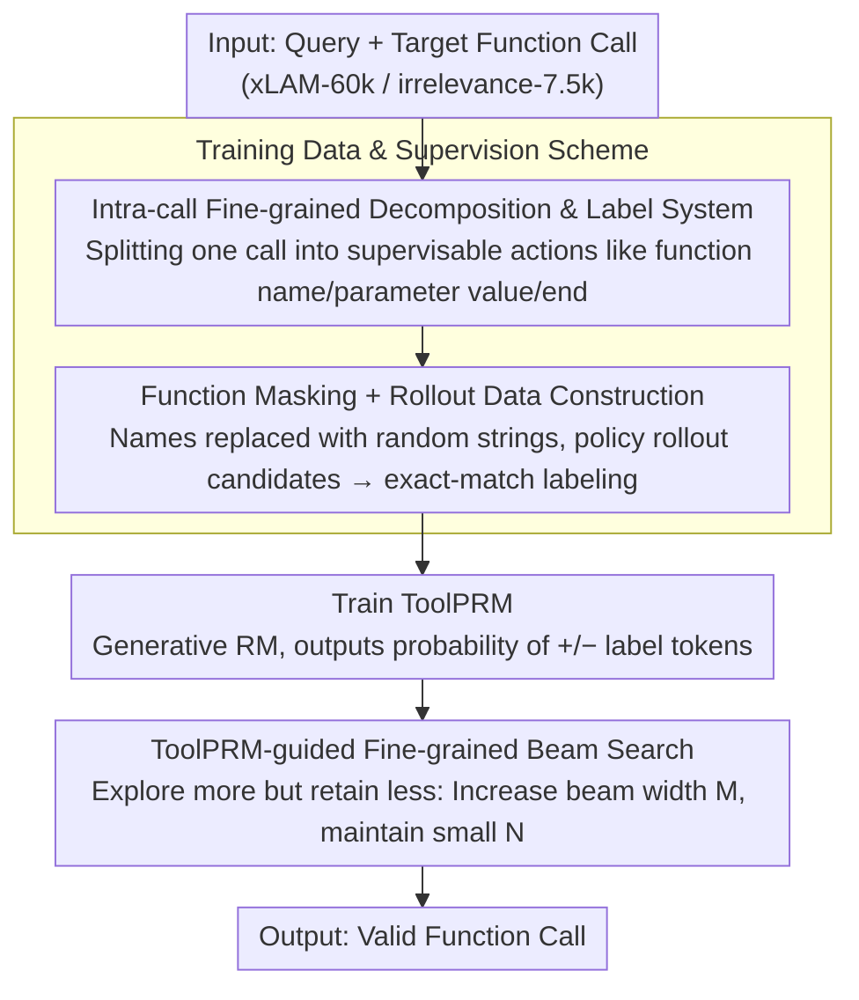

# ToolPRM: Fine-Grained Inference Scaling of Structured Outputs for Function Calling

**Conference**: ACL2026  
**arXiv**: [2510.14703](https://arxiv.org/abs/2510.14703)  
**Code**: To be confirmed  
**Area**: LLM Inference / Tool Calling  
**Keywords**: Function Calling, Process Reward Model, Structured Output, Inference Scaling, Beam Search

## TL;DR
ToolPRM decomposes function calling into fine-grained decisions such as function name selection, parameter name selection, and parameter value assignment. It trains an intra-call process reward model to guide beam search and proposes an inference scaling principle for structured outputs: "explore more but retain less." This approach consistently improves the Hammer2.1 series tool-calling models on BFCL and ToolAlpaca.

## Background & Motivation
**Background**: Inference-time scaling has been widely applied to unstructured generation tasks like mathematics and logical reasoning using methods such as self-consistency, Best-of-N, Tree-of-Thought, beam search, or MCTS. These methods typically rely on outcome reward models or process reward models to score and filter candidate reasoning paths.

**Limitations of Prior Work**: Function calling belongs to structured output: the model must not only generate natural language but also select the correct function name, fill in correct parameter names and values, and maintain a valid JSON / Python-style format. Existing inference scaling methods mostly treat a function call as a single holistic candidate for scoring. This granularity is too coarse to prune early errors, such as when a function name is first chosen incorrectly or a specific parameter value is wrong.

**Key Challenge**: In unstructured reasoning, early errors can sometimes be recovered through subsequent reflection or correction. However, structured outputs in function calling are typically unrecoverable; an incorrect function name or parameter invalidates the entire trajectory. Thus, structured outputs require broader exploration to find the correct decision but cannot afford to retain too many erroneous candidates that continue to consume the computation budget.

**Goal**: The authors aim to construct the first fine-grained process supervision dataset for intra-call decisions in function calling, train ToolPRM to score each local decision, and use it to guide search, allowing small tool-calling models to achieve higher accuracy through additional test-time computation.

**Key Insight**: The paper decomposes a function call into a state transition process: first selecting the function name, then sequentially selecting parameter names and filling parameter values, and finally determining whether the parameters and the function call have ended. This allows the PRM to judge each local action immediately rather than waiting for the complete JSON to be generated.

**Core Idea**: Use function masking and rollouts to automatically collect fine-grained positive and negative step labels. A generative reward model is trained to output "+" or "-", which then guides a beam search that increases the width of candidates per step while reducing the number of retained beams, thereby concentrating the computation budget on correct structural paths.

## Method

### Overall Architecture
The ToolPRM workflow consists of three steps. The first step is constructing fine-grained supervision data: natural language queries and target function calls are obtained from xLAM-function-calling-60k and xLAM-irrelevance-7.5k. Function names and parameter names are masked to force the model to understand tools through descriptions rather than memorizing names. Hammer2.1-3B/7B is used as the policy model to rollout candidate function calls.

The second step is the automatic labeling of local decisions within each candidate trajectory. The paper defines multiple labels for function calls: whether the function name selection is correct, whether a parameter name-value pair is correct, whether all parameters are filled, whether a single function call is correct, and whether the overall response is correct. Each label is obtained via binary positive/negative supervision through exact matching with the ground truth.

The third step is training ToolPRM and applying it to inference scaling. ToolPRM itself is an LLM that takes the current state and candidate action as input and outputs the probability of "+" or "-". During beam search, multiple candidates are expanded at each step, ranked by ToolPRM scores, and pruned. Due to the unrecoverable nature of early errors in structured output, the authors advocate for increasing the beam width to explore more local choices while retaining fewer beams, forming the "explore more but retain less" strategy.

### Key Designs
**1. Intra-call Fine-grained Decomposition and Label System: Decomposing "Holistic JSON" into Stepwise Supervisable Local Decisions**

Existing inference scaling methods mostly treat the entire function call as a single candidate, which is too coarse. By the time a full JSON is generated, early errors like an incorrect function name or parameter are already unrecoverable. ToolPRM decomposes a call into a series of supervisable local actions and defines labels for each: `<FUNC_NAME>` judges the function name, `<ARG_VALUE>` judges if a parameter name-value pair matches the ground truth, and `<TOTAL_FINISH>` judges if the entire list of function calls is complete and correct. This allows the reward model to identify error sources earlier without waiting for the JSON to finish. Experimental results show that retaining parameter-level labels like `<ARG_VALUE>` actually improves trajectory-level judgment; local supervision does not cause the model to lose sight of the global context.

**2. Function Masking + Rollout Data Construction: Forcing the Reward Model to Understand Semantics Rather Than Memorizing Tool Names**

If function and parameter names in training data are recognizable, the reward model may degrade into memorizing tool names, leading to a collapse in generalization when tool names or schemas change during deployment. ToolPRM replaces function names and parameter identifiers with random strings during data construction. The policy model is then given a set of masked function candidates to rollout candidate calls. Finally, exact matching is used to label each step as positive or negative, resulting in both step-level and trajectory-level data. By masking superficial names, the reward model must focus on query intent, function descriptions, parameter semantics, and generated structural context, learning truly transferable judgment capabilities.

**3. ToolPRM-guided Fine-grained Beam Search: Allocating Extra Budget to "More Exploration, Less Retention" at Test-time**

There is a fundamental difference between structured output and free-text reasoning: in mathematical reasoning, early errors can sometimes be rectified by subsequent reflection, whereas an incorrect JSON branch in function calling is nearly unrecoverable. Therefore, the correct strategy is not to retain many candidates for later correction, but to prune early and give the budget to correct structures. During search, ToolPRM outputs logits for the "+" and "-" label tokens for each candidate action, calculating a local correctness score:

$$s=\frac{e^{s_+}}{e^{s_+}+e^{s_-}}$$

The beam search retains the top-$N$ beams and expands $M$ subsequent candidates for each. The authors advocate for increasing $M$ to expand lateral exploration at each step while maintaining a small $N$ to prevent incorrect candidates from continuing to consume the budget—the "explore more but retain less" principle. Budget analysis confirms this: fixing $N=4$ and increasing $M$ raises the ToolAlpaca F1 score as the budget increases, while fixing $M=4$ and increasing $N$ yields minimal gains or even performance degradation.

### Loss & Training
ToolPRM employs generative process reward modeling. Given a trajectory $\mathcal{T}=\{(s_t,a_t,r_t)\}$ where $r_t\in\{+,-\}$, the training objective is to maximize the probability of the correct label token, i.e., minimizing $-\log p_\theta(r_t|s_t,a_t)$. The authors use Hammer2.1-3B as the reward model backbone, with SFT for 5 epochs using the Adam optimizer, a batch size of 1024, a learning rate of $1e-3$, a warmup ratio of 0.008, and weight decay of $1e-5$. During inference, the temperature is set to 0.8, and the beam number $N$ and beam width $M$ are selected from $\{1,2,4,8,16\}$.

## Key Experimental Results

### Main Results
The ToolPRM dataset is large-scale and includes both step and trajectory granularities. The following table is adapted from Table 1 in the paper.

| Sample Granularity / Split | Positive | Negative | Total |
|------------------|----------|----------|-------|
| Step / Train | 4,380,323 | 731,665 | 5,111,988 |
| Trajectory / Train | 466,786 | 127,648 | 594,434 |
| Step / Test | 488,611 | 81,366 | 569,977 |
| Trajectory / Test | 52,030 | 14,019 | 66,049 |

Reward model prediction accuracy indicates that finer supervision granularity leads to better judgment of complete function call trajectories. ToolPRM outperforms outcome-only (ORM) and coarse PRM (C-PRM) in terms of loss, step accuracy, and trajectory accuracy.

| Reward Model | Loss ↓ | Step Acc ↑ | Trajectory Acc ↑ |
|--------------|--------|------------|------------------|
| ORM | 0.0536 | 98.39% | 98.39% |
| C-PRM | 0.0371 | 98.87% | 99.06% |
| ToolPRM | 0.0286 | 99.11% | 99.38% |

### Ablation Study
Inference scaling results show that ToolPRM is more stable than token-level beam search, majority voting, and Best-of-N, with particularly significant improvements for smaller models.

| Policy Model | Method | BFCL Avg. | ToolAlpaca Avg. | Key Conclusion |
|-------------|------|-----------|-----------------|----------|
| Hammer2.1-7B | Base | 88.65 | 72.77 | Strong base performance |
| Hammer2.1-7B | + ToolPRM | 89.52 | 73.36 | Small but stable gain |
| Hammer2.1-3B | Base | 86.86 | 71.57 | Close to 7B base |
| Hammer2.1-3B | + ToolPRM | 88.88 | 71.96 | BFCL approaches 7B + ToolPRM |
| Hammer2.1-1.5B | Base | 82.79 | 69.30 | Smaller models have more structural errors |
| Hammer2.1-1.5B | + ToolPRM | 85.61 | 72.93 | Most significant gain, rivals larger base |

Budget analysis further validates "explore more but retain less": with $N=4$ fixed, increasing $M$ typically leads to rising F1 on ToolAlpaca as budget increases. Conversely, with $M=4$ fixed, increasing $N$ provides lower marginal returns or performance drops, suggesting that retaining more candidates is not always beneficial as incorrect branches lead subsequent budgets astray.

### Key Findings
- Fine-grained supervision improves both step-level and trajectory-level accuracy, indicating that local labels help the model judge global correctness rather than focusing only on fragments.
- ToolPRM provides greater marginal benefits for smaller models. Hammer2.1-1.5B with ToolPRM saw BFCL Avg. rise from 82.79 to 85.61 and ToolAlpaca Avg. rise from 69.30 to 72.93, approaching or exceeding larger base models.
- Standard inference scaling methods are unstable. Token-level beam search performed worse than the base model in several settings because early errors in structured generation are unrecoverable.

## Highlights & Insights
- The paper identifies a core difference between structured output and free-text reasoning: while math reasoning can retain multiple paths for future correction, function calls are like program construction where early schema decisions are critical and unrecoverable.
- "Explore more but retain less" is a practical inference scaling principle. It is more specific than simply increasing test-time compute, pointing out that the budget should be spent on lateral exploration at each step rather than maintaining historical error branches.
- The data construction method in ToolPRM is highly transferable. Function masking, step-level exact-match labeling, and generative label prediction can be extended to tasks like SQL generation, workflow orchestration, and robotic action parameterization.

## Limitations & Future Work
- ToolPRM discretizes function calls into explicit states and labels, but real models may have implicit reasoning or uncertainty not fully captured by these states.
- The method requires an extra reward model, masking rules, and state definitions, which increases engineering complexity compared to Best-of-N.
- The optimal $M/N$ trade-off currently depends on grid search rather than adaptive adjustment based on input complexity or ToolPRM confidence.
- Automatic labeling relies on exact-match ground truth, which might underestimate semantically equivalent but differently formatted calls and may not cover side effects or runtime failures in real tool environments.

## Related Work & Insights
- **vs ORM / Best-of-N**: ORMs only see final candidates, suitable for full-answer filtering. ToolPRM prunes at function/parameter stages, making it better for structured outputs where errors are unrecoverable.
- **vs Coarse PRM**: C-PRM is finer than ORM but removes parameter-level labels like `<ARG_VALUE>`. ToolPRM retains the finest steps, yielding higher trajectory accuracy.
- **vs Standard Beam Search / Majority Voting**: These methods increase candidate counts but lack structural local rewards, often retaining invalid JSON branches. ToolPRM's value lies in using process rewards to decide which branches are worth continuing.

## Rating
- Novelty: ⭐⭐⭐⭐☆ Pinpointing the intra-call level for PRMs and summarizing structured reasoning scaling principles.
- Experimental Thoroughness: ⭐⭐⭐⭐☆ Comprehensive data statistics, RM granularity comparisons, and budget analyses, though real-world multi-turn environments could be further explored.
- Writing Quality: ⭐⭐⭐⭐☆ Clear structure with well-explained methodology and state transitions.
- Value: ⭐⭐⭐⭐⭐ High practical value for function calling and agent engineering, especially for enhancing small edge-device models with extra inference budget.

<!-- RELATED:START -->

## Related Papers

- [\[ICLR 2026\] The Limits of Inference Scaling Through Resampling](../../ICLR2026/llm_reasoning/the_limits_of_inference_scaling_through_resampling.md)
- [\[ACL 2026\] DVMap: Fine-Grained Pluralistic Value Alignment via High-Consensus Demographic-Value Mapping](dvmap_fine-grained_pluralistic_value_alignment_via_high-consensus_demographic-va.md)
- [\[ICLR 2026\] Fine-R1: Make Multi-modal LLMs Excel in Fine-Grained Visual Recognition by Chain-of-Thought Reasoning](../../ICLR2026/llm_reasoning/fine-r1_make_multi-modal_llms_excel_in_fine-grained_visual_recognition_by_chain-.md)
- [\[AAAI 2026\] Small Language Models for Efficient Agentic Tool Calling: Outperforming Large Models with Targeted Fine-tuning](../../AAAI2026/llm_reasoning/small_language_models_for_efficient_agentic_tool_calling_outperforming_large_mod.md)
- [\[ICML 2026\] Attention Illuminates LLM Reasoning: The Preplan-and-Anchor Rhythm Enables Fine-Grained Policy Optimization](../../ICML2026/llm_reasoning/attention_illuminates_llm_reasoning_the_preplan-and-anchor_rhythm_enables_fine-g.md)

<!-- RELATED:END -->
