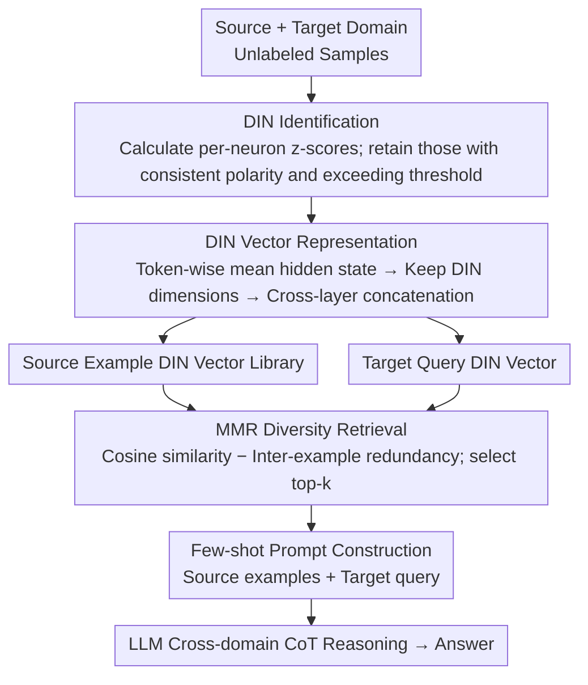

# Towards Effective In-context Cross-domain Knowledge Transfer via Domain-invariant-neurons-based Retrieval

**Conference**: ACL 2026 Findings  
**arXiv**: [2604.05383](https://arxiv.org/abs/2604.05383)  
**Code**: [GitHub](https://github.com/Leon221220/DIN-Retrieval)  
**Area**: LLM Inference  
**Keywords**: Cross-domain Knowledge Transfer, Domain-invariant Neurons, ICL Retrieval, Structural Alignment, Mathematical & Logical Reasoning

## TL;DR

This paper proposes DIN-Retrieval, which identifies Domain-invariant Neurons (DINs) with consistent activation polarity across domains within LLMs. By constructing a domain-robust representation subspace to retrieve structurally compatible cross-domain examples, it demonstrates for the first time the feasibility of improving LLM reasoning performance using cross-domain ICL examples, achieving an average improvement of 1.8% in math-logic reasoning transfer.

## Background & Motivation

**Background**: In-context Learning (ICL) allows LLMs to adapt to new tasks without parameter updates. However, existing ICL research assumes the availability of expert-annotated examples from the same domain, which limits applicability in domains where specialized knowledge is scarce (e.g., specialized mathematical reasoning, formal logic, legal analysis).

**Limitations of Prior Work**: (1) Zero-shot LLMs are prone to three failure modes during reasoning: missing intermediate links, incomplete branch integration, and ignoring blocking conditions; (2) Although reasoning tasks from different domains differ significantly in surface semantics, they share many reusable implicit logical structures (e.g., chain-of-thought, conditional branching); (3) Manually selecting structurally aligned cross-domain examples is impractical as reasoning structures vary widely between tasks.

**Key Challenge**: While prior work suggests cross-domain examples can help restore correct reasoning topologies, there is a lack of automated mechanisms to retrieve structurally compatible examples.

**Goal**: To develop an automated retrieval method capable of finding ICL examples from other domains that are structurally compatible with the target query.

**Key Insight**: Leveraging the idea of domain-invariant features from domain adaptation theory—identifying neurons in LLM hidden layers with consistent activation polarity across domains—these neurons encode domain-agnostic reasoning structural information.

**Core Idea**: Discover Domain-invariant Neurons (DINs) within the LLM, utilize their activations to build domain-robust retrieval representations, and retrieve structurally aligned cross-domain examples via cosine similarity.

## Method

### Overall Architecture

DIN-Retrieval aims to address the scenario where expert-annotated examples are missing in the target domain by borrowing reasoning examples from other domains. The pipeline involves identifying reasoning neurons shared across domains, using their activations as a "retrieval fingerprint" to fetch the most structurally similar examples from a source domain, and concatenating them into a few-shot prompt. Specifically: first, activation z-scores for each neuron are calculated using unlabeled samples from both domains to identify DINs; then, these activations are concatenated across layers into a compact DIN vector; subsequently, top-k source examples are retrieved in the DIN vector space using cosine similarity combined with MMR; finally, these examples serve as few-shot demonstrations for cross-domain CoT reasoning.

### Key Designs

**1. Domain-invariant Neuron (DIN) Identification: Locating neurons insensitive to domain shifts**

Cross-domain examples are potentially useful because different tasks share logical skeletons like chain reasoning or conditional branching despite surface semantic gaps. To automatically locate these structural encoders, DIN-Retrieval calculates activation z-scores $z_k^S$ and $z_k^T$ for each neuron $k$ in every layer across source and target domain samples. Neurons are retained only if their polarity is consistent and exceeds a threshold: $\mathcal{I} = \{k \mid z_k^S > \tau \wedge z_k^T > \tau\} \cup \{k \mid z_k^S < -\tau \wedge z_k^T < -\tau\}$. If the count exceeds a budget $K$, the top-$K$ are selected based on $|z_k^S| + |z_k^T|$. The intuition is that neurons strongly activated in the same direction across two disparate domains respond to abstract features rather than domain-specific vocabulary. Pruning experiments confirm that removing DINs increases perplexity significantly more than random pruning, proving their functional importance for reasoning.

**2. DIN Vector Representation: Narrowing the fingerprint from "Semantics" to "Structure"**

Using full hidden states for cross-domain similarity often results in domain-specific noise (topics, terminology) overshadowing structural signals, leading to the retrieval of "topically similar" rather than "structurally similar" examples. DIN-Retrieval calculates the token-wise average of hidden states $\bar{h}^{(l)}(x)$ for each layer and retains only the DIN dimensions, concatenating them: $\mathbf{v}_{\text{DIN}}(x) = \bigoplus_{l \in \mathcal{L}} h^{(l)}(x)_{\mathcal{I}^{(l)}}$. This filtering ensures the vector encodes "how to reason" rather than "what is being talked about," enabling effective structural retrieval across domains.

**3. MMR Diversity Retrieval: Balancing structural proximity and example diversity**

Retrieving top-k solely based on query similarity can yield redundant examples with identical reasoning patterns. To provide diverse structural cues, retrieval scoring uses Maximum Marginal Relevance (MMR) to balance query proximity and inter-example diversity: $\text{Score}(i) = \lambda \cdot \cos(\mathbf{v}_q, \mathbf{v}_i) - (1-\lambda) \cdot \max_{j \in \mathcal{S}} \cos(\mathbf{v}_i, \mathbf{v}_j)$, typically retrieving $k=2$ source examples. This ensures retrieved examples are structurally compatible with the query while covering different reasoning modes.

### Loss & Training

DIN-Retrieval is training-free. DIN identification relies on activation statistics, and retrieval is based on cosine similarity. Evaluations were conducted using models such as LLaMA-3.1-8B, Gemma-3-12B/27B, and Qwen2.5/3-7B~32B.

## Key Experimental Results

### Main Results

**Cross-domain Reasoning Accuracy (Average across four transfer directions)**

| Method | Qwen2.5-7B | Qwen3-8B | Gemma-3-27B |
|------|-----------|---------|------------|
| Zero-shot | 84.6 | 91.8 | 88.75 |
| X-ICL (Embedding Retrieval) | 83.4 | 91.2 | — |
| **Ours (DIN-Retrieval)** | **86.8** | **93.1** | **90.3** |

### Ablation Study

**DIN vs. Random Neuron Selection (GSM8K→FOLIO)**

| Model | DIN Acc. | Random Acc. | Gain |
|------|----------|-------------|------|
| LLaMA-3.1-8B | 62.7 | 60.3 | +2.4 |
| Qwen2.5-7B | 62.8 | 59.5 | +3.3 |
| Qwen3-8B | 85.5 | 84.0 | +1.5 |

### Key Findings

- DIN-Retrieval consistently outperforms zero-shot and embedding-based cross-domain ICL across all models and transfer directions.
- Perplexity increases caused by DIN pruning are significantly higher than random pruning, verifying the functional importance of DINs.
- This is the first systematic proof that cross-domain ICL examples can improve LLM reasoning performance, breaking the assumption that ICL requires in-domain examples.
- Bidirectional transfer is effective for both GSM8K→FOLIO (Math to Logic) and FOLIO→GSM8K (Logic to Math).
- Although the improvements are modest (average 1.8%), they are statistically significant and consistent.

## Highlights & Insights

- The insight that "different domains share reasoning structures" is profound—reasoning ability is not domain-specific but cross-domain reusable.
- The discovery of DINs provides a new perspective for understanding internal reasoning representations in LLMs: specialized neurons encode domain-agnostic reasoning patterns.
- The design is elegant and lightweight—it requires no training and is based entirely on activation statistics and cosine similarity.

## Limitations & Future Work

- The average improvement of 1.8% is limited, and for some models, the headroom on strong zero-shot baselines is small.
- Validation was restricted to math-logic reasoning transfers; it hasn't been extended to other domains (e.g., Legal to Medical).
- DIN identification requires unlabeled samples from both domains to calculate z-scores, thus it is not entirely zero-resource.
- The selection of threshold $\tau$ and neuron ratio $k_{\text{ratio}}$ lacks an adaptive mechanism.

## Related Work & Insights

- **vs. X-ICL (Embedding Retrieval)**: Full state embeddings contain domain-specific noise; DIN filtering focuses on structural information.
- **vs. In-domain ICL**: In-domain examples are usually superior when available, but this work proves cross-domain is effective when in-domain labels are absent.
- **vs. Domain Adaptation (DANN, etc.)**: Traditional domain adaptation requires training, whereas DIN-Retrieval is entirely training-free, migrating the domain-invariant feature concept from training to inference-time retrieval.

## Rating

- Novelty: ⭐⭐⭐⭐ First systematic study of cross-domain ICL; DIN discovery has theoretical value.
- Experimental Thoroughness: ⭐⭐⭐⭐ Multi-model × Multi-transfer directions + DIN existence verification + statistical significance tests.
- Writing Quality: ⭐⭐⭐⭐ Clear motivational chain from failure mode analysis to method design.
- Value: ⭐⭐⭐⭐ Provides a new approach for ICL in domains with scarce expert knowledge.

<!-- RELATED:START -->

## Related Papers

- [\[AAAI 2026\] L2V-CoT: Cross-Modal Transfer of Chain-of-Thought Reasoning via Latent Intervention](../../AAAI2026/llm_reasoning/l2v-cot_cross-modal_transfer_of_chain-of-thought_reasoning_v.md)
- [\[AAAI 2026\] SERL: Self-Examining Reinforcement Learning on Open-Domain](../../AAAI2026/llm_reasoning/serl_self-examining_reinforcement_learning_on_open-domain.md)
- [\[NeurIPS 2025\] DreamPRM: Domain-Reweighted Process Reward Model for Multimodal Reasoning](../../NeurIPS2025/llm_reasoning/dreamprm_domain-reweighted_process_reward_model_for_multimodal_reasoning.md)
- [\[CVPR 2025\] Style Evolving along Chain-of-Thought for Unknown-Domain Object Detection](../../CVPR2025/llm_reasoning/style_evolving_along_chain-of-thought_for_unknown-domain_object_detection.md)
- [\[AAAI 2026\] RPM-MCTS: Knowledge-Retrieval as Process Reward Model with Monte Carlo Tree Search for Code Generation](../../AAAI2026/llm_reasoning/rpm-mcts_knowledge-retrieval_as_process_reward_model_with_monte_carlo_tree_searc.md)

<!-- RELATED:END -->
