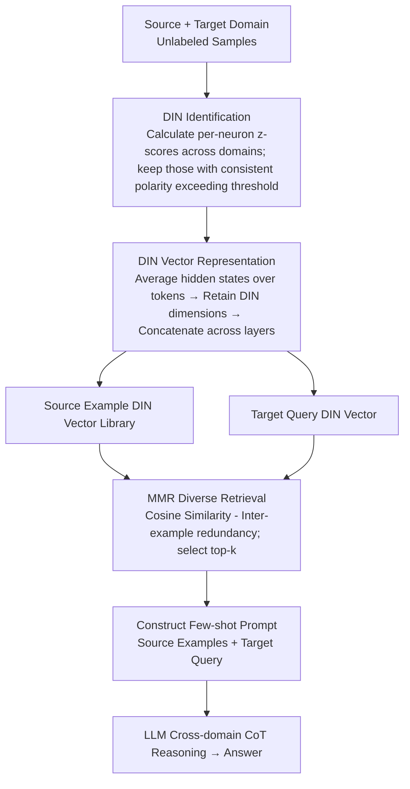

# Towards Effective In-context Cross-domain Knowledge Transfer via Domain-invariant-neurons-based Retrieval

**Conference**: ACL 2026 Findings  
**arXiv**: [2604.05383](https://arxiv.org/abs/2604.05383)  
**Code**: [GitHub](https://github.com/Leon221220/DIN-Retrieval)  
**Area**: LLM Reasoning  
**Keywords**: Cross-domain knowledge transfer, domain-invariant neurons, in-context learning retrieval, reasoning structure alignment, math-logic reasoning

## TL;DR

This paper proposes DIN-Retrieval, which identifies domain-invariant neurons (DINs) with consistent activation polarity across domains in LLMs to construct a domain-robust representation subspace. This subspace is used to retrieve structurally compatible cross-domain examples. It serves as the first demonstration of the feasibility of using cross-domain ICL examples to improve LLM reasoning performance, achieving an average improvement of 1.8% in math-to-logic reasoning transfer.

## Background & Motivation

**Background**: In-context learning (ICL) allows LLMs to adapt to new tasks without parameter updates. However, existing ICL research assumes the availability of expert-labeled examples from the same domain, which limits applicability in knowledge-scarce domains such as specialized mathematical reasoning, formal logic, and legal analysis.

**Limitations of Prior Work**: (1) Zero-shot LLMs are prone to three types of reasoning failures—missing intermediate links, incomplete branch integration, and ignoring blocking conditions; (2) Although reasoning tasks from different domains vary significantly in surface semantics, they share reusable implicit logical structures (e.g., chain of reasoning, conditional branching); (3) Manually selecting structurally aligned cross-domain examples is impractical due to the massive variation in reasoning structures across tasks.

**Key Challenge**: Cross-domain examples can restore the correct reasoning topology (as proven by existing work), but there is a lack of automated mechanisms to retrieve examples that are structurally compatible.

**Goal**: To develop an automated retrieval method capable of finding cross-domain ICL examples from other domains that are structurally compatible with the target query.

**Key Insight**: Utilize the concept of domain-invariant features from domain adaptation theory—identifying neurons in LLM hidden layers with consistent activation polarity across domains, as these neurons encode domain-agnostic reasoning structure information.

**Core Idea**: Discover domain-invariant neurons (DINs) within the LLM and use their activations to construct domain-robust retrieval representations, enabling the retrieval of structurally aligned cross-domain examples via cosine similarity.

## Method

### Overall Architecture

DIN-Retrieval addresses the following: when no expert-labeled examples exist in the target domain, can reasoning examples be borrowed from other domains to assist the LLM? The pipeline involves identifying shared reasoning neurons inside the model, using their activations as retrieval fingerprints to fetch structurally similar samples from a source domain, and concatenating them into few-shot prompts for cross-domain CoT reasoning. The steps are: calculate activation z-scores for each neuron using unlabeled samples from both domains to pick "domain-invariant neurons" (DIN) with consistent polarity; concatenate these DIN activations across layers into a compact DIN vector; retrieve top-k source domain examples in the DIN vector space using cosine similarity and Maximal Marginal Relevance (MMR); and finally, use the retrieved examples as few-shot demonstrations for the target query.

### Key Designs

**1. Domain-Invariant Neuron (DIN) Identification: Identifying neurons insensitive to "domain shifts"**

The viability of cross-domain examples stems from shared logical skeletons (e.g., chain reasoning) despite divergent surface semantics. DIN-Retrieval identifies these by calculating activation z-scores $z_k^S$ and $z_k^T$ for each neuron $k$ in each layer across domains, retaining only those with consistent polarity: $\mathcal{I} = \{k \mid z_k^S > \tau \wedge z_k^T > \tau\} \cup \{k \mid z_k^S < -\tau \wedge z_k^T < -\tau\}$. If the count exceeds a budget $K$, the top-$K$ are selected based on $|z_k^S| + |z_k^T|$. The intuition is that neurons strongly activated in the same direction across distinct domains respond to abstract shared features rather than domain-specific vocabulary.

**2. DIN Vector Representation: Narrowing fingerprints from "semantics" to "structure"**

Using full hidden states for cross-domain similarity results in domain-specific noise (topic words, terminology) overshadowing reasoning signals. This method averages hidden states across tokens $\bar{h}^{(l)}(x)$ for each layer, but retains only the DIN dimensions, concatenating them: $\mathbf{v}_{\text{DIN}}(x) = \bigoplus_{l \in \mathcal{L}} h^{(l)}(x)_{\mathcal{I}^{(l)}}$. This ensures the vector encodes "how to reason" rather than "what the topic is."

**3. MMR Diversity Retrieval: Balancing query similarity and example diversity**

Selecting top-k purely by similarity often results in redundant reasoning patterns. MMR is used to balance similarity to the query and diversity among selected examples: $\text{Score}(i) = \lambda \cdot \cos(\mathbf{v}_q, \mathbf{v}_i) - (1-\lambda) \cdot \max_{j \in \mathcal{S}} \cos(\mathbf{v}_i, \mathbf{v}_j)$, typically retrieving $k=2$ source examples to provide comprehensive structural cues.

### Loss & Training

DIN-Retrieval is training-free. DIN identification relies on activation statistics, and retrieval is based on cosine similarity. Evaluations were conducted using models including LLaMA-3.1-8B, Gemma-3-12B/27B, and Qwen2.5/3-7B~32B.

## Key Experimental Results

### Main Results

**Cross-domain Reasoning Accuracy (Average across four transfer directions)**

| Method | Qwen2.5-7B | Qwen3-8B | Gemma-3-27B |
| :--- | :--- | :--- | :--- |
| Zero-shot | 84.6 | 91.8 | 88.75 |
| X-ICL (Embedding Retrieval) | 83.4 | 91.2 | — |
| **DIN-Retrieval** | **86.8** | **93.1** | **90.3** |

### Ablation Study

**DIN vs. Random Neuron Selection (GSM8K→FOLIO)**

| Model | DIN Acc. | Random Acc. | Gain |
| :--- | :--- | :--- | :--- |
| LLaMA-3.1-8B | 62.7 | 60.3 | +2.4 |
| Qwen2.5-7B | 62.8 | 59.5 | +3.3 |
| Qwen3-8B | 85.5 | 84.0 | +1.5 |

### Key Findings

- DIN-Retrieval consistently outperforms zero-shot and embedding-based cross-domain ICL across all models and transfer directions.
- Perplexity increases significantly more when pruning DINs compared to random neurons, verifying their functional importance.
- This work systematically proves that cross-domain ICL examples can enhance LLM reasoning, breaking the assumption that ICL must use in-domain examples.
- Bidirectional transfer between GSM8K and FOLIO (Math $\leftrightarrow$ Logic) is effective.
- While the average improvement is 1.8%, it is statistically significant and consistent.

## Highlights & Insights

- The insight that different domains share reasoning structures is profound—reasoning ability is not domain-specific but cross-domain reusable.
- The discovery of DINs provides a new perspective for understanding internal representations—dedicated neurons encode domain-agnostic reasoning patterns.
- The design is elegant and lightweight—it requires no training and relies solely on activation statistics and cosine similarity.

## Limitations & Future Work

- The 1.8% average improvement is relatively modest, as some models have limited room for growth on strong zero-shot baselines.
- Evaluation was limited to math-logic transfer and has not been extended to other domains (e.g., Legal $\rightarrow$ Medical).
- DIN identification requires unlabeled samples from both domains to calculate z-scores, meaning it is not strictly zero-resource.
- The selection of threshold $\tau$ and neuron ratio $k_{\text{ratio}}$ lacks an adaptive mechanism.

## Related Work & Insights

- **vs. X-ICL (Embedding Retrieval)**: Embedding retrieval uses full hidden states containing domain-specific noise; DIN filtering focuses on structural information.
- **vs. In-domain ICL**: In-domain examples are usually superior when available, but this work proves cross-domain utility when in-domain labels are missing.
- **vs. Domain Adaptation (DANN, etc.)**: Classic domain adaptation requires training; DIN-Retrieval is entirely training-free, migrating domain-invariant feature concepts from training to inference-time retrieval.

## Rating

- Novelty: ⭐⭐⭐⭐ Systematic study of cross-domain ICL; DIN discovery has theoretical value.
- Experimental Thoroughness: ⭐⭐⭐⭐ Multiple models $\times$ multiple directions + DIN existence verification + significance testing.
- Writing Quality: ⭐⭐⭐⭐ Clear motivation chain from failure analysis to method design.
- Value: ⭐⭐⭐⭐ Provides new ideas for ICL in expert-knowledge-scarce domains.

<!-- RELATED:START -->

## Related Papers

- [\[AAAI 2026\] L2V-CoT: Cross-Modal Transfer of Chain-of-Thought Reasoning via Latent Intervention](../../AAAI2026/llm_reasoning/l2v-cot_cross-modal_transfer_of_chain-of-thought_reasoning_v.md)
- [\[AAAI 2026\] SERL: Self-Examining Reinforcement Learning on Open-Domain](../../AAAI2026/llm_reasoning/serl_self-examining_reinforcement_learning_on_open-domain.md)
- [\[ICLR 2026\] ContextPRM: Leveraging Contextual Coherence for multi-domain Test-Time Scaling](../../ICLR2026/llm_reasoning/contextprm_leveraging_contextual_coherence_for_multi-domain_test-time_scaling.md)
- [\[NeurIPS 2025\] DreamPRM: Domain-Reweighted Process Reward Model for Multimodal Reasoning](../../NeurIPS2025/llm_reasoning/dreamprm_domain-reweighted_process_reward_model_for_multimodal_reasoning.md)
- [\[CVPR 2025\] Style Evolving along Chain-of-Thought for Unknown-Domain Object Detection](../../CVPR2025/llm_reasoning/style_evolving_along_chain-of-thought_for_unknown-domain_object_detection.md)

<!-- RELATED:END -->
