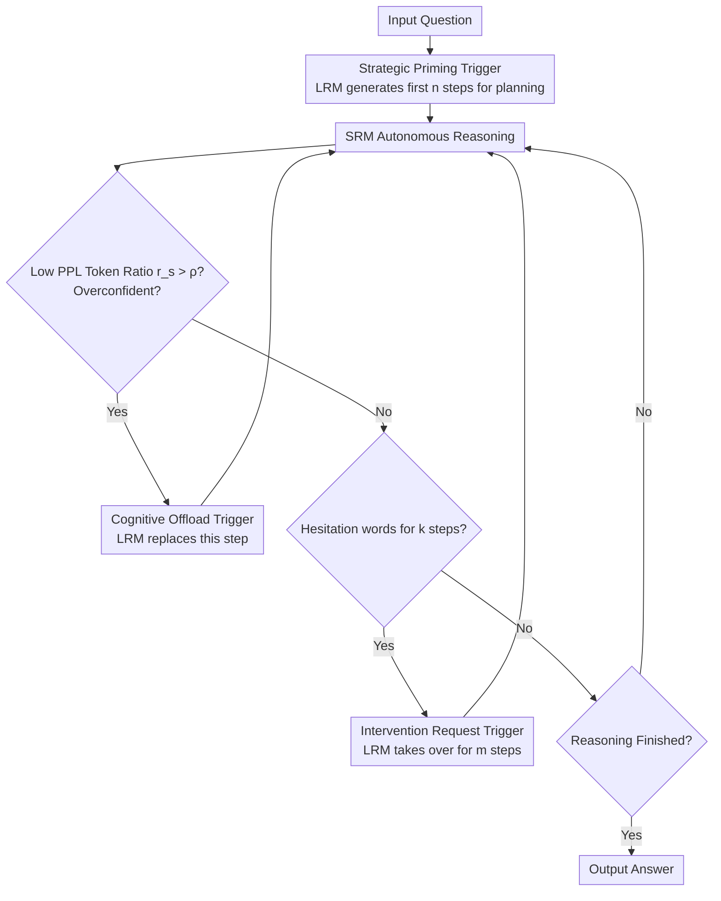

# TrigReason: Trigger-Based Collaboration between Small and Large Reasoning Models

**Conference**: ACL 2026 Findings  
**arXiv**: [2604.14847](https://arxiv.org/abs/2604.14847)  
**Code**: [https://github.com/QQQ-yi/TrigReason](https://github.com/QQQ-yi/TrigReason)  
**Area**: LLM Reasoning  
**Keywords**: Reasoning Acceleration, Small-Large Model Collaboration, Speculative Reasoning, Event-Triggered, Reasoning Models

## TL;DR

TrigReason proposes an event-triggered collaboration framework between small and large reasoning models. By analyzing three types of reasoning risks in small models (path deviation, cognitive overload, and recovery failure), it designs strategic priming, cognitive offload, and intervention request triggers to replace step-by-step polling verification. While maintaining LRM-level accuracy, it offloads 1.70-4.79x more reasoning steps to the small model, reducing latency by 43.9% and API costs by 73.3%.

## Background & Motivation

**Background**: Large Reasoning Models (LRMs) such as DeepSeek-R1 and QwQ achieve powerful complex reasoning capabilities by scaling the Chain-of-Thought (CoT). However, the autoregressive generation of thousands of "thinking tokens" leads to significant reasoning latency. Recently, SpecReason proposed a speculative reasoning paradigm where a Small Reasoning Model (SRM) generates reasoning steps and an LRM verifies them step-by-step.

**Limitations of Prior Work**: SpecReason faces two critical issues: (1) LRM-as-Judge is unreliable—experiments show that four different LRMs' scores for the same reasoning trajectory varied drastically (1.87 to 8.93), and LRMs even rejected 63.7% of their own generated steps; (2) Step-by-step polling is inefficient—calling the LRM for verification regardless of step difficulty increases latency by 22.44% and API costs by 42.31% in edge-cloud collaboration scenarios compared to pure LRM.

**Key Challenge**: Existing methods lack a systematic understanding of "when and why SRMs fail," necessitating frequent blind verification to ensure quality. This results in most final outputs being corrected/generated by the LRM, rendering the "speculation" ineffective.

**Goal**: Systematically characterize the boundaries of SRM reasoning capabilities and design an "intervention-on-demand" collaboration strategy instead of "step-by-step verification."

**Key Insight**: By comparing SRM and LRM reasoning trajectories, the authors identified three systematic risk patterns. A key finding is that SRM failures are often preceded by abnormally low token perplexity (overconfidence), which can serve as an early warning signal for cognitive overload.

**Core Idea**: Shift LRM intervention from continuous polling to event-triggered—invoking the LRM only during initial strategic planning, detection of abnormal overconfidence, or when reasoning falls into stagnant loops. This allows the SRM to autonomously handle the vast majority of steps.

## Method

### Overall Architecture

TrigReason addresses the bottleneck where speculative reasoning (SpecReason) relies on unreliable and expensive LRM verification, often resulting in most steps being redone by the LRM. It shifts the intervention paradigm from "verify every step" to "event-triggered": by default, the SRM autonomously completes most steps, with the LRM intervening only at three specific moments. First, the LRM generates the initial $n$ steps for strategic priming; second, if "overconfidence" (a signal of cognitive overload) is detected during SRM generation, the LRM replaces that step; third, if the SRM repeatedly uses hesitation words or gets stuck in loops, the LRM takes over for $m$ steps to pull the trajectory back on track. The LRM does not judge the correctness of every step.

### Key Designs

**1. Strategic Priming Trigger: LRM sets the direction initially to prevent SRM from deviating early.**

The first risk for SRMs is "path deviation"—they lack strategic foresight and often jump directly into calculations or apply familiar but inapplicable methods. An error in the first step leads to total failure. TrigReason lets the LRM generate the first $n$ steps (default $n=20$) to complete problem decomposition and strategic planning before handing control to the SRM: $y_{1:n} \sim p_L(y_{1:n}\mid x)$, followed by $y_t \sim p_S(y_t \mid y_{<t}, x)$ for $t > n$. While this seems like a simple "start," it is crucial—removing it ($n=0$) drops accuracy by 25.4%, suggesting "direction" is scarcer than "computing power" for SRMs.

**2. Cognitive Offload Trigger: Using SRM's overconfidence as an alarm to switch to LRM when it's overwhelmed.**

The second risk is "cognitive overload"—SRMs fail at critical steps beyond their capacity. It is difficult to detect this without LRM judgment. The authors' key observation is that SRM errors are often preceded by abnormally low token perplexity, or "overconfidence." By monitoring the ratio $r_s$ of tokens with PPL below a threshold $\tau=1.05$ in each step, if $r_s > \rho$, the step is judged as cognitively overloaded, triggering the LRM to replace it. Statistically, 94.6% of SRM error steps exhibit such overconfidence, while only 38.1% of all steps do. This signal is internal to the SRM and bypasses the need for unreliable LRM judging.

**3. Intervention Request Trigger: SRM requests help when looping; LRM adjusts and releases control.**

The third risk is "recovery failure"—SRMs lack self-reflection and struggle to break out of reasoning loops, but they implicitly emit hesitation signals. TrigReason maintains a set of hesitation words $\mathcal{H}$ (e.g., "wait", "hmm", "alternatively"). When hesitation words appear in $k$ consecutive steps, the LRM is triggered to take over for $m$ steps (default $m=1$) for path correction. Ablations show that 1 step of LRM correction is usually enough to realign the reasoning.

### Mechanism: A complete AIME problem walkthrough

Given a configuration of SRM=R1-1.5B, LRM=QwQ-32B, $n=20, \tau=1.05, m=1$:

1.  **Start (Strategic Priming)**: For a difficult AIME problem, the LRM writes the first 20 steps—interpreting the intent, choosing the solution path, and defining the strategy.
2.  **SRM Autonomous Reasoning**: From step 21, the SRM takes over, following the LRM's direction to perform substitutions and simplifications. It handles large blocks of routine calculation while the LRM remains idle.
3.  **Triggering Cognitive Offload**: At a non-trivial critical step, the SRM produces tokens with PPL < 1.05 for over $\rho$ percent of the step. The alarm $r_s > \rho$ triggers the LRM to replace the step with the correct result before returning control to the SRM.
4.  **Triggering Intervention Request**: Near the end, the SRM outputs "wait... hmm..." for $k$ steps. The LRM takes over for 1 step to fix the trajectory, after which the SRM finishes the final steps.
5.  **Result**: The LRM only generated the first 20 steps + 1 replacement step + 1 correction step. Over 60% of steps were completed by the cheap SRM, maintaining LRM-level accuracy while offloading the majority of tokens.

### Loss & Training

TrigReason is entirely training-free and acts as a pure inference-time collaboration strategy. It uses the SGLang inference engine with temperature 0.6, top-p 0.95, and a default token budget of 8192. Evaluation uses pass@1 with $k=16$.

## Key Experimental Results

### Main Results

| Configuration | AIME24 Accuracy | AIME25 Accuracy | GPQA-D Accuracy | SRM Token Ratio |
| :--- | :--- | :--- | :--- | :--- |
| LRM only (QwQ-32B) | Baseline | Baseline | Baseline | 0% |
| SRM only (R1-1.5B) | Significantly Lower | Significantly Lower | Significantly Lower | 100% |
| SpecReason | ≈LRM | ≈LRM | ≈LRM | ~35.6% |
| **TrigReason** | **105.8% LRM** | **104.7% LRM** | **99.6% LRM** | **~61.4%** |

### Ablation Study

| Configuration | AIME24 Accuracy Impact | Description |
| :--- | :--- | :--- |
| w/o Strategic Priming (n=0) | -25.4% | Most critical module; initial planning is indispensable. |
| w/o Cognitive Offload (ρ=1) | Significant drop | Prevents error accumulation. |
| Increased correction steps (m=1→3) | Marginal gain | 1 correction step is sufficient. |
| Increased priming steps (n>30) | Diminishing returns | Excessive priming wastes LRM resources. |

### Key Findings

*   TrigReason outperforms pure LRM in some configurations (e.g., Qwen3-0.6B + Qwen3-30B reaches 119.3% of LRM on AIME24).
*   SRM token usage ratio improved from ~35% (SpecReason) to ~61%, with efficiency gains of 1.70-4.79x.
*   Latency reduced by 43.9% and API costs by 73.3% in edge-cloud deployment.
*   Effective on BBH (logical reasoning) and ARC (commonsense reasoning), proving the triggers capture general reasoning difficulty.
*   The overconfidence threshold $\rho$ is model-dependent: optimal at 0.85 for DeepSeek-R1-1.5B and 0.75 for Qwen3-0.6B.

## Highlights & Insights

*   The discovery of "overconfidence as a signal for cognitive overload" is profound—94.6% of SRM errors are accompanied by abnormally low perplexity. This replaces subjective LRM judgment with objective statistical signals.
*   The paradigm shift from continuous polling to event-triggered intervention is highly generalizable: it moves from asking "is this step correct?" to "when is an error likely to occur?"
*   The finding that only 1 step of LRM correction can restore the reasoning path suggests that LRM's value lies in "guidance" rather than "participation."

## Limitations & Future Work

*   Trigger designs are based on heuristic rules; the causal link between overconfidence and actual errors requires further study.
*   Similar to speculative decoding, it requires extra memory to run the small model, which may be constrained in memory-limited environments.
*   The gap with pure LRM slightly widens under high token budgets (32K); optimization for ultra-long reasoning is needed.
*   The definition of the hesitation set $\mathcal{H}$ is empirical and requires verification for cross-lingual generalization.

## Related Work & Insights

*   **vs SpecReason**: SpecReason requires LRM verification at every step, and the verification itself is unreliable (rejection rate up to 80%). TrigReason reduces LRM calls to critical moments, increasing SRM contribution from 35% to 61%.
*   **vs Reasoning Compression**: Methods like length-penalty RL compress the token budget directly, which might skip critical steps. TrigReason maintains full reasoning but executes most steps with a cheaper SRM without sacrificing quality.

## Rating

*   Novelty: ⭐⭐⭐⭐⭐ Systematic characterization of SRM risks and the "overconfidence=overload" insight.
*   Experimental Thoroughness: ⭐⭐⭐⭐⭐ 4 model combinations, multiple math benchmarks, extra domains, and deployment validation.
*   Writing Quality: ⭐⭐⭐⭐⭐ Rigorous motivation and logical flow from analysis to solution.
*   Value: ⭐⭐⭐⭐⭐ Establishes a new paradigm for small-large reasoning model collaboration with high practical value.

<!-- RELATED:START -->

## Related Papers

- [\[ACL 2026\] Chain-of-Thought as a Lens: Evaluating Structured Reasoning Alignment between Human Preferences and Large Language Models](chain-of-thought_as_a_lens_evaluating_structured_reasoning_alignment_between_hum.md)
- [\[ACL 2026\] Revisiting Entropy in Reinforcement Learning for Large Reasoning Models](revisiting_entropy_in_reinforcement_learning_for_large_reasoning_models.md)
- [\[ACL 2026\] Large Reasoning Models Are (Not Yet) Multilingual Latent Reasoners](large_reasoning_models_are_not_yet_multilingual_latent_reasoners.md)
- [\[ICLR 2026\] Pruning Long Chain-of-Thought of Large Reasoning Models via Small-Scale Preference Optimization](../../ICLR2026/llm_reasoning/pruning_long_chain-of-thought_of_large_reasoning_models_via_small-scale_preferen.md)
- [\[ACL 2026\] LegalDrill: Diagnosis-Driven Synthesis for Legal Reasoning in Small Language Models](legaldrill_diagnosis-driven_synthesis_for_legal_reasoning_in_small_language_mode.md)

<!-- RELATED:END -->
