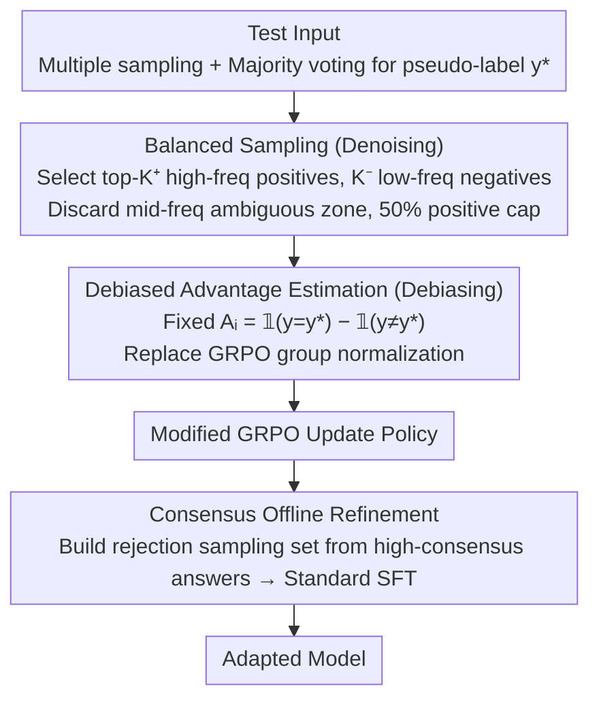

# Understanding and Mitigating Spurious Signal Amplification in Test-Time Reinforcement Learning for Math Reasoning

**Conference**: ACL 2026 Findings  
**arXiv**: [2604.21327](https://arxiv.org/abs/2604.21327)  
**Code**: [https://github.com/yuyongcan/DDRL](https://github.com/yuyongcan/DDRL)  
**Area**: Image Restoration  
**Keywords**: Test-Time Reinforcement Learning, Pseudo-label Noise, GRPO Bias, Denoising and Debiasing, Mathematical Reasoning

## TL;DR

This paper systematically analyzes the sources and amplification mechanisms of spurious signals in Test-Time Reinforcement Learning (TTRL). It identifies that the ambiguous regions formed by mid-frequency answers are the primary noise sources, and that group-relative normalization in GRPO amplifies these spurious signals. The proposed DDRL framework mitigates these issues through a three-pronged approach: balanced sampling, fixed advantage values, and consensus-based offline refinement, achieving a 15.3% relative improvement on Qwen2.5-Math-1.5B.

## Background & Motivation

**Background**: TTRL adapts to distribution shifts during test-time by constructing pseudo-labels through multiple sampling and majority voting, followed by unsupervised RL using GRPO. It operates under completely unsupervised conditions, where reward signals are derived entirely from the model's own outputs.

**Limitations of Prior Work**: TTRL is susceptible to spurious reward signals—incorrect responses may be erroneously rewarded, while correct ones may be punished. However, the specific sources and propagation mechanisms of these spurious signals have not been systematically analyzed.

**Key Challenge**: (1) Source level—the relationship between answer frequency and reliability is non-linear: high-frequency answers are mostly correct, low-frequency answers are mostly incorrect, but mid-frequency answers are highly ambiguous (with oscillating accuracy). Standard TTRL treats all sampled rollouts equally. (2) Amplification level—GRPO's group-relative normalization assigns extremely high advantage values when positive samples are scarce. While reasonable in supervised RL (where rare positives represent valuable signals), in TTRL, few positive samples imply low consensus or high uncertainty. GRPO effectively assigns the largest weights to the most unreliable samples.

**Goal**: Systematically understand the sources and amplification mechanisms of spurious signals in TTRL and design effective mitigation strategies.

**Key Insight**: Analyze pseudo-label reliability from the perspective of answer sampling frequency and investigate signal amplification through the mathematical properties of GRPO advantage estimation.

**Core Idea**: (1) Balanced Confidence Sampling—exclude ambiguous mid-frequency samples and maintain a balance between positive and negative samples; (2) Debiased Advantage Estimation—replace group normalization with fixed advantage values $A_i = \mathbb{I}(y=y^*) - \mathbb{I}(y \neq y^*)$ to eliminate amplification effects; (3) Consensus Offline Refinement—perform efficient and stable post-optimization using a rejection-sampled dataset after the RL phase.

## Method

### Overall Architecture

DDRL addresses a persistent issue in TTRL: pseudo-labels generated via majority voting contain significant spurious signals, which GRPO further amplifies. This work diagnoses "where spurious signals come from and how they are amplified," and then prescribes three solutions: filtering reliable samples by frequency and discarding the ambiguous mid-frequency region (denoising); replacing GRPO's group normalization with fixed $\pm 1$ advantage values (debiasing); and concluding with a round of offline SFT refinement using high-consensus samples.

### Key Designs

**1. Spurious Signal Source Analysis and Balanced Sampling: Discarding Unreliable Mid-frequency Answers**

The first source of spurious signals is on the data side: the relationship between answer frequency and accuracy is non-linear. High-frequency answers are almost always correct (reliable positives), and low-frequency answers are almost always wrong (reliable negatives). However, mid-frequency answers exhibit volatile accuracy and are the primary source of noise. Balanced Sampling selects only from the two ends: the top-$K^+$ highest frequency samples matching the pseudo-label (capped at $\lfloor K/2 \rfloor$) for positives, and $K^-$ lowest frequency samples for negatives, discarding the mid-frequency ambiguous zone. The 50% positive cap prevents positive samples from dominating and maintains balance.

**2. Debiased Advantage Estimation: Replacing GRPO Normalization with Fixed $\pm 1$ Advantages to Break the Amplification Chain**

The second source is algorithmic: GRPO's group normalization assigns massive advantage values when positive samples are rare. In TTRL, "rare positives" equals "low consensus" and "high uncertainty." Normalization places the most weight on the least reliable samples, creating a vicious cycle: "fewer positives $\to$ larger advantage $\to$ amplified noise." DDRL fixes the advantage values to $A_i = \mathbb{I}(y=y^*) - \mathbb{I}(y \neq y^*)$ (+1 for positives, -1 for negatives), removing group-relative normalization. Preliminary experiments show that removing normalization alone improves AIME2024 performance from 15.8% to 20.6%.

**3. Consensus Offline Refinement: Final SFT Round with Clean Data after RL**

Even with denoising and debiasing, unsupervised RL remains somewhat volatile. After the RL phase, DDRL constructs a rejection-sampled dataset using highly consistent answers from multiple samples to perform a final round of standard SFT refinement. This step utilizes the "cleanest" supervision signals to smooth out any jitters introduced during RL training, serving as a stability guarantee for the entire pipeline.

### Loss & Training

The RL phase utilizes the modified GRPO (fixed advantage + balanced sampling), while the refinement phase uses standard SFT loss. Evaluation was conducted on Qwen2.5-Math-1.5B/3B and LLaMA-3.1-8B-Instruct across benchmarks including MATH-500 and AIME2024.

## Key Experimental Results

### Main Results

| Model/Method | AIME2024 | MATH-500 | Gain (Rel.) |
|----------|---------|---------|---------|
| Qwen2.5-Math-1.5B + TTRL | 15.8 | 73.0 | - |
| Qwen2.5-Math-1.5B + DDRL | **18.2** | **84.2** | **+15.3%** |
| LLaMA-3.1-8B + TTRL | - | - | - |
| LLaMA-3.1-8B + DDRL | - | - | **+12.7%** |

### Ablation Study

| Configuration | AIME2024 | MATH | Description |
|------|---------|------|------|
| GRPO (Standard Norm) | 15.8 | 73.0 | Amplifies spurious signals |
| GRPO (No Norm) | 20.6 | 75.0 | Significant gain from debiasing alone |
| + Balanced Sampling | Further Improved | Further Improved | Denoising |
| + Offline Refinement | Best | Best | Full DDRL |

### Key Findings

- Mid-frequency answers are the primary source of spurious signals due to high accuracy variance and unreliable pseudo-labels.
- GRPO normalization systematically amplifies spurious signals in low-consensus scenarios; removing normalization yields significant improvements.
- The three components of DDRL provide independent and stackable gains.
- The 50% positive sample cap in balanced sampling is crucial for stable training.
- Consistent improvements were observed across three LLMs of different scales.

## Highlights & Insights

- **Thorough "Frequency-Reliability" Analysis**: Dividing answer frequency into high/mid/low zones clearly locates the source of spurious signals (mid-frequency), providing direct guidance for sampling strategies.
- **Deep Theoretical Analysis of GRPO Bias**: Reveals the core contradiction where "rational assumptions in supervised RL are violated in unsupervised TTRL." This insight is valuable for all unsupervised methods using GRPO.
- **Simplicity of Fixed Advantages**: Replacing complex group normalization with a simple $+1/-1$ fixed advantage is more effective, reflecting the principle that "simplicity is more robust in noisy environments."

## Limitations & Future Work

- Validation is limited to mathematical reasoning; other tasks (e.g., code, logic) have not been tested.
- Frequency threshold settings (distinguishing high/mid/low) may require adjustment for different tasks.
- The offline refinement stage adds additional computational cost.
- DDRL's effectiveness may be limited when the base model capacity is very weak (i.e., when majority voting itself is unreliable).

## Related Work & Insights

- **vs Standard TTRL**: TTRL treats all samples equally and uses standard GRPO, leading to signal amplification. DDRL addresses this via denoising (sampling) and debiasing (advantage estimation).
- **vs EMPO/STILL (Unsupervised RL)**: These methods attempt unsupervised RL but do not analyze the mechanism of spurious signals. DDRL provides systematic analysis and targeted solutions.

## Rating

- Novelty: ⭐⭐⭐⭐ The systematic analysis of spurious signals is insightful, though the solutions (fixed advantage + sampling filter) are technically straightforward.
- Experimental Thoroughness: ⭐⭐⭐⭐ Sufficient evaluation across three models, multiple benchmarks, and step-by-step ablations.
- Writing Quality: ⭐⭐⭐⭐⭐ The logical chain for problem analysis (frequency-reliability + GRPO bias) is exceptionally clear.

<!-- RELATED:START -->

## Related Papers

- [\[ACL 2026\] Revisiting Entropy in Reinforcement Learning for Large Reasoning Models](revisiting_entropy_in_reinforcement_learning_for_large_reasoning_models.md)
- [\[ACL 2026\] Efficient Test-Time Scaling via Temporal Reasoning Aggregation](efficient_test-time_scaling_via_temporal_reasoning_aggregation.md)
- [\[ICLR 2026\] Understanding the Role of Training Data in Test-Time Scaling](../../ICLR2026/llm_reasoning/understanding_the_role_of_training_data_in_test-time_scaling.md)
- [\[ACL 2026\] TemplateRL: Structured Template-Guided Reinforcement Learning for LLM Reasoning](templaterl_structured_template-guided_reinforcement_learning_for_llm_reasoning.md)
- [\[ACL 2026\] Parallel Test-Time Scaling for Latent Reasoning Models](parallel_test-time_scaling_for_latent_reasoning_models.md)

<!-- RELATED:END -->
