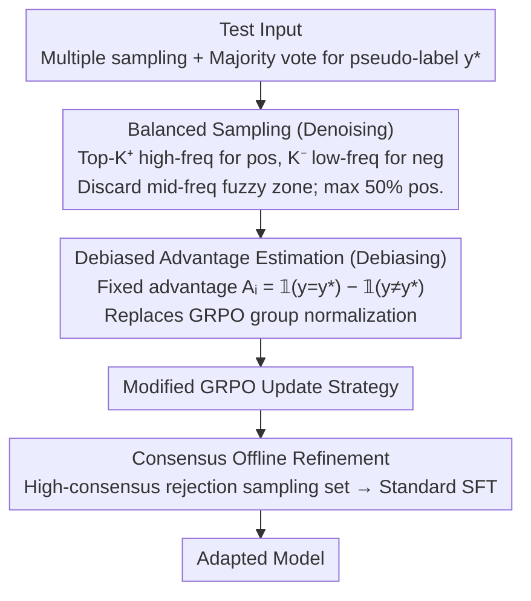

# Understanding and Mitigating Spurious Signal Amplification in Test-Time Reinforcement Learning for Math Reasoning

**Conference**: ACL 2026 Findings  
**arXiv**: [2604.21327](https://arxiv.org/abs/2604.21327)  
**Code**: [https://github.com/yuyongcan/DDRL](https://github.com/yuyongcan/DDRL)  
**Area**: Image Restoration  
**Keywords**: Test-time reinforcement learning, pseudo-label noise, GRPO bias, denoising and debiasing, mathematical reasoning

## TL;DR

This paper systematically analyzes the sources and amplification mechanisms of spurious signals in Test-Time Reinforcement Learning (TTRL). It identifies that the fuzzy region composed of mid-frequency answers is the primary noise source and that group normalization in GRPO amplifies these signals. The proposed DDRL framework mitigates these issues through a three-pronged approach: balanced sampling, fixed advantage values, and consensus offline refinement, achieving a relative gain of 15.3% on Qwen2.5-Math-1.5B.

## Background & Motivation

**Background**: TTRL adapts to distribution shifts during test time by constructing pseudo-labels through multiple sampling and majority voting, followed by unsupervised RL using GRPO. It operates under fully unsupervised conditions where reward signals are derived entirely from the model's own outputs.

**Limitations of Prior Work**: TTRL is susceptible to spurious reward signals—incorrect answers may be wrongly rewarded, while correct answers may be punished. However, the specific sources and propagation mechanisms of these spurious signals have not been systematically analyzed.

**Key Challenge**: (1) Source level—The relationship between answer frequency and reliability is non-linear: high-frequency answers are mostly correct, low-frequency answers are mostly incorrect, while mid-frequency answers are highly ambiguous with volatile accuracy. Standard TTRL treats all sampled rollouts equally. (2) Amplification level—Group normalization in GRPO assigns extremely high advantage values when positive samples are scarce. While reasonable in supervised RL (where rare positives represent valuable signals), in TTRL, few positive samples imply low consensus and high uncertainty. GRPO inadvertently assigns the maximum weight to the most unreliable samples.

**Goal**: To systematically understand the sources and amplification mechanisms of spurious signals in TTRL and design effective mitigation strategies.

**Key Insight**: Analyze pseudo-label reliability from the perspective of answer sampling frequency and analyze signal amplification through the mathematical properties of GRPO advantage estimation.

**Core Idea**: (1) Balanced confidence sampling—Exclude mid-frequency fuzzy samples and maintain a balance between positive and negative samples; (2) Debiased advantage estimation—Replace group normalization with fixed advantage values $A_i = \mathbb{I}(y=y^*) - \mathbb{I}(y \neq y^*)$ to eliminate amplification effects; (3) Consensus offline refinement—Perform efficient and stable post-optimization using a rejection-sampled dataset after the RL stage.

## Method

### Overall Architecture

DDRL addresses a chronic issue in TTRL: pseudo-labels generated via majority voting contain significant spurious signals, which are further amplified by GRPO. This work diagnoses "where spurious signals come from and how they are amplified" before applying three remedies: selecting reliable positive/negative samples based on frequency while discarding the mid-frequency fuzzy zone (denoising); replacing GRPO group normalization with fixed $\pm 1$ advantage values (debiasing); and concluding with a round of offline SFT using high-consensus samples.

### Key Designs

**1. Spurious Signal Source Analysis and Balanced Sampling: Removing Unreliable Mid-frequency Answers**

The first source of spurious signals lies in the data: the relationship between answer frequency and accuracy is non-linear—high-frequency answers are almost always correct (reliable positives), and low-frequency answers are almost always wrong (reliable negatives). Mid-frequency answers exhibit high accuracy variance and are the primary source of noise. Balanced sampling exclusively selects the two ends and discards the middle: positive samples are the top-$K^+$ highest frequency samples matching the pseudo-label (capped at $\lfloor K/2 \rfloor$), while negative samples are the $K^-$ lowest frequency samples. The mid-frequency fuzzy zone is discarded, and the 50% cap on positive samples prevents them from dominating the training.

**2. Debiased Advantage Estimation: Replacing GRPO Normalization with Fixed ±1 to Cut Amplification**

The second source of spurious signals is algorithmic: GRPO group normalization assigns large advantage values when positives are rare. While appropriate for supervised RL (rare positive = valuable signal), in TTRL, "rare positive = low consensus = high uncertainty." Normalization places the highest weight on the least reliable samples, creating a vicious cycle where fewer positives lead to larger advantages and amplified noise. DDRL fixes the advantage values to $A_i = \mathbb{I}(y=y^*) - \mathbb{I}(y \neq y^*)$ (positive $+1$, negative $-1$), removing group normalization. This achieves immediate gains—preliminary experiments in Table 1 show that removing normalization alone improves AIME2024 from $15.8\%$ to $20.6\%$.

**3. Consensus Offline Refinement: Post-RL SFT Using Clean Data**

Even with denoising and debiasing, unsupervised RL involves inherent volatility. After the RL stage, DDRL constructs a rejection-sampled dataset using highly consistent answers from multiple samplings to perform a final round of standard SFT. This step utilizes the "highest consensus" clean signals to smooth out fluctuations introduced during RL training, serving as a stability guarantee for the entire pipeline.

### Loss & Training

The RL stage utilizes the modified GRPO (fixed advantage values + balanced sampling), while the refinement stage utilizes the standard SFT loss. Evaluations were conducted on Qwen2.5-Math-1.5B/3B and LLaMA-3.1-8B-Instruct, with benchmarks including MATH-500 and AIME2024.

## Key Experimental Results

### Main Results

| Model / Method | AIME2024 | MATH-500 | Gain |
|----------|---------|---------|---------|
| Qwen2.5-Math-1.5B + TTRL | 15.8 | 73.0 | - |
| Qwen2.5-Math-1.5B + Ours | **18.2** | **84.2** | **+15.3%** |
| LLaMA-3.1-8B + TTRL | - | - | - |
| LLaMA-3.1-8B + Ours | - | - | **+12.7%** |

### Ablation Study

| Configuration | AIME2024 | MATH | Notes |
|------|---------|------|------|
| GRPO (Standard Normalization) | 15.8 | 73.0 | Amplifies spurious signals |
| GRPO (No Normalization) | 20.6 | 75.0 | Improvement via debiasing alone |
| + Balanced Sampling | Further Improvement | Further Improvement | Denoising |
| + Offline Refinement | Optimal | Optimal | Full DDRL |

### Key Findings

- Mid-frequency answers are the primary source of spurious signals—their accuracy variance is extremely high, making them unreliable as pseudo-labels.
- GRPO normalization systematically amplifies spurious signals in low-consensus scenarios—simply removing normalization leads to significant improvements.
- The three components of DDRL provide independent gains that are additive.
- The 50% positive sample cap in balanced sampling is crucial for stable training.
- Consistent improvements are observed across three different LLM scales.

## Highlights & Insights

- **Thorough "Frequency-Reliability" Analysis**: By categorizing answer frequencies into high/mid/low zones, the study clearly identifies the source of spurious signals (mid-frequency), providing direct guidance for sampling strategies.
-  **In-depth Theoretical Analysis of GRPO Bias**: The research reveals the core contradiction where reasonable assumptions in supervised RL are violated in unsupervised TTRL. This insight is valuable for all unsupervised methods using GRPO.
- **Simplicity of Fixed Advantage Values**: Replacing complex group normalization with a simple $+1/-1$ fixed advantage yields better results, embodying the principle that "simplicity is more robust in noisy environments."

## Limitations & Future Work

- Validated only on mathematical reasoning tasks; other reasoning tasks (e.g., code, logic) have not been tested.
- Setting frequency thresholds (to distinguish high/mid/low frequency) may require adjustment for different tasks.
- The offline refinement stage introduces additional computational costs.
- DDRL's effectiveness may be limited when the model's base capability is extremely weak (i.e., when majority voting itself is unreliable).

## Related Work & Insights

- **vs. Standard TTRL**: TTRL treats all samples equally and uses standard GRPO, allowing spurious signals to be amplified. DDRL addresses the problem via denoising (sampling) and debiasing (advantage estimation).
- **vs. EMPO/STILL (Unsupervised RL)**: These methods also attempt unsupervised RL but do not analyze the mechanism of spurious signals. DDRL provides a systematic analysis and targeted solutions.

## Rating

- Novelty: ⭐⭐⭐⭐ Systematic analysis of spurious signals is insightful, though the solutions (fixed advantage + sampling filter) are technically straightforward.
- Experimental Thoroughness: ⭐⭐⭐⭐ Sufficient testing across three models, multiple benchmarks, and step-by-step ablations.
- Writing Quality: ⭐⭐⭐⭐⭐ The logical chain for problem analysis (frequency-reliability + GRPO bias) is exceptionally clear.

<!-- RELATED:START -->

## Related Papers

- [\[ICLR 2026\] Understanding the Role of Training Data in Test-Time Scaling](../../ICLR2026/llm_reasoning/understanding_the_role_of_training_data_in_test-time_scaling.md)
- [\[ACL 2026\] Revisiting Entropy in Reinforcement Learning for Large Reasoning Models](revisiting_entropy_in_reinforcement_learning_for_large_reasoning_models.md)
- [\[ACL 2026\] Efficient Test-Time Scaling via Temporal Reasoning Aggregation](efficient_test-time_scaling_via_temporal_reasoning_aggregation.md)
- [\[ACL 2026\] TemplateRL: Structured Template-Guided Reinforcement Learning for LLM Reasoning](templaterl_structured_template-guided_reinforcement_learning_for_llm_reasoning.md)
- [\[ACL 2026\] Parallel Test-Time Scaling for Latent Reasoning Models](parallel_test-time_scaling_for_latent_reasoning_models.md)

<!-- RELATED:END -->
