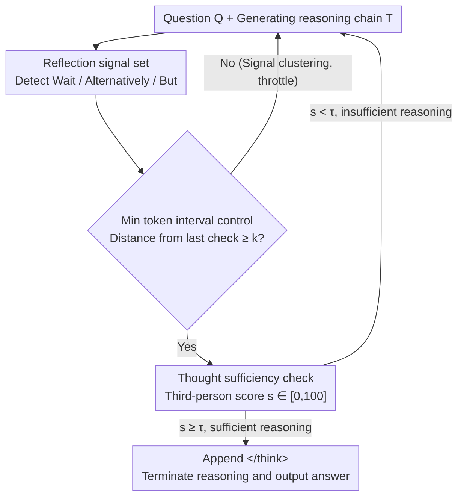

# When Is Thinking Enough? Early Exit via Sufficiency Assessment for Efficient Reasoning

**Conference**: ACL 2026  
**arXiv**: [2604.06787](https://arxiv.org/abs/2604.06787)  
**Code**: To be confirmed  
**Area**: LLM Reasoning  
**Keywords**: Reasoning efficiency, Early exit strategies, Overthinking, Metacognition, Chain-of-Thought

## TL;DR

Ours proposes the DTSR framework, which identifies "reflection signals" (e.g., Wait, Alternatively) within the reasoning process and triggers a self-assessment of "thought sufficiency" to determine early termination. It achieves a 28.9%–34.9% reduction in reasoning length on Qwen3 series models with negligible accuracy loss.

## Background & Motivation

**Background**: Large Reasoning Models (LRMs) such as DeepSeek-R1 and Qwen3 have achieved significant progress in complex tasks via long Chain-of-Thought (CoT). However, this introduces severe reasoning redundancy, where models repeatedly verify or explore alternatives even for simple queries.

**Limitations of Prior Work**: Existing early exit methods rely on manually designed criteria—Dynasor-CoT uses consecutive answer consistency (requiring additional tokens for verification after the correct answer appears), while DEER utilizes the entropy of intermediate answers as a confidence metric. These methods face two fundamental issues: (1) Reasoning models exhibit overconfidence, maintaining high confidence even when answers are incorrect; (2) They are only applicable to short-answer tasks and fail in long-answer scenarios like code generation or open-ended QA.

**Key Challenge**: How to determine if a reasoning process is "sufficient" without relying on answer confidence? A method is required to evaluate the reasoning process itself rather than the final answer correctness.

**Goal**: To design a general and reliable early exit framework by assessing the sufficiency of the reasoning chain instead of answer confidence.

**Key Insight**: Drawing from human metacognition—humans do not frequently produce intermediate answers to decide when to stop thinking; instead, they internally evaluate whether the current thought is sufficient to support a conclusion.

**Core Idea**: Trigger a sufficiency check at reflection signals (e.g., "Wait", "Let me check") and task the model with evaluating, from a third-person perspective, whether the current reasoning chain is sufficient to derive the final answer.

## Method

### Overall Architecture

DTSR operates in two stages: (1) Reflection signal monitoring—detecting specific reflection trigger words (e.g., "Wait", "Alternatively", "But") during generation, which signal the start of redundant verification or backtracking; (2) Thought sufficiency check—upon detection, the original question and current reasoning chain are input into a sufficiency assessment template. The model outputs a sufficiency score $s \in [0, 100]$. If the score exceeds a threshold $\tau$ (default 100), a `</think>` tag is appended to terminate reasoning and output the answer; otherwise, reasoning continues to the next signal. A minimum token interval $k$ (default 64) is set to avoid excessive checks.

### Key Designs

**1. Reflection Signals: Utilizing Natural Exit Points**

A primary challenge in early exit is determining the check timing. By analyzing Qwen3-32B trajectories, it was observed that "optimal exit points" (the earliest point where the correct answer can be derived) are frequently followed by explicit self-reflection behaviors, such as "Wait", "Alternatively", or "Let me check". These triggers mark the boundary where the model shifts from reasoning to redundant verification. Using these signals aligns the exit mechanism with the model's inherent generation patterns.

**2. Sufficiency Assessment: Third-person Evaluation of the Process**

DTSR evaluates the integrity of the reasoning process rather than answer confidence. At a reflection signal, the original question $Q$ and chain $T$ are used to prompt the model to judge "objectively" whether the reasoning is complete. Adopting a "third-person" perspective addresses overconfidence, as models evaluate reasoning chains more accurately when treated as external content. This approach ensures generalizability across tasks without standard short answers.

**3. Minimum Token Interval Control: Throttling Dense Signals**

Reflection signals often appear in clusters (e.g., "Wait, but let me check"). To minimize computation overhead, DTSR enforces a gap of at least $k$ tokens (default $k=64$) between checks. This interval balances reasoning length reduction and inference latency.

### Loss & Training

DTSR is a training-free method, requiring no additional training. Sufficiency assessment is performed during inference only.

## Key Experimental Results

### Main Results

| Method | Model | Overall Acc | Overall Tok | Length Reduction |
|------|------|------------|------------|---------|
| Vanilla | Qwen3-8B | 81.9 | 6510 | - |
| DEER | Qwen3-8B | 79.3 | 4532 | -30.4% |
| **Ours** | Qwen3-8B | **81.0** | **4428** | **-32.0%** |
| Vanilla | Qwen3-14B | 84.4 | 5761 | - |
| DEER | Qwen3-14B | 83.0 | 4367 | -24.2% |
| **Ours** | Qwen3-14B | **84.8** | **3748** | **-34.9%** |
| Vanilla | Qwen3-32B | 84.7 | 5638 | - |
| DEER | Qwen3-32B | 83.1 | 4318 | -23.4% |
| **Ours** | Qwen3-32B | **84.6** | **4010** | **-28.9%** |

### Ablation Study

| Configuration | Key Results | Description |
|------|---------|------|
| k=16 | Latency increase | Overly frequent checks |
| k=64 | Optimal balance | Default setting |
| k=256 | Length increase | Missed optimal exit points |
| τ=50 | Acc significantly drops | Premature termination |
| τ=100 | Optimal | High-confidence termination |
| First-person | Acc drops | Higher overconfidence |

### Key Findings
- On Qwen3-14B, DTSR improved accuracy (84.8 vs 84.4), suggesting that removing redundant reasoning can mitigate errors.
- Reasoning length was reduced by over 50% on programming tasks (LiveCodeBench) due to high redundancy in code verification.
- Inference latency is lower than DEER (MATH-500: 1.9s vs 4.2s) because DEER requires full decoding of intermediate answers, whereas DTSR only generates a score.
- The third-person evaluation paradigm significantly outperforms first-person assessment, confirming that overconfidence is primarily a self-evaluation issue.

## Highlights & Insights

- **Metacognitive Redefinition**: Shifting the problem from "is the answer right" to "is the reasoning enough" avoids the calibration issues of confidence metrics and enhances task universality.
- **Reflection Signals as Natural Candidates**: Leveraging the model’s own "hesitation" signals provides a more adaptive exit timing compared to fixed-interval checks.
- **Third-person Perspective**: The finding that models are better at evaluating reasoning when positioned as an external observer provides broader implications for LLM self-correction.

## Limitations & Future Work

- Validated only on Qwen3; reflection signal patterns may vary for other models like DeepSeek-R1 or o1.
- Computational overhead of the check—though it reduces total latency, costs may offset gains in specific low-$k$ scenarios.
- The fixed threshold $\tau=100$ may lack flexibility for varying task difficulties.
- Future work could explore training-based sufficiency modules to further improve performance.

## Related Work & Insights

- **vs DEER**: entropy-based methods fail on long-answer tasks and suffer from overconfidence; DTSR is more general and reliable.
- **vs Dynasor-CoT**: Consistency checks require extra tokens after the answer is found; DTSR exits earlier by identifying the reasoning boundary.
- **vs NoWAIT**: Masking reflection tokens can degrade reasoning capabilities; DTSR preserves the full reasoning capability and only terminates when appropriate.

## Rating

- Novelty: ⭐⭐⭐⭐
- Experimental Thoroughness: ⭐⭐⭐⭐
- Writing Quality: ⭐⭐⭐⭐
- Value: ⭐⭐⭐⭐

<!-- RELATED:START -->

## Related Papers

- [\[ACL 2026\] Step-GRPO: Internalizing Dynamic Early Exit for Efficient Reasoning](step-grpo_internalizing_dynamic_early_exit_for_efficient_reasoning.md)
- [\[ICLR 2026\] Dynamic Early Exit in Reasoning Models](../../ICLR2026/llm_reasoning/dynamic_early_exit_in_reasoning_models.md)
- [\[ACL 2026\] DRP: Distilled Reasoning Pruning with Skill-aware Step Decomposition for Efficient Large Reasoning Models](drp_distilled_reasoning_pruning_with_skill-aware_step_decomposition_for_efficien.md)
- [\[ICML 2026\] SuCo: Sufficiency-guided Continuous Adaptive Reasoning](../../ICML2026/llm_reasoning/suco_sufficiency-guided_continuous_adaptive_reasoning.md)
- [\[ICLR 2026\] When More Is Less: Understanding Chain-of-Thought Length in LLMs](../../ICLR2026/llm_reasoning/when_more_is_less_understanding_chain-of-thought_length_in_llms.md)

<!-- RELATED:END -->
