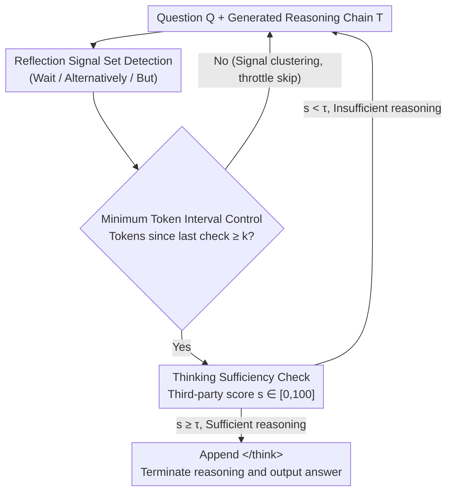

# When Is Thinking Enough? Early Exit via Sufficiency Assessment for Efficient Reasoning

**Conference**: ACL 2026  
**arXiv**: [2604.06787](https://arxiv.org/abs/2604.06787)  
**Code**: To be confirmed  
**Area**: LLM Reasoning  
**Keywords**: Reasoning Efficiency, Early Exit Strategy, Overthinking, Metacognition, Chain-of-Thought

## TL;DR

This paper proposes the DTSR framework, which detects "reflection signals" (e.g., *Wait*, *Alternatively*) during the reasoning process and triggers a "sufficiency assessment" for the model to self-evaluate whether the current reasoning is "sufficient" to decide on early termination. This achieves a 28.9%–34.9% reduction in reasoning length on Qwen3 series models with almost no loss in accuracy.

## Background & Motivation

**Background**: Large Reasoning Models (LRMs) such as DeepSeek-R1 and Qwen3 have made significant progress in complex reasoning tasks through long Chain-of-Thought (CoT). However, this introduces serious reasoning redundancy—models repeatedly verify and explore alternative paths even for simple questions.

**Limitations of Prior Work**: Existing early exit methods rely on manually designed exit criteria. Dynasor-CoT uses consecutive answer consistency (but still requires extra tokens for verification after the correct answer appears), and DEER uses the entropy of intermediate answers as a confidence metric. These methods face two fundamental issues: (1) Reasoning models exhibit overconfidence, maintaining high confidence even when answers are incorrect, making confidence-based judgments unreliable; (2) They are only applicable to short-answer tasks and do not work for long-answer scenarios like code generation or open-ended QA.

**Key Challenge**: How to determine if the reasoning process is already "sufficient" without relying on answer confidence? A method is needed to evaluate the reasoning process itself rather than the correctness of the answer.

**Goal**: To design a universal and reliable early exit framework that decides the exit timing by assessing the sufficiency of the reasoning chain rather than the confidence of the answer.

**Key Insight**: Drawing inspiration from human metacognition—humans do not frequently produce intermediate answers to decide whether to stop thinking; instead, they internally evaluate whether the "current thoughts are sufficient to support the final conclusion."

**Core Idea**: Trigger a sufficiency check at the model's reflection signals (e.g., "Wait", "Let me check"). This allows the model to evaluate, from a third-person perspective, whether the current reasoning chain is sufficient to derive the final answer.

## Method

### Overall Architecture

DTSR operates in two stages: (1) Reflection signal monitoring—detecting specific reflection trigger words (e.g., "Wait", "Alternatively", "But") during generation, which signal that the model is about to begin redundant verification or backtracking; (2) Thinking sufficiency check—upon detecting a reflection signal, the original question and current reasoning chain are fed into a sufficiency assessment template. The model outputs a sufficiency score from 0–100. If the score exceeds the threshold $\tau$ (default 100), a `</think>` tag is appended to terminate reasoning and output the final answer; otherwise, reasoning continues to the next reflection signal. To avoid frequent checks, a minimum token interval $k$ (default 64) is implemented.

### Key Designs

**1. Reflection Signal Set: Using the model's own "hesitation" as a natural exit point**

The most difficult part of early exit methods is determining where to check. Inserting checks at fixed intervals is cumbersome and easy to mistime. The authors analyzed the reasoning trajectories of Qwen3-32B, marked the "optimal early exit point" (the earliest position where the correct answer could be derived) for each sample, and observed the model's subsequent behavior. They found that these points are followed by explicit self-reflection behaviors—words like "Wait", "Alternatively", "But wait", and "Let me check" appear repeatedly. These reflection triggers are collected into a signal set to serve as markers for exit candidates.

The rationale is that reflection signals precisely mark the boundary where the model switches from "reasoning" to "verification." Correct answers often emerge before the reflection; subsequent repetitive checks are mostly redundant. Leveraging the model's own generation patterns to locate check timings fits model behavior better than external fixed-rhythm mechanisms.

**2. Thinking Sufficiency Check: Evaluating "Is this reasoning enough?" from a third-person perspective rather than "Am I right?"**

Relying on answer confidence to decide when to stop hits the wall of overconfidence in reasoning models—incorrect answers often have high confidence, making judgments unreliable. Furthermore, this only works for tasks with standard short answers. DTSR bypasses confidence to evaluate the completeness of the reasoning process itself. At a reflection signal, the original question $Q$ and current reasoning chain $T$ are combined into a sufficiency assessment prompt. The model acts as a "third person" to judge if the reasoning is complete enough to derive the correct answer, outputting a scalar score $s \in [0, 100]$. When $s \geq \tau$ (default $\tau = 100$), it appends `</think>` to terminate and provide the final answer.

The key lies in the "third-person" perspective shift. The authors hypothesize that overconfidence primarily occurs during "self" assessment—judging someone else's reasoning chain is more objective than judging one's own answer. Experiments confirm that third-person assessment accuracy is significantly higher than first-person. This shift also provides universality: since it evaluates the reasoning process rather than the answer correctness, it is not restricted to tasks with ground-truth answers, making it applicable to code generation and open-ended QA.

**3. Minimum Token Interval Control: Throttling dense reflection signals**

Reflection signals often appear in clusters (e.g., "Wait, but let me check" contains multiple triggers). Triggering a sufficiency check for every signal would cause overhead to accumulate rapidly. DTSR requires at least $k$ tokens (default $k = 64$) generated between two checks. This interval is a trade-off: $k < 64$ results in excessive checks and latency, while $k > 256$ easily misses the optimal exit point. $k = 64$ optimizes both reasoning length and latency.

### Loss & Training

DTSR is a training-free method and requires no additional training. Sufficiency assessment blocks are inserted only during inference.

## Key Experimental Results

### Main Results

| Method | Model | Overall Acc | Overall Tok | Length Reduction |
|------|------|------------|------------|---------|
| Vanilla | Qwen3-8B | 81.9 | 6510 | - |
| DEER | Qwen3-8B | 79.3 | 4532 | -30.4% |
| **DTSR** | Qwen3-8B | **81.0** | **4428** | **-32.0%** |
| Vanilla | Qwen3-14B | 84.4 | 5761 | - |
| DEER | Qwen3-14B | 83.0 | 4367 | -24.2% |
| **DTSR** | Qwen3-14B | **84.8** | **3748** | **-34.9%** |
| Vanilla | Qwen3-32B | 84.7 | 5638 | - |
| DEER | Qwen3-32B | 83.1 | 4318 | -23.4% |
| **DTSR** | Qwen3-32B | **84.6** | **4010** | **-28.9%** |

### Ablation Study

| Configuration | Key Result | Description |
|------|---------|------|
| k=16 | Latency increased, length similar | Checks too frequent |
| k=64 | Optimal balance | Default setting |
| k=256 | Length increased | Missed optimal exit points |
| τ=50 | Acc dropped significantly | Premature termination |
| τ=100 | Optimal | High-confidence termination |
| First-person Eval | Acc dropped | Worse overconfidence |

### Key Findings
- On Qwen3-14B, DTSR even improved accuracy (84.8 vs 84.4), suggesting that removing redundant reasoning can improve results.
- Reasoning length reduction exceeded 50% on programming tasks (LiveCodeBench), where redundant verification is more severe.
- DTSR's inference latency is lower than DEER (MATH-500: 1.9s vs 4.2s) because DEER requires full decoding of intermediate answers for each check, while DTSR only needs to generate a score.
- The third-person assessment paradigm (evaluating the reasoning process rather than self-assessment) is significantly superior to the first person, validating the hypothesis that "overconfidence stems from self-assessment."

## Highlights & Insights

- **Redefining the early exit problem via metacognition**: Instead of judging "is the answer right," it judges "is the reasoning enough"—this perspective shift bypasses overconfidence and is more universal (not limited to tasks with standard answers).
- **Reflection signals as natural exit candidates**: By utilizing the behavior patterns of reasoning models themselves (reflection triggers), it avoids external fixed-interval mechanisms and aligns better with the model's generation routine.
- **Third-person vs. First-person assessment**: The discovery that models evaluate others' reasoning more accurately than their own has broader implications for the field of LLM self-evaluation.

## Limitations & Future Work

- Validated only on the Qwen3 series; reflection signal patterns in other reasoning models (DeepSeek-R1, o1, etc.) may differ.
- Sufficiency checks require extra computation—while overall latency decreases, the overhead of checks might offset savings in specific scenarios where $k$ is small.
- The optimal value for threshold $\tau$ may vary with task difficulty; fixing it at 100 might lack flexibility.
- The potential for combination with training-based methods was not explored—a trained sufficiency assessment module might perform better.

## Related Work & Insights

- **vs DEER**: Methods based on intermediate answer entropy are affected by overconfidence and limited to short-answer tasks; DTSR evaluates the reasoning process, making it more universal and reliable.
- **vs Dynasor-CoT**: Requires extra validation tokens after answers become consistent, failing to reach the absolute optimal exit point; DTSR's direct assessment at reflection signals allows for earlier exits.
- **vs NoWAIT**: Reduces redundancy by masking reflection tokens but disrupts the model's natural reasoning ability; DTSR preserves full reasoning ability and only terminates at appropriate times.

## Rating

- Novelty: ⭐⭐⭐⭐ Metacognitive perspective and third-person evaluation are innovative, though the framework is intuitive.
- Experimental Thoroughness: ⭐⭐⭐⭐ Extensive testing across three model sizes, six datasets, and multi-dimensional ablations.
- Writing Quality: ⭐⭐⭐⭐ Motivation and methodology are clearly described with in-depth experimental analysis.
- Value: ⭐⭐⭐⭐ Significant practical value for reasoning efficiency; training-free methods are easy to deploy.

<!-- RELATED:START -->

## Related Papers

- [\[ACL 2026\] Step-GRPO: Internalizing Dynamic Early Exit for Efficient Reasoning](step-grpo_internalizing_dynamic_early_exit_for_efficient_reasoning.md)
- [\[ACL 2026\] Efficient Test-Time Scaling via Temporal Reasoning Aggregation](efficient_test-time_scaling_via_temporal_reasoning_aggregation.md)
- [\[ACL 2026\] DRP: Distilled Reasoning Pruning with Skill-aware Step Decomposition for Efficient Large Reasoning Models](drp_distilled_reasoning_pruning_with_skill-aware_step_decomposition_for_efficien.md)
- [\[ACL 2026\] Reinforced Efficient Reasoning via Semantically Diverse Exploration](reinforced_efficient_reasoning_via_semantically_diverse_exploration.md)
- [\[ICLR 2026\] Plan and Budget: Effective and Efficient Test-Time Scaling on Reasoning LLMs](../../ICLR2026/llm_reasoning/plan_and_budget_effective_and_efficient_test-time_scaling_on_reasoning_large_lan.md)

<!-- RELATED:END -->
