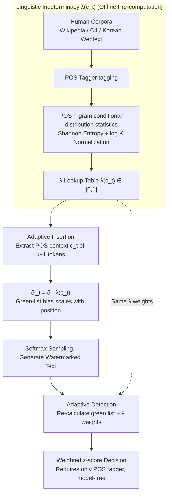

# STELA: A Linguistics-Aware LLM Watermarking via Syntactic Predictability

**Conference**: ACL 2026  
**arXiv**: [2510.13829](https://arxiv.org/abs/2510.13829)  
**Code**: https://github.com/Shinwoo-Park/stela_watermark  
**Area**: LLM Security / Watermarking / Publicly Verifiable Detection  
**Keywords**: Watermark, POS n-gram, Linguistic Indeterminacy, Publicly Verifiable, Cross-lingual

## TL;DR
STELA utilizes "linguistic indeterminacy" $\lambda(c_t)$, estimated via POS n-grams, as a modulation signal for watermark strength. It weakens the watermark at positions with high syntactic constraints (to preserve quality) and strengthens it at syntactically free positions (to improve detection). Like KGW, it supports public verification using only a POS tagger, without requiring access to model logits.

## Background & Motivation
**Background**: KGW, the foundational LLM watermarking scheme, uses hashing to partition the vocabulary into green/red lists and adds a bias $\delta$ to green list logits to embed statistical signals. Detection only requires re-calculating hashes and performing a z-test without model internal access, making it publicly verifiable. However, in positions with "low token entropy" (e.g., proper nouns or required functional words), adding a bias fails to change the most likely token, and forcing a change results in unnatural text.

**Limitations of Prior Work**: To address the low-entropy issue, methods like SWEET (selecting positions based on entropy thresholds) and EWD (weighting z-scores by entropy) were developed. While effective, they **all require access to LLM logits for detection**, breaking "public verifiability," the core advantage of KGW. MorphMark introduces adaptive embedding but still relies on output probabilities, leaving its flexibility limited.

**Key Challenge**: There has long been an inherent trade-off between "adaptive strength" and "model-free public detection": achieving the former requires token-level entropy, while the latter typically necessitates static schemes.

**Goal**: To identify a "model-independent signal capable of modulating watermark strength," allowing both insertion and detection to be adaptive without relying on LLM internals.

**Key Insight**: The authors decompose token-level entropy into two causes: "semantic fixation" (e.g., proper nouns) and "syntactic necessity" (e.g., Korean particles). The latter is determined by the linguistic structure of the language and is independent of specific models. By modeling "syntactic predictability" using the conditional entropy of POS n-grams, a truly model-free indeterminacy signal is obtained.

**Core Idea**: Utilize "POS n-gram conditional entropy + language-specific $K$ normalization" to calculate $\lambda(c_t) \in [0, 1]$ as a watermark modulation factor. During insertion, $\delta'_t = \delta \cdot \lambda(c_t)$; during detection, the z-score is weighted by $\lambda$. The entire pipeline requires only a POS tagger.

## Method

### Overall Architecture
Offline One-time Pre-computation: A POS tagger is run on large human-written corpora (Wikipedia / OpenWebText2 / C4 / KOREAN-WEBTEXT). The conditional probability distribution $P(\pi_t \mid c_t)$ of each POS tag following a POS context $c_t$ of length $k-1$ is statistically computed to generate a $\lambda$ lookup table.

Online Generation: At each step $t$, the POS context $c_t$ of the preceding $k-1$ tokens is extracted. $\lambda(c_t)$ is retrieved from the table, and the fixed bias $\delta$ of KGW is modified to $\delta'_t = \delta \cdot \lambda(c_t)$ before softmax sampling.

Online Detection: The green list and $\lambda$ weights are recalculated for each position, and detection is determined using a weighted z-score. The entire pipeline only requires a POS tagger and a hash function, keeping the detector completely model-free.

### Key Designs

**1. Linguistic Indeterminacy $\lambda(c_t)$: Moving the "Modulation Signal" from Model Space to Language Space**

Previous adaptive watermarks assumed token entropy was the only signal to measure whether a watermark should be added. However, entropy requires reading model logits, and if the detector must calculate it, KGW's core advantage of public verifiability is lost. The authors' breakthrough is noting that low token entropy stems from two sources: fixed semantics (e.g., proper nouns) and syntactic necessity (e.g., Korean particles). The latter is governed by syntax and is model-independent. By modeling "syntactic predictability," a model-free indeterminacy signal is derived.

Specifically, for a POS context $c_t$ of length $k-1$, the conditional distribution of the next POS tag is used to compute Shannon entropy $H(P(\pi_t \mid c_t)) = -\sum_{\pi'} P(\pi' \mid c_t) \log P(\pi' \mid c_t)$, which is then normalized by the number of unique tags $K_{c_t}$ observed after that context:

$$\lambda(c_t) = \frac{H(P(\pi_t \mid c_t))}{\log K_{c_t}} \in [0, 1]$$

$\lambda \to 1$ indicates "nearly arbitrary next POS" (high syntactic freedom), while $\lambda \to 0$ indicates "next POS fixed by syntax." The context window $k$ is set based on linguistic typology: $k=2$ for English, $k=4$ for Chinese/Korean. Normalization ensures comparability across languages.

**2. Adaptive Insertion $\delta'_t = \delta \cdot \lambda(c_t)$: Embedding Watermarks with Linguistic Flow**

With model-free $\lambda$, the generator scales the fixed green-list bias $\delta$ to $\delta'_t = \delta \cdot \lambda(c_t)$. This is applied to the logits: $l'_{t, i} = l_{t, i} + \delta'_t \cdot \mathbb{I}[i \in \mathcal{V}_G]$. In positions with high syntactic constraints (where $\lambda \approx 0$), the watermark interference is minimal, avoiding quality degradation. In syntactically free positions ($\lambda \approx 1$), the watermark is embedded at full strength to accumulate detection signals.

**3. Adaptive Detection: Applying the Same $\lambda$ Weights to the Weighted z-score**

If only the insertion is adaptive, the detection signal would be diluted by noise from low-indeterminacy positions. STELA allows the detector to reuse the weights $w_t = \lambda(c_t)$, where green tokens in high-freedom positions contribute more. The weighted statistic $W_G = \sum_t w_t \cdot \mathbb{I}(x_t \in \mathcal{V}_{G, t})$ yields the z-score:

$$z' = \frac{W_G - \gamma \sum_t w_t}{\sqrt{\gamma(1-\gamma) \sum_t w_t^2}}$$

This process maintains the model-free property of KGW while achieving adaptivity.

### Loss & Training
STELA is a training-free method. During generation, the temperature is fixed at 0.7, the green list ratio $\gamma = 0.5$, and $\delta$ is calibrated by language ($2.0 / \mathbb{E}[\lambda(c_t)]$): English 0.575, Chinese 0.523, Korean 0.475, ensuring fair comparison with baselines.

## Key Experimental Results

### Main Results: Detection Performance (TPR@5%FPR / Best F1)

| LLM | Method | English TPR / F1 | Chinese TPR / F1 | Korean TPR / F1 |
|-----|--------|------------------|------------------|-----------------|
| Llama-3.2 | KGW | 0.950 / 0.963 | 0.962 / 0.963 | 0.906 / 0.932 |
| Llama-3.2 | SWEET | 0.850 / 0.906 | 0.872 / 0.910 | 0.862 / 0.912 |
| Llama-3.2 | EWD | 0.870 / 0.916 | 0.850 / 0.902 | 0.896 / 0.928 |
| Llama-3.2 | MorphMark | 0.926 / 0.943 | 0.936 / 0.945 | 0.826 / 0.893 |
| Llama-3.2 | **STELA** | 0.938 / 0.953 | **0.976 / 0.972** | **0.950 / 0.954** |
| Qwen-3 | STELA | 0.978 / 0.966 | **0.996 / 0.994** | **0.950 / 0.950** |
| HyperCLOVA | STELA | **0.988 / 0.975** | **0.932 / 0.942** | **0.960 / 0.960** |

STELA achieves the highest average F1 across nine (model, language) combinations.

### Ablation Study: POS Context Length $k$ and Tagset Granularity

| Language | Optimal $k$ | Universal UD TPR | Specific Tagset TPR | Gain |
|------|---------|--------------------|---------------------|------|
| English | 2 | 0.948 / 0.972 / 0.984 | 0.938 / 0.978 / 0.988 | Negligible |
| Chinese | 4 | 0.976 / 0.998 / 0.930 | 0.976 / 0.996 / 0.932 | Negligible |
| Korean | 4 | 0.928 / 0.932 / 0.950 | 0.950 / 0.950 / 0.960 | **+1–2 pts** |

Robustness: STELA remains robust against Dipper paraphrasing attacks. At heavy rewriting (L=50), F1 remains **0.825**.

### Key Findings
- STELA's advantage is more pronounced in syntactically complex languages (Chinese, Korean), validating that its strength comes from capturing syntactic constraints.
- Korean shows significant gains from fine-grained tagsets (+1.6 TPR) because STELA requires specific syntactic distinctions (e.g., nominative vs. accusative particles) to locate constraints.
- Strong model independence: Results are consistent across Llama, Qwen, and HyperCLOVA.
- High robustness to structural rewriting: Watermark signals are deeply embedded in syntactic structures, which are difficult to eliminate systematically.

## Highlights & Insights
- **Conceptual Shift**: Moving from model-specific signals to language-universal ones. By replacing token entropy with POS n-gram entropy, the method regains KGW's public verifiability.
- **Typology-Aware Evaluation**: Testing on analytic (English), isolating (Chinese), and agglutinative (Korean) languages proves the method is not biased toward specific linguistics traits.
- **Physical Intuition for Robustness**: Syntactic constraints are hard to flatten during paraphrasing attacks, leading to a path for robust watermarking based on linguistic invariance.

## Limitations & Future Work
- Heavy dependence on POS tagger accuracy; low-resource languages without POS tools may face degradation.
- Quality evaluation is limited to perplexity and simple LLM-as-judge metrics, lacking nuanced stylistic analysis.
- Domain sensitivity: $\lambda$ is estimated from reference corpora and may lose accuracy in specialized domains (e.g., medical/legal).
- Lack of adversarial analysis against attackers who might also compute $\lambda$ to target low-indeterminacy positions.

## Related Work & Insights
- **vs KGW**: STELA introduces adaptivity through $\lambda(c_t)$, significantly improving accuracy while remaining publicly verifiable.
- **vs SWEET / EWD**: These methods lose model-free status by using token entropy; STELA is a strict improvement by using POS entropy to preserve it.
- **vs MorphMark**: MorphMark is only adaptive at insertion; STELA is adaptive at both ends, leading to denser signals.

## Rating
- Novelty: ⭐⭐⭐⭐⭐ 
- Experimental Thoroughness: ⭐⭐⭐⭐⭐ 
- Writing Quality: ⭐⭐⭐⭐⭐ 
- Value: ⭐⭐⭐⭐⭐ 

<!-- RELATED:START -->

## Related Papers

- [\[ACL 2026\] SSG: Logit-Balanced Vocabulary Partitioning for LLM Watermarking](ssg_logit-balanced_vocabulary_partitioning_for_llm_watermarking.md)
- [\[ACL 2026\] XMark: Reliable Multi-Bit Watermarking for LLM-Generated Texts](xmark_reliable_multi-bit_watermarking_for_llm-generated_texts.md)
- [\[ACL 2026\] Privacy-R1: Privacy-Aware Multi-LLM Agent Collaboration via Reinforcement Learning](privacy-r1_privacy-aware_multi-llm_agent_collaboration_via_reinforcement_learnin.md)
- [\[ICML 2026\] Watermarking LLM Agent Trajectories (ACTHOOK)](../../ICML2026/llm_safety/watermarking_llm_agent_trajectories.md)
- [\[ACL 2026\] Maximizing Local Entropy Where It Matters: Prefix-Aware Localized LLM Unlearning](maximizing_local_entropy_where_it_matters_prefix-aware_localized_llm_unlearning.md)

<!-- RELATED:END -->
