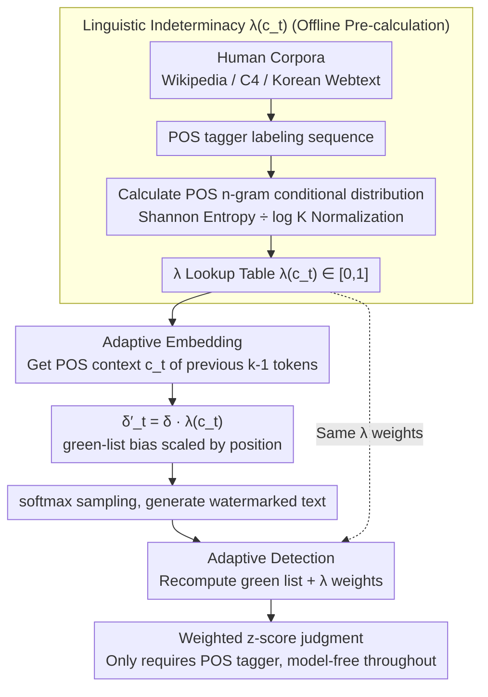

# STELA: A Linguistics-Aware LLM Watermarking via Syntactic Predictability

**Conference**: ACL 2026  
**arXiv**: [2510.13829](https://arxiv.org/abs/2510.13829)  
**Code**: https://github.com/Shinwoo-Park/stela_watermark  
**Area**: LLM Security / Watermarking / Publicly Verifiable Detection  
**Keywords**: Watermarking, POS n-gram, Linguistic Indeterminacy, Publicly Verifiable, Cross-lingual

## TL;DR
STELA uses "linguistic indeterminacy" $\lambda(c_t)$ estimated from POS n-grams as a modulation signal for watermark strength. It weakens the watermark at positions with high syntactic constraints (preserving quality) and strengthens it at syntactically free positions (improving detectability). Similar to KGW, STELA remains publicly verifiable using only a POS tagger, without requiring access to model logits.

## Background & Motivation
**Background**: KGW, the foundational watermark for LLMs, uses hashing to partition the vocabulary into green/red lists and adds a bias $\delta$ to green list logits to embed statistical signals. Since the detection side only needs to recompute hashes and perform a z-test without internal model access, it is publicly verifiable. However, in low-entropy positions (e.g., proper nouns or mandatory functional words), adding a bias fails to change the most likely token, and forcing shifts can lead to unnatural text generation.

**Limitations of Prior Work**: To address low-entropy issues, SWEET (selecting positions via entropy thresholds) and EWD (weighting z-scores by entropy) were developed. While effective, they **require access to LLM logits for detection**, breaking "public verifiability"—the core advantage of KGW. MorphMark adapts at the embedding stage but still relies on output probabilities, leaving its flexibility constrained.

**Key Challenge**: There has been a persistent trade-off between "adaptive watermark strength" and "model-free public detectability": the former traditionally requires token-level entropy, while the latter was limited to static strategies.

**Goal**: To identify a "model-independent signal capable of modulating watermark strength," enabling both insertion and detection to be adaptive without relying on LLM internals.

**Key Insight**: The authors decompose token-level entropy into two causes: "semantic fixation" (e.g., proper nouns) and "syntactic necessity" (e.g., Korean particles). The latter is determined by the language's syntactic structure and is independent of specific models. By modeling "syntactic predictability" using the conditional entropy of POS n-grams, a truly model-free indeterminacy signal is obtained.

**Core Idea**: Use "POS n-gram conditional entropy + language-specific $K$ normalization" to calculate $\lambda(c_t) \in [0, 1]$ as a watermark modulation factor. The embedding is performed as $\delta'_t = \delta \cdot \lambda(c_t)$, and detection weights the z-score by $\lambda$. The entire pipeline requires only a POS tagger.

## Method

### Overall Architecture
Offline one-time pre-calculation: Run a POS tagger on large human-written corpora (Wikipedia / OpenWebText2 / C4 / KOREAN-WEBTEXT). Calculate the conditional probability distribution $P(\pi_t \mid c_t)$ of each POS tag following a POS context $c_t$ of length $k-1$ to obtain the $\lambda$ lookup table.

Online generation: At each step $t$, extract the POS context $c_t$ of the preceding $k-1$ tokens, look up $\lambda(c_t)$, and modify the fixed KGW bias $\delta$ to $\delta'_t = \delta \cdot \lambda(c_t)$ before softmax sampling.

Online detection: Recompute the green list and $\lambda$ weights for each position, using a weighted z-score for judgment. The entire pipeline requires only a POS tagger and a hash function; the detector remains completely model-free.

### Key Designs

**1. Linguistic Indeterminacy $\lambda(c_t)$: Shifting the "modulation signal" from model space to language space**

Previous adaptive watermarks assumed token entropy was the only signal for determining where to apply a watermark. However, entropy requires access to logits, which voids KGW's public verifiability. The authors resolve this by observing that low entropy stems either from semantic fixation or syntactic necessity; the latter is model-independent. By modeling "syntactic predictability," they obtain a model-free indeterminacy signal.

Specifically, for a POS context $c_t$ of length $k-1$, the conditional distribution and Shannon entropy $H(P(\pi_t \mid c_t)) = -\sum_{\pi'} P(\pi' \mid c_t) \log P(\pi' \mid c_t)$ are calculated, then normalized by the number of unique tags $K_{c_t}$ appearing after that context:

$$\lambda(c_t) = \frac{H(P(\pi_t \mid c_t))}{\log K_{c_t}} \in [0, 1]$$

$\lambda \to 1$ indicates "syntactic freedom" (next POS is arbitrary), while $\lambda \to 0$ indicates "syntactic constraint" (next POS is fixed). The window $k$ follows linguistic typology, with $k=2$ for English and $k=4$ for Chinese/Korean. Normalization ensures comparability across languages.

**2. Adaptive Insertion $\delta'_t = \delta \cdot \lambda(c_t)$: Scaling the watermark by linguistic freedom**

With a model-free $\lambda$, the generation side scales the KGW green-list bias $\delta$ at each position: $\delta'_t = \delta \cdot \lambda(c_t)$. This is applied to the logits: $l'_{t, i} = l_{t, i} + \delta'_t \cdot \mathbb{I}[i \in \mathcal{V}_G]$. In high-constraint positions (e.g., where a Korean nominative particle is mandatory), $\lambda \approx 0$, minimizing interference and preserving quality. In high-freedom positions ($\lambda \approx 1$), the full bias is applied to maximize the detection signal.

**3. Adaptive Detection: Applying $\lambda$ weights to the weighted z-score**

If only the insertion were adaptive, the detection signal would be diluted by noise from low-indeterminacy positions. STELA uses the same weights $w_t = \lambda(c_t)$ at detection: tokens in high-freedom positions contribute more to the statistic. The weighted statistic $W_G = \sum_t w_t \cdot \mathbb{I}(x_t \in \mathcal{V}_{G, t})$ follows a null hypothesis $H_0$ with $\mathbb{E}[W_G] = \gamma \sum_t w_t$ and $\text{Var}(W_G) = \gamma(1-\gamma) \sum_t w_t^2$. The z-score is:

$$z' = \frac{W_G - \gamma \sum_t w_t}{\sqrt{\gamma(1-\gamma) \sum_t w_t^2}}$$

This allows both ends to be adaptive while remaining model-free.

### Loss & Training
STELA is a training-free method. Generation uses a temperature of 0.7, green list ratio $\gamma = 0.5$, and $\delta = 2.0 / \mathbb{E}[\lambda(c_t)]$ (calibrated by language: 0.575 for English, 0.523 for Chinese, 0.475 for Korean).

## Key Experimental Results

### Main Results: Detection Performance (TPR@5%FPR / Best F1)

| LLM | Method | English TPR / F1 | Chinese TPR / F1 | Korean TPR / F1 |
|-----|--------|------------------|------------------|-----------------|
| Llama-3.2 | KGW | 0.950 / 0.963 | 0.962 / 0.963 | 0.906 / 0.932 |
| Llama-3.2 | SWEET | 0.850 / 0.906 | 0.872 / 0.910 | 0.862 / 0.912 |
| Llama-3.2 | EWD | 0.870 / 0.916 | 0.850 / 0.902 | 0.896 / 0.928 |
| Llama-3.2 | MorphMark | 0.926 / 0.943 | 0.936 / 0.945 | 0.826 / 0.893 |
| Llama-3.2 | **STELA** | 0.938 / 0.953 | **0.976 / 0.972** | **0.950 / 0.954** |
| Qwen-3 | STELA | 0.978 / 0.966 | **0.996 / 0.994** | **0.950 / 0.950** |
| HyperCLOVA | STELA | **0.988 / 0.975** | **0.932 / 0.942** | **0.960 / 0.960** |

STELA achieves the highest average F1 across 9 (model, language) combinations.

### Ablation Study: Context Length $k$ and Tagset Granularity

| Language | Optimal $k$ | Universal UD Tagset TPR | Language-Specific Tagset TPR | Gain |
|------|---------|--------------------|---------------------|------|
| English | 2 | 0.948 / 0.972 / 0.984 | 0.938 / 0.978 / 0.988 | Negligible |
| Chinese | 4 | 0.976 / 0.998 / 0.930 | 0.976 / 0.996 / 0.932 | Negligible |
| Korean | 4 | 0.928 / 0.932 / 0.950 | 0.950 / 0.950 / 0.960 | **+1–2 pts** |

Robustness (English Llama-3.2, Dipper attack): Baseline F1 0.953; heavy rewriting (L=50) still maintains **0.825**; 50% synonym replacement maintains F1 > 0.85.

### Key Findings
- The more syntactically complex the language, the greater STELA's advantage (larger lead in CN/KR than EN).
- A significant gain (+1.6 TPR) is seen in Korean with fine-grained tagsets, as universal UD tags conflate all particles, while STELA benefits from distinguishing subject (JKS) and object (JKO) markers.
- Strong model independence: Results are consistent across Llama, Qwen, and HyperCLOVA.
- Robust against structural rewriting (Dipper): The signal is embedded in the syntax, which is difficult to eliminate systematically.
- Word class contribution: In English, content/functional words contribute ~43% to the z-score; in Chinese, content words contribute 67%; in Korean, 74%.

## Highlights & Insights
- **Conceptual Shift**: Replaces "model-specific" token entropy with "language-universal" POS n-gram entropy, reclaiming public verifiability without losing adaptivity.
- **Typological Design**: Validates performance across analytical (English), isolating (Chinese), and agglutinative (Korean) languages.
- **Syntactic Robustness**: By attaching the watermark to syntactic structures—which even rewriters must respect—STELA provides a robust watermark path based on physical intuition.
- **Clean Hyperparameters**: The context length $k$ couples naturally with linguistic types, showing the design is principled rather than over-tuned.

## Limitations & Future Work
- Heavy reliance on POS tagger accuracy; low-resource languages without POS tools may suffer.
- Quality evaluation is limited to perplexity and simple LLM-as-judge A/B testing.
- The $\lambda$ table is estimated from general corpora; accuracy may drop in domain-specific contexts (e.g., medical/legal).
- Limited language coverage: missing fusional (e.g., Russian) and polysynthetic languages.
- Lack of adversarial analysis regarding "STELA-aware" attackers who could target low-indeterminacy positions.

## Related Work & Insights
- **vs KGW**: KGW uses static bias; STELA uses $\delta \cdot \lambda(c_t)$, maintaining public verifiability with higher accuracy.
- **vs SWEET / EWD**: These use token entropy but lose model-free properties; STELA is a strict improvement by restoring model-free status.
- **vs MorphMark**: MorphMark adapts at insertion but remains uniform at detection; STELA is adaptive at both ends.
- **vs Semantic-aware watermark**: Those use LSH for semantic clustering; STELA achieves robustness through syntactic invariance at a lower computational cost.

## Rating
- Novelty: ⭐⭐⭐⭐⭐ "Replacing token entropy with POS n-gram entropy" is a clean conceptual substitution.
- Experimental Thoroughness: ⭐⭐⭐⭐⭐ Covers multiple models, languages, and various attacks with word-class analysis.
- Writing Quality: ⭐⭐⭐⭐⭐ Clear derivation and fair comparison via $\delta$ calibration.
- Value: ⭐⭐⭐⭐⭐ High regulatory value for "publicly verifiable + adaptive" watermarking under context like the EU AI Act.

<!-- RELATED:START -->

## Related Papers

- [\[ACL 2026\] SSG: Logit-Balanced Vocabulary Partitioning for LLM Watermarking](ssg_logit-balanced_vocabulary_partitioning_for_llm_watermarking.md)
- [\[ACL 2026\] XMark: Reliable Multi-Bit Watermarking for LLM-Generated Texts](xmark_reliable_multi-bit_watermarking_for_llm-generated_texts.md)
- [\[ACL 2026\] Privacy-R1: Privacy-Aware Multi-LLM Agent Collaboration via Reinforcement Learning](privacy-r1_privacy-aware_multi-llm_agent_collaboration_via_reinforcement_learnin.md)
- [\[ACL 2026\] Maximizing Local Entropy Where It Matters: Prefix-Aware Localized LLM Unlearning](maximizing_local_entropy_where_it_matters_prefix-aware_localized_llm_unlearning.md)
- [\[ACL 2026\] AgentMark: Utility-Preserving Behavioral Watermarking for Agents](agentmark_utility-preserving_behavioral_watermarking_for_agents.md)

<!-- RELATED:END -->
