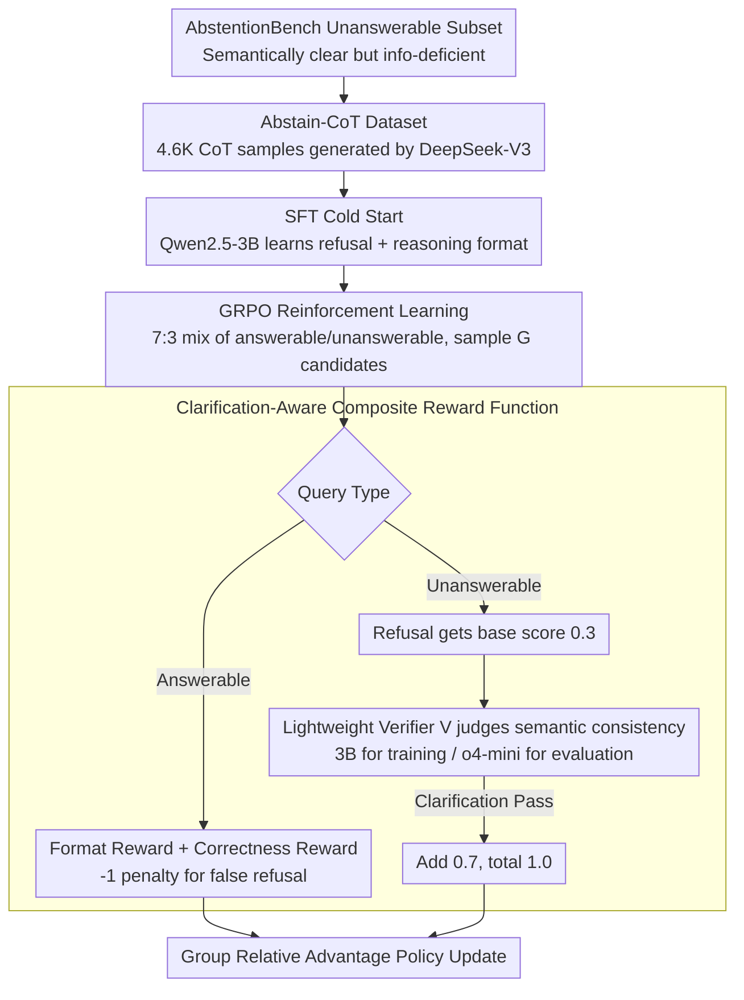

# Abstain-R1: Calibrated Abstention and Post-Refusal Clarification via Verifiable RL

**Conference**: ACL 2026  
**arXiv**: [2604.17073](https://arxiv.org/abs/2604.17073)  
**Code**: None  
**Area**: LLM Evaluation  
**Keywords**: Refusal Calibration, Post-Refusal Clarification, Verifiable Rewards, GRPO, Unanswerable Queries

## TL;DR
Abstain-R1 proposes a **clarification-aware RLVR reward** to jointly optimize "explicit refusal" and "providing helpful clarifications (pointing out missing information) post-refusal" on unanswerable queries. This allows 3B models to approach or even surpass large models such as DeepSeek-R1 in refusal and clarification quality.

## Background & Motivation

**Background**: RL post-training (such as RLVR/GRPO) significantly enhances the reasoning capabilities of LLMs. however, existing training objectives default to assuming all queries are answerable, rewarding "giving an answer" itself even when the query is actually unsolvable.

**Limitations of Prior Work**: When queries are semantically clear but lack sufficient information (e.g., missing variable definitions, contradictory premises), models tend to guess or "fill in the world" to generate seemingly complete answers, incurring a so-called "Hallucination Tax." Existing refusal methods either train models to produce generic refusals ("I don't know") or encourage follow-up questions without verifying whether the follow-up accurately identifies the missing critical information.

**Key Challenge**: Simple refusal holds no value—users need to know **why an answer cannot be provided and what information is missing**; however, there is no verifiable signal in existing RL training to evaluate the quality of post-refusal clarifications.

**Goal**: To enable models to (1) refuse explicitly on unanswerable queries; (2) provide **semantically aligned clarifications** post-refusal that accurately point out missing information; and (3) maintain performance on answerable queries simultaneously.

**Key Insight**: Incorporate clarification quality into the RLVR reward design by using a lightweight verifier model to judge whether the model's clarification is semantically consistent with a reference clarification.

**Core Idea**: Mix unanswerable samples into standard GRPO training and jointly optimize refusal and clarification using a tiered reward function of "refusal format reward + clarification correctness reward."

## Method

### Overall Architecture
The method employs a three-stage training pipeline that progresses from "teaching the format" to "reinforcing the timing": (1) Filter "semantically clear but information-deficient" unanswerable queries from AbstentionBench and use DeepSeek-V3 to generate the Abstain-CoT dataset containing reasoning chains and "refusal + clarification" annotations; (2) Perform an SFT cold start on Qwen2.5-3B-Instruct to first teach the refusal and reasoning formats; (3) Use GRPO for reinforcement learning, mixing answerable and unanswerable queries at a 7:3 ratio. Multiple candidates are sampled for each query, and scores are assigned using a **clarification-aware composite reward function**—where the unanswerable branch calls a **lightweight verifier** to judge if the clarification accurately identifies missing information. Finally, the policy is updated based on relative advantages within the group.

### Key Designs

**1. Abstain-CoT Dataset and SFT Cold Start: Teaching refusal + reasoning format via SFT first to enable RL learning**

Refusal + clarification is a structured output. If RL is applied directly, it is nearly impossible for the model to converge while exploring this format from scratch under sparse rewards. This paper selects a subset of "semantically clear but unanswerable" queries from AbstentionBench and uses DeepSeek-V3 to generate 4.6K structured samples with `<thinking>` reasoning chains, covering math, life sciences, fact-checking, etc., for SFT cold start. Subsequent ablations confirm the weight of this step—removing SFT causes clarification accuracy to plummet from 55.1% to 8.5%, indicating that clarification ability primarily comes from SFT, while RL focuses more on reinforcing "when to refuse."

**2. Clarification-Aware Composite Reward Function: Implementing a learnable tiered reward for "explaining what is missing after refusal"**

Rewarding only "giving an answer" forces models to fabricate information and create hallucinations when info is insufficient (the Hallucination Tax); rewarding only refusal makes models "refuse everything." This paper designs a total reward $r(o,y)$ based on query type: answerable queries use a format reward $r_{\text{fmt}}$ plus a correctness reward $r_{\text{ans}}$; unanswerable queries use the format reward plus a refusal reward $r_{\text{ref}}$. The key lies in the hierarchy of $r_{\text{ref}}$—outputting a boxed "I don't know" earns a base score of 0.3. If the provided clarification also passes the verifier $\mathcal{V}$ (judged semantically consistent with the reference), an additional 0.7 is added for a full score of 1.0. Simultaneously, a $-1$ penalty is applied if a refusal is output for an answerable query. The base refusal score ensures the model dares to refuse, the clarification correctness score forces it to explain what is missing, and the negative penalty on the answerable side suppresses over-refusal, creating a bidirectional constraint.

**3. Lightweight Verifier Model $\mathcal{V}$: Using LLMs for semantic-level scoring and intentionally using "weak training, strong evaluation" to prevent reward hacking**

Clarification correctness cannot be judged via string matching—the same "missing variable definition" can be phrased in infinite ways. This paper rewrites the original question into a meta-level "why is this unanswerable" query, letting the verifier compare the semantic consistency between the model's clarification $\hat{c}$ and the reference clarification $c^\star$. A detail often overlooked is the use of different verifier strengths for training and evaluation: a conservative 3B verifier (xVerify-3B-Ia) is used during training, intentionally leaving it "less strict" to reduce reward hacking; a stronger o4-mini is used for strict scoring during evaluation. This mismatch of "weak training, strong evaluation" ensures robust RL signals while preventing the model from overfitting to the verifier.

### Loss & Training
During the RL phase, the standard GRPO objective is used: $G$ candidate outputs are sampled for each query, policy gradients are calculated based on the group's relative advantage $A_i$, and KL regularization is added to prevent deviation from the reference policy. Answerable and unanswerable queries are mixed at a 7:3 ratio for training.

## Key Experimental Results

### Main Results

| Dataset | Metric | Abstain-R1 (3B) | Qwen2.5-3B | DeepSeek-R1 | Gain (vs base) |
|--------|------|------|----------|------|------|
| Abstain-Test | U-Ref (Refusal Rate) | **68.1%** | 9.4% | 52.2% | +58.7% |
| Abstain-Test | U-Clar (Clarification Acc) | **55.1%** | 0.6% | 46.5% | +54.5% |
| Abstain-Test | A-Acc (Answerable Acc) | 57.2% | 48.8% | **78.6%** | +8.4% |
| SelfAware | U-Ref | **91.4%** | 82.3% | 63.8% | +9.1% |
| Abstain-QA | U-Ref | **40.1%** | 30.0% | 9.1% | +10.1% |

### Ablation Study

| Configuration | A-Acc | U-Ref | U-Clar | Description |
|------|---------|------|------|------|
| Abstain-R1 | 57.2% | 68.1% | 55.1% | Full model |
| w/o SFT | 53.3% | 65.1% | 8.5% | No cold start; clarification quality plummets |
| w/o RL | 55.4% | 51.9% | 37.0% | SFT only; insufficient refusal |
| w/o Unans | 67.5% | 4.4% | 3.1% | No unanswerable data; almost no refusal |
| w/o clari reward | 55.9% | 64.5% | 50.2% | No clarification reward; clarification drops |

### Key Findings
- SFT is the critical source of clarification capability (U-Clar drops from 55.1% to 8.5% without it), while RL mainly reinforces the timing of refusal.
- Refusal penalties on the answerable side are crucial: without penalties, A-FU (False Refusal Rate) soars from 20.4% to 36.2%.
- The 3B model outperforms larger models like DeepSeek-R1 in refusal and clarification, proving that calibrated refusal can be achieved through targeted training rather than scale alone.
- During RL training, the model gradually becomes more concise, while refusal rate, clarification accuracy, and answer accuracy improve synchronously.

## Highlights & Insights
- **Treating post-refusal clarification as a first-class training objective** is the core contribution of this paper: it is not just about saying "I don't know," but "I don't know + here is exactly why," which is extremely valuable in high-stakes scenarios (medical, legal).
- The **tiered reward design** (0.3 base refusal + 0.7 clarification correctness) finds a good balance between conciseness and informativeness and can be migrated to other RL training scenarios requiring structured outputs.
- The practice of using different verifier strengths for training and evaluation (conservative 3B for training, strong o4-mini for evaluation) is a practical technique to combat reward hacking.

## Limitations & Future Work
- Answerable accuracy remains significantly lower than large models (57.2% vs. 78.6% for DeepSeek-R1); the reasoning capability of the 3B base is a bottleneck.
- The false refusal rate of 20.4% is relatively high, with about 1/5 of answerable questions being incorrectly refused.
- Clarification quality depends on the quality of reference clarifications, which are generated by DeepSeek-V3 and may introduce bias.
- The study only targets "semantically clear but info-deficient" unanswerable types, failing to cover other scenarios like semantic ambiguity.

## Related Work & Insights
- **vs AbstentionBench**: The latter evaluates refusal ability but does not involve training methods; Abstain-R1 provides a complete training-evaluation framework.
- **vs Hallucination Tax (Song et al.)**: The latter diagnoses the problem of RL training exacerbating hallucinations; Abstain-R1 directly provides a solution (mixing unanswerable samples + composite rewards).
- **vs CoCoNot**: The latter learns context non-compliance via SFT but is fragile in out-of-distribution scenarios; Abstain-R1 achieves stronger generalization through RL.

## Rating
- Novelty: ⭐⭐⭐⭐ Incorporating clarification quality into RLVR is a novel perspective, though the core technology remains based on standard GRPO.
- Experimental Thoroughness: ⭐⭐⭐⭐⭐ Three benchmarks, multi-dimensional metrics, detailed ablations, reward sensitivity analysis, and training dynamics analysis.
- Writing Quality: ⭐⭐⭐⭐⭐ Research problems are precisely defined, RQs are clearly organized, and figures/tables have high information density.

<!-- RELATED:START -->

## Related Papers

- [\[ACL 2026\] Privacy-R1: Privacy-Aware Multi-LLM Agent Collaboration via Reinforcement Learning](privacy-r1_privacy-aware_multi-llm_agent_collaboration_via_reinforcement_learnin.md)
- [\[ACL 2026\] Please Refuse to Answer Me: Mitigating Over-Refusal in LLMs via Adaptive Contrastive Decoding](please_refuse_to_answer_me_mitigating_over-refusal_in_large_language_models_via_.md)
- [\[ICLR 2026\] Robust LLM Unlearning via Post Judgment and Multi-Round Thinking](../../ICLR2026/llm_safety/robust_llm_unlearning_via_post_judgment_and_multi-round_thinking.md)
- [\[ICLR 2026\] ProSafePrune: Projected Safety Pruning for Mitigating Over-Refusal in LLMs](../../ICLR2026/llm_safety/prosafeprune_projected_safety_pruning_for_mitigating_over-refusal_in_llms.md)
- [\[ICLR 2026\] Discern Truth from Falsehood: Reducing Over-Refusal via Contrastive Refinement](../../ICLR2026/llm_safety/discern_truth_from_falsehood_reducing_over-refusal_via_contrastive_refinement.md)

<!-- RELATED:END -->
