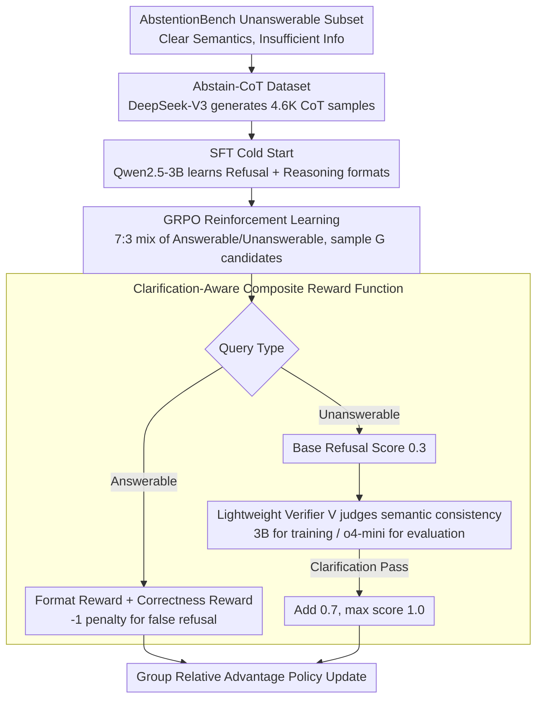

# Abstain-R1: Calibrated Abstention and Post-Refusal Clarification via Verifiable RL

**Conference**: ACL 2026  
**arXiv**: [2604.17073](https://arxiv.org/abs/2604.17073)  
**Code**: None  
**Area**: LLM Evaluation  
**Keywords**: Refusal Calibration, Post-Refusal Clarification, Verifiable Rewards, GRPO, Unanswerable Queries

## TL;DR
Abstain-R1 proposes a **clarification-aware RLVR reward** to jointly optimize "explicit refusal" and "providing useful clarifications (pointing out missing information)" for unanswerable queries. This enables 3B models to approach or even surpass large models like DeepSeek-R1 in refusal and clarification quality.

## Background & Motivation

**Background**: RL post-training (such as RLVR/GRPO) significantly enhances the reasoning capabilities of LLMs. However, existing training objectives often assume all queries are answerable, rewarding the "act of answering" even when the query is actually unsolvable.

**Limitations of Prior Work**: When queries are semantically clear but information-deficient (e.g., missing variable definitions, contradictory premises), models tend to guess or "fill the world" to generate seemingly complete answers, incurring what is known as the "Hallucination Tax." Existing refusal methods either train models to produce generic refusals ("I don't know") or encourage follow-up questions without verifying if those questions accurately identify the missing key information.

**Key Challenge**: Simple refusal lacks value—users need to know **why an answer cannot be provided and what information is missing**. However, existing RL training lack verifiable signals to evaluate the quality of post-refusal clarifications.

**Goal**: To enable models to (1) explicitly refuse unanswerable queries; (2) provide **semantically aligned clarifications** that accurately point out missing information; and (3) maintain performance on answerable queries.

**Key Insight**: Incorporate clarification quality into the RLVR reward design by using a lightweight verifier model to judge whether the model's clarification is semantically consistent with a reference clarification.

**Core Idea**: Mix unanswerable samples into standard GRPO training and jointly optimize refusal and clarification using a hierarchical reward function consisting of a "refusal format reward + clarification correctness reward."

## Method

### Overall Architecture
The method follows a three-stage training pipeline, progressing from "teaching the format" to "strengthening the timing": (1) Filter "semantically clear but info-deficient" unanswerable queries from AbstentionBench and use DeepSeek-V3 to generate the Abstain-CoT dataset with reasoning chains and "refusal + clarification" labels; (2) Perform SFT cold start on Qwen2.5-3B-Instruct to teach refusal and reasoning formats; (3) Use GRPO for reinforcement learning, mixing answerable and unanswerable queries at a 7:3 ratio. Multiple candidates are sampled for each query, scored by a **clarification-aware composite reward function**, and the policy is updated based on group relative advantage.

### Key Designs

**1. Abstain-CoT Dataset and SFT Cold Start: Teaching the refusal + reasoning format through SFT to enable effective RL.**

Refusal + clarification is a structured output. If RL is applied directly, it is nearly impossible for the model to converge while exploring this format from scratch under sparse rewards. This work selects a "semantically clear but unanswerable" subset from AbstentionBench and uses DeepSeek-V3 to generate 4.6K structured samples with `<thinking>` reasoning chains across fields like math, life sciences, and fact-checking for SFT cold start. Ablation studies confirm this step's importance; without SFT, clarification accuracy plummets from 55.1% to 8.5%, indicating that clarification capability primarily comes from SFT, while RL reinforces "when to refuse."

**2. Clarification-Aware Composite Reward Function: Implementing a learnable hierarchical reward for "explaining what is missing after refusal."**

Rewarding only "giving an answer" causes models to manufacture hallucinations (Hallucination Tax) when information is insufficient. Conversely, rewarding only refusal causes models to "refuse everything." This work designs a total reward $r(o,y)$ based on query type: answerable queries use format reward $r_{\text{fmt}}$ plus correctness reward $r_{\text{ans}}$, while unanswerable queries use format reward plus refusal reward $r_{\text{ref}}$. The key lies in the hierarchy of $r_{\text{ref}}$: a boxed "I don't know" output earns a base score of 0.3. If the clarification passes the verifier $\mathcal{V}$ (judged semantically consistent with the reference), an additional 0.7 is added for a total of 1.0. Simultaneously, a $-1$ penalty is applied if the model refuses an answerable query. The base refusal score encourages the model to refuse, the clarification correctness score forces it to explain what is missing, and the negative penalty on the answerable side suppresses over-refusal, creating a bidirectional constraint.

**3. Lightweight Verifier Model $\mathcal{V}$: Using LLMs for semantic-level scoring and a "weak training, strong evaluation" strategy to prevent reward hacking.**

Clarification correctness cannot be judged via string matching—the same "missing variable definition" can be phrased in countless ways. This work rewrites the original problem into a meta-level query ("why is this unanswerable?") and has the verifier compare the semantic consistency between the model's clarification $\hat{c}$ and the reference $c^\star$. A critical detail is the use of different verifier strengths for training and evaluation: a conservative 3B verifier (xVerify-3B-Ia) is used during training, intentionally being "less strict" to reduce reward hacking; a stronger o4-mini is used for strict scoring during evaluation. This "weak training, strong evaluation" mismatch ensures robust RL signals and prevents the model from overfitting to the verifier.

### Loss & Training
The RL stage uses the standard GRPO objective: $G$ candidate outputs are sampled per query, policy gradients are calculated based on group relative advantage $A_i$, and KL regularization is added to prevent deviation from the reference policy. Answerable and unanswerable queries are mixed at a 7:3 ratio.

## Key Experimental Results

### Main Results

| Dataset | Metric | Abstain-R1 (3B) | Qwen2.5-3B | DeepSeek-R1 | Gain (vs base) |
|--------|------|------|----------|------|------|
| Abstain-Test | U-Ref (Refusal Rate) | **68.1%** | 9.4% | 52.2% | +58.7% |
| Abstain-Test | U-Clar (Clarification Acc) | **55.1%** | 0.6% | 46.5% | +54.5% |
| Abstain-Test | A-Acc (Answerable Acc) | 57.2% | 48.8% | **78.6%** | +8.4% |
| SelfAware | U-Ref | **91.4%** | 82.3% | 63.8% | +9.1% |
| Abstain-QA | U-Ref | **40.1%** | 30.0% | 9.1% | +10.1% |

### Ablation Study

| Configuration | A-Acc | U-Ref | U-Clar | Description |
|------|---------|------|------|------|
| Abstain-R1 | 57.2% | 68.1% | 55.1% | Complete model |
| w/o SFT | 53.3% | 65.1% | 8.5% | No cold start, clarification quality plummets |
| w/o RL | 55.4% | 51.9% | 37.0% | SFT only, insufficient refusal |
| w/o Unans | 67.5% | 4.4% | 3.1% | No unanswerable data, almost no refusal |
| w/o clari reward | 55.9% | 64.5% | 50.2% | No clarification reward, clarification decreases |

### Key Findings
- SFT is the critical source of clarification capability (U-Clar drops from 55.1% to 8.5% without it), while RL mainly reinforces the timing of refusal.
- Refusal penalties on answerable queries are vital: without them, the False Refusal (A-FU) rate surges from 20.4% to 36.2%.
- The 3B model surpasses large models like DeepSeek-R1 in refusal and clarification, proving that calibrated refusal can be achieved through targeted training rather than scale alone.
- During RL training, the model gradually becomes more concise, while refusal rate, clarification accuracy, and answer accuracy improve simultaneously.

## Highlights & Insights
- **Treating post-refusal clarification as a first-class training objective** is the core contribution: it is not just "saying I don't know," but "saying I don't know + explaining why," which is highly valuable for high-stakes scenarios (medical, legal).
- The **hierarchical reward design** (0.3 base refusal + 0.7 clarification correctness) finds a good balance between conciseness and informativeness and can be migrated to other RL training tasks requiring structured outputs.
- The practice of using different verifier strengths (conservative 3B for training, strong o4-mini for evaluation) is a practical trick to combat reward hacking.

## Limitations & Future Work
- Answerable accuracy remains significantly lower than large models (57.2% vs 78.6% for DeepSeek-R1); the reasoning capacity of the 3B base is the bottleneck.
- The false refusal rate of 20.4% is high, with approximately 1/5 of answerable questions being incorrectly rejected.
- Clarification quality depends on the quality of reference clarifications generated by DeepSeek-V3, which may introduce bias.
- The work targets only "semantically clear but info-deficient" unanswerable types, leaving other scenarios like semantic ambiguity unaddressed.

## Related Work & Insights
- **vs AbstentionBench**: The latter evaluates refusal but does not involve training methods; Abstain-R1 provides a full training-evaluation framework.
- **vs Hallucination Tax (Song et al.)**: The latter diagnoses how RL training exacerbates hallucinations; Abstain-R1 provides a direct solution (mixing unanswerable samples + composite rewards).
- **vs CoCoNot**: The latter learns context non-compliance via SFT but is fragile in OOD scenarios; Abstain-R1 achieves stronger generalization through RL.

## Rating
- Novelty: ⭐⭐⭐⭐ Incorporating clarification quality into RLVR is a novel perspective, though the core tech is based on standard GRPO.
- Experimental Thoroughness: ⭐⭐⭐⭐⭐ Three benchmarks, multi-dimensional metrics, detailed ablations, reward sensitivity, and training dynamics analysis.
- Writing Quality: ⭐⭐⭐⭐⭐ Precise definition of research problems, clearly organized RQs, and high information density in charts.

<!-- RELATED:START -->

## Related Papers

- [\[ACL 2026\] Privacy-R1: Privacy-Aware Multi-LLM Agent Collaboration via Reinforcement Learning](privacy-r1_privacy-aware_multi-llm_agent_collaboration_via_reinforcement_learnin.md)
- [\[ACL 2026\] Please Refuse to Answer Me: Mitigating Over-Refusal in LLMs via Adaptive Contrastive Decoding](please_refuse_to_answer_me_mitigating_over-refusal_in_large_language_models_via_.md)
- [\[ICML 2026\] Optimizing Token Choice for Code Watermarking: An RL Approach](../../ICML2026/llm_safety/optimizing_token_choice_for_code_watermarking_an_rl_approach.md)
- [\[ICML 2026\] ACTG-ARL: Differentially Private Conditional Text Generation with RL-Boosted Control](../../ICML2026/llm_safety/actg-arl_differentially_private_conditional_text_generation_with_rl-boosted_cont.md)
- [\[ICLR 2026\] PURGE: Reinforcement Unlearning via Group Relative Policy Optimization](../../ICLR2026/llm_safety/reinforcement_unlearning_via_group_relative_policy_optimization.md)

<!-- RELATED:END -->
