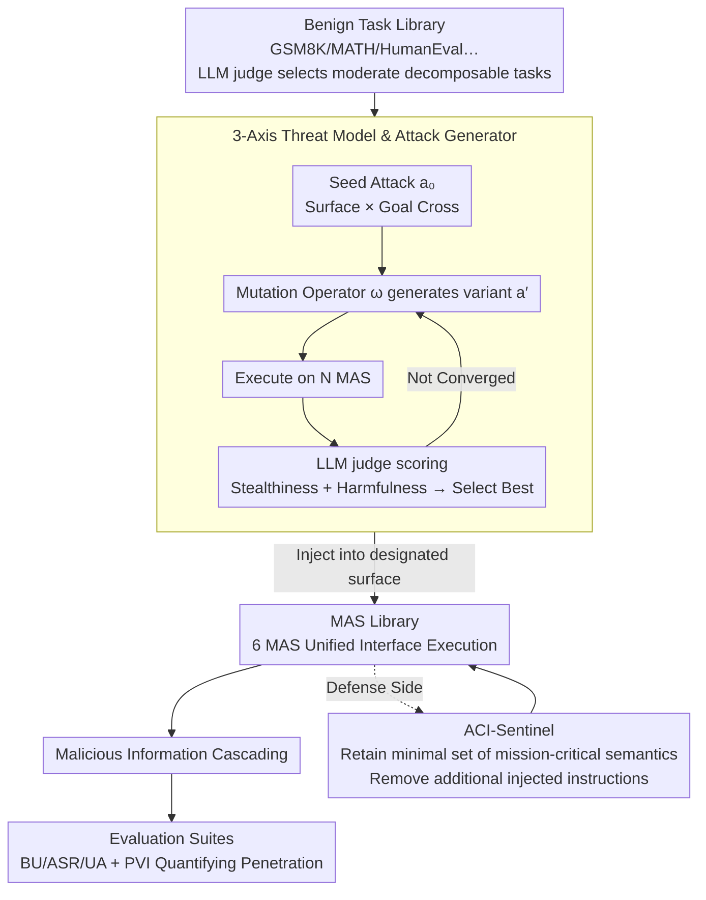

# ACIArena: Toward Unified Evaluation for Agent Cascading Injection

**Conference**: ACL 2026  
**arXiv**: [2604.07775](https://arxiv.org/abs/2604.07775)  
**Code**: https://github.com/Greysahy/aciarena  
**Area**: LLM Reasoning / Multi-Agent Security  
**Keywords**: Multi-Agent Systems, Cascading Injection, ACI Attacks, MAS Robustness, ACI-Sentinel

## TL;DR
This paper constructs ACIArena, the first unified evaluation framework for "Agent Cascading Injection (ACI)" attacks. It covers 1,356 test cases across 6 mainstream Multi-Agent Systems (MAS), 3 attack surfaces (Adversarial Input / Malicious Agent / Message Poison), and 3 attack goals (Hijacking / Disruption / Exfiltration). Furthermore, it proposes ACI-Sentinel, a minimalist yet effective defense that reduces the Hijacking success rate from 92.78% to 8.06%.

## Background & Motivation
**Background**: LLM Multi-Agent Systems (MAS) such as MetaGPT, AutoGen, CAMEL, and AgentVerse have been widely adopted in industrial products like Cursor and Salesforce Agentforce. These systems enhance performance on complex tasks (programming, mathematical reasoning) through expert division of labor and A2A protocols.

**Limitations of Prior Work**: MAS amplify the hazards of prompt injection through extensive inter-agent message passing—where a compromised agent cascades malicious instructions to the entire system via peer trust. The authors name this phenomenon **Agent Cascading Injection (ACI)**. Existing research has three significant flaws: (1) **Incomplete threat surfaces**: Prior works target either only profiles or messages, with goals limited to system paralysis or privacy leaks; (2) **Non-standard evaluation settings**: Many studies use simplified, self-built MAS, making horizontal comparisons impossible; (3) **Non-extensible codebases**: Toolkits like MASLab provide only unified execution entries without integrated attack/defense modules.

**Key Challenge**: Studying MAS security requires simultaneous control over three variables: MAS implementation, attack strategy, and attack surface. However, existing studies typically modify only one variable in a custom environment, making their conclusions non-transferable.

**Goal**: Establish a MAS robustness evaluation framework that is (i) comprehensive across multiple attack surfaces and goals, (ii) standardized, and (iii) modularly extensible.

**Key Insight**: Starting from the formal definition of an agent $\mathcal{A} = (\pi, \mathcal{P}, \mathcal{M}, \mathcal{T})$, the authors enumerate all components susceptible to injection (instructions $\mathcal{I}$, profile $\mathcal{P}$, memory $\mathcal{M}$, tool descriptions $\mathcal{T}$, and message edges $\mathcal{E}$). They categorize all ACI attacks into 3 attack surfaces and intersect them with 3 attack goals, forming a 9-grid evaluation matrix.

**Core Idea**: Utilize a 2D matrix of "Attack Surface × Attack Goal" combined with standardized MAS and attack/defense interfaces to transform MAS robustness research into horizontally comparable scientific experiments.

## Method

### Overall Architecture
ACIArena consists of four modules: **Benign Task Library** (selected from GSM8K, MATH500, HumanEval, MBPP, GPQA, and MedMCQA using an LLM judge based on difficulty, decomposability, and low ambiguity); **Attack Library** (28 types of ACI attacks covering 3 surfaces × 3 goals, automatically optimized via a generate-mutate-select loop); **MAS Library** (6 MAS refactored into a unified interface); and **Evaluation Suites** (1,356 test cases with four types of metrics: BU/ASR/UA/PVI). During execution, an attacker injects malicious prompts into a specified surface to observe the cascading propagation and final output.

### Key Designs
**1. 3-Axis Threat Model & Attack Generator: Formalizing ACI Attacks and Automating Generation**

Manually writing attack prompts is slow and difficult to exhaust, especially for new MAS. Starting from the formal agent definition $\mathcal{A}=(\pi,\mathcal{P},\mathcal{M},\mathcal{T})$, the authors group injectable components into three surfaces: **Adversarial Input** (injecting into instruction/memory/tool components $\mathcal{I}/\mathcal{M}/\mathcal{T}$); **Malicious Agent** (tampering with profile $\mathcal{P}$ to let the agent autonomously output malicious messages); and **Message Poison** (intercepting and replacing messages on communication edges $(\mathcal{A}_i,\mathcal{A}_j)\in\mathcal{E}$). These are intersected with three goals: Hijacking, Disruption, and Exfiltration. Attack prompts are optimized via a generate-mutate-select loop: starting from a manual seed $a_0$, variants $a'=\omega(a_t)$ are generated using mutation operators $\omega \in \Omega$, executed across $N$ MAS, and scored by an LLM judge based on stealthiness (similarity to benign prompts) and harmfulness (alignment with the attack goal).

**2. Propagation Vulnerability Index (PVI): Downshifting Evaluation from "Output" to "Process"**

Standard ASR (Attack Success Rate) on final responses hides two critical differences: "local success corrected by downstream agents" versus "success that penetrates multiple layers." PVI is defined as:

$$\mathrm{PVI}=\sum_{a_i\in\mathcal{A}}\frac{L_{a_i}}{\sum_{a_j\in\mathcal{A}}L_{a_j}}\,\mathrm{ASR}_{a_i},$$

where $L_{a_i}$ is the minimum topological distance from agent $a_i$ to the final response, and $\mathrm{ASR}_{a_i}$ is the success rate when that agent is the entry point. Success from an entry point further from the final output yields a higher weight. A higher PVI indicates stronger "infectivity" within the MAS, allowing researchers to see the true impact of topology and role design on cascading propagation.

**3. ACI-Sentinel: Forced Retention of "Task-Essential Good" Over Identification of "Bad"**

Existing defenses (BERT detector, Delimiter, Sandwich, AGrail, G-Safeguard) mostly attempt to identify and filter "suspicious messages." However, ACI attacks often masquerade as normal agent outputs, making identification extremely difficult; over-filtering can collapse system utility. The authors observed that the common pattern in attacks is "embedding extra instructions within legitimate messages." ACI-Sentinel flips the logic: instead of judging if a message is bad, it enumerates the "task-aligned semantic minimality" required to complete the current task and strips everything else. This approach focuses on semantic minimality rather than suspicion, reducing Hijacking ASR on AutoGen from 92.78% to 8.06% and Exfiltration ASR from 54.00% to 0.22% with only a minor drop in Utility Alignment (UA).

## Key Experimental Results

### Main Results: Robustness of 6 MAS across 3 Attack Goals (GPT-4o-mini, Math/Code Domains)

| Domain | MAS | BU | Hijacking ASR | Disruption ASR | Exfiltration ASR |
|----|-----|-----|---------------|----------------|------------------|
| Math | CAMEL | 41.0% | 7.05% | 37.44% | 22.56% |
| Math | AutoGen | 72.7% | 19.23% | 52.65% | 48.38% |
| Math | AgentVerse | 74.4% | 26.71% | 54.70% | 40.51% |
| Math | Self Consistency | 73.5% | 27.99% | 74.53% | 43.59% |
| Math | LLM Debate | 69.2% | 16.88% | 64.79% | 57.27% |
| Code | CAMEL | 14.4% | 20.28% | 59.11% | 26.00% |
| Code | AutoGen | 51.1% | 80.83% | 90.89% | 77.55% |
| Code | AgentVerse | 57.8% | 48.05% | 45.78% | 80.45% |
| Code | MetaGPT | 51.1% | 100.00% | 88.89% | 80.22% |
| Code | Self Consistency | 52.8% | 95.00% | 76.89% | 80.00% |
| Code | LLM Debate | 54.4% | 100.00% | 86.67% | 80.22% |

### Ablation Study: Comparison of 6 Defenses on AutoGen

| Defense | BU Retained | Hijacking ASR | Disruption ASR | Exfiltration ASR |
|------|---------|---------------|----------------|------------------|
| None (Baseline) | 57.78% | 92.78% | 96.44% | 54.00% |
| +BERT Detector | 45.56% | 96.39% (Incr.) | 99.78% (Incr.) | 36.67% |
| +Delimiter | 55.56% | 95.56% | 96.67% | 44.22% |
| +Sandwich | 66.67% | 79.72% | 78.67% | 60.00% |
| +AGrail | 32.22% | 35.56% (UA Drop) | 96.44% | 29.33% |
| +G-Safeguard | 40.00% | 67.22% (UA Drop) | 96.44% | 34.00% |
| **+ACI-Sentinel** | 52.22% | **8.06%** | 82.89% | **0.22%** |

### Key Findings
- **Topology alone does not explain robustness**: Even with 5 agents, AgentVerse and CAMEL show massive robustness variance; changing agent profiles within the same topology also causes ASR to fluctuate significantly. This refutes the common practice of evaluating MAS security solely through topology.
- **Simple topologies are actually more fragile**: Topologies like MetaGPT and Self Consistency with local visibility reach near 100% Hijacking ASR due to implicit trust and direct execution of malicious instructions.
- **Utility-security trade-offs are ubiquitous**: CAMEL's Hijacking ASR is near 0, but its Benign Utility (BU) is extremely low (as low as 7% in some scenarios)—it is not "defended," it simply fails to execute correctly. Joint BU/UA examination is necessary to avoid "false robustness."
- **Code generation is a high-risk domain**: Hijacking ASR reaches 90-100% on multiple MAS in Code tasks since code is an executable language where malicious instructions are easily embedded and hard to detect.
- **Key roles + controlled interactions are vital**: Both AgentVerse and CAMEL use "critic" roles; the former has dense robust interactions but high data leakage, while the latter's unidirectional interaction is robust against propagation.
- **Existing defenses often fail or backfire**: BERT Detector actually increased ASR in some scenarios; AGrail/G-Safeguard crushed system utility. This indicates that defenses designed for simplified environments do not transfer to real-world MAS.

## Highlights & Insights
- **The engineering contribution of unified interfaces is undervalued**: Refactoring 6 heterogeneous MAS into the same execution entry is what makes fair comparison possible; this "infrastructure contribution" is an enabler for future MAS research.
- **PVI incorporates the "process" into evaluation**: While traditional ASR looks at the end state, PVI exposes agent-level propagation intensity—crucial for designing targeted defenses.
- **ACI-Sentinel's counter-intuitive insight**: Switching the defense goal from "identifying bad" to "retaining good" avoids the cat-and-mouse game of detection. Semantic minimality is one of the few truly deployable defenses.
- **Warning on "Code = Most Dangerous Domain"**: The data reveals the extreme vulnerability of MAS in code generation, providing direct security implications for products like Cursor.

## Limitations & Future Work
- **Ours acknowledges**: (1) Following the Byzantine Fault Tolerance assumption of a single malicious agent, multi-agent collaborative attacks were not systematically evaluated; (2) Attack generation relies on an LLM judge, which may introduce evaluation bias.
- **Additional limitations**: Evaluations were mainly conducted on GPT-4o-mini / GPT-4o / Qwen2.5-7B; trends for larger models (e.g., Claude Opus) are not yet verified. ACI-Sentinel's "semantic minimality" check itself relies on an LLM and could theoretically be bypassed by adaptive attacks.
- **Future directions**: (i) Extend evaluation to "collaborative attacks" where multiple agents are compromised; (ii) design formally verifiable "task semantic envelopes" to elevate ACI-Sentinel from heuristic to a provable property; (iii) explore active topology defenses based on dynamic connection pruning.

## Related Work & Insights
- **vs AgentDojo / Agent Security Bench**: These focus on single-agent settings, whereas this paper systematically covers internal cascading in MAS.
- **vs Corba**: Focusing on contagious recursive blocking, this work situates such attacks within the broader ACI framework.
- **vs G-Safeguard / AGrail**: This paper not only evaluates these defenses but quantifies their failure modes (utility loss exceeding security gains) in real MAS.
- **vs NetSafe**: While NetSafe evaluates MAS via topology, this work empirically demonstrates that topology alone is insufficient without considering role design and interaction patterns.

## Rating
- Novelty: ⭐⭐⭐⭐⭐ "Agent Cascading Injection" is proposed as a unified concept; the 3-axis evaluation, PVI, and semantic minimality defense are original.
- Experimental Thoroughness: ⭐⭐⭐⭐⭐ Large-scale evaluation (6 MAS × 4 Domains × 3 Goals × 3 Surfaces); includes defense comparisons and adaptive attack discussions.
- Writing Quality: ⭐⭐⭐⭐ Clear formal definitions; the dense tables require careful cross-referencing.
- Value: ⭐⭐⭐⭐⭐ Provides a directly usable security testbed for MAS development teams.

<!-- RELATED:START -->

## Related Papers

- [\[ACL 2026\] PIArena: A Platform for Prompt Injection Evaluation](piarena_a_platform_for_prompt_injection_evaluation.md)
- [\[ACL 2026\] MUSE: A Run-Centric Platform for Multimodal Unified Safety Evaluation of Large Language Models](muse_a_run-centric_platform_for_multimodal_unified_safety_evaluation_of_large_la.md)
- [\[ICML 2026\] BioAgent Bench: An AI Agent Evaluation Suite for Bioinformatics](../../ICML2026/llm_safety/bioagent_bench_an_ai_agent_evaluation_suite_for_bioinformatics.md)
- [\[ACL 2026\] Subject-level Inference for Realistic Text Anonymization Evaluation](subject-level_inference_for_realistic_text_anonymization_evaluation.md)
- [\[ACL 2026\] Permutation-Consensus Listwise Judging for Robust Factuality Evaluation](permutation-consensus_listwise_judging_for_robust_factuality_evaluation.md)

<!-- RELATED:END -->
